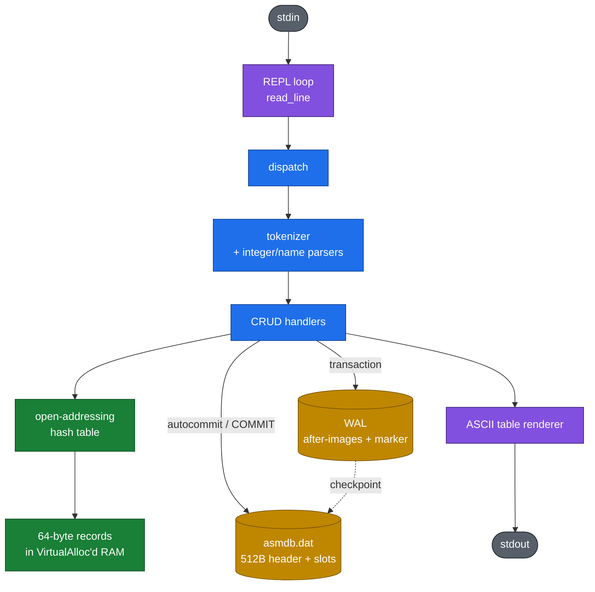
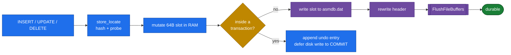
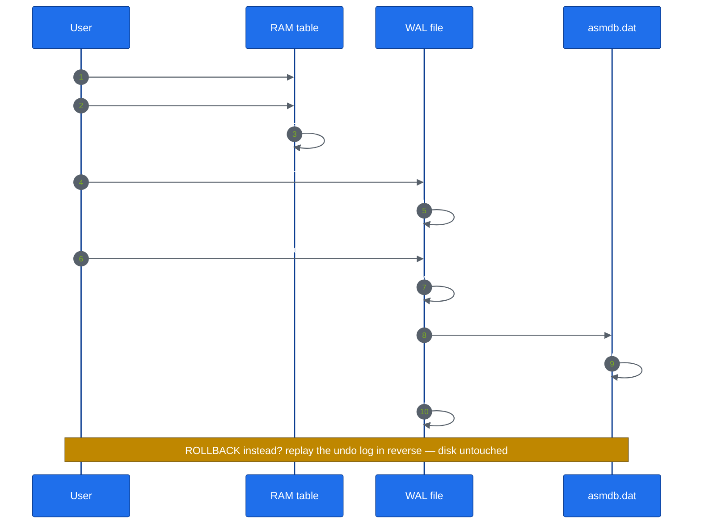
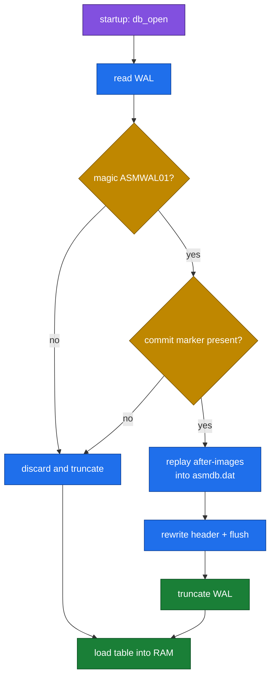
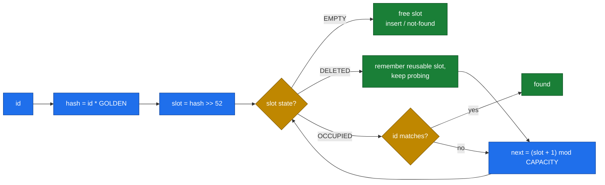
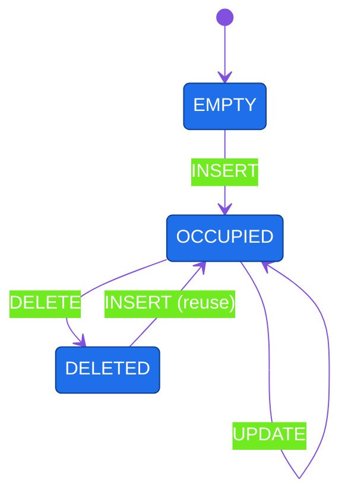

<div align="center">

```text
    _    ____  __  __ ____  ____
   / \  / ___||  \/  |  _ \| __ )
  / _ \ \___ \| |\/| | | | |  _ \
 / ___ \ ___) | |  | | |_| | |_) |
/_/   \_\____/|_|  |_|____/|____/
```

### a minimalist **transactional** database in **x86-64 assembly**

Full CRUD · write-ahead log · crash recovery · ASCII-art CLI


</div>

---

`asmdb` is a tiny key/value database engine written from scratch in x86-64
assembly. There is **no linker**, **no C runtime**, and **no external library** —
NASM emits the Windows PE executable directly (`nasm -f bin`) and the program
talks to `kernel32.dll` through a hand-crafted import table.

Despite fitting in ~10 KB, it is a genuinely **transactional** store: every
statement is durable, `BEGIN`/`COMMIT`/`ROLLBACK` are real, and a write-ahead
log guarantees atomic recovery after a crash.

## Highlights

- **Zero dependencies** — assembled by NASM alone, no linker, no CRT.
- **Cache-friendly core** — fixed 64-byte records (one cache line) in an
  open-addressing hash table; the record array *is* the index.
- **Fast hashing** — Fibonacci hashing (`id * 2^64/φ >> 52`) + linear probing.
- **Durable by default** — autocommit flushes each mutation to disk.
- **Real transactions** — `BEGIN` / `COMMIT` / `ROLLBACK` with an undo log.
- **Crash-safe** — a WAL with a commit marker is replayed or discarded
  atomically on startup.
- **ASCII-art CLI** — a REPL that renders results as boxed tables.

## Architecture



### Record layout (64 bytes)

| Offset | Size | Field    | Notes                              |
|-------:|-----:|----------|------------------------------------|
| `0`    | 8    | `id`     | `u64` primary key                  |
| `8`    | 1    | `status` | `0` empty · `1` occupied · `2` deleted |
| `16`   | 8    | `value`  | `i64` payload                      |
| `24`   | 40   | `name`   | zero-padded ASCII                  |

The on-disk file is a 512-byte header (magic `ASMDB`, version, capacity, live
count) followed by `CAPACITY × 64` slot bytes — a direct image of the in-memory
table.

## How a write becomes durable



## Transactions & the write-ahead log



## Crash recovery

On startup the WAL is inspected before the table is loaded. Recovery is
**idempotent**: replaying an already-applied WAL is harmless.



## Hash probing



Slots move through three states; tombstones keep probe chains intact:



## Requirements

- Windows x64
- NASM 3.x — `winget install --id NASM.NASM -e`

## Build & run

```powershell
.\build.ps1          # -> build\asmdb.exe
.\build.ps1 -Run     # build then run
.\build.ps1 -Poc     # assemble the proof-of-concept poc\hello.asm
```

Or invoke NASM directly (run from the `src\` directory so `%include` resolves):

```powershell
cd src
nasm -f bin main.asm -o ..\build\asmdb.exe
```

The optional first argument names the database (default `asmdb`), producing
`<name>.dat` and `<name>.wal`:

```powershell
.\build\asmdb.exe SalesDB
```

## REPL commands

```
INSERT <id> <value> <name>    add a row
SELECT <id>                   show one row
SELECT *                      show all rows
UPDATE <id> <value> <name>    modify a row
DELETE <id>                   remove a row
COUNT                         number of live rows
BEGIN | COMMIT | ROLLBACK     transaction control
HELP                          command list
EXIT | QUIT                   leave asmdb
```

## Sample: seed the SalesDB / SalesTransactions demo

A helper script loads ten `SalesTransactions` rows into a sample `SalesDB`
inside a single atomic transaction:

```powershell
.\examples\seed-salesdb.ps1 -Fresh
```

The `SalesTransactions` fields map onto asmdb's record shape as
`id → transaction id`, `value → amount`, `name → customer`:

```
asmdb> [ OK ] transaction started
asmdb> [ OK ] 1 row inserted        (x10)
asmdb> [ OK ] transaction committed
asmdb> +------------+------------------------+----------------+
| id         | name                   | value          |
+------------+------------------------+----------------+
| 1005       | Tailspin_Toys          | 3799           |
| 1010       | Blue_Yonder            | 649            |
| 1002       | Fabrikam_Inc           | 499            |
| 1007       | Litware_Inc            | 4599           |
| 1004       | Northwind_Traders      | 149            |
| 1009       | Fourth_Coffee          | 1899           |
| 1001       | Contoso_Ltd            | 1299           |
| 1006       | Wingtip_Toys           | 899            |
| 1003       | Adventure_Works        | 2599           |
| 1008       | Proseware_Inc          | 249            |
+------------+------------------------+----------------+
asmdb> [ OK ] 10 row(s)
```

(Rows appear in hash order, not insertion order — that's the probe layout.)

Re-open the same database to prove durability:

```powershell
.\build\asmdb.exe SalesDB
asmdb> SELECT *
asmdb> COUNT
```

## Project layout

```
asmdb/
  src/
    main.asm      PE64 header, entry point, REPL loop, module includes
    asmdb.inc     constants, record layout, Win32 values
    console.inc   buffered stdin/stdout, number formatting
    parse.inc     tokenizer + CRUD handlers + dispatch + table renderer
    store.inc     hash function + open-addressing probe
    db.inc        asmdb.dat header/slot persistence
    wal.inc       write-ahead log, transactions, crash recovery
    data.inc      globals, strings, banner, import table
  poc/            minimal 752-byte PE64 proof-of-concept (reference)
  examples/       seed-salesdb.ps1 sample loader
  tests/          test helpers (make_wal.py crash-recovery fixture)
  docs/           PLAN.md — detailed design
  build.ps1       build script (locates NASM, assembles from src\)
```

## Design notes

- **Linker-free PE64.** `SectionAlignment == FileAlignment == 0x200`, so every
  RVA equals its file offset — the import thunks can be laid out by hand.
- **One section.** Code, data and the import table share a single
  read/write/execute `.text` section; the record store lives outside the binary
  in `VirtualAlloc`'d memory, keeping the executable tiny.
- **Uniform ABI.** Every routine uses an `rbp` frame with ≥ 32 bytes of shadow
  space and keeps `rsp` 16-byte aligned before each Win32 call.

See [`docs/PLAN.md`](docs/PLAN.md) for the full design and the phase-by-phase
roadmap.

## License

MIT — see [`LICENSE`](LICENSE).
