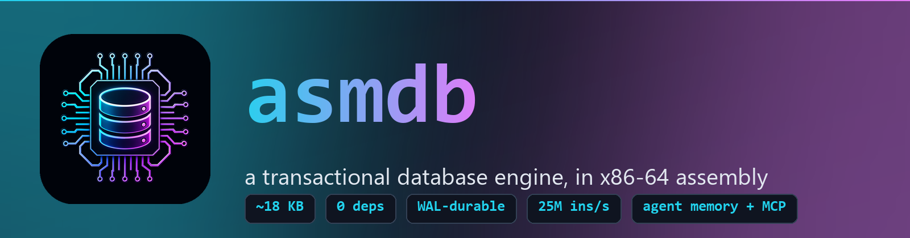
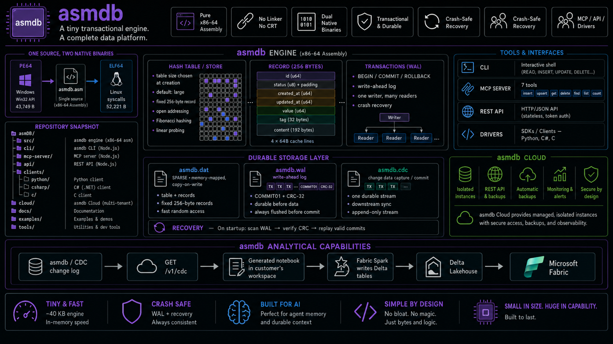
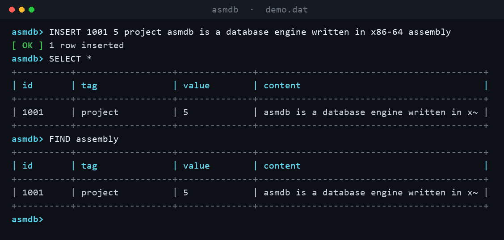
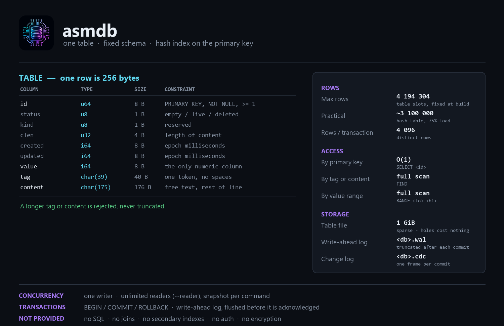
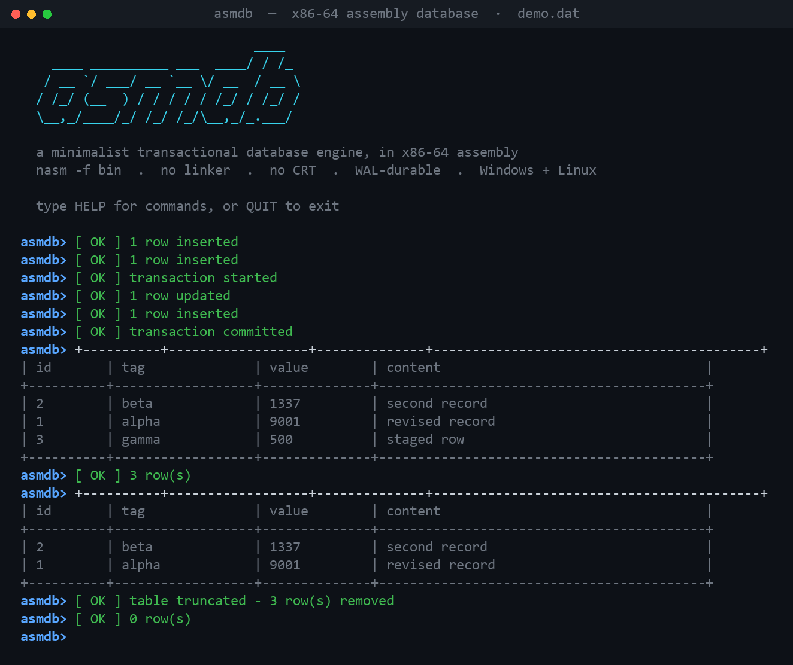
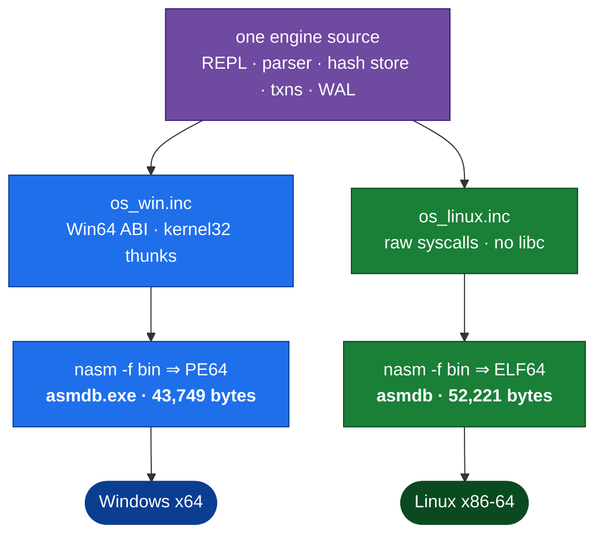
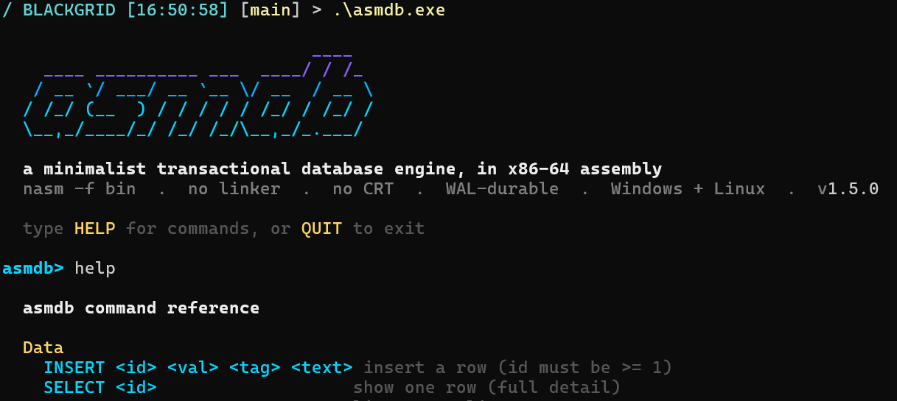

<div align="center">
  

  <h1>asmdb</h1>

  <p>
    <strong>A minimalist, transactional CRUD database engine, hand-written in<br>
    x86-64 assembly — with a Model Context Protocol server as its interface.</strong><br>
    No linker. No C runtime. No dependencies. Runs natively on Windows (PE64)
    <strong>and</strong> Linux (ELF64). The 1.6.2 PE64 build is 43,749 bytes;
    the 1.6.2 ELF64 build is 52,221 bytes. And it is genuinely fast.
  </p>

  

  <p>
    <a href="#"></a>
    <a href="#"></a>
    <a href="#"></a>
    <a href="#"></a>
    <a href="#"></a>
    <a href="#"></a>
    <a href="#"></a>
  </p>
</div>

---

**asmdb** is a tiny, transactional database engine written from scratch in
x86-64 assembly — and it is a *real* database, not a demo.

<p align="center">
  
</p>

|  | |
|---|---|
| 🔩 **Nothing underneath it** | NASM emits the executable **directly** (`nasm -f bin`). No linker, no C runtime, no libraries — the whole engine is one `.asm` tree |
| 🪟🐧 **One source, two native binaries** | a **Windows PE64** calling `kernel32.dll` through a hand-built import table, and a **Linux ELF64** with a hand-assembled header talking to the kernel by raw `syscall` — chosen by a thin `os_*` layer |
| 💾 **Durable, not best-effort** | every statement reaches the disk, `BEGIN`/`COMMIT`/`ROLLBACK` are real transactions, and a write-ahead log makes crash recovery atomic |
| 🔁 **Every change is captured** | an append-only change log records one durable frame per committed transaction, so anything downstream can follow the database exactly |
| 👥 **One writer, many readers** | `--reader` sessions run alongside the writer, each command isolated by the commit sequence |
| ⚡ **Absurdly fast at its one job** | **over 12 million inserts/second** in RAM on one workstation core — roughly **12× SQLite** on the same machine (benchmark below, reproducible) |

**Two ways to drive it:**

- an **ASCII-art CLI** over stdin/stdout — plus `FORMAT TSV` when a program, not
  a human, is reading;
- a bundled **[MCP server](mcp/)** exposing the engine to any Model Context
  Protocol client as a generic CRUD store (`db_insert` / `db_get` / `db_find` / …).

The 256-byte record — a numeric `value`, automatic `created`/`updated`
timestamps, a short `tag` and a free-text `content` field — suits many
workloads. **Durable long-term memory for an AI agent is one example, not the
only one.**

<p align="center">
  
</p>

The speed is not a trick — it is the direct consequence of doing far less. One
fixed-shape row, one hash-indexed table, no parser, no planner. That is the
whole point of writing a database in assembly.

## What fits, and what is enforced

Before you design anything on top of asmdb: the shape of a row is fixed and the
table size is chosen when the database is created (default `large`), then stored
in the file header. Every limit below is refused at write time rather than
silently trimmed.

<p align="center">
  
</p>

| | |
|---|---|
| **Rows per table** | default/large: 4 194 304 slots, 3 145 728 usable rows (0.75 load factor) |
| **Row size** | 256 bytes, fixed — seven columns, no more |
| **`tag`** | 39 bytes max, one token, no spaces |
| **`content`** | 175 bytes max, rest of line |
| **`id`** | `u64`, unique, ≥ 1 |
| **`value`** | `i64` |
| **Rows per transaction** | 4 096 distinct rows |
| **Database on disk** | default/large `<db>.dat` ~1 GiB, sparse on local filesystems, plus `<db>.wal` and `<db>.cdc` |
| **Concurrency** | one writer, unlimited `--reader` sessions |
| **Not there** | no SQL, no joins, no query planner, no secondary indexes, no auth, no encryption |

**A database *is* a table.** There is no `CREATE TABLE`, no `USE`, no catalogue:
`<name>.dat` holds exactly one table, and that file plus its `<name>.wal` and
`<name>.cdc` is simultaneously the unit of durability, of locking, of
transactions, of backup and of change capture. "Database", "table" and "engine
instance" are three words for the same object — the table simply carries a
display name that may differ from the file name. Several tables means several
files, therefore several engine processes, and **no transaction spans two of
them**.

A [`FIND`](docs/COMMANDS.md#find) or
[`RANGE`](docs/COMMANDS.md#range) is a full scan of the configured slot table;
[`SELECT <id>`](docs/COMMANDS.md#select) is O(1). Full details in
[Data model & supported types](#data-model--supported-types).

## asmdb Cloud

asmdb Cloud is the same engine run as a managed service. The public hostname is
**https://www.asmdb.cloud**, with `asmdb.cloud` redirected to it by the
registrar. You create a database and get a real isolated asmdb instance,
reachable through the REST data API, an MCP endpoint for AI agents and
a CLI. The endpoint and the instance access token are returned together once at
creation; the token is then stored only as a hash and can be rotated from the
management API.

<p align="center">
  
</p>

Three tiers, priced from Azure list rates at 15 % margin on run — the derivation,
the assumptions and the ways the model breaks are in
[`docs/COST.md`](docs/COST.md).

Those prices do **not** buy the workstation benchmark above. Hosted tiers get
0.25 vCPU (`free`), 0.5 vCPU (`standard`) or 1 vCPU (`premium`), and every
request also traverses the REST/MCP sidecar and gateway. `free` and `standard`
scale to zero, so the first request after idling waits for a container start;
`premium` stays warm. Official per-tier throughput numbers are not published
yet — use `BENCH` on your own instance for that measurement.

The public front door is API Management; instance containers and storage stay
private. Requests are HTTPS end-to-end, including the hop from the gateway to the
control plane. The browser console signs in with Microsoft Entra ID and PKCE; it
does not carry a client secret. The full design is in
[`docs/SAAS.md`](docs/SAAS.md), and the engine/platform threat model is in
[`docs/SECURITY.md`](docs/SECURITY.md).

## Table of contents

- [asmdb Cloud](#asmdb-cloud) — hosted asmdb instances, API surfaces and service design
- [What fits, and what is enforced](#what-fits-and-what-is-enforced) — capacity, schema and hard limits
- [Why it's interesting](#why-its-interesting)
- [Quickstart](#quickstart)
- [Runs on Windows & Linux](#runs-on-windows--linux) — one engine, two native binaries
- [Commands](#commands) — summary; full [command dictionary](docs/COMMANDS.md)
- [Data model & supported types](#data-model--supported-types)
- [MCP server & the CRUD interface](#mcp-server--the-crud-interface)
- [Change data capture](#change-data-capture) — a durable log of every change
- [How asmdb works](#how-asmdb-works) — the 60-second version, then a deep dive
- [On-disk format: `.dat`, `.wal` and `.cdc`](#on-disk-format-dat-wal-and-cdc)
- [Performance](#performance) — benchmarks vs SQLite
- [How a modern database goes faster](#how-a-modern-database-goes-faster)
- [Transactional-database principles](#transactional-database-principles) — the pillars & coverage
- [Connect from your app](#connect-from-your-app-python--c--c)
- [Engine specification](#engine-specification)
- [Roadmap & SaaS plan](#roadmap--saas-plan)
- [Changelog](#changelog) — what changed, newest first
- [Upgrading a database](#upgrading-a-database) — `--upgrade` between engine versions
- [Project layout](#project-layout)

## Why it's interesting

- **Zero dependencies** — assembled by NASM alone. No linker, no CRT: on Windows the
  only import is `kernel32`; on Linux there are no libraries at all, just `syscall`.
- **One engine, two native binaries** — a thin `os_*` layer lets the *same* assembly
  build a Windows **PE64** and a Linux **ELF64**, both hand-emitted by `nasm -f bin`.
- **Four cache lines per row** — fixed 256-byte records in an open-addressing hash
  table; the record array *is* the index. Lookups are Fibonacci hash + linear probe.
- **Real transactions** — `BEGIN` / `COMMIT` / `ROLLBACK` backed by an undo log.
- **Durable by default** — autocommit flushes every mutation (`FlushFileBuffers`).
- **Crash-safe** — a WAL with a commit marker is replayed or discarded atomically on startup.
- **Two interfaces** — an ASCII-art **CLI** and a bundled **[MCP server](mcp/)** that
  exposes generic CRUD tools (`db_insert` / `db_get` / `db_find` / `db_list` / …).
- **General-purpose record** — a numeric `value`, auto `created`/`updated` timestamps,
  a `tag` namespace and free-text `content`, plus a `FIND` substring search; agent
  memory is one example workload.
- **Genuinely fast** — a built-in `BENCH` command measures the engine directly (see [Performance](#performance)).
- **A real CLI** — colored banner, sectioned `HELP`, catalog commands, boxed result tables.

## Quickstart

The hosted site publishes standalone binaries for both platforms:

```text
/downloads/manifest.json
/downloads/asmdb-<version>-windows-x64.exe
/downloads/asmdb-<version>-linux-x64
```

The manifest is generated at build time and carries the version, byte size and
SHA-256 for each binary, so the page can only advertise the files it is serving.
There is nothing to install; download the matching file and run it. On Linux,
mark it executable first:

```bash
chmod +x asmdb-<version>-linux-x64
```

If you are building from source instead:

**Windows** — requires x64 + NASM 3.x (`winget install --id NASM.NASM -e`):

```powershell
.\scripts\build.ps1                 # -> build\asmdb.exe
.\scripts\build.ps1 -Run            # build, then launch the REPL
.\build\asmdb.exe SalesDB SalesTransactions
```

The first argument names the database (`<name>.dat` + `<name>.wal`); the
optional second argument names the table (stored in the file header).

Load the bundled sample — ten rows in one atomic transaction:

```powershell
.\examples\seed-salesdb.ps1 -Fresh
```

<div align="center">
  
  <br><sub>The ASCII-art REPL — colored banner, boxed result tables, sectioned <code>HELP</code>.</sub>
</div>

## Runs on Windows & Linux

There is **one engine source**. A thin platform layer (`os_*`) is the only part
that differs per OS — everything above it (REPL, parser, hash store, transactions,
WAL) is shared, byte-for-byte. NASM emits each OS's native executable **directly**,
with no linker and no runtime:



The `os_*` layer wraps just a handful of primitives — open/read/write/pread/pwrite,
allocate, flush (`FlushFileBuffers` ↔ `fsync`), current time, standard I/O and a
TTY check — so a `CreateFileW` on Windows and an `openat` syscall on Linux are the
*only* places the platforms diverge.

**Linux** — requires NASM + a GNU toolchain (`sudo apt-get install nasm`), then:

```bash
./scripts/build.sh                # -> build/asmdb   (hand-built ELF64)
./build/asmdb SalesDB SalesTransactions
```

`scripts/build.ps1 -Linux` produces the same ELF from Windows for cross-building.
Validate it with `python tests/validate_elf.py build/asmdb`; run the Linux smoke
suite with `tests/smoke.sh`. See [ENGINE.md §11](docs/ENGINE.md) for the ELF
layout and the full Windows↔Linux syscall mapping.

## Commands

asmdb speaks a small, line-oriented grammar — full CRUD over a fixed-schema table,
real transactions, a catalog, and backup/restore. `HELP` prints the whole
reference in the REPL:

<p align="center">
  
</p>

The essentials:

| Command | Description |
|---|---|
| `INSERT <id> <value> <tag> <content...>` | add a new row (auto `created`/`updated`; `id ≥ 1`) |
| `SELECT <id>` / `SELECT *` | one row as a detail block / all rows as a table |
| `UPDATE <id> <value> <tag> <content...>` | overwrite an existing row (bumps `updated`) |
| `DELETE <id>` | remove one row by key |
| `TRUNCATE` | remove **every** row (transaction-aware) |
| `FIND <substr>` · `RANGE <lo> <hi>` · `COUNT` | search · value-range scan · live count |
| `BEGIN` · `COMMIT` · `ROLLBACK` | transaction control |
| `BACKUP <file>` · `RESTORE <file>` | snapshot / reload the database |
| `TABLES` · `DATABASES` · `SCHEMA` · `TYPES` · `BENCH <n>` | catalog & benchmark |
| `HELP` · `EXIT` / `QUIT` | reference · leave |

📖 **The full [command dictionary](docs/COMMANDS.md)** documents every command with
syntax, constraints and worked examples — including why a fixed-schema engine has
**no `CREATE TABLE` / `DROP` / `ALTER`** (`CREATE TABLE` is implicit; empty a table
with `TRUNCATE`; "drop" is deleting the `.dat` file).

Notes: `tag` is a single token, `content` is the rest of the line (spaces allowed);
`INSERT`/`UPDATE` enforce an `id ≥ 1` **CHECK** (id `0` is reserved);
`BACKUP`/`RESTORE` are refused inside a transaction; and opening a database that
another engine already holds **for writing** is refused (single-writer lock).
Any number of `--reader` sessions can read it at the same time.

## Data model & supported types

Every row is a **fixed 256-byte record** — exactly four CPU cache lines. That
single constraint is what keeps the engine small, predictable, and fast. The
fields are general-purpose — a numeric `value`, two automatic timestamps, a
short category `tag`, and a free-text `content` field — and the physical layout
never changes:

| Offset | Size | Field | Type | Notes |
|-------:|-----:|-------|------|-------|
| `0`  | 8   | `id`      | `u64`       | primary key |
| `8`  | 1   | `status`  | `u8`        | `0` empty · `1` live · `2` deleted (tombstone) |
| `9`  | 1   | `kind`    | `u8`        | row-kind tag (reserved, default `0`) |
| `12` | 4   | `clen`    | `u32`       | content byte length |
| `16` | 8   | `created` | `i64`       | creation time, unix epoch ms (auto) |
| `24` | 8   | `updated` | `i64`       | last-update time, unix epoch ms (auto) |
| `32` | 8   | `value`   | `i64`       | numeric payload / score |
| `40` | 40  | `tag`     | `char[40]`  | category / namespace — 39 usable bytes + NUL |
| `80` | 176 | `content` | `char[176]` | free text — 175 usable bytes + NUL |

On top of that raw layout, `TYPES` advertises a catalog of **logical types**.
Narrow integers, booleans and floats all ride inside the 64-bit `value` cell —
asmdb stores the raw bits and your application (or an agent via the MCP server)
chooses the interpretation:

| Type | Bits | Domain | Column(s) |
|------|-----:|--------|-----------|
| `u64`         | 64   | `0 .. 1.8e19`              | `id` (key) |
| `i64`         | 64   | `-9.2e18 .. 9.2e18`        | `value` |
| `u32` / `i32` | 32   | narrowed integer           | `value`, `clen` |
| `u16` / `i16` | 16   | narrowed integer           | `value` |
| `u8`  / `i8`  | 8    | narrowed integer           | `kind`, `value` |
| `bool`        | 8    | `0 = false` / `1 = true`   | `value` |
| `f64`         | 64   | IEEE-754 double (bits)     | `value` |
| `timestamp`   | 64   | unix epoch milliseconds    | `created`, `updated` |
| `char[40]`    | 320  | text, ≤ 39 B + NUL         | `tag` |
| `char[176]`   | 1408 | text, ≤ 175 B + NUL        | `content` |

One `.dat` file is one database holding one logical table; its name lives in the
512-byte header. See [On-disk format](#on-disk-format-dat-wal-and-cdc) for the exact bytes.

## MCP server & the CRUD interface

asmdb ships with a Node [Model Context Protocol](https://modelcontextprotocol.io)
server in [`mcp/`](mcp/) that exposes the engine to any MCP client as a
**generic CRUD store**. It keeps one long-lived `asmdb.exe` process (the 1 GiB
region is read once) and exposes seven tools:

| Tool | Arguments | Description |
|------|-----------|-------------|
| `db_insert` | `id`\|`key`, `content?`, `tag?`, `value?`, `upsert?` | insert a row; `upsert:true` overwrites instead of erroring |
| `db_update` | `id`\|`key`, `content?`, `tag?`, `value?` | overwrite an existing row |
| `db_get`    | `id`\|`key` | fetch one row with value, tag, content, timestamps |
| `db_delete` | `id`\|`key` | remove a row |
| `db_find`   | `query` | case-insensitive substring search over tag + content |
| `db_list`   | — | return every live row |
| `db_count`  | — | number of live rows |

A row is addressed by a numeric `id` (used as-is) **or** a string `key` that the
server hashes to asmdb's `u64` primary id with 64-bit FNV-1a — so the engine
stays a pure id-keyed store with no secondary index.

> **Example use case — agent memory.** Address each memory by a string `key`
> (e.g. `user.timezone`), use `tag` as a namespace, `value` as an optional
> score and `content` as the remembered text, and call `db_insert` with
> `upsert:true` to store-or-overwrite. `created`/`updated` are automatic, so an
> agent gets durable long-term memory for free — one workload among many.

```bash
cd mcp && npm install && npm test      # end-to-end test against a scratch DB
```

See [`mcp/README.md`](mcp/README.md) for client registration (Claude / VS Code /
Copilot) and configuration.

## Change data capture

Every committed transaction that changes something appends **one frame** to a
durable, append-only **`<db>.cdc`** log. Another process can follow it to mirror
the table, feed a queue, or drive a materialised view — no network protocol, no
library to link against, no daemon.

```text
> python tests/cdc_dump.py sales.cdc
Frame seq=1 op_count=1 flags=0 size=328 offset=0
  UPSERT id=1 value=100 tag=alpha content=premiere
Frame seq=2 op_count=1 flags=0 size=328 offset=328
  UPSERT id=1 value=111 tag=alpha content=modifiee
Frame seq=3 op_count=1 flags=0 size=328 offset=656
  DELETE id=2
Frame seq=4 op_count=0 flags=RESET size=56 offset=984
```

What the log is careful about:

- **Nothing is lost.** The frame is durable *before* the change reaches
  `<db>.dat`, so recovery can only ever owe the log a frame — never the reverse.
  Crash in that exact window and the next open publishes it, exactly once.
- **One event per row per transaction, carrying the final image.** Three updates
  to a row in one transaction produce one `UPSERT` with the last value.
  Inserting then deleting it produces **nothing**, and burns no sequence number.
- **`RESET`, not a flood.** `TRUNCATE`, `RESTORE` and `BENCH` replace the whole
  table, so each emits a single `RESET` telling the consumer to re-snapshot —
  `BENCH 1000` is one frame, not a thousand.
- **Bootstrap without a gap.** `BACKUP` carries `last_commit_seq`, so a consumer
  loads a snapshot, reads its watermark, and resumes from the frames after it.
- **Torn vs corrupt.** A trailing frame cut short by a crash is trimmed; a
  *complete* frame that fails its checksum refuses the open and is kept.

Full byte layout and recovery protocol: **[`docs/CDC.md`](docs/CDC.md)**.
`tests/cdc_dump.py` is a dependency-free reference reader.

## How asmdb works
### The 60-second version

Picture the default `large` table as a huge coat-check with **4,194,304 numbered
hooks**. To store a row, asmdb runs the row's `id` through a scrambling function
that turns it into a hook number, and hangs the 256-byte row there. To find it
again, it runs the *same* function and walks straight to that hook — no scanning,
no index to maintain, because **the array of hooks *is* the index**. If two rows
want the same hook, the second one takes the next free hook along (a "linear
probe").

That whole coat-check lives in memory, so reads and writes are essentially free.
Durability is a separate job: when you change data, asmdb also writes it to a
file and asks Windows to physically flush it to the disk. Inside a transaction it
is cleverer — it stages all the changes in a **write-ahead log**, flushes that
once, stamps it "committed", and only then updates the main file. If the power
dies mid-way, startup either finds a fully-committed log (and replays it) or an
incomplete one (and throws it away). You never see a half-written transaction.

Now the diagram, then the deep dive.


### The deep dive

How a 43,749-byte PE64 and a 52,221-byte ELF64 become a durable database.

#### The executable — no linker, no CRT

NASM emits each native binary **directly** (`nasm -f bin`); there is no linker
step on either platform. On **Windows** the trick is alignment: with
`SectionAlignment == FileAlignment == 0x200`, every RVA equals its offset in the
file, so the import table can be laid out by hand — a small array of thunks
pointing at hint/name entries that Windows binds to `kernel32.dll` at load time.
On **Linux** there is no import table at all: a hand-assembled ELF64 header maps a
single RWX `PT_LOAD` segment and the code issues raw `syscall`s, so the binary
depends on nothing but the kernel. Code, data and imports share a single section;
the 1 GiB record store is **mapped copy-on-write from the `.dat`** at runtime,
which is why the PE64 binary is 43,749 bytes at 1.6.2 and the 1.6.2
ELF64 binary is 52,221 bytes — and why a million-row database needs only a few
MB of RAM.

#### The record store — four cache lines per row

Each row is a fixed **256-byte record** (exactly four cache lines), and the
records live in an open-addressing hash table where the record array *is* the
index — there is no separate structure to keep in sync. The default `large`
table has **4,194,304 slots**. The slot for a key is a Fibonacci hash: multiply
by the 64-bit golden-ratio constant and keep the top bits.

```asm
; store_hash(rcx = id) -> rax = slot 0 .. 4194303 in the large table
mov  rax, rcx
mov  rdx, 0x9E3779B97F4A7C15   ; 2^64 / golden ratio
imul rax, rdx                  ; scramble the key across the whole table
shr  rax, 42                   ; keep the top 22 bits (log2 of 4,194,304)
```

Collisions are resolved by linear probing (`slot = (slot + 1) & (CAPACITY-1)`),
and a deleted row is marked with a **tombstone** (`status = 2`) instead of being
cleared, so probe chains that once ran through it still terminate correctly.
Multiplying by the golden ratio scatters even sequential keys across the whole
table, which keeps probe chains short and lookups close to O(1).

#### Calling convention

Every routine follows one shape: an `rbp` frame, at least 32 bytes of shadow
space, and `rsp` kept 16-byte aligned before each `kernel32` call — the Win64
ABI, applied uniformly so the code reads the same everywhere. During parsing,
`rsi` is the cursor walking the input line one byte at a time.

#### Transactions — undo log + write-ahead log

Two logs do all the work. An **undo log** makes `ROLLBACK` possible; a
**write-ahead log (WAL)** makes `COMMIT` durable and crash-safe.

- **`BEGIN`** snapshots the live row count and clears the undo log.
- **Each mutation in a transaction** is applied to the RAM table immediately, and
  the *previous* 256-byte image of the touched slot is appended to the undo log.
  The `.dat` file is **not** written yet.
- **`ROLLBACK`** walks the undo log in reverse, restoring each saved image, then
  drops back to the snapshot count. Disk was never touched, so there is nothing
  to reverse on disk.
- **`COMMIT`** is two-phase, and the *order* is what guarantees durability:

  1. stage every *after*-image into the WAL buffer, write it to `<db>.wal`, and
     `FlushFileBuffers`;
  2. append an 8-byte `COMMIT01` marker and flush **again** — after this flush the
     transaction is durable even if the machine dies a microsecond later;
  3. apply the after-images to `<db>.dat` and flush;
  4. truncate the WAL.

The marker in step 2 is the atomic switch: it is written *after* the data is
already safe in the log, so a log either has a marker (the transaction happened)
or it does not (it did not).

#### Crash recovery

On startup, before the table is loaded, asmdb inspects the WAL. A log with a
valid magic, a commit marker **and a matching CRC-32** is replayed into the
`.dat`; a torn or marker-less log is discarded. Replay is **idempotent** — each
WAL entry is an absolute write to a slot index, so applying an already-applied
log changes nothing. That is the classic redo-logging invariant, in a few
hundred bytes of assembly.

The checksum is written and flushed in the *same* operation as the commit
marker, so a frame can never be committed without one. If a committed frame's
bytes no longer match its checksum, asmdb **refuses to open** rather than
replay corrupt rows or silently drop an acknowledged transaction — see the
[error reference](docs/COMMANDS.md#error-reference).

## On-disk format: `.dat`, `.wal` and `.cdc`

asmdb persists a database as **three files** next to each other: `<name>.dat`
holds the data, `<name>.wal` is the transaction log (present only while a commit
is in flight, or after a crash), and `<name>.cdc` is the append-only
[change log](#change-data-capture), specified in [`docs/CDC.md`](docs/CDC.md).

### `<name>.dat` — the data file

A **512-byte header** followed by the fixed slot array. Every RVA-style offset is
exact; there is no padding surprise because the record size never changes.

```
offset  size  field             value / meaning
------  ----  ----------------  ----------------------------------------
   0      8   magic             "ASMDB\0\0\0"
   8      4   version           2
  12      4   record_size       256
  16      8   capacity          slot count selected at creation
  24      8   live_count        number of live rows
  32     48   table_name        ASCII, NUL-padded
  80      4   engine_version    the build that last wrote this file
  88      8   last_commit_seq   change-log watermark
  96      8   reset_pending     1 while a whole-table replacement is in flight
 104      8   reset_pending_seq the sequence that RESET will carry
 112     16   lineage           identity shared with <name>.cdc
 128    384   reserved          zero-filled to 512
 512    ... slot array          capacity × 256-byte records (sparse on disk)
```

Slot *i* lives at file offset `512 + i * 256`. A record is
`u64 id · u8 status · u8 kind · u32 clen · i64 created · i64 updated · i64 value
· char[40] tag · char[176] content`; `status` is `0` empty, `1` live, `2`
tombstone. Because the on-disk slot layout mirrors the in-RAM table exactly, the
region is **mapped copy-on-write** rather than parsed — no deserialization, and
only the pages actually touched become resident.

> `db_open` validates the magic, the version, the record size, the capacity and
> the row count, and refuses anything it cannot fully account for rather than
> reinterpreting it. A database from an incompatible build is migrated with
> [`--upgrade`](#upgrading-a-database), never silently.

### `<name>.wal` — the write-ahead log

Written only during `COMMIT` and read only during recovery. Layout, in the exact
order it is flushed:

```
offset        size        field       meaning
------------  ----------  ----------  -----------------------------------
   0            8         magic       "ASMWAL03"
   8            8         N           number of staged entries
  16            8         count       live_count to stamp into the header
  24            8         commit_seq  the change-log sequence this commit takes
  32            8         flags       bit 0 = RESET
  40         N × 280      entries     N × { u64 slot_index ; u64 prev_id ;
                                            u64 prev_status ; 256-byte image }
40 + N×280      8         marker      "COMMIT01"   ┐ written & flushed
48 + N×280      8         crc32       of [0, 40+N×280)  ┘ together, LAST
```

The marker is the commit point, and its checksum ships in the same flush, so a
frame can never be committed without one. Only slots that **actually changed**
are staged, which is what makes the frame double as the change set; `prev_id`
and `prev_status` are what let a reused slot emit `DELETE(old)` alongside
`UPSERT(new)`.

Recovery reads the log, verifies the magic, the marker and the checksum, then —
before touching the data file — publishes the change frame if the crash lost it,
replays each entry as an absolute write to `512 + slot_index × 256`, and only
then truncates the log. Since every entry is an absolute slot write and the
change frame is keyed by sequence, replaying twice is harmless: recovery is
idempotent. Frames carrying the older `ASMWAL01`/`ASMWAL02` magic are still
replayed, so an engine upgrade never drops an acknowledged commit.

## Performance

asmdb ships with a `BENCH <n>` command that times the engine **from the inside**
using `QueryPerformanceCounter`, with no text protocol and no shell in the way.
The harness below runs `BENCH`, the two end-to-end stdio modes, and — for an
honest baseline — the **same workloads on SQLite** (via Python's in-process
`sqlite3`, i.e. the C API with no protocol overhead, which is generous to SQLite).

```powershell
.\examples\bench.ps1 -Rows 2000000            # 2,000,000 rows, best of 3, + SQLite compare
.\examples\bench.ps1 -Rows 2000000 -NoCompare # asmdb only
```

### asmdb vs SQLite — 2,000,000 rows on one workstation core

Records are **256 bytes** and the store is a **1 GiB** hash region (`2^22` slots),
created **sparse** on disk so unused slots cost nothing.

| Workload, same workstation core | asmdb | SQLite 3.49.1 | ratio |
|---|--:|--:|--:|
| **Engine insert** — in-RAM, one transaction | **≈ 12,383,609** rows/s | 1,004,090 rows/s | **≈ 12.3× faster** |
| **Durable bulk load** — one checkpoint + `fsync` | **≈ 1,170,960** rows/s | 859,784 rows/s | **≈ 1.4× faster*** |
| **Durable per-row** — one `fsync` per row | **≈ 932** rows/s | 101 rows/s | **≈ 9.2× faster** |

A fourth figure, not in the table because SQLite has no equivalent, is the
**transaction throughput over the stdio protocol** — the realistic
"over-the-wire" number a client sees, including command parsing and per-row acks:
**≈ 5,932 rows/s** (2M rows in `BEGIN…COMMIT` batches). It is bounded by the
line-based text protocol, not the engine — which is exactly why a real
deployment batches inside `BEGIN … COMMIT`.

These are **local workstation measurements**, not hosted-tier promises. asmdb
Cloud sells fractions of a Container Apps CPU: 0.25 vCPU on `free`, 0.5 on
`standard`, and 1.0 on `premium`; REST, MCP and gateway hops add overhead, and
`free`/`standard` also pay a cold start after idling. Per-tier throughput
figures are not published yet — run `BENCH` on your own instance to measure the
engine path for that tier.

The story the numbers tell: the disk flush dominates durability. Autocommit
`fsync`s after *every* row (~932/s); a transaction applies every row in RAM and
`fsync`s **once** (millions/s). Wrapping inserts in `BEGIN … COMMIT` is the single
biggest speed lever.

### Why asmdb wins — and the honest caveats

asmdb is faster on **in-RAM inserts (≈ 12×)** and **per-row durability (≈ 9×)**
because **it does far less**: a fixed 256-byte schema, a single table, no SQL
parser, no query planner, no secondary indexes, no MVCC, no concurrency control.
SQLite is a full relational engine doing all of that. So this is *not* "assembly
beats C" — it is **a specialized key/value store beating a general-purpose SQL
database at the narrow thing it was built for.**

**\* The durable bulk-load row is the one to read with care.** In this clean,
best-of-3 run it edged *ahead* of SQLite (≈ 1.4×), but it is by far the most
disk- and page-cache-sensitive number here and has measured *slower* than SQLite
on cold, fresh-file runs. The reason is a real, documented trade-off: because the
open-addressed hash scatters rows across the whole 1 GiB region, the bulk
checkpoint currently writes (and, on a fresh sparse file, first-allocates) the
*entire* region rather than just the dirty rows — ~1 GiB flushed for 2M rows,
far more bytes than SQLite's page-cache commit. The planned fix — an incremental
(dirty-slot) checkpoint and partitioned files — is on the
[roadmap](#how-a-modern-database-goes-faster) and is what will make this figure
*consistently* fast instead of variance-dependent. It is reported as measured
rather than cherry-picked.

<sub>Measured on an Intel Core Ultra 7 268V · NVMe SSD · Windows 11 · single-threaded ·
best of 3 · SQLite 3.49.1 in-process (C API, no protocol). Throughput is disk- and
machine-dependent — reproduce it with the command above.</sub>

## How a modern database goes faster

asmdb today is a **row store**: whole 256-byte records, one table, one thread. That
is a deliberate v1 tradeoff — small, predictable, cache-friendly. Here is how the
big engines (SQL Server, PostgreSQL, DuckDB, ClickHouse) push further, which CRUD
path each technique accelerates, and where it sits on asmdb's roadmap.

| Technique | What it buys you | Speeds up | In asmdb |
|---|---|---|---|
| Open-addressing hash index (array *is* the index) | O(1) average key lookup, zero index maintenance | Create / Read / Update / Delete by key | ✅ implemented |
| Fibonacci hashing | scatters keys, short probe chains | Read / Update probing | ✅ implemented |
| WAL + group commit | amortize one `fsync` over many rows | durable Create / Update / Delete | ✅ implemented |
| Columnar storage | store each column contiguously; touch only the columns a query needs | analytical Reads, `COUNT` / `SUM` scans | 🗺️ roadmap |
| Lightweight compression (RLE, dictionary, bit-packing, frame-of-reference) | fewer bytes ⇒ fewer cache misses and less I/O | Read scans, bulk load | 🗺️ roadmap |
| Secondary & bitmap indexes | fast lookup on non-key columns | Reads with predicates | 🗺️ roadmap |
| Partitioning + file split | prune irrelevant data, shrink the working set, parallel I/O | all CRUD at scale | 🗺️ roadmap |
| SIMD + multi-threading | process many rows per instruction / per core | analytical Reads, bulk ops | 🗺️ roadmap |
| Snapshot readers | readers never block the writer | concurrent workloads | ✅ `--reader` |
| MVCC | many concurrent *writers* | write-heavy workloads | 🗺️ roadmap |

**Columnar + compression.** A row store reads a whole 256-byte record even to sum
one column. A *column* store keeps each column in its own contiguous run, so a
`SUM(value)` streams only the `value` array through the CPU — and because a column
holds one kind of data, it compresses hard: run-length encoding for repeats,
dictionaries for low-cardinality text, bit-packing and frame-of-reference for
narrow integers. Less data moved means fewer cache misses and less disk I/O on
every Read. In asmdb the natural first step is to split the `value` cell out of
the record into a packed column and bit-pack it to its declared `TYPES` width
(a `u8` column would shrink 8×).

**Partitioning + parallelism.** Beyond a certain size one file and one thread stop
scaling. Modern engines **partition** data (by key range or hash) into separate
files, so a query can *prune* whole partitions it doesn't need and process the
survivors **in parallel** — one thread or core per partition, often with **SIMD**
scanning 8–16 values per instruction inside each. asmdb's fixed-width slot array
is already SIMD- and shard-friendly: the slot region could be split into *P*
files of `CAPACITY/P` slots, each with its own WAL, checkpointed by *P* threads at
once. The single-file, single-thread design is what keeps v1 honest and tiny; the
layout was chosen so these are additive, not rewrites.

Everything marked 🗺️ is future work, called out plainly so the benchmarks above
stay honest: they measure what asmdb **does today**, not what it might do.

## Transactional-database principles

A serious transactional database is more than fast CRUD. The table below scores
asmdb against the classic **ACID** guarantees plus the operational pillars every
real database service needs — ✅ delivered, ◐ partial, 🗺️ planned — and points
at where each lives (the assembly **engine**, its [roadmap](docs/ENGINE.md#12-roadmap),
or the hosted [SaaS layer](docs/SAAS.md)).

| # | Principle | asmdb today | Where |
|--:|-----------|:-----------:|-------|
| 1 | **Atomicity** — a transaction is all-or-nothing | ✅ | `BEGIN`/`COMMIT`/`ROLLBACK` + undo log (engine) |
| 2 | **Consistency** — only valid states are committed | ✅ | unique primary key, fixed-width typed columns, and `CHECK`-style validation (`id ≥ 1` + bounded field lengths) enforced at write (engine) |
| 3 | **Isolation** — concurrent txns don't interfere | ✅ | serializable for writes (one writer at a time); readers get snapshot isolation at commit granularity via the commit-sequence fence — no dirty or phantom reads; concurrent *writers* (MVCC) → roadmap |
| 4 | **Durability** — committed data survives a crash | ✅ | WAL + `FlushFileBuffers` (engine) |
| 5 | **Crash recovery** — atomic redo / discard on restart | ✅ | idempotent WAL replay with commit marker (engine) |
| 6 | **Concurrency control** — many clients, safely | ✅ | one writer (byte-range / `flock` lock) plus unlimited concurrent `--reader` sessions; group commit and multi-writer MVCC → roadmap |
| 7 | **Indexing & access paths** — no full scans | ✅ | O(1) primary hash index + `SELECT *`, `FIND` and value `RANGE` access paths; index-accelerated secondary columns → roadmap |
| 8 | **Query & access interface** — a defined API | ✅ | REPL grammar + MCP CRUD tools + Python/C#/C clients |
| 9 | **Backup & restore / PITR** — recover to a point in time | ✅ | in-engine `BACKUP`/`RESTORE` snapshots; WAL shipping + PITR → SaaS |
| 10 | **Security & observability** — authz, encryption, audit, metrics | 🗺️ | provided by the [SaaS layer](docs/SAAS.md) (engine stays single-node) |

The engine delivers **nine of the ten** principles on a single node — the whole
transactional core (1–5), single-writer concurrency control (6), a primary index
plus secondary access paths (7), the query interface (8) and in-engine
backup/restore (9). Only **security & observability** (10) — and the *scale-out*
facets of concurrency (6) and point-in-time recovery (9) — belong to the
[SaaS layer](docs/SAAS.md). The engine stays 100% assembly throughout.

## Connect from your app (Python · C# · C)

There is **no driver or network protocol** — asmdb is a stdin/stdout REPL. To use
it from another language you **spawn the process and pipe commands**; colors are
disabled automatically when the output is redirected, so you get clean ASCII back.

```python
from asmdb_client import Asmdb
db = Asmdb(r".\build\asmdb.exe", "SalesDB", "SalesTransactions")
db.run("BEGIN", "INSERT 1 500 customer Contoso Ltd - key account", "COMMIT")
print(db.select_all())     # [{'id': 1, 'tag': 'customer', 'value': 500, 'content': 'Contoso Ltd - key account'}]
```

Ready-to-run examples live in [`clients/`](clients/) (Python, C#, C), along with
notes on adding a proper `--json` batch mode or a TCP server for a real driver.
For AI agents, the [`mcp/`](mcp/) server is the turnkey path — no piping required.

## Engine specification

For the precise, byte-level technical reference — PE64 layout, calling
convention, record store, hash function, on-disk formats, the two-phase commit
and recovery protocol, the MCP integration, and the full roadmap — see
**[`docs/ENGINE.md`](docs/ENGINE.md)**.

## Roadmap & SaaS plan

Two documents, deliberately kept in separate lanes:

- **[`docs/ENGINE.md`](docs/ENGINE.md) — the engine roadmap.** Everything here
  stays **100% x86-64 assembly**. See [§12 Roadmap](docs/ENGINE.md#12-roadmap).
- **[`docs/SAAS.md`](docs/SAAS.md) — the productization plan.** How the assembly
  engine becomes **asmdb Cloud**: a hosted, pay-as-you-go database service where
  every database instance runs in its **own isolated micro-container** with a
  dedicated `asmdb` process. Covers provisioning & lifecycle, per-instance
  isolation, the HTTP + remote-MCP access layer, consumption metering &
  billing, durability/backups, HA, security/compliance, deployment, pricing, and
  a phased GTM. The engine is the data plane and stays assembly; **this
  control/service layer may use any language** (Rust/Go), by design. (Hosted
  agent memory is one example workload on top.)

### Where the engine stands today

| Area | Status |
|---|---|
| **CRUD + transactions** | ✅ `INSERT`/`SELECT`/`UPDATE`/`DELETE`/`TRUNCATE`/`COUNT`, `BEGIN`/`COMMIT`/`ROLLBACK`, `FIND`, `RANGE` |
| **Durability** | ✅ WAL with two-phase flush, **CRC-32 per frame**, idempotent crash recovery; the log carries the database lineage, so a stray `.wal` is refused rather than replayed |
| **Whole-table operations** | ✅ `TRUNCATE`/`RESTORE`/`BENCH` are announced in the header before they start, so an interrupted one is finished on the next open |
| **Change data capture** | ✅ `<db>.cdc`: one durable frame per committed transaction, dense sequences, `RESET` for global operations, and `CDCTRIM` for retention |
| **Concurrency** | ✅ one writer plus **unlimited `--reader` sessions**, each command isolated by the commit-sequence fence |
| **Integrity** | ✅ `VERIFY` re-checks the store's own invariants — status bytes, reserved keys, content lengths, probe reachability, duplicate keys, row count |
| **Safety** | ✅ every read/write/flush checked; a failed durable write aborts instead of acknowledging; a corrupt or foreign `.dat` is refused, never silently recreated; `BACKUP` refuses to target a live file |
| **Startup & memory** | ✅ local workstation measurement: the store is **mapped copy-on-write**; opening a database is ~80 ms whatever its size (was ~600 ms), and a 1 M-row database peaks at **~5 MB** of RAM (was ~1 029 MB) |
| **Snapshots** | ✅ written a chunk at a time with empty chunks left as holes — a three-row backup allocates 3.2 MiB, not 1 GiB |
| **Machine interface** | ✅ `FORMAT TSV` + `PAGE` — full-fidelity rows, never truncated, for clients that must not parse a picture |
| **Portability** | ✅ Windows PE64 + Linux ELF64 from one source, behind a thin `os_*` layer |
| **Integration** | ✅ MCP server (generic CRUD tools) + Python / C# / C stdio clients |
| **Security** | ⚠️ no auth, no encryption, no audit log; the binary is a single RWX image at a fixed address — see [`docs/SECURITY.md`](docs/SECURITY.md) |
| **Tests** | ✅ Windows and Linux smoke suites, plus 24 checks for the MCP server — fault-injected I/O failures, crash windows, format fuzzing |
| **Next up** | 🔜 **secondary indexes** — on the local benchmark machine, a full `FIND` costs ~900 ms whatever the row count, and a status directory was prototyped and measured *worse* on populated tables. Then SIMD scans and multi-writer MVCC |

**The roadmap is driven by measurement, not intuition.** On the local benchmark
workstation, the last milestone came from noticing that opening a database cost
**~600 ms regardless of its
contents** — 0 rows, 1 000 rows and 1 000 000 rows all measured the same,
because `db_open` committed and read the *entire* 1 GiB slot region even though
the file is sparse and mostly holes. Mapping the file **copy-on-write** instead
fixed it at the root:

| 1 000 000 rows, local workstation | before | after |
|---|--:|--:|
| open + `COUNT` | 684 ms | **104 ms** |
| peak memory | 1 029 MB | **5 MB** |
| `BENCH` in-RAM insert | 11.8 M rows/s | 11.7 M rows/s (unchanged) |

Hosted cgroup stats need a different reading: Azure Files NFS reserves the full
tier table on disk, and container working set includes reclaimable file-backed
cache from the copy-on-write mapping. That is why the service reports reserved
versus actually used separately; it does not weaken the local 5 MB measurement.

**And measurement kills ideas as well as confirming them.** The next roadmap item
was a *persisted status directory* — one byte per slot, held contiguously, so a
full scan reads 4 MiB instead of striding through 1 GiB. It was built, and it did
exactly what it promised on a nearly-empty table:

| full `FIND` | 1 GiB sweep | status directory |
|---|--:|--:|
| 100 rows | 529 ms | **108 ms** |
| 100 000 rows | **897 ms** | 6 000 ms |

Reading one byte per slot is cheap; *then jumping to each live record* is not.
The old code streamed the region sequentially and let readahead do the work,
while the directory turns the same work into random reads. The win only survives
below roughly a thousand rows — nowhere near enough to justify changing the
storage format. It was reverted, and the real answer to a slow `FIND` is a
**secondary index**.

Durability was deliberately left alone: a *private* mapping keeps uncommitted
writes out of the file, so the WAL protocol still owns every byte that reaches
disk. The 200× memory drop is also what makes the one-container-per-instance
model in [`docs/SAAS.md`](docs/SAAS.md) realistic.

**And the honest cost:** a full-table scan (`SELECT *`, `FIND`) now faults the
region in rather than walking already-resident RAM — about **26 % slower** on a
full `FIND`, more on a sparsely populated table. That is the next item: a
**persisted dense status directory** so a scan streams a few MiB instead of
touching 1 GiB. Details in [§12 Roadmap](docs/ENGINE.md#12-roadmap).

## Changelog

<details>
<summary><b>Release history</b> — 1.6.2 · 1.6.1 · 1.6.0 · 1.5.3 · 1.5.2 · 1.5.1 · … (click to expand)</summary>

Versions follow `MAJOR.MINOR.PATCH`. **`MAJOR` changes only when the on-disk
format does**, so a major bump is the signal that `--upgrade` has work to do.
`MINOR` marks a feature or a behaviour change, `PATCH` marks fixes,
performance and docs.

Two numbers are tracked separately and should not be confused:

| | What it is | How often it moves | Effect |
|---|---|---|---|
| **Engine version** | the software (`1.6.2`) | every release | shown by `VERSION` and in the banner; stamped into each database it writes |
| **Storage format** | the byte layout of `<db>.dat` (`2`) | rarely | decides whether a file can be opened, and what `--upgrade` migrates |

Run `VERSION` inside the REPL to see both, plus which engine last wrote the open
database. To move a database written by an incompatible build, see
[Upgrading a database](#upgrading-a-database).

Newest first — click a version to expand it.

<details>
  <summary><b>1.6.2</b> — an upgrade no longer inherits the revision it must replace</summary>

  **A field the control plane never sets could stop every upgrade.** Upgrading
  reads the container app, changes the image and writes it back, so a revision
  suffix already present in the template travelled with it. Azure refuses to
  create a second revision with a suffix that already exists, so the write
  failed:

  ```
  Field 'template.revisionsuffix' is invalid with details:
  'Invalid value: "v160182757": revision with suffix v160182757 already exists.'
  ```

  The upgrade rolled back correctly and the database was never at risk, but the
  failure was permanent: once any out-of-band operation had pinned a suffix, no
  later upgrade could succeed. The error named a field this code does not touch,
  which is what made it hard to attribute. The suffix is now cleared before every
  write and Azure allocates a fresh one.

</details>

<details>
  <summary><b>1.6.1</b> — a database that needs recovery can start again</summary>

  **Five seconds to open a database.** That was the sidecar's startup budget,
  and it was measured on a workstation where opening is instant. On the hosted
  service the data sits on Azure Files NFS, the `.dat` is a gigabyte and not
  sparse there, and an open that follows an abrupt stop must first finish an
  interrupted whole-table operation before it can answer.

  The consequence was not a slow start but a permanent one. Container Apps never
  revives a revision that failed to become healthy, so an instance whose engine
  needed more than five seconds — precisely the instance that had just been
  interrupted and most needed to recover — could not come back at all. Found by
  killing revisions during an upgrade and watching a healthy database become
  unstartable.

  The budget is now five minutes, and `ASMDB_START_TIMEOUT` overrides it, so an
  operator can bring up a database on unusually slow storage without shipping an
  image. A start in progress logs its progress every fifteen seconds, because a
  silent wait is indistinguishable from a hang.

  Also in this release: running text on the site was constrained to a measure
  much narrower than the sections around it, leaving a thin column in a wide
  page. It now uses a wider measure — around 95 characters, not the full
  viewport, because a 200-character line is worse than the problem it fixes.

</details>

<details>
  <summary><b>1.6.0</b> — the table is sized for the machine it runs on</summary>

  **A database allocated a gigabyte before holding a single row.** The slot
  table was a compile-time constant: 2²² slots × 256 B, exactly 1 GiB, the same
  on every machine. That is defensible on a workstation and indefensible as a
  hosted service, where the smallest tier is given 0.5 GiB — half of what the
  engine wanted before any data existed.

  The capacity is now chosen when the database file is created, from
  `ASMDB_CAPACITY`: `small` (2¹⁹ slots), `medium` (2²¹) or `large` (2²², the
  default, so existing files and existing behaviour are unchanged). It is
  recorded in the file header, and **the header wins on every later open** — the
  variable can never reshape a database that already exists, which matters
  because an environment variable is the easiest thing in the world to change by
  accident. Growing a database from one size to the next goes through the
  migration path that already existed for exactly this case.

  The probe loop keeps its speed: the wrap mask and the hash shift became a
  loaded mask and a variable shift, not a branch or a call.

  **What the hosted service advertised was the slot count, not the row count.**
  The engine refuses inserts past a 0.75 load factor — that is what keeps
  lookups constant-time in an open-addressed table — so `4,194,304` was a
  ceiling no customer could ever reach. Every published figure is now the number
  the engine actually refuses to exceed: 393,216 · 1,572,864 · 3,145,728.

  **Reservation is no longer reported as consumption.** A database holding five
  rows reported `1,023.96 MiB working set / 1 GiB`, which reads as full. It was
  not: the record store is mapped copy-on-write from the `.dat`, so most of that
  is reclaimable file cache, and the hosted volume is Azure Files NFS, which does
  not honour sparseness, so the file genuinely occupies its full size on disk.
  The engine was correct and has not been changed. `/v1/stats` now separates
  reserved from actually-used for both memory and storage, and reports the
  reclaimable portion instead of leaving it unknown — it had no cgroup v1
  fallback, which is why that field was always blank.

  **The CLI answered the previous question.** Responses drifted by one command
  and never recovered: `SCHEMA` returned the preceding `SELECT *`, `FIND`
  returned the schema, `COUNT` returned twenty rows, and `BENCH 100000` reported
  `0 row(s)` after writing a hundred thousand. A command emitting more than one
  frame left the extra unread, and every later answer was served one behind. The
  reader now drains to a known boundary before and after each command, so a
  single malformed response cannot desynchronise a session permanently.

  **A busy database is no longer reported as a broken one.** A stats probe
  arriving during a long command timed out and blanked the panel, then recovered
  on the next poll. Probes no longer queue behind the workload or trigger a
  restart, and a timeout is served as the last known good sample marked stale.

  Console: the instance token is held per database rather than globally, is
  cleared when leaving the creation screen instead of lingering in the DOM after
  being shown "once", and the row preview distinguishes *no token held* from
  *request failed* from *genuinely empty* rather than calling all three empty.

</details>

<details>
  <summary><b>1.5.3</b> — an instance can back itself up without the platform holding a write key</summary>

  Hosting only; the engine is unchanged from 1.5.2 apart from the version
  constant.

  **The upgrade path could never run.** It takes a backup before touching
  anything and aborts when that fails — the guarantee worth keeping — but the
  backup could not succeed. The control plane has no credential to command an
  instance: the customer's token exists only as a hash, and the per-instance
  platform token is confined to reading stats.

  The obvious move was to widen that token. It is derived for the whole fleet
  from one master secret, so a route that accepted it *and* could mutate data
  would be a fleet-wide write capability behind a single key. Instead the
  instance backs itself up, through a route that can do nothing else: the caller
  sends no command, no path, no argument that reaches the engine, and can
  express exactly one thing. A test asserts that property and fails loudly if
  anyone later adds a parameter.

  **Instance updates stop before they start.** Container Apps rolls updates; the
  engine holds an exclusive lock and runs one replica. So a new revision could
  never open the database while the old one lived, and the old one was never
  retired because the new one never became healthy. Rotating a token returned
  200 and a token the database rejected. Rotation and upgrade now stop the app,
  apply, start, confirm healthy, and roll back — leaving the previous token
  working rather than handing over one that does not.

  A cold start is now a state rather than a failure. An idle instance returns
  the platform's own HTML error page; that is recognised, retried while the
  instance comes up, and reported as `instance_starting`.

</details>

<details>
  <summary><b>1.5.2</b> — every command answers, and the answer belongs to the command</summary>

  **Four commands emitted no status line.** `HELP`, `SCHEMA`, `VERSION` and
  `SELECT *` on an empty table returned to the prompt without an `[ OK ]` or an
  `[ERR]`. The protocol every machine consumer relies on is *send a line, read
  until a status line*, so those four left the reader waiting for a terminator
  that never arrived.

  The consequence was not a hang, which would at least be honest. The reader
  blocked until its timeout and then **every later response was offset by one
  command**. Sending `HELP` to a hosted instance returned `[ OK ] 5 row(s)` —
  the answer to an earlier `COUNT`. A desynchronised stream does not fail, it
  returns confident wrong answers.

  It also explains a symptom nobody had connected to it: a stuck `HELP` holds
  the engine lock, so the hosted service's `/v1/stats` could not run its `COUNT`
  and the console showed the database as unavailable until the timeout released
  it. One defect, three symptoms.

  Every command now terminates, on error paths as well as success, in both
  `FORMAT TABLE` and `FORMAT TSV`. **Clients may rely on it**: exactly one
  status line per command, always.

  The suite gained a check for it. This reached a running service precisely
  because nothing tested that a command answers at all — the tests asserted what
  commands *print*, never that they *finish*.

  The binary grew from 42,749 to 43,013 bytes. The storage format is unchanged
  at 2, so no database needs migrating.

</details>

<details>
  <summary><b>1.5.1</b> — a slow command no longer leaves a hosted instance dead</summary>

  Found by benchmarking a live hosted instance rather than by reading the code.
  `BENCH 10000` on a quarter of a core takes longer than the sidecar's fixed
  30-second command timer, so the sidecar killed the engine, then started a
  replacement while the process it had just killed still held the exclusive
  lock. The replacement exited with `database is locked by another process`,
  which triggered another restart, immediately — dozens of cycles a second, and
  the instance never came back. A plain `COUNT` failed afterwards too.

  Two faults, and the second is the serious one. A single timeout for every
  command punished the ones that are legitimately long — `BENCH`, but equally
  `BACKUP`, `RESTORE`, `VERIFY` and `TRUNCATE` on a populated table. And the
  restart raced a dying process for its own lock, with no backoff and no
  ceiling, which is what turned a slow command into a permanently broken
  database.

  Commands now get a budget chosen by what they are, a restart waits for the
  previous process to exit before claiming the lock, retries back off, and a run
  of failures makes the instance report itself unhealthy instead of spinning.
  Exceeding a budget no longer kills the engine by itself.

  **The engine is unchanged.** This release is the hosting layer around it; the
  `.asm` tree is identical to 1.5.0 apart from the version constant.

</details>

<details>
<summary><b>1.5.0</b> — change-log retention, and a command line that survives a space</summary>

**`CDCTRIM <seq>` gives the change log a retention policy.** `<db>.cdc` was
append-only with no way to reclaim anything: it grew for the life of the
database and was re-read and re-checksummed in full at every open, so start-up
eventually became a function of history rather than of data. Once a consumer has
acknowledged a watermark, `CDCTRIM` drops everything up to it.

It is not a truncation. A replacement log is built beside the old one carrying
the same lineage and a `base_seq` of `<seq>`, so a reader still sees a dense,
verifiable sequence starting at `<seq> + 1` — the same rule that already applied
to a log recreated after an operator deleted it. The old file is replaced only
once the new one is complete and flushed, so a crash leaves either the whole old
log or the whole new one. A watermark below the log's base or above the last
published commit is refused rather than guessed at.

**A Linux argument containing a space no longer splits in two.** The engine
rebuilds a single command-line string from `argv` so that one parser serves both
platforms, and it joined the arguments with spaces — the shell had already
removed the quotes, so `asmdb "my db"` opened a database called `my`. Arguments
containing whitespace are now re-quoted on the way in.

Documentation: the capacity card is rebuilt around the project logo and speaks
database — columns, types, sizes, constraints, access paths — and the README's
opening example is now a rendering of the engine's *actual* output rather than a
hand-written block that had drifted (it still claimed `FIND` printed
`1 match`). `HELP` is shown as a real terminal capture.

Tests: 143 → 151 checks on Windows, mirrored on Linux.

</details>

<details>
<summary><b>1.4.0</b> — the write-ahead log names its database, whole-table operations survive a crash, and a snapshot stops costing a gigabyte</summary>

**A write-ahead log could be replayed into the wrong database.** The log carried
no identity at all, so an `<db>.wal` left behind by one database was replayed
into any other opened under the same base name — including a brand-new, empty
one, which then adopted the foreign log's row count as well. Demonstrated in one
command: with only `orphan.wal` on disk, opening `orphan` produced two rows that
had never been inserted.

Frames are now `ASMWAL04` and carry the 128-bit database lineage. A frame naming
a different database is refused and the log is kept. A frame naming *no*
database — v01 to v03, written before this release — cannot be told apart from
one that wandered in, so it is refused too; the log is left intact and the engine
build that wrote it can still replay it.

**`TRUNCATE`, `RESTORE` and `BENCH` are now crash-atomic.** They replace every
row at once, which no write-ahead frame can express, so `reset_pending` only ever
guaranteed the change log got its `RESET` frame — it said nothing about the table
itself. A crash halfway through left some rows deleted, some not, and a row count
matching neither. The operation is now announced in the header and flushed
*before* it starts, and the announcement is cleared only once the table is
finished and flushed. The next open sees the announcement and completes the work:
`TRUNCATE` and `BENCH` converge on an empty table, `RESTORE` re-copies from the
same snapshot. Tested by crashing at three different points inside a `TRUNCATE`
and checking the reopened database is fully truncated and passes `VERIFY`.

**A snapshot no longer writes a gigabyte to save three rows.** `BACKUP`,
`RESTORE` and the `BENCH` checkpoint each wrote all 4 194 304 slots regardless
of how many were used. The region is now written a 1 MiB chunk at a time and
chunks that are entirely zero are left as file holes — a hole reads back as
zeros, which is exactly what an empty slot is. Backing up a three-row database
allocates **3.2 MiB instead of 1 GiB**, and the test suite went from about six
minutes to 142 seconds. Overwriting an existing region still zeroes the chunks
that used to hold rows, so restoring a small snapshot over a large table really
does remove the old rows.

**Over-long `tag` and `content` are refused instead of truncated.** The columns
are 40 and 176 bytes but reserve their last byte as a terminator, so the usable
maxima are **39 and 175**. Anything longer was silently cut and reported as
success. It is now `[ERR] tag exceeds 39 bytes or content exceeds 175 bytes -
nothing stored`, matching the rule already applied to over-long input lines. The
documentation said 40 and 176 throughout; it now says 39 and 175, and the MCP
server enforces the same numbers.

**A [`docs/SECURITY.md`](docs/SECURITY.md) that is honest rather than
flattering.** The binary is a single segment that is readable, writable *and*
executable, loaded at a fixed address with no ASLR; the engine has no
authentication, no encryption and no audit log; CRC32 detects accidental
corruption, not an attacker; and `flock` on Linux is advisory, so the
single-writer guarantee assumes cooperating processes. All of it is written
down, with a supported-versions table and a disclosure process.

Also: a CycloneDX [`docs/sbom.json`](docs/sbom.json) covering the three layers (engine — no
dependencies at all, MCP server, tooling) with `docs/SBOM.md` explaining it; a
dependency-free fuzz harness that corrupts `.dat`, `.wal` and `.cdc` and asserts
the engine never reports success on damaged input.

Tests: 143 checks on Windows, the same battery on Linux, 24 for the MCP server.

</details>

<details>
<summary><b>1.3.1</b> — the change log validates its own header</summary>

Two checks the change log advertised but never performed.

**A torn header was treated as a pre-1.1 log.** A log whose 64-byte header was
cut short by a crash fell into the "headerless legacy log" branch — which is
exactly the branch that skips the lineage check. A truncated header therefore
disabled the protection against pairing a database with someone else's change
log. A short file is now only accepted as legacy when it actually begins with a
frame magic; a half-written header is refused and the file is kept for
inspection.

**The record format was written and never read.** Every log header carries the
storage format its frames were produced with. Nothing ever compared it, so a log
written under a different record layout would have been replayed as if it
matched. It is now checked like the rest of the header.

Also documented: a transaction may touch at most **4096 distinct rows**. The
undo log has one entry per slot, so a thousand updates to one row cost one
entry, but the 4097th distinct row fails the statement — a limit callers doing
bulk loads need to know about, and which was nowhere in the command reference.

Tests: 137 Windows, 131 Linux.

</details>

<details>
<summary><b>1.3.0</b> — concurrent readers</summary>

Until now a database could be opened by exactly one process. Not one *writer* —
one process. A second session was refused even if all it wanted to do was read a
row, which made the engine unusable behind anything serving more than one
caller, and it is the first thing that has to change before a hosted version
makes any sense.

**`asmdb <db> --reader` opens a read-only session.** It takes no lock, creates
nothing, and never touches the write-ahead log or the change log. Any number of
readers can run beside the single writer, and beside each other.

**Isolation comes from the commit sequence, not from locking.** The commit path
writes the slots first and the header — which carries `last_commit_seq` — only
afterwards. So a reader reads that sequence, runs its command, and reads it
again: if it did not move, no commit landed in between and every row it saw
belongs to the same committed state. If it did move, the command is replayed
against the newer one. That is why reader output is buffered rather than printed
as it is produced — a replay must not print anything twice. A result larger than
the 4 MiB buffer can no longer be replayed silently, so it is reported as mixed
rather than passed off as a snapshot.

The guarantee is therefore precise: **a reader never observes a half-applied
transaction**, and never blocks the writer for an instant.

**Writes are still excluded properly.** Windows used to get single-writer
exclusion for free by opening the file with no sharing at all — which is exactly
what blocked readers. Exclusion now comes from an exclusive `LockFileEx` on one
sentinel byte far past the data region, so a second writer is still refused
while readers are unaffected. Linux already used advisory `flock`, which readers
simply do not take.

Mutating commands in a reader session are refused by a **whitelist**, not a
blacklist: a command added later is refused until someone decides it is safe.

Two bugs found while building this. A 64-bit constant was being written with
`mov qword [mem], imm`, which NASM narrows — the writer's lock landed on byte 0
and made every read of the header fail with a lock violation. And the `OVERLAPPED`
offset was being written to `InternalHigh` instead of `Offset`, with the same
effect.

Known limits, stated plainly: there is still exactly **one writer**. Readers do
not see uncommitted data, but they also do not hold a snapshot across commands —
each command is individually consistent. Multi-writer MVCC remains roadmap.

Tests: 125 → 135 checks on Windows, 119 → 129 on Linux, including three
simultaneous readers against a live writer.

</details>

<details>
<summary><b>1.2.0</b> — machine protocol, integrity checks, and a full external audit</summary>

A 26-point external audit went over the whole project — engine, MCP server,
example clients, local test scripts and documentation. This release closes the findings that
could lose or leak data, and adds the two things the audit showed were missing
outright: a way to read the database without parsing a human table, and a way
to ask the engine whether its own file still makes sense.

**`BACKUP` could destroy the database it was asked to protect.** The target was
opened with create-and-truncate and compared to nothing. On Linux, where the
single-writer lock is advisory, `BACKUP db.dat` truncated the live file to zero
and then wrote a snapshot of an already-empty table over it. Comparing path
*strings* would not have been enough either — `db.dat`, `./db.dat`, an absolute
path, a symlink and a hard link all reach the same bytes. The target is now
identified by **(device, inode)** on Linux and **(volume, file index)** on
Windows, and any path that resolves to the live `.dat`, `.wal` or `.cdc` is
refused. A path that exists but cannot be identified is refused too: the one
guess that can destroy data is the one that assumes it is safe.

The snapshot itself is now written to `<file>.part`, created **exclusively**,
flushed, and only then renamed into place. A failed or interrupted backup no
longer leaves a plausible-looking half file behind, and no longer destroys the
previous good backup at the same path.

**`--upgrade` could silently migrate a partial database.** The source was read
with a single `pread` per chunk, and the offset advanced by the raw byte count.
A short read therefore dropped the trailing partial record *and* restarted the
next chunk off a record boundary, so every record after it was reinterpreted
from the wrong offset. Chunks are now filled completely; a source that ends
early is refused. Two more holes closed on the same path: a record that found no
free slot was **skipped** — a dropped row is a lost row, so it now refuses — and
the migrated row count is checked against the count the source header declares.
The destination is created exclusively instead of overwriting whatever was there.

**Numbers were parsed too generously.** `parse_i64` accepted positive literals
above `INT64_MAX`, which wrapped into the negative half — an operator asking for
`9223372036854775808` got a negative value stored without a word. And every
numeric token stopped at the first non-digit, so `DELETE 42junk` deleted row 42
and `RANGE 1x 5` scanned from 1. A number must now end on a token boundary.

**Over-long input lines were executed after being truncated.** The tail past 511
bytes was dropped and the amputated command ran anyway, which meant an `INSERT`
storing less than the caller wrote and — worse — a `RESTORE`, `BACKUP` or
`DELETE` acting on a different target than the one typed. An over-long line is
now refused outright.

**`FORMAT TSV` — reading without parsing a picture.** Everything that consumed
the database went through the ASCII table, whose content column is 40 characters
wide and truncates with `~`. `db_get` returned all 175 bytes while `db_list` and
`db_find` returned about 39, and because the marker was stripped the loss was
undetectable. `FORMAT TSV` switches `SELECT`, `FIND` and `RANGE` to one
`R`-prefixed line per row, never truncated, with only backslash, TAB, LF and CR
escaped — every other byte passes through, so UTF-8 survives. `PAGE <limit>
<offset>` bounds the same commands. The MCP server and the Python client now use
this protocol; the table is for humans.

**`VERIFY` — a logical integrity check.** The WAL checksum protects a frame in
flight and says nothing about the file it was applied to. Nothing ever re-read
the store to ask whether it was still coherent, so a truncated, hand-edited or
partially restored `.dat` was served as if it were sound. `VERIFY` walks every
slot and checks status bytes, the reserved id 0, content lengths and their
terminators, and that each row is reachable by probing from its own hash — one
check that catches both a broken probe chain and a duplicate key — then compares
the live rows against the header count.

**Data files are no longer world-readable.** They were created `0644` on Linux.
The rows *are* the file, so every local account could read every record. They
are now `0600`. The change log is the sharpest case: it is opened with read
sharing precisely so consumers can follow it.

**MCP server** (`1.1.0` → `1.2.0`): `id` and `value` are exchanged as decimal
strings, because a `u64` key and an `i64` value do not survive a JavaScript
number; reads are paginated and bounded with a timeout and an output cap;
UTF-8 is accepted and limited by *bytes*, not characters, instead of being
stripped to ASCII; text keys store and verify their original spelling rather
than trusting a bare 64-bit hash; the child process reports spawn failures,
propagates stderr and respects backpressure; the default executable follows the
platform instead of always being `asmdb.exe`; and every tool returns one stable
envelope. Its smoke suite went 13 → 24 checks.

**Example clients**: the C client built a command string and handed it to a
shell, so a quote or a `;` in any field became shell syntax — it now uses
`CreateProcess` pipes on Windows and `fork`/`execv` on POSIX. The C# client uses
`ArgumentList` instead of concatenating into a re-parsed string. The Python
client reads `FORMAT TSV` and picks its executable from the platform.

The MCP suite and dependency audit are local checks.

A latent bug found on the way: `u64_to_dec` pushed `rdi` *after* overwriting it,
so it returned with the caller's register replaced by the output buffer. No
existing caller depended on it; the first one that did produced wrong digits.

Tests: 113 → 124 checks on Windows, 107 → 118 on Linux, 13 → 24 for the MCP.

</details>

<details>
<summary><b>1.1.0</b> — CDC lineage, dense sequences, and four audit fixes</summary>

An external audit of 1.0.0 found that the change log, while structurally sound,
had gaps that undermined the very guarantee it exists to provide. All of them
are closed.

**A reused slot no longer loses its `DELETE`.** `DELETE 5` then `INSERT 9`
landing on the same tombstone inside one transaction produced only `UPSERT 9` —
a consumer kept row 5 forever. WAL entries (v03) now carry what the slot held
*before*, so both the commit path and recovery emit `DELETE(5)` **and**
`UPSERT(9)`.

**The log is no longer anonymous.** A 64-byte file header carries a **lineage**
shared with `<db>.dat`, plus `base_seq`. Pairing a fresh database with an old
log used to restart sequences at 1 while the log held 100, so the next hundred
commits looked "already published" and were dropped in silence. That pairing is
now refused. `base_seq` also lets a log recreated after an operator removed it
stay verifiable instead of pretending to be the start of history.

**Sequences must be dense, not merely increasing.** `1, 3` was accepted; since
the engine advances by exactly one per frame, a gap means history was lost. The
emit gate is equally strict: only `seq == last` (already published) or
`seq == last + 1` (the next frame) are legitimate.

**A complete frame is never trimmed.** Trimming is now permitted *only* when the
frame does not fit in the file. Any failure on a frame that is physically
complete — magic, trailer, checksum, structure — refuses the open and keeps the
file. An I/O error aborts rather than truncating anything.

Also: `ROLLBACK` clears the pending-reset flag (a rolled-back `TRUNCATE` could
arm a spurious `RESET` for the next commit); `reset_pending` invariants are
checked at open; frame validation bounds `op_count` before multiplying it and
rejects unknown flags; and the snapshot-after-`RESET` rule is now a stated
contract — *only load a backup whose watermark is ≥ the reset's sequence*.

**Found outside the CDC:** `--upgrade` treated a read error or premature EOF
while streaming the source as "done", persisted the partial result and reported
success. It now aborts on error and refuses on a short source.

`README.md` and `ENGINE.md` were describing the pre-CDC protocol and the v1
header — for a durability feature, contradictory documentation is a defect, so
both are now in step with `docs/CDC.md`.

Tests: 102 → 113 checks per platform.
</details>

<details>
<summary><b>1.0.0</b> — change data capture, and the format that makes it stable</summary>

**Change data capture.** Every committed transaction that changes something
appends one frame to a durable, append-only **`<db>.cdc`** log. An external
process can follow it without touching the engine — see
[`docs/CDC.md`](docs/CDC.md) for the byte layout and the recovery protocol, and
`tests/cdc_dump.py` for a reference reader.

What the log guarantees:

- **Total order.** `commit_seq` is strictly increasing and survives restarts.
- **Nothing is lost.** The frame is durable *before* the change reaches
  `<db>.dat`, so recovery can only ever owe the log a frame, never the reverse.
  Verified by crashing in that exact window: the next open publishes the missing
  frame, and reopening again does not duplicate it.
- **One event per row per transaction, carrying the final image.** Updating a
  row three times in one transaction yields one `UPSERT` with the last value;
  inserting then deleting it in the same transaction yields *nothing at all* and
  consumes no sequence, because the comparison is logical rather than byte-wise.
- **`RESET` instead of a flood.** `TRUNCATE`, `RESTORE` and `BENCH` replace the
  whole table, so each emits a single `RESET` telling the consumer to
  re-snapshot — `BENCH 1000` is one frame, not a thousand. A reset is announced
  in the header before the table is touched and cleared only once its frame is
  durable, so a crash halfway still yields exactly one.
- **Bootstrap from a snapshot.** `BACKUP` now carries `last_commit_seq`, so a
  consumer loads a backup, reads its watermark, and resumes from the frames
  after it.

Opening the log validates it: a torn trailing frame (a crash mid-append) is
trimmed, but a **complete** frame with a bad checksum, or a sequence that does
not strictly increase, refuses the open and keeps the file.

**Storage format 2** adds `last_commit_seq` and the reset state to the header.
`--upgrade` migrates a format-1 database and resets the change metadata, since a
migrated file starts a new lineage.

**Two audit fixes that landed first.** A refused `TRUNCATE` inside a transaction
left its partial captures in the undo log, which would have invented events for
rows that never moved — it now unwinds to the watermark. And a committed WAL
frame whose *contents* were impossible (a slot outside the table) was still
being discarded; once the marker and checksum validate, the transaction is
acknowledged, so the engine now refuses to open and **keeps** the log rather
than erasing a commit.

Tests: 78 → 102 checks per platform.
</details>

<details>
<summary><b>0.9.0</b> — crash-atomic autocommit, WAL read safety, versioning &amp; <code>--upgrade</code></summary>

**Two correctness bugs fixed.**

- **Autocommit was not crash-atomic.** `INSERT`/`UPDATE`/`DELETE` outside a
  transaction wrote the record, then the header, then flushed — with nothing
  ordering the two writes. A crash in between left a row present but uncounted
  (or deleted but still counted). Reproduced with fault injection: the old
  binary reported `COUNT = 1` while listing 2 rows. Single-statement mutations
  now commit through the **same WAL path** as explicit transactions, so they are
  atomic by construction. The old non-atomic helper was deleted outright so it
  cannot come back. Verified by crashing at all four durable writes: count and
  rows agree every time.
- **A WAL read error could delete the WAL.** A negative return from the log read
  fell into the discard path, which truncates — destroying what may have been a
  committed, acknowledged transaction. A read error now aborts instead.
  `wal_read` also looped only once, so a short read could be mistaken for an
  incomplete frame; it now loops like every other read path.

**Versioning.** The engine version is shown in the launch banner and by the new
`VERSION` command, and is stamped into each database's header, so you can always
tell which build last wrote a file. The storage-format number is reported next
to it and kept deliberately separate.

**`--upgrade`.** `asmdb <db> --upgrade` migrates a database whose layout differs
from what this build expects — today, a `.dat` written when the table had a
different capacity, which is exactly the case that produced a bare
`[ERR] incompatible database format`. It rehashes every live row into a **new**
file (`<db>.upgraded.dat`), preserves the logical table name, and **never
touches the original**; you inspect the result and swap the files yourself. A
format with no migration path is refused rather than guessed at.

**Cost, stated plainly on that release's local benchmark machine:** autocommit went from ~650 to ~250 rows/s, because
atomicity means three flushes (log frame, commit marker, checkpoint) instead of
one. Transactions are unaffected — batching in `BEGIN … COMMIT` was already the
right call and now matters more. Group commit is the roadmap answer.

Tests: 61 → 77 checks per platform.
</details>

<details>
<summary><b>0.8.0</b> — copy-on-write store mapping: open 7–9× faster, 200× less memory <code>867844c</code></summary>

The slot region is no longer a 1 GiB allocation that gets read from disk before
the first command. It is **mapped copy-on-write** from the `.dat`
(`CreateFileMapping(PAGE_WRITECOPY)` + `MapViewOfFile(FILE_MAP_COPY)` on Windows,
`mmap(MAP_PRIVATE)` on Linux) behind two new primitives, `os_map_cow` and
`os_filesize`.

| 1 000 000 rows, local workstation | before | after |
|---|--:|--:|
| open + `COUNT` | 684 ms | **104 ms** |
| peak working set | 1 029 MB | **5 MB** |
| `BENCH` in-RAM insert | 11.8 M rows/s | 11.7 M rows/s (unchanged) |

On that machine, opening a brand-new database went from 575 ms to 72 ms, and
open time no longer depends on the database's contents at all.

- **Durability is untouched.** The mapping is *private*, so writes to the store
  never reach the file: the `.dat` still changes only through the explicit
  `write_at`/`fsync` paths. A *shared* mapping would have broken the WAL
  contract, since the OS could flush an uncommitted page at any moment.
- The mapping is created **after** `wal_recover`, because recovery writes to the
  file directly and a private mapping is not guaranteed to see writes made
  afterwards.
- Truncation detection moved to an explicit `os_filesize` check — cheaper than
  reading 1 GiB to see if it came up short, and necessary because
  `CreateFileMapping` would otherwise silently grow a truncated file to fit.
- **Known cost:** a full scan (`SELECT *`, `FIND`, `RANGE`, `TRUNCATE`) now
  faults the region in, ≈26 % slower on a full `FIND`. The fix — a *persisted*
  status directory — is the next roadmap item.

All 61 checks passed unchanged, which is the signal that mattered for a change
this deep in the storage path.
</details>

<details>
<summary><b>0.7.0</b> — WAL frame checksums, a tested abort path, better open diagnostics <code>09946f2</code></summary>

- **CRC-32 on every WAL frame.** Table-driven CRC-32 (IEEE, reflected, poly
  `0xEDB88320`) built once at startup and verified byte-for-byte against
  `zlib.crc32`. The checksum is written and flushed in the *same* operation as
  the `COMMIT01` marker, so a frame can never be committed without one. Frame
  magic is now `ASMWAL02`; legacy `ASMWAL01` frames still replay, so upgrading a
  binary never discards an already-acknowledged transaction.
- A committed frame whose bytes no longer match its checksum is **neither
  replayed** (corrupt rows) **nor discarded** (silent loss of an acknowledged
  transaction): the engine refuses to open, keeps the `.wal`, and prints the two
  ways out.
- **The abort path is now actually tested.** A `%ifdef FAULT_INJECT` hook makes
  the *n*-th durable write fail, simulating `ENOSPC`. It contributes zero bytes
  to the shipping binary. The tests assert the engine aborts, says why, does
  *not* print `transaction committed`, and leaves a committed WAL that a normal
  binary then replays — which also proves the writer's CRC is the one the reader
  expects.
- **Open-time diagnostics.** `[ERR] incompatible database format` now names the
  file and prints this build's version / record size / capacity next to the
  file's, then says what to do. Read failures get their own message instead of
  claiming a durable write failed.
- Dropped the conservative `TRUNCATE` admission check, which double-counted rows
  the transaction had already captured and could refuse truncates that fit.
</details>

<details>
<summary><b>0.6.0</b> — I/O error propagation, file validation, undo de-duplication <code>3996800</code></summary>

A reliability pass over the whole engine. No new features, no schema change,
no new dependencies.

- **I/O errors propagate.** `os_pread`/`os_pwrite` return `-1` on error; Windows
  now checks the seek *and* the transfer and clears the byte counter first (it
  could return a stale count from a previous call). A zero-byte write counts as
  a failure. Durable paths abort via `io_fatal` instead of acknowledging — the
  engine never prints `[ OK ]` after a failed write.
- **Undo captures are de-duplicated.** A slot is captured at most once per
  transaction, keeping the first pre-image. The 4096-entry limit now bounds
  *distinct rows*, not statements: rewriting one row 5 000 times used to fail at
  write 4 097, and `ROLLBACK` now restores the original image rather than an
  intermediate one.
- **An invalid `.dat` is never silently reinitialized.** Only a 0-byte file
  creates a new database; a partial header, bad magic, mismatched
  version/record-size/capacity, `count > CAPACITY`, or a truncated slot region
  are each refused with a distinct message, leaving the file untouched.
- **`BACKUP`/`RESTORE` hardened.** `BACKUP` checks every write and the final
  flush. `RESTORE` validates the snapshot completely — including a probe of the
  *last* byte of the record region — **before** overwriting a single byte of the
  live table. `BENCH` is now refused inside a transaction.
- Found while auditing: `parse_u64` silently wrapped (`18446744073709551617`
  parsed as id 1); `TRUNCATE` inside a transaction could leave the table
  half-cleared; `wal_recover` did not bound entry slot indices, so a corrupt
  frame could write at an arbitrary file offset; `io_fatal` was reached by
  `jcc` with a misaligned stack and crashed instead of exiting 1; the path that
  *creates* the `.dat` did not load the slot region, so rows replayed from a WAL
  predating the file were counted but not visible; and `make_wal.py` still used
  the old 64-byte record layout, meaning WAL recovery was effectively untested.
- Tests grew from 20 to 61 checks per platform.
</details>

<details>
<summary><b>0.5.0</b> — Linux ELF64 port, <code>TRUNCATE</code>, and the stdin BOM fixes <code>09ce053</code> · <code>8598a1f</code> · <code>0ddaf12</code> · <code>4c52647</code></summary>

- **Linux ELF64 port.** A hand-built ELF header and a raw-`syscall` backend sit
  behind a thin `os_*` platform layer, so one source builds both a Windows PE64
  and a Linux ELF64. The Linux smoke suite runs the ELF natively.
- **`TRUNCATE`** command, transaction-aware.
- **Fixed partial-I/O data loss.** A single `ReadFile`/`pread` is not guaranteed
  to transfer a large request, and the 1 GiB region routinely came back short —
  which silently dropped records whose slot lived past the prefix. Both paths
  now loop.
- **Fixed piped-stdin corruption in PowerShell pipelines.** pwsh prepends a UTF-8 BOM to
  the first piped line, and writes it as a *separate* pipe write, so the first
  `ReadFile` returned only the 3 BOM bytes. The reader skips a leading BOM once
  and retries when that empties the buffer.
</details>

<details>
<summary><b>0.4.0</b> — transactional-database principles, 2M-row scale, SaaS repositioning <code>4493be7</code> · <code>7061530</code> · <code>7993439</code></summary>

- Repositioned asmdb as a **general-purpose transactional database** that
  happens to expose an MCP server — agent memory is one example workload, not
  the product.
- Implemented the transactional-database principles in assembly (all but
  security & observability, which belong to the hosted layer): `BACKUP`/
  `RESTORE`, an exclusive single-writer lock, a `RANGE` access path, and an
  `id ≥ 1` CHECK constraint. Added the coverage table.
- **Scaled to 2M rows**: capacity raised to `2^22` slots (a 1 GiB region) on a
  **sparse** `.dat`, so an empty database still costs kilobytes.
- Rewrote the SaaS plan around **one micro-container per instance**, and added
  the web-app connectivity guide. Every diagram is now coloured Mermaid.
</details>

<details>
<summary><b>0.3.0</b> — MCP server, 256-byte record schema, engine spec &amp; SaaS plan <code>d97bbe2</code> · <code>f6352e7</code></summary>

- **MCP server** (Node) exposing the engine as a set of generic CRUD tools, plus
  Python / C# / C stdio client examples.
- Reworked the record into a general 256-byte shape: numeric `value`, automatic
  `created`/`updated` timestamps, a short `tag`, and free-text `content`.
- Wrote **`docs/ENGINE.md`**, the byte-level technical specification, and
  **`docs/SAAS.md`**, the productization plan.
- Code audit with all recommendations applied.
</details>

<details>
<summary><b>0.2.0</b> — benchmarks, catalog commands, and the visual identity <code>bc9237a</code> · <code>afd9293</code> · <code>cd866ed</code></summary>

- **`BENCH`** command timing the engine from the inside with
  `QueryPerformanceCounter`, plus a harness that compares the same workloads
  against SQLite.
- Catalog commands: `SCHEMA`, `TYPES`, `TABLES`, `DATABASES`.
- CLI polish, generated logo/icon/banner, terminal screenshot, and the rewritten
  README with engine internals.
</details>

<details>
<summary><b>0.1.0</b> — the engine itself <code>e594842</code></summary>

The first working database: PE64 emitted by NASM alone (no linker, no CRT), a
REPL over stdin/stdout with ASCII-art presentation, an open-addressing hash
store over fixed 256-byte records, disk persistence, a write-ahead log with
`BEGIN`/`COMMIT`/`ROLLBACK`, and idempotent crash recovery at startup.
</details>

</details>

## Upgrading a database

asmdb refuses to open a `.dat` it does not fully understand rather than
reinterpreting or silently recreating it — so an engine upgrade can leave you
holding a file the new binary declines:

```text
[ERR] incompatible database format - refusing to open sales.dat
      this build : version 2, record 256 B, capacity 4194304 slots
      that file  : version 1, record 256 B, capacity 262144 slots
```

Migrate it with:

```powershell
asmdb sales --upgrade
```

This rehashes every live row into **`sales.upgraded.dat`** under the current
format, keeping the logical table name, and reports how many rows moved. The
original file is opened **read-only and never modified** — you check the result
and swap the files yourself:

```text
  asmdb upgrade
  source   : sales.dat
  found    : format 1, record 256 B, capacity 262144 slots
  this build expects format 2, record 256 B, capacity 4194304 slots
  writing   : sales.upgraded.dat
[ OK ] migrated 3 row(s)
```

Rules:

- **Already current** → nothing is written, exit 0.
- **An older storage format or capacity that this build can migrate** →
  migrated, as above.
- **A newer storage format, or a record size with no migration path in this build** →
  refused (`[ERR] no automatic migration from that format in this build`), so a
  guess never destroys data.
- Run `VERSION` to see the engine build, the storage format, and which engine
  last wrote the open database.

For asmdb Cloud releases, the same engine version in `src/asmdb.inc` drives the
image tag, downloadable binaries and upgrade detection. The release procedure is
kept in [`docs/SAAS.md §8c`](docs/SAAS.md#8c-releasing-a-new-engine-version).

## Project layout

```
asmdb/
  src/          main.asm + .inc modules (console, parse, store, db, wal, cdc, data)
                + os_win.inc / os_linux.inc / elf.inc (platform backends)
  mcp/          Model Context Protocol server (generic CRUD tools) + tests
  clients/      stdio client examples: Python, C#, C
  examples/     seed-salesdb.ps1 sample loader, bench.ps1 + bench_sqlite.py
  tests/        smoke.ps1 / smoke.sh, validate_elf.py, make_wal.py, cdc_dump.py
  scripts/      build.ps1 / build.sh helpers
  docs/         ENGINE.md spec, SAAS.md plan, COMMANDS.md dictionary,
                SECURITY.md, SBOM.md, sbom.json, assets/
  poc/          minimal 752-byte PE64 proof-of-concept
```

See [`docs/ENGINE.md`](docs/ENGINE.md) for the full engine specification and
roadmap, and [`docs/SAAS.md`](docs/SAAS.md) for the SaaS productization plan.

## License

MIT — see [`LICENSE`](LICENSE).
