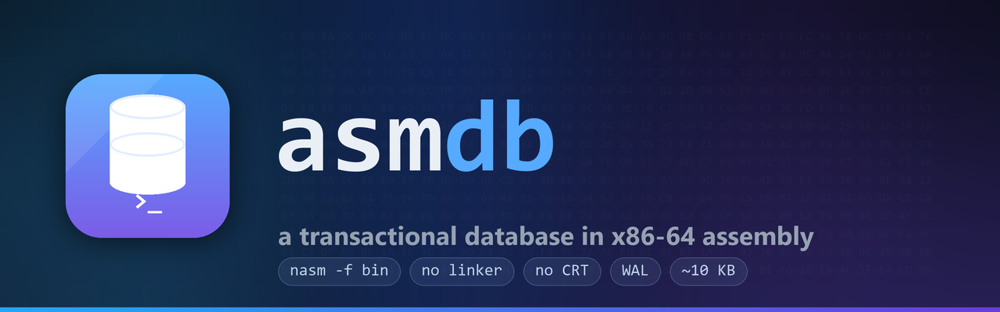
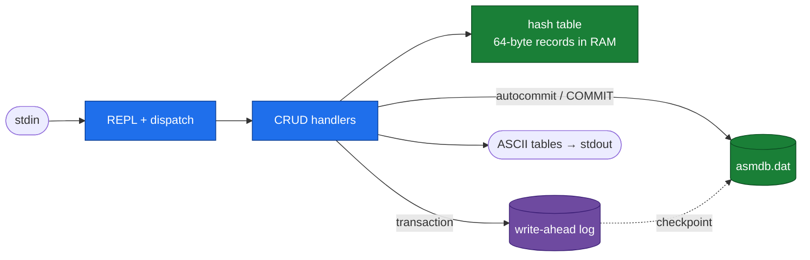

<div align="center">
  
</div>

<p align="center">
  <a href="#"></a>
  <a href="#"></a>
  <a href="#"></a>
  <a href="#"></a>
  <a href="#"></a>
  <a href="#"></a>
</p>

**asmdb** is a tiny, transactional key/value database engine written from
scratch in x86-64 assembly. **No linker, no C runtime, no libraries** — NASM
emits the Windows PE executable directly (`nasm -f bin`) and the program calls
`kernel32.dll` through a hand-built import table. Yet it is genuinely durable:
every statement is flushed to disk, `BEGIN`/`COMMIT`/`ROLLBACK` are real, and a
write-ahead log makes crash recovery atomic.

```text
asmdb> INSERT 1001 1299 Contoso_Ltd
[ OK ] 1 row inserted
asmdb> SELECT *
+------------+------------------------+----------------+
| id         | name                   | value          |
+------------+------------------------+----------------+
| 1001       | Contoso_Ltd            | 1299           |
+------------+------------------------+----------------+
```

---

## Why it's interesting

- **Zero dependencies** — assembled by NASM alone. No linker, no CRT, no DLL but `kernel32`.
- **One cache line per row** — fixed 64-byte records in an open-addressing hash
  table; the record array *is* the index. Lookups are Fibonacci hash + linear probe.
- **Durable by default** — autocommit flushes every mutation (`FlushFileBuffers`).
- **Real transactions** — `BEGIN` / `COMMIT` / `ROLLBACK` backed by an undo log.
- **Crash-safe** — a WAL with a commit marker is replayed or discarded atomically on startup.
- **A real CLI** — colored banner, sectioned `HELP`, catalog commands, boxed result tables.

## Quickstart

Requires Windows x64 and NASM 3.x (`winget install --id NASM.NASM -e`).

```powershell
.\build.ps1                 # -> build\asmdb.exe
.\build.ps1 -Run            # build, then launch the REPL
.\build\asmdb.exe SalesDB SalesTransactions
```

The first argument names the database (`<name>.dat` + `<name>.wal`); the
optional second argument names the table (stored in the file header).

Load the bundled sample — ten rows in one atomic transaction:

```powershell
.\examples\seed-salesdb.ps1 -Fresh
```

## Commands

| Command | Description |
|---|---|
| `INSERT <id> <value> <name>` | add a new row |
| `SELECT <id>` · `SELECT *` | show one row / list all rows |
| `UPDATE <id> <value> <name>` | modify an existing row |
| `DELETE <id>` | remove a row by key |
| `COUNT` | number of live rows |
| `BEGIN` · `COMMIT` · `ROLLBACK` | transaction control |
| `TABLES` | the table held in this database |
| `DATABASES` | list `*.dat` databases in the current folder |
| `SCHEMA` | show the record layout |
| `TYPES` | supported column types |
| `HELP` | command reference |
| `EXIT` · `QUIT` | leave asmdb |

## Data model & supported types

Every row is a **fixed 64-byte record** — no varints, no BLOBs, no schema
changes. That constraint is what keeps the engine small and predictable.

| Offset | Size | Field | Type | Notes |
|-------:|-----:|-------|------|-------|
| `0`  | 8  | `id`     | `u64`      | primary key |
| `8`  | 1  | `status` | `u8`       | `0` empty · `1` live · `2` deleted (tombstone) |
| `16` | 8  | `value`  | `i64`      | signed payload |
| `24` | 40 | `name`   | `char[40]` | ASCII, NUL-padded |

One `.dat` file is one database holding one logical table; its name lives in the
512-byte header (magic `ASMDB`, version, capacity, live count, table name).

## How it works



**Durability.** Outside a transaction, each `INSERT`/`UPDATE`/`DELETE` writes its
64-byte slot and the header, then `FlushFileBuffers` — the change is durable
before the prompt returns.

**Transactions.** `BEGIN` snapshots the row count and starts an undo log; each
mutation is applied in RAM and its previous image recorded. `ROLLBACK` replays
the undo log in reverse and never touches disk. `COMMIT` writes all after-images
to the WAL, flushes, appends a `COMMIT01` marker, flushes again (now durable),
applies them to the `.dat`, flushes, and truncates the WAL.

**Crash recovery.** On startup the WAL is inspected before the table loads. A log
with a valid magic *and* commit marker is replayed into the `.dat`; anything torn
is discarded. Replaying an already-applied WAL is idempotent, so recovery is safe
to repeat.

## Connect from your app (Python · C# · C)

There is **no driver or network protocol** — asmdb is a stdin/stdout REPL. To use
it from another language you **spawn the process and pipe commands**; colors are
disabled automatically when the output is redirected, so you get clean ASCII back.

```python
from asmdb_client import Asmdb
db = Asmdb(r".\build\asmdb.exe", "SalesDB", "SalesTransactions")
db.run("BEGIN", "INSERT 1 500 alice", "COMMIT")
print(db.select_all())     # [{'id': 1, 'name': 'alice', 'value': 500}]
```

Ready-to-run examples live in [`clients/`](clients/) (Python, C#, C), along with
notes on adding a proper `--json` batch mode or a TCP server for a real driver.

## Project layout

```
asmdb/
  src/          main.asm + .inc modules (console, parse, store, db, wal, data)
  clients/      stdio client examples: Python, C#, C
  examples/     seed-salesdb.ps1 sample loader
  tests/        smoke.ps1 + make_wal.py crash-recovery fixture
  docs/         PLAN.md design notes, assets/ (hero image + generator)
  poc/          minimal 752-byte PE64 proof-of-concept
  build.ps1     locates NASM and assembles from src\
```

## Design notes

- **Linker-free PE64.** `SectionAlignment == FileAlignment == 0x200`, so every RVA
  equals its file offset and the import thunks can be laid out by hand.
- **One section.** Code, data and imports share a single RWX `.text` section; the
  record store is `VirtualAlloc`'d at runtime, keeping the executable tiny.
- **Uniform ABI.** Every routine uses an `rbp` frame with ≥ 32 bytes of shadow
  space and keeps `rsp` 16-byte aligned before each Win32 call.

See [`docs/PLAN.md`](docs/PLAN.md) for the full design and roadmap.

## License

MIT — see [`LICENSE`](LICENSE).
