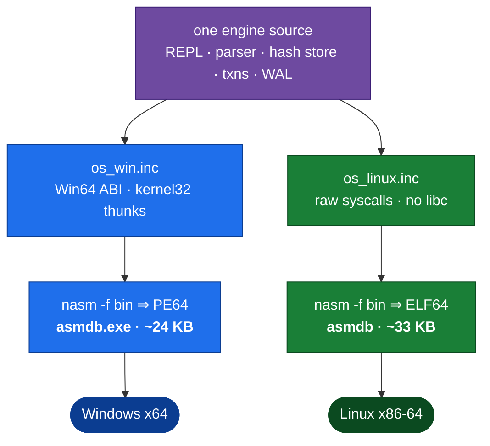

<div align="center">
  

  <h1>asmdb</h1>

  <p>
    <strong>A minimalist, transactional CRUD database engine, hand-written in<br>
    x86-64 assembly — with a Model Context Protocol server as its interface.</strong><br>
    No linker. No C runtime. No dependencies. Runs natively on Windows (PE64)
    <strong>and</strong> Linux (ELF64). ~24 KB. And it is genuinely fast.
  </p>

  

  <p>
    <a href="#"></a>
    <a href="#"></a>
    <a href="#"></a>
    <a href="#"></a>
    <a href="#"></a>
    <a href="#"></a>
    <a href="#"></a>
  </p>
</div>

---

**asmdb** is a tiny, transactional database engine written from scratch in
x86-64 assembly. NASM emits the final executable **directly** (`nasm -f bin`) —
there is **no linker, no C runtime, no libraries**. The same engine source builds
two native binaries: a **Windows PE64** that calls `kernel32.dll` through a
hand-built import table, and a **Linux ELF64** (a hand-assembled ELF header) that
talks to the kernel through raw `syscall`s — selected by a thin `os_*` platform
layer. Yet it is a real database: every statement is flushed to disk,
`BEGIN`/`COMMIT`/`ROLLBACK` are real transactions, and a write-ahead log makes
crash recovery atomic.

You drive it two ways: an **ASCII-art CLI** over stdin/stdout, and a bundled
**[MCP server](mcp/)** that exposes the engine to any Model Context Protocol
client as a generic CRUD store (`db_insert` / `db_get` / `db_find` / …). Its
256-byte record — a numeric `value`, automatic `created`/`updated` timestamps,
a short `tag`, and a free-text `content` field — suits many workloads;
**durable long-term memory for an AI agent is one example use case**, not the
only one.

```text
asmdb> INSERT 1001 5 project asmdb is a database engine written in x86-64 assembly
[ OK ] 1 row inserted
asmdb> SELECT *
+----------+------------------+------------+------------------------------------------+
| id       | tag              | value      | content                                  |
+----------+------------------+------------+------------------------------------------+
| 1001     | project          | 5          | asmdb is a database engine written in ~  |
+----------+------------------+------------+------------------------------------------+
asmdb> FIND assembly
  1 match
```

Because the engine does one thing — fixed-shape rows in a single hash-indexed
table — it does that one thing at speeds a general-purpose SQL database cannot
touch: **over 12 million inserts/second** in RAM (measured below, and
reproducible — ≈ 12× SQLite on the same machine). That is the whole point of
writing a database in assembly.

## Table of contents

- [Why it's interesting](#why-its-interesting)
- [Quickstart](#quickstart)
- [Runs on Windows & Linux](#runs-on-windows--linux) — one engine, two native binaries
- [Commands](#commands) — summary; full [command dictionary](docs/COMMANDS.md)
- [Data model & supported types](#data-model--supported-types)
- [MCP server & the CRUD interface](#mcp-server--the-crud-interface)
- [How asmdb works](#how-asmdb-works) — the 60-second version, then a deep dive
- [On-disk format: `.dat` and `.wal`](#on-disk-format-dat-and-wal)
- [Performance](#performance) — benchmarks vs SQLite
- [How a modern database goes faster](#how-a-modern-database-goes-faster)
- [Transactional-database principles](#transactional-database-principles) — the pillars & coverage
- [Connect from your app](#connect-from-your-app-python--c--c)
- [Engine specification](#engine-specification)
- [Roadmap & SaaS plan](#roadmap--saas-plan)
- [Changelog](#changelog) — what changed, newest first
- [Project layout](#project-layout)

## Why it's interesting

- **Zero dependencies** — assembled by NASM alone. No linker, no CRT: on Windows the
  only import is `kernel32`; on Linux there are no libraries at all, just `syscall`.
- **One engine, two native binaries** — a thin `os_*` layer lets the *same* assembly
  build a Windows **PE64** and a Linux **ELF64**, both hand-emitted by `nasm -f bin`.
- **Four cache lines per row** — fixed 256-byte records in an open-addressing hash
  table; the record array *is* the index. Lookups are Fibonacci hash + linear probe.
- **Real transactions** — `BEGIN` / `COMMIT` / `ROLLBACK` backed by an undo log.
- **Durable by default** — autocommit flushes every mutation (`FlushFileBuffers`).
- **Crash-safe** — a WAL with a commit marker is replayed or discarded atomically on startup.
- **Two interfaces** — an ASCII-art **CLI** and a bundled **[MCP server](mcp/)** that
  exposes generic CRUD tools (`db_insert` / `db_get` / `db_find` / `db_list` / …).
- **General-purpose record** — a numeric `value`, auto `created`/`updated` timestamps,
  a `tag` namespace and free-text `content`, plus a `FIND` substring search; agent
  memory is one example workload.
- **Genuinely fast** — a built-in `BENCH` command measures the engine directly (see [Performance](#performance)).
- **A real CLI** — colored banner, sectioned `HELP`, catalog commands, boxed result tables.

## Quickstart

**Windows** — requires x64 + NASM 3.x (`winget install --id NASM.NASM -e`):

```powershell
.\build.ps1                 # -> build\asmdb.exe
.\build.ps1 -Run            # build, then launch the REPL
.\build\asmdb.exe SalesDB SalesTransactions
```

The first argument names the database (`<name>.dat` + `<name>.wal`); the
optional second argument names the table (stored in the file header).

Load the bundled sample — ten rows in one atomic transaction:

```powershell
.\examples\seed-salesdb.ps1 -Fresh
```

<div align="center">
  
  <br><sub>The ASCII-art REPL — colored banner, boxed result tables, sectioned <code>HELP</code>.</sub>
</div>

## Runs on Windows & Linux

There is **one engine source**. A thin platform layer (`os_*`) is the only part
that differs per OS — everything above it (REPL, parser, hash store, transactions,
WAL) is shared, byte-for-byte. NASM emits each OS's native executable **directly**,
with no linker and no runtime:



The `os_*` layer wraps just a handful of primitives — open/read/write/pread/pwrite,
allocate, flush (`FlushFileBuffers` ↔ `fsync`), current time, standard I/O and a
TTY check — so a `CreateFileW` on Windows and an `openat` syscall on Linux are the
*only* places the platforms diverge.

**Linux** — requires NASM + a GNU toolchain (`sudo apt-get install nasm`), then:

```bash
./build.sh                        # -> build/asmdb   (hand-built ELF64)
./build/asmdb SalesDB SalesTransactions
```

`build.ps1 -Linux` produces the same ELF from Windows for cross-building. The ELF
is validated in CI (`tests/validate_elf.py`) and its smoke suite runs **natively
on Ubuntu** — see [ENGINE.md §11](docs/ENGINE.md) for the ELF layout and the full
Windows↔Linux syscall mapping.

## Commands

asmdb speaks a small, line-oriented grammar — full CRUD over a fixed-schema table,
real transactions, a catalog, and backup/restore. The essentials:

| Command | Description |
|---|---|
| `INSERT <id> <value> <tag> <content...>` | add a new row (auto `created`/`updated`; `id ≥ 1`) |
| `SELECT <id>` / `SELECT *` | one row as a detail block / all rows as a table |
| `UPDATE <id> <value> <tag> <content...>` | overwrite an existing row (bumps `updated`) |
| `DELETE <id>` | remove one row by key |
| `TRUNCATE` | remove **every** row (transaction-aware) |
| `FIND <substr>` · `RANGE <lo> <hi>` · `COUNT` | search · value-range scan · live count |
| `BEGIN` · `COMMIT` · `ROLLBACK` | transaction control |
| `BACKUP <file>` · `RESTORE <file>` | snapshot / reload the database |
| `TABLES` · `DATABASES` · `SCHEMA` · `TYPES` · `BENCH <n>` | catalog & benchmark |
| `HELP` · `EXIT` / `QUIT` | reference · leave |

📖 **The full [command dictionary](docs/COMMANDS.md)** documents every command with
syntax, constraints and worked examples — including why a fixed-schema engine has
**no `CREATE TABLE` / `DROP` / `ALTER`** (`CREATE TABLE` is implicit; empty a table
with `TRUNCATE`; "drop" is deleting the `.dat` file).

Notes: `tag` is a single token, `content` is the rest of the line (spaces allowed);
`INSERT`/`UPDATE` enforce an `id ≥ 1` **CHECK** (id `0` is reserved);
`BACKUP`/`RESTORE` are refused inside a transaction; and opening a database that
another engine already holds is refused (exclusive **single-writer** lock).

## Data model & supported types

Every row is a **fixed 256-byte record** — exactly four CPU cache lines. That
single constraint is what keeps the engine small, predictable, and fast. The
fields are general-purpose — a numeric `value`, two automatic timestamps, a
short category `tag`, and a free-text `content` field — and the physical layout
never changes:

| Offset | Size | Field | Type | Notes |
|-------:|-----:|-------|------|-------|
| `0`  | 8   | `id`      | `u64`       | primary key |
| `8`  | 1   | `status`  | `u8`        | `0` empty · `1` live · `2` deleted (tombstone) |
| `9`  | 1   | `kind`    | `u8`        | row-kind tag (reserved, default `0`) |
| `12` | 4   | `clen`    | `u32`       | content byte length |
| `16` | 8   | `created` | `i64`       | creation time, unix epoch ms (auto) |
| `24` | 8   | `updated` | `i64`       | last-update time, unix epoch ms (auto) |
| `32` | 8   | `value`   | `i64`       | numeric payload / score |
| `40` | 40  | `tag`     | `char[40]`  | category / namespace, NUL-padded |
| `80` | 176 | `content` | `char[176]` | free text, NUL-padded |

On top of that raw layout, `TYPES` advertises a catalog of **logical types**.
Narrow integers, booleans and floats all ride inside the 64-bit `value` cell —
asmdb stores the raw bits and your application (or an agent via the MCP server)
chooses the interpretation:

| Type | Bits | Domain | Column(s) |
|------|-----:|--------|-----------|
| `u64`         | 64   | `0 .. 1.8e19`              | `id` (key) |
| `i64`         | 64   | `-9.2e18 .. 9.2e18`        | `value` |
| `u32` / `i32` | 32   | narrowed integer           | `value`, `clen` |
| `u16` / `i16` | 16   | narrowed integer           | `value` |
| `u8`  / `i8`  | 8    | narrowed integer           | `kind`, `value` |
| `bool`        | 8    | `0 = false` / `1 = true`   | `value` |
| `f64`         | 64   | IEEE-754 double (bits)     | `value` |
| `timestamp`   | 64   | unix epoch milliseconds    | `created`, `updated` |
| `char[40]`    | 320  | fixed ASCII text, ≤ 40 B   | `tag` |
| `char[176]`   | 1408 | fixed ASCII text, ≤ 176 B  | `content` |

One `.dat` file is one database holding one logical table; its name lives in the
512-byte header. See [On-disk format](#on-disk-format-dat-and-wal) for the exact bytes.

## MCP server & the CRUD interface

asmdb ships with a Node [Model Context Protocol](https://modelcontextprotocol.io)
server in [`mcp/`](mcp/) that exposes the engine to any MCP client as a
**generic CRUD store**. It keeps one long-lived `asmdb.exe` process (the 1 GiB
region is read once) and exposes seven tools:

| Tool | Arguments | Description |
|------|-----------|-------------|
| `db_insert` | `id`\|`key`, `content?`, `tag?`, `value?`, `upsert?` | insert a row; `upsert:true` overwrites instead of erroring |
| `db_update` | `id`\|`key`, `content?`, `tag?`, `value?` | overwrite an existing row |
| `db_get`    | `id`\|`key` | fetch one row with value, tag, content, timestamps |
| `db_delete` | `id`\|`key` | remove a row |
| `db_find`   | `query` | case-insensitive substring search over tag + content |
| `db_list`   | — | return every live row |
| `db_count`  | — | number of live rows |

A row is addressed by a numeric `id` (used as-is) **or** a string `key` that the
server hashes to asmdb's `u64` primary id with 64-bit FNV-1a — so the engine
stays a pure id-keyed store with no secondary index.

> **Example use case — agent memory.** Address each memory by a string `key`
> (e.g. `user.timezone`), use `tag` as a namespace, `value` as an optional
> score and `content` as the remembered text, and call `db_insert` with
> `upsert:true` to store-or-overwrite. `created`/`updated` are automatic, so an
> agent gets durable long-term memory for free — one workload among many.

```bash
cd mcp && npm install && npm test      # end-to-end test against a scratch DB
```

See [`mcp/README.md`](mcp/README.md) for client registration (Claude / VS Code /
Copilot) and configuration.

## How asmdb works

### The 60-second version

Picture a huge coat-check with **4,194,304 numbered hooks**. To store a row, asmdb
runs the row's `id` through a scrambling function that turns it into a hook
number, and hangs the 256-byte row there. To find it again, it runs the *same*
function and walks straight to that hook — no scanning, no index to maintain,
because **the array of hooks *is* the index**. If two rows want the same hook,
the second one takes the next free hook along (a "linear probe").

That whole coat-check lives in memory, so reads and writes are essentially free.
Durability is a separate job: when you change data, asmdb also writes it to a
file and asks Windows to physically flush it to the disk. Inside a transaction it
is cleverer — it stages all the changes in a **write-ahead log**, flushes that
once, stamps it "committed", and only then updates the main file. If the power
dies mid-way, startup either finds a fully-committed log (and replays it) or an
incomplete one (and throws it away). You never see a half-written transaction.

Now the diagram, then the deep dive.


### The deep dive

How ~24 KB of assembly becomes a durable database.

#### The executable — no linker, no CRT

NASM emits each native binary **directly** (`nasm -f bin`); there is no linker
step on either platform. On **Windows** the trick is alignment: with
`SectionAlignment == FileAlignment == 0x200`, every RVA equals its offset in the
file, so the import table can be laid out by hand — a small array of thunks
pointing at hint/name entries that Windows binds to `kernel32.dll` at load time.
On **Linux** there is no import table at all: a hand-assembled ELF64 header maps a
single RWX `PT_LOAD` segment and the code issues raw `syscall`s, so the binary
depends on nothing but the kernel. Code, data and imports share a single section;
the 1 GiB record store is **mapped copy-on-write from the `.dat`** at runtime,
which is why the binaries stay ~24 KB (PE) / ~33 KB (ELF) on disk — and why a
million-row database needs only a few MB of RAM.

#### The record store — four cache lines per row

Each row is a fixed **256-byte record** (exactly four cache lines), and the
records live in an open-addressing hash table of **4,194,304 slots** where the
record array *is* the index — there is no separate structure to keep in sync. The
slot for a key is a Fibonacci hash: multiply by the 64-bit golden-ratio constant
and keep the top bits.

```asm
; store_hash(rcx = id) -> rax = slot 0 .. 4194303
mov  rax, rcx
mov  rdx, 0x9E3779B97F4A7C15   ; 2^64 / golden ratio
imul rax, rdx                  ; scramble the key across the whole table
shr  rax, 42                   ; keep the top 22 bits (log2 of 4,194,304)
```

Collisions are resolved by linear probing (`slot = (slot + 1) & (CAPACITY-1)`),
and a deleted row is marked with a **tombstone** (`status = 2`) instead of being
cleared, so probe chains that once ran through it still terminate correctly.
Multiplying by the golden ratio scatters even sequential keys across the whole
table, which keeps probe chains short and lookups close to O(1).

#### Calling convention

Every routine follows one shape: an `rbp` frame, at least 32 bytes of shadow
space, and `rsp` kept 16-byte aligned before each `kernel32` call — the Win64
ABI, applied uniformly so the code reads the same everywhere. During parsing,
`rsi` is the cursor walking the input line one byte at a time.

#### Transactions — undo log + write-ahead log

Two logs do all the work. An **undo log** makes `ROLLBACK` possible; a
**write-ahead log (WAL)** makes `COMMIT` durable and crash-safe.

- **`BEGIN`** snapshots the live row count and clears the undo log.
- **Each mutation in a transaction** is applied to the RAM table immediately, and
  the *previous* 256-byte image of the touched slot is appended to the undo log.
  The `.dat` file is **not** written yet.
- **`ROLLBACK`** walks the undo log in reverse, restoring each saved image, then
  drops back to the snapshot count. Disk was never touched, so there is nothing
  to reverse on disk.
- **`COMMIT`** is two-phase, and the *order* is what guarantees durability:

  1. stage every *after*-image into the WAL buffer, write it to `<db>.wal`, and
     `FlushFileBuffers`;
  2. append an 8-byte `COMMIT01` marker and flush **again** — after this flush the
     transaction is durable even if the machine dies a microsecond later;
  3. apply the after-images to `<db>.dat` and flush;
  4. truncate the WAL.

The marker in step 2 is the atomic switch: it is written *after* the data is
already safe in the log, so a log either has a marker (the transaction happened)
or it does not (it did not).

#### Crash recovery

On startup, before the table is loaded, asmdb inspects the WAL. A log with a
valid magic, a commit marker **and a matching CRC-32** is replayed into the
`.dat`; a torn or marker-less log is discarded. Replay is **idempotent** — each
WAL entry is an absolute write to a slot index, so applying an already-applied
log changes nothing. That is the classic redo-logging invariant, in a few
hundred bytes of assembly.

The checksum is written and flushed in the *same* operation as the commit
marker, so a frame can never be committed without one. If a committed frame's
bytes no longer match its checksum, asmdb **refuses to open** rather than
replay corrupt rows or silently drop an acknowledged transaction — see the
[error reference](docs/COMMANDS.md#error-reference).

## On-disk format: `.dat` and `.wal`

asmdb persists a database as **two files** next to each other: `<name>.dat` holds
the data, `<name>.wal` is the transaction log (present only while a commit is in
flight, or after a crash).

### `<name>.dat` — the data file

A **512-byte header** followed by the fixed slot array. Every RVA-style offset is
exact; there is no padding surprise because the record size never changes.

```
offset  size  field        value / meaning
------  ----  -----------  ---------------------------------------------
   0      8   magic        "ASMDB\0\0\0"
   8      4   version      1
  12      4   record_size  256
  16      8   capacity     4194304
  24      8   live_count   number of live rows (rewritten on each flush)
  32     48   table_name   ASCII, NUL-padded
  80    432   reserved     zero-filled to 512
 512    1 GiB slot array   capacity × 256-byte records (sparse on disk)
```

Slot *i* lives at file offset `512 + i * 256`. A record is
`u64 id · u8 status · u8 kind · u32 clen · i64 created · i64 updated · i64 value
· char[40] tag · char[176] content`; `status` is `0` empty, `1` live, `2`
tombstone. Because the on-disk slot layout mirrors the in-RAM table exactly,
loading a database is a single `ReadFile` of the whole slot region — no parsing,
no per-row deserialization.

> Note: `db_open` validates only the 5-byte magic, not the version or capacity,
> so a database created by an older build still opens after the capacity was
> raised. The header is authoritative for `live_count` and `table_name`.

### `<name>.wal` — the write-ahead log

Written only during `COMMIT` and read only during recovery. Layout, in the exact
order it is flushed:

```
offset        size        field    meaning
------------  ----------  -------  --------------------------------------
   0            8         magic    "ASMWAL01"
   8            8         N        number of staged entries
  16            8         count    live_count to stamp into the header
  24         N × 264      entries  N × { u64 slot_index ; 256-byte after-image }
24 + N×264      8         marker   "COMMIT01"  (written & flushed LAST)
```

The marker is the commit point. Recovery reads the log, checks the magic, bounds
`N`, and looks for `COMMIT01` at the computed offset. If everything lines up it
replays each entry as an absolute write to `512 + slot_index × 256`; otherwise it
discards the log. Since every entry is an absolute slot write, replaying a log
twice is harmless — recovery is idempotent.

## Performance

asmdb ships with a `BENCH <n>` command that times the engine **from the inside**
using `QueryPerformanceCounter`, with no text protocol and no shell in the way.
The harness below runs `BENCH`, the two end-to-end stdio modes, and — for an
honest baseline — the **same workloads on SQLite** (via Python's in-process
`sqlite3`, i.e. the C API with no protocol overhead, which is generous to SQLite).

```powershell
.\examples\bench.ps1 -Rows 2000000            # 2,000,000 rows, best of 3, + SQLite compare
.\examples\bench.ps1 -Rows 2000000 -NoCompare # asmdb only
```

### asmdb vs SQLite — 2,000,000 rows

Records are **256 bytes** and the store is a **1 GiB** hash region (`2^22` slots),
created **sparse** on disk so unused slots cost nothing.

| Workload | asmdb | SQLite 3.49.1 | ratio |
|---|--:|--:|--:|
| **Engine insert** — in-RAM, one transaction | **≈ 12,383,609** rows/s | 1,004,090 rows/s | **≈ 12.3× faster** |
| **Durable bulk load** — one checkpoint + `fsync` | **≈ 1,170,960** rows/s | 859,784 rows/s | **≈ 1.4× faster*** |
| **Durable per-row** — one `fsync` per row | **≈ 932** rows/s | 101 rows/s | **≈ 9.2× faster** |

A fourth figure, not in the table because SQLite has no equivalent, is the
**transaction throughput over the stdio protocol** — the realistic
"over-the-wire" number a client sees, including command parsing and per-row acks:
**≈ 5,932 rows/s** (2M rows in `BEGIN…COMMIT` batches). It is bounded by the
line-based text protocol, not the engine — which is exactly why a real
deployment batches inside `BEGIN … COMMIT`.

The story the numbers tell: the disk flush dominates durability. Autocommit
`fsync`s after *every* row (~932/s); a transaction applies every row in RAM and
`fsync`s **once** (millions/s). Wrapping inserts in `BEGIN … COMMIT` is the single
biggest speed lever.

### Why asmdb wins — and the honest caveats

asmdb is faster on **in-RAM inserts (≈ 12×)** and **per-row durability (≈ 9×)**
because **it does far less**: a fixed 256-byte schema, a single table, no SQL
parser, no query planner, no secondary indexes, no MVCC, no concurrency control.
SQLite is a full relational engine doing all of that. So this is *not* "assembly
beats C" — it is **a specialized key/value store beating a general-purpose SQL
database at the narrow thing it was built for.**

**\* The durable bulk-load row is the one to read with care.** In this clean,
best-of-3 run it edged *ahead* of SQLite (≈ 1.4×), but it is by far the most
disk- and page-cache-sensitive number here and has measured *slower* than SQLite
on cold, fresh-file runs. The reason is a real, documented trade-off: because the
open-addressed hash scatters rows across the whole 1 GiB region, the bulk
checkpoint currently writes (and, on a fresh sparse file, first-allocates) the
*entire* region rather than just the dirty rows — ~1 GiB flushed for 2M rows,
far more bytes than SQLite's page-cache commit. The planned fix — an incremental
(dirty-slot) checkpoint and partitioned files — is on the
[roadmap](#how-a-modern-database-goes-faster) and is what will make this figure
*consistently* fast instead of variance-dependent. It is reported as measured
rather than cherry-picked.

<sub>Measured on an Intel Core Ultra 7 268V · NVMe SSD · Windows 11 · single-threaded ·
best of 3 · SQLite 3.49.1 in-process (C API, no protocol). Throughput is disk- and
machine-dependent — reproduce it with the command above.</sub>

## How a modern database goes faster

asmdb today is a **row store**: whole 256-byte records, one table, one thread. That
is a deliberate v1 tradeoff — small, predictable, cache-friendly. Here is how the
big engines (SQL Server, PostgreSQL, DuckDB, ClickHouse) push further, which CRUD
path each technique accelerates, and where it sits on asmdb's roadmap.

| Technique | What it buys you | Speeds up | In asmdb |
|---|---|---|---|
| Open-addressing hash index (array *is* the index) | O(1) average key lookup, zero index maintenance | Create / Read / Update / Delete by key | ✅ implemented |
| Fibonacci hashing | scatters keys, short probe chains | Read / Update probing | ✅ implemented |
| WAL + group commit | amortize one `fsync` over many rows | durable Create / Update / Delete | ✅ implemented |
| Columnar storage | store each column contiguously; touch only the columns a query needs | analytical Reads, `COUNT` / `SUM` scans | 🗺️ roadmap |
| Lightweight compression (RLE, dictionary, bit-packing, frame-of-reference) | fewer bytes ⇒ fewer cache misses and less I/O | Read scans, bulk load | 🗺️ roadmap |
| Secondary & bitmap indexes | fast lookup on non-key columns | Reads with predicates | 🗺️ roadmap |
| Partitioning + file split | prune irrelevant data, shrink the working set, parallel I/O | all CRUD at scale | 🗺️ roadmap |
| SIMD + multi-threading | process many rows per instruction / per core | analytical Reads, bulk ops | 🗺️ roadmap |
| MVCC | readers never block writers | concurrent workloads | 🗺️ roadmap |

**Columnar + compression.** A row store reads a whole 256-byte record even to sum
one column. A *column* store keeps each column in its own contiguous run, so a
`SUM(value)` streams only the `value` array through the CPU — and because a column
holds one kind of data, it compresses hard: run-length encoding for repeats,
dictionaries for low-cardinality text, bit-packing and frame-of-reference for
narrow integers. Less data moved means fewer cache misses and less disk I/O on
every Read. In asmdb the natural first step is to split the `value` cell out of
the record into a packed column and bit-pack it to its declared `TYPES` width
(a `u8` column would shrink 8×).

**Partitioning + parallelism.** Beyond a certain size one file and one thread stop
scaling. Modern engines **partition** data (by key range or hash) into separate
files, so a query can *prune* whole partitions it doesn't need and process the
survivors **in parallel** — one thread or core per partition, often with **SIMD**
scanning 8–16 values per instruction inside each. asmdb's fixed-width slot array
is already SIMD- and shard-friendly: the slot region could be split into *P*
files of `CAPACITY/P` slots, each with its own WAL, checkpointed by *P* threads at
once. The single-file, single-thread design is what keeps v1 honest and tiny; the
layout was chosen so these are additive, not rewrites.

Everything marked 🗺️ is future work, called out plainly so the benchmarks above
stay honest: they measure what asmdb **does today**, not what it might do.

## Transactional-database principles

A serious transactional database is more than fast CRUD. The table below scores
asmdb against the classic **ACID** guarantees plus the operational pillars every
real database service needs — ✅ delivered, ◐ partial, 🗺️ planned — and points
at where each lives (the assembly **engine**, its [roadmap](docs/ENGINE.md#12-roadmap),
or the hosted [SaaS layer](docs/SAAS.md)).

| # | Principle | asmdb today | Where |
|--:|-----------|:-----------:|-------|
| 1 | **Atomicity** — a transaction is all-or-nothing | ✅ | `BEGIN`/`COMMIT`/`ROLLBACK` + undo log (engine) |
| 2 | **Consistency** — only valid states are committed | ✅ | unique primary key, fixed-width typed columns, and `CHECK`-style validation (`id ≥ 1` + bounded field lengths) enforced at write (engine) |
| 3 | **Isolation** — concurrent txns don't interfere | ✅ | serializable: a single writer holds the DB exclusively, so no dirty/phantom reads are possible; multi-reader MVCC → roadmap |
| 4 | **Durability** — committed data survives a crash | ✅ | WAL + `FlushFileBuffers` (engine) |
| 5 | **Crash recovery** — atomic redo / discard on restart | ✅ | idempotent WAL replay with commit marker (engine) |
| 6 | **Concurrency control** — many clients, safely | ✅ | exclusive single-writer lock (a concurrent open is refused); group commit / MVCC → roadmap |
| 7 | **Indexing & access paths** — no full scans | ✅ | O(1) primary hash index + `SELECT *`, `FIND` and value `RANGE` access paths; index-accelerated secondary columns → roadmap |
| 8 | **Query & access interface** — a defined API | ✅ | REPL grammar + MCP CRUD tools + Python/C#/C clients |
| 9 | **Backup & restore / PITR** — recover to a point in time | ✅ | in-engine `BACKUP`/`RESTORE` snapshots; WAL shipping + PITR → SaaS |
| 10 | **Security & observability** — authz, encryption, audit, metrics | 🗺️ | provided by the [SaaS layer](docs/SAAS.md) (engine stays single-node) |

The engine delivers **nine of the ten** principles on a single node — the whole
transactional core (1–5), single-writer concurrency control (6), a primary index
plus secondary access paths (7), the query interface (8) and in-engine
backup/restore (9). Only **security & observability** (10) — and the *scale-out*
facets of concurrency (6) and point-in-time recovery (9) — belong to the
[SaaS layer](docs/SAAS.md). The engine stays 100% assembly throughout.

## Connect from your app (Python · C# · C)

There is **no driver or network protocol** — asmdb is a stdin/stdout REPL. To use
it from another language you **spawn the process and pipe commands**; colors are
disabled automatically when the output is redirected, so you get clean ASCII back.

```python
from asmdb_client import Asmdb
db = Asmdb(r".\build\asmdb.exe", "SalesDB", "SalesTransactions")
db.run("BEGIN", "INSERT 1 500 customer Contoso Ltd - key account", "COMMIT")
print(db.select_all())     # [{'id': 1, 'tag': 'customer', 'value': 500, 'content': 'Contoso Ltd - key account'}]
```

Ready-to-run examples live in [`clients/`](clients/) (Python, C#, C), along with
notes on adding a proper `--json` batch mode or a TCP server for a real driver.
For AI agents, the [`mcp/`](mcp/) server is the turnkey path — no piping required.

## Engine specification

For the precise, byte-level technical reference — PE64 layout, calling
convention, record store, hash function, on-disk formats, the two-phase commit
and recovery protocol, the MCP integration, and the full roadmap — see
**[`docs/ENGINE.md`](docs/ENGINE.md)**.

## Roadmap & SaaS plan

Two documents, deliberately kept in separate lanes:

- **[`docs/ENGINE.md`](docs/ENGINE.md) — the engine roadmap.** Everything here
  stays **100% x86-64 assembly**. See [§12 Roadmap](docs/ENGINE.md#12-roadmap).
- **[`docs/SAAS.md`](docs/SAAS.md) — the productization plan.** How the assembly
  engine becomes **asmdb Cloud**: a hosted, pay-as-you-go database service where
  every database instance runs in its **own isolated micro-container** with a
  dedicated `asmdb` process. Covers provisioning & lifecycle, per-instance
  isolation, the HTTP/gRPC + remote-MCP access layer, consumption metering &
  billing, durability/backups, HA, security/compliance, deployment, pricing, and
  a phased GTM. The engine is the data plane and stays assembly; **this
  control/service layer may use any language** (Rust/Go), by design. (Hosted
  agent memory is one example workload on top.)

### Where the engine stands today

| Area | Status |
|---|---|
| **CRUD + transactions** | ✅ `INSERT`/`SELECT`/`UPDATE`/`DELETE`/`TRUNCATE`/`COUNT`, `BEGIN`/`COMMIT`/`ROLLBACK`, `FIND`, `RANGE` |
| **Durability** | ✅ WAL with two-phase flush, **CRC-32 per frame**, idempotent crash recovery |
| **Safety** | ✅ every read/write/flush checked; a failed durable write aborts instead of acknowledging; a corrupt or foreign `.dat` is refused, never silently recreated |
| **Startup & memory** | ✅ the store is **mapped copy-on-write**: opening a database is ~80 ms whatever its size (was ~600 ms), and a 1 M-row database peaks at **~5 MB** of RAM (was ~1 029 MB) |
| **Portability** | ✅ Windows PE64 + Linux ELF64 from one source, behind a thin `os_*` layer |
| **Integration** | ✅ MCP server (generic CRUD tools) + Python / C# / C stdio clients |
| **Tests** | ✅ 61 checks per platform in CI, incl. fault-injected I/O failures |
| **Next up** | 🔜 **persisted status directory** (see below), then incremental checkpoint, secondary indexes, SIMD scans |

**The roadmap is driven by measurement, not intuition.** The last milestone came
from noticing that opening a database cost **~600 ms regardless of its
contents** — 0 rows, 1 000 rows and 1 000 000 rows all measured the same,
because `db_open` committed and read the *entire* 1 GiB slot region even though
the file is sparse and mostly holes. Mapping the file **copy-on-write** instead
fixed it at the root:

| 1 000 000 rows | before | after |
|---|--:|--:|
| open + `COUNT` | 684 ms | **104 ms** |
| peak memory | 1 029 MB | **5 MB** |
| `BENCH` in-RAM insert | 11.8 M rows/s | 11.7 M rows/s (unchanged) |

Durability was deliberately left alone: a *private* mapping keeps uncommitted
writes out of the file, so the WAL protocol still owns every byte that reaches
disk. The 200× memory drop is also what makes the one-container-per-instance
model in [`docs/SAAS.md`](docs/SAAS.md) realistic.

**And the honest cost:** a full-table scan (`SELECT *`, `FIND`) now faults the
region in rather than walking already-resident RAM — about **26 % slower** on a
full `FIND`, more on a sparsely populated table. That is the next item: a
**persisted dense status directory** so a scan streams a few MiB instead of
touching 1 GiB. Details in [§12 Roadmap](docs/ENGINE.md#12-roadmap).

## Changelog

Newest first. Every entry is collapsed — click one to expand it.

<details>
<summary><b>Copy-on-write store mapping</b> — open 7–9× faster, 200× less memory <code>867844c</code></summary>

The slot region is no longer a 1 GiB allocation that gets read from disk before
the first command. It is **mapped copy-on-write** from the `.dat`
(`CreateFileMapping(PAGE_WRITECOPY)` + `MapViewOfFile(FILE_MAP_COPY)` on Windows,
`mmap(MAP_PRIVATE)` on Linux) behind two new primitives, `os_map_cow` and
`os_filesize`.

| 1 000 000 rows | before | after |
|---|--:|--:|
| open + `COUNT` | 684 ms | **104 ms** |
| peak working set | 1 029 MB | **5 MB** |
| `BENCH` in-RAM insert | 11.8 M rows/s | 11.7 M rows/s (unchanged) |

Opening a brand-new database went from 575 ms to 72 ms, and open time no longer
depends on the database's contents at all.

- **Durability is untouched.** The mapping is *private*, so writes to the store
  never reach the file: the `.dat` still changes only through the explicit
  `write_at`/`fsync` paths. A *shared* mapping would have broken the WAL
  contract, since the OS could flush an uncommitted page at any moment.
- The mapping is created **after** `wal_recover`, because recovery writes to the
  file directly and a private mapping is not guaranteed to see writes made
  afterwards.
- Truncation detection moved to an explicit `os_filesize` check — cheaper than
  reading 1 GiB to see if it came up short, and necessary because
  `CreateFileMapping` would otherwise silently grow a truncated file to fit.
- **Known cost:** a full scan (`SELECT *`, `FIND`, `RANGE`, `TRUNCATE`) now
  faults the region in, ≈26 % slower on a full `FIND`. The fix — a *persisted*
  status directory — is the next roadmap item.

All 61 checks passed unchanged, which is the signal that mattered for a change
this deep in the storage path.
</details>

<details>
<summary><b>WAL frame checksums, a tested abort path, better open diagnostics</b> <code>09946f2</code></summary>

- **CRC-32 on every WAL frame.** Table-driven CRC-32 (IEEE, reflected, poly
  `0xEDB88320`) built once at startup and verified byte-for-byte against
  `zlib.crc32`. The checksum is written and flushed in the *same* operation as
  the `COMMIT01` marker, so a frame can never be committed without one. Frame
  magic is now `ASMWAL02`; legacy `ASMWAL01` frames still replay, so upgrading a
  binary never discards an already-acknowledged transaction.
- A committed frame whose bytes no longer match its checksum is **neither
  replayed** (corrupt rows) **nor discarded** (silent loss of an acknowledged
  transaction): the engine refuses to open, keeps the `.wal`, and prints the two
  ways out.
- **The abort path is now actually tested.** A `%ifdef FAULT_INJECT` hook makes
  the *n*-th durable write fail, simulating `ENOSPC`. It contributes zero bytes
  to the shipping binary. The tests assert the engine aborts, says why, does
  *not* print `transaction committed`, and leaves a committed WAL that a normal
  binary then replays — which also proves the writer's CRC is the one the reader
  expects.
- **Open-time diagnostics.** `[ERR] incompatible database format` now names the
  file and prints this build's version / record size / capacity next to the
  file's, then says what to do. Read failures get their own message instead of
  claiming a durable write failed.
- Dropped the conservative `TRUNCATE` admission check, which double-counted rows
  the transaction had already captured and could refuse truncates that fit.
</details>

<details>
<summary><b>I/O error propagation, file validation, undo de-duplication</b> <code>3996800</code></summary>

A reliability pass over the whole engine. No new features, no schema change,
no new dependencies.

- **I/O errors propagate.** `os_pread`/`os_pwrite` return `-1` on error; Windows
  now checks the seek *and* the transfer and clears the byte counter first (it
  could return a stale count from a previous call). A zero-byte write counts as
  a failure. Durable paths abort via `io_fatal` instead of acknowledging — the
  engine never prints `[ OK ]` after a failed write.
- **Undo captures are de-duplicated.** A slot is captured at most once per
  transaction, keeping the first pre-image. The 4096-entry limit now bounds
  *distinct rows*, not statements: rewriting one row 5 000 times used to fail at
  write 4 097, and `ROLLBACK` now restores the original image rather than an
  intermediate one.
- **An invalid `.dat` is never silently reinitialized.** Only a 0-byte file
  creates a new database; a partial header, bad magic, mismatched
  version/record-size/capacity, `count > CAPACITY`, or a truncated slot region
  are each refused with a distinct message, leaving the file untouched.
- **`BACKUP`/`RESTORE` hardened.** `BACKUP` checks every write and the final
  flush. `RESTORE` validates the snapshot completely — including a probe of the
  *last* byte of the record region — **before** overwriting a single byte of the
  live table. `BENCH` is now refused inside a transaction.
- Found while auditing: `parse_u64` silently wrapped (`18446744073709551617`
  parsed as id 1); `TRUNCATE` inside a transaction could leave the table
  half-cleared; `wal_recover` did not bound entry slot indices, so a corrupt
  frame could write at an arbitrary file offset; `io_fatal` was reached by
  `jcc` with a misaligned stack and crashed instead of exiting 1; the path that
  *creates* the `.dat` did not load the slot region, so rows replayed from a WAL
  predating the file were counted but not visible; and `make_wal.py` still used
  the old 64-byte record layout, meaning WAL recovery was effectively untested.
- Tests grew from 20 to 61 checks per platform.
</details>

<details>
<summary><b>Linux ELF64 port, <code>TRUNCATE</code>, and the stdin BOM fixes</b> <code>09ce053</code> · <code>8598a1f</code> · <code>0ddaf12</code> · <code>4c52647</code></summary>

- **Linux ELF64 port.** A hand-built ELF header and a raw-`syscall` backend sit
  behind a thin `os_*` platform layer, so one source builds both a Windows PE64
  and a Linux ELF64. CI runs the ELF natively on Ubuntu.
- **`TRUNCATE`** command, transaction-aware.
- **Fixed partial-I/O data loss.** A single `ReadFile`/`pread` is not guaranteed
  to transfer a large request, and the 1 GiB region routinely came back short —
  which silently dropped records whose slot lived past the prefix. Both paths
  now loop.
- **Fixed piped-stdin corruption on Windows CI.** pwsh prepends a UTF-8 BOM to
  the first piped line, and writes it as a *separate* pipe write, so the first
  `ReadFile` returned only the 3 BOM bytes. The reader skips a leading BOM once
  and retries when that empties the buffer.
</details>

<details>
<summary><b>Transactional-database principles, 2M-row scale, SaaS repositioning</b> <code>4493be7</code> · <code>7061530</code> · <code>7993439</code></summary>

- Repositioned asmdb as a **general-purpose transactional database** that
  happens to expose an MCP server — agent memory is one example workload, not
  the product.
- Implemented the transactional-database principles in assembly (all but
  security & observability, which belong to the hosted layer): `BACKUP`/
  `RESTORE`, an exclusive single-writer lock, a `RANGE` access path, and an
  `id ≥ 1` CHECK constraint. Added the coverage table.
- **Scaled to 2M rows**: capacity raised to `2^22` slots (a 1 GiB region) on a
  **sparse** `.dat`, so an empty database still costs kilobytes.
- Rewrote the SaaS plan around **one micro-container per instance**, and added
  the web-app connectivity guide. Every diagram is now coloured Mermaid.
</details>

<details>
<summary><b>MCP server, agent-memory schema, engine spec &amp; SaaS plan</b> <code>d97bbe2</code> · <code>f6352e7</code></summary>

- **MCP server** (Node) exposing the engine as a set of generic CRUD tools, plus
  Python / C# / C stdio client examples.
- Reworked the record into a general 256-byte shape: numeric `value`, automatic
  `created`/`updated` timestamps, a short `tag`, and free-text `content`.
- Wrote **`docs/ENGINE.md`**, the byte-level technical specification, and
  **`docs/SAAS.md`**, the productization plan.
- Code audit with all recommendations applied.
</details>

<details>
<summary><b>Benchmarks, catalog commands, and the visual identity</b> <code>bc9237a</code> · <code>afd9293</code> · <code>cd866ed</code></summary>

- **`BENCH`** command timing the engine from the inside with
  `QueryPerformanceCounter`, plus a harness that compares the same workloads
  against SQLite.
- Catalog commands: `SCHEMA`, `TYPES`, `TABLES`, `DATABASES`.
- CLI polish, generated logo/icon/banner, terminal screenshot, and the rewritten
  README with engine internals.
</details>

<details>
<summary><b>The engine itself</b> <code>e594842</code></summary>

The first working database: PE64 emitted by NASM alone (no linker, no CRT), a
REPL over stdin/stdout with ASCII-art presentation, an open-addressing hash
store over fixed 256-byte records, disk persistence, a write-ahead log with
`BEGIN`/`COMMIT`/`ROLLBACK`, and idempotent crash recovery at startup.
</details>

## Project layout

```
asmdb/
  src/          main.asm + .inc modules (console, parse, store, db, wal, data)
                + os_win.inc / os_linux.inc / elf.inc (platform backends)
  mcp/          Model Context Protocol server (generic CRUD tools) + tests
  clients/      stdio client examples: Python, C#, C
  examples/     seed-salesdb.ps1 sample loader, bench.ps1 + bench_sqlite.py
  tests/        smoke.ps1 / smoke.sh, validate_elf.py, make_wal.py fixture
  docs/         ENGINE.md spec, SAAS.md plan, COMMANDS.md dictionary, assets/
  poc/          minimal 752-byte PE64 proof-of-concept
  build.ps1     locates NASM, assembles the PE64 (or the ELF64 with -Linux)
  build.sh      assembles the Linux ELF64 natively
```

See [`docs/ENGINE.md`](docs/ENGINE.md) for the full engine specification and
roadmap, and [`docs/SAAS.md`](docs/SAAS.md) for the SaaS productization plan.

## License

MIT — see [`LICENSE`](LICENSE).
