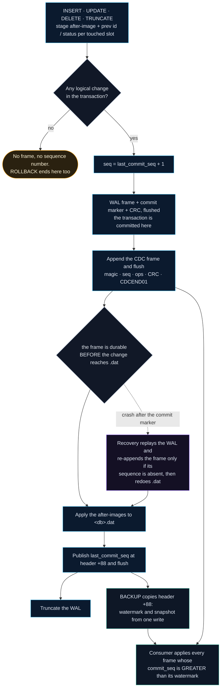
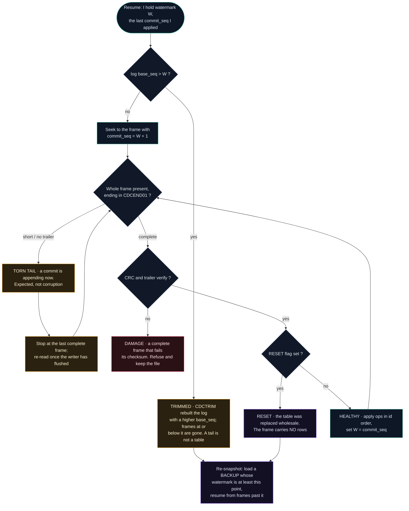

<div align="center">
  

  <h1>asmdb — change data capture (<code>&lt;db&gt;.cdc</code>)</h1>

  <p><em>The change-log format, and how a consumer follows it without losing a row.</em></p>
</div>

---

Every committed transaction that changes something appends **one frame** to a
durable, append-only log next to the database. A separate process can read that
log to mirror the table elsewhere, feed a queue, or drive a materialised view —
without linking against the engine, without a network protocol, and without the
engine knowing the consumer exists.

- [What the log guarantees](#what-the-log-guarantees)
- [How a committed change becomes a frame](#how-a-committed-change-becomes-a-frame)
- [Frame format](#frame-format)
- [Operations](#operations)
- [What produces an event — and what does not](#what-produces-an-event--and-what-does-not)
- [`RESET`: whole-table replacements](#reset-whole-table-replacements)
- [Commit ordering](#commit-ordering)
- [Recovery protocol](#recovery-protocol)
- [Opening and repairing the log](#opening-and-repairing-the-log)
- [The states a consumer can find the log in](#the-states-a-consumer-can-find-the-log-in)
- [Retention: `CDCTRIM`](#retention-cdctrim)
- [Bootstrapping a consumer](#bootstrapping-a-consumer)
- [Reading the log](#reading-the-log)
- [Limits in this version](#limits-in-this-version)

---

## What the log guarantees

| Guarantee | How |
|---|---|
| **Total order, no gaps** | `commit_seq` advances by **exactly one** per frame — it is dense, not merely increasing. The engine refuses to open a log whose next frame is not `last + 1`, so a consumer that sees `commit_seq` jump knows history was lost or altered, never merely reordered. The first log of a database starts at 1; a log recreated after removal, or trimmed by `CDCTRIM`, starts at its `base_seq + 1` |
| **Nothing is lost** | for an ordinary commit the frame is durable *before* the change reaches `<db>.dat`, so recovery can only ever owe the log a frame, never the reverse. A whole-table `RESET` is ordered the other way, but its intent is armed in the `.dat` header first (`reset_pending`), which owes the log the frame just the same |
| **Idempotent recovery** | the committed WAL frame carries its `commit_seq`; recovery appends only if that sequence is absent |
| **One event per row per transaction** | carrying the row's **final** image, not each intermediate step |
| **Readable while running** | the file is opened shared-for-read; there is still exactly one writer |
| **No new dependencies** | the log is written by the same assembly engine, with no library and no daemon |

## How a committed change becomes a frame

The shape of the format follows from one decision: the change log must never
promise a row the database does not have, and must never hide a row it does. The
engine reaches that by fixing the *order* in which a commit becomes durable, and
by making the consumer's rule a single inequality against a watermark.

A committed transaction travels through the engine and out to a consumer like
this. The interesting edge is the durability barrier in the middle: the CDC
frame is on disk before the change reaches `<db>.dat`, so the only skew a crash
can produce is a frame the data file has not caught up to yet, which is exactly
what recovery redoes.



Two consequences are worth reading off the diagram directly. A transaction that
changes nothing logical takes the left branch: no frame, no sequence number, so
a consumer never sees a gap where a `ROLLBACK` or a no-op commit happened. And
the frame the recovery path re-appends is byte-identical to the one the commit
path would have written, because both are built from the same staged WAL entries
(each entry carries the after-image and the previous id and status), not from
live memory. `cdc_seq_gate` makes the re-append idempotent: it writes only when
the frame's sequence is absent, so replaying a crash any number of times adds the
frame exactly once.

## Frame format

Little-endian throughout. A log written by engine 1.1 or later begins with a
**64-byte file header**, then frames back to back. A zero-byte file, or a file
holding only the header, simply means "nothing has changed yet".

### File header

```
offset  size  field
+0       8    magic         'ASMCDCH1'
+8       4    cdc_format_version
+12      4    record_format_version
+16     16    lineage       identity shared with <db>.dat
+32      8    base_seq      the first frame carries base_seq + 1
+40      8    crc32         of bytes [0, 40), zero-extended
+48      8    reserved
+56      8    trailer       'CDCHEND1'
```

The header exists because an anonymous log is dangerous. Pair a **fresh**
`<db>.dat` with an **old** `<db>.cdc` and the database restarts at sequence 1
while the log already holds 100 — every one of the next hundred commits would
look "already published" and be dropped in silence. The `lineage` ties the two
files together and is checked on every open; a log from another database is
refused outright.

`base_seq` is what lets a log remain verifiable after an operator removes it:
the replacement starts at the current watermark rather than pretending to be
the beginning of history, and the reader can still check every frame.

A log with no header is a **legacy** log written by engine 1.0.0. It is still
read, with the lineage check skipped.

### Frames

```
offset  size  field
+0       8    magic        'ASMCDC01'
+8       8    frame_size   whole frame, magic through trailer
+16      8    commit_seq   dense: exactly the previous frame's + 1
+24      8    op_count
+32      8    flags        bit 0 = RESET
+40      op_count * 272    operations
+X       8    crc32        CRC-32 (IEEE, poly 0xEDB88320) of bytes [0, X), zero-extended
+X+8     8    trailer      'CDCEND01'
```

with `X = 40 + op_count * 272` and `frame_size = X + 16`. `commit_seq` is dense,
not merely increasing: the first frame carries `base_seq + 1` and every frame
after it adds exactly one. A reader that finds a gap has found evidence of loss
or tampering, not reordering, and the engine refuses to open such a log.

The trailer exists so a reader can tell a **torn** frame (a crash during the
append) from a **corrupt** one: a frame that stops short has no trailer, while a
frame that is complete but fails its checksum is real damage.

## Operations

Every operation is a fixed **272 bytes**, so a reader never has to guess a
length:

```
offset  size  field
+0       8    op_type   1 = UPSERT, 2 = DELETE
+8       8    id        primary key
+16    256    record    full record image (all zero for DELETE)
```

The 256-byte image is the same layout the engine stores — see
[`ENGINE.md §4`](ENGINE.md#4-record-layout-256-byte-record). Carrying the whole record means a
consumer never has to query the database to resolve an event.

## What produces an event — and what does not

The engine compares each touched row's **first before-image** with its **final
state**, and the comparison is *logical*, not byte-wise:

| Before | After | Event |
|---|---|---|
| absent | live | `UPSERT` |
| live | live, same id, different | `UPSERT` (final image) |
| live | live, same id, identical | *nothing* |
| live | live, **different id** | `DELETE` (old id) **and** `UPSERT` (new id) |
| live | absent | `DELETE` |
| absent | absent | *nothing* |

The fourth row is the one that is easy to get wrong. A slot whose tombstone is
reused inside a single transaction — `DELETE 5` then `INSERT 9` landing on the
same slot — holds a *different row* at the end. Emitting only `UPSERT 9` would
leave a consumer holding row 5 forever. That is why a v03 WAL entry records what
the slot held before the transaction touched it, not just the final image:
without the previous id, neither the commit path nor recovery could tell that
something disappeared.

Consequences worth stating plainly:

- Updating one row three times in a transaction produces **one** `UPSERT`
  carrying the last value.
- Inserting a row and deleting it in the same transaction produces **nothing**,
  and consumes **no sequence number** — the row never existed as far as a
  consumer is concerned, even though the slot's bytes changed.
- A `ROLLBACK` produces nothing at all.
- A transaction with no logical change writes no frame and does not advance
  `commit_seq`.

## `RESET`: whole-table replacements

`TRUNCATE`, `RESTORE` and `BENCH` replace the entire table. Emitting one event
per row would mean millions of frames for a single statement, so each emits a
**single `RESET`** — `flags` bit 0 set, `op_count` zero — which tells the
consumer: *discard what you have and take a fresh snapshot.*

A reset is durable on both sides of the operation:

1. `reset_pending` and `reset_pending_seq` are written to the `.dat` header and
   flushed **before** the table is touched;
2. the table is replaced;
3. the `RESET` frame is appended and flushed;
4. only then is `reset_pending` cleared.

So a crash anywhere in the middle leaves the flag set, and the next open
publishes the `RESET` — exactly once, however many times it reopens.

Inside an explicit transaction, `TRUNCATE` only *declares* the reset; `COMMIT`
turns it into the frame. A `ROLLBACK` therefore emits nothing.

### When is the snapshot ready?

A `RESET` carries no data — it tells the consumer to re-snapshot. But seeing the
`RESET` frame and taking a `BACKUP` are two separate acts, and the frame can
become visible before the engine has finished publishing the new watermark to
the `.dat` header (and, after a crash mid-`RESET`, before the replacement itself
has completed). A backup taken too eagerly can therefore carry a watermark below
**N**, or predate the replacement. The watermark resolves it, and this is a
contract, not advice:

> After receiving a `RESET` carrying sequence **N**, only load a `BACKUP` whose
> `last_commit_seq` is **≥ N**. If it is lower, the snapshot predates the reset:
> discard it and take another.

The rule is sound because the header watermark reaches **N** only once the table
has been replaced *and* the `RESET` frame is durable, so any backup at **N** or
beyond necessarily reflects the post-reset table.

Concretely: on `RESET(N)`, take a `BACKUP`, read its watermark, and retry until
it reaches `N`. Then resume from the frames after that watermark, exactly as at
first bootstrap.

## Commit ordering

```
1.  seq = last_commit_seq + 1
2.  write the WAL frame (entries + seq + flags)      ──► flush
3.  write the commit marker + its checksum           ──► flush   ← committed here
4.  append the CDC frame                             ──► flush
5.  apply the images to <db>.dat
6.  publish last_commit_seq = seq in the header      ──► flush
7.  truncate the WAL
```

Step 4 sits deliberately **between** the commit decision and the data file. A
consumer can therefore never see a row in the database that is missing from the
log; the only possible skew is a frame that is in the log while the crash
prevented step 5, and step 5 is exactly what recovery redoes.

Autocommit and `BEGIN … COMMIT` run this identical path — a single-statement
mutation gets the same guarantees as a multi-statement one.

## Recovery protocol

On open, in order:

1. Validate the `.dat` header and read `last_commit_seq`, `reset_pending`.
2. Open and validate `.cdc`, learning the highest sequence it holds.
3. Replay the WAL. If it holds a committed frame carrying `commit_seq`:
   - append that frame to the log **if and only if** its sequence is absent —
     which is what makes a crash between steps 3 and 4 above recoverable, and
     replaying it any number of times harmless;
   - redo the after-images into `.dat`, publish the sequence, truncate the log.
4. If `reset_pending` is set, publish the pending `RESET` (idempotently) and
   clear the flag.

Because the after-image's `status` byte already says whether the row ended up
present or gone, recovery reconstructs *byte-identical* frames to the ones the
commit path would have written. Unchanged rows were filtered out before they
were staged, so the WAL frame **is** the change set.

## Opening and repairing the log

| Condition | Action |
|---|---|
| last frame does not fit in the file | **trim** it — a crash mid-append was never acknowledged |
| complete frame, damaged trailer | **refuse to open**, keep the file |
| complete frame, checksum mismatch | **refuse to open**, keep the file |
| sequence not exactly `last + 1` (a gap or a repeat) | **refuse to open**, keep the file |
| bad magic mid-file, or `frame_size` inconsistent with `op_count` | **refuse to open**, keep the file |
| `op_count` larger than this build could ever write, or a flag bit this build does not know (a newer writer) | **refuse to open**, keep the file |
| a `RESET` frame (`flags` bit 0) carrying any operations | **refuse to open**, keep the file |
| the log cannot be read at all (I/O error) | **abort**, never trim |

The asymmetry is the point: an append that never finished is noise and is
discarded, but a frame that is physically *complete* and still fails
verification is evidence of damage, and is preserved for inspection. An I/O
error is neither — trimming a file we cannot read would turn a transient fault
into permanent loss.

### The sequence gate

When the engine is about to write a frame with sequence `S`, only two answers
are legitimate:

| | Meaning |
|---|---|
| `S == last_seq` | the crash happened after the append; skip it |
| `S == last_seq + 1` | the next frame; write it |
| anything else | **refuse** |

A lower sequence would rewrite history. A higher one would leave a hole. And a
log that is artificially **ahead** is the dangerous case: every future commit
would look "already published" and be silently skipped while `<db>.dat` kept
moving — permanent, invisible divergence. So after replaying the WAL and
finishing any pending `RESET`, the engine also checks that the log and the
header agree:

```
g_cdc_lastseq == last_commit_seq
```

They can legitimately differ *during* recovery — a crash between the append and
the header write leaves the log one ahead — which is exactly why the check runs
last, once recovery has closed that gap.

**One benign exception:** an *empty* log with a non-zero watermark. That is what
an operator leaves behind by deleting the file, so the engine adopts the
watermark and carries on. The next frame is still strictly greater than anything
a consumer ever saw, so no sequence is ever reused.

## The states a consumer can find the log in

The rules above are what the *engine* does on open. A separate consumer reading
the file while the engine runs faces a smaller decision tree, but the same
distinctions, and getting them wrong is how a warehouse silently diverges. There
are four states, plus one that is genuine damage. Each obliges a different
response, and colour below carries that meaning: green is progress, amber is
"wait or re-snapshot, but nothing is wrong", purple is a full reload, red is a
stop.



The **torn tail** is the state most likely to be misread. A reader that follows
the log while the engine is mid-append sees a frame whose bytes stop before the
`CDCEND01` trailer, or a `frame_size` that runs past end-of-file. That is not
corruption: the engine writes and flushes each frame whole, so an incomplete tail
is simply a commit that has not finished landing. The correct response is to
stop at the last complete, checksum-verified frame and re-read later — never to
treat the partial bytes as a short frame. The trailer exists precisely to make
this distinguishable from a frame that is *complete* and still fails its CRC,
which is real damage and must stop the consumer.

The **trimmed** state is covered in the next section. The **reset** state is the
one that empties a naive consumer's table: a `RESET` frame carries no operations,
so a consumer that simply "applies" it deletes everything and reloads nothing.
It must instead discard its copy and take a fresh snapshot.

## Retention: `CDCTRIM`

There is no automatic retention, but there is a manual one. Left alone the log
grows for the life of the database and is re-read in full at every open, so
start-up time eventually tracks history rather than data. Once a consumer has
acknowledged everything up to some sequence out of band, `CDCTRIM <seq>` drops
the frames at or below it.

```powershell
CDCTRIM 4211      # discard frames with commit_seq <= 4211
```

`CDCTRIM` is **not** a truncation of the existing file. It builds a replacement
next to the old log, carrying the same `lineage` and a `base_seq` of `<seq>`,
copies the frames worth keeping, flushes it, and only then renames it over the
old file. So a crash leaves either the whole old log or the whole new one, never
a half-trimmed file, and the replacement is a self-describing log in its own
right: it starts at `base_seq + 1`, remains dense, and verifies frame by frame.
The command refuses a `<seq>` below the current `base_seq` (already trimmed past
that point) or above the last published `commit_seq` (cannot discard what was
never written), and refuses to run inside a transaction.

The consequence for a consumer is the **trimmed** state above. `base_seq` rising
past a consumer's watermark means the frames it still needed are gone, and a
partial tail is not a whole table:

> If a log's `base_seq` is greater than your watermark, you cannot resume
> incrementally. Re-snapshot from a `BACKUP` and resume from `base_seq + 1`.

This is the same `base_seq` machinery that lets a log survive an operator simply
deleting the file: in both cases numbering resumes above anything a consumer ever
saw, so no sequence is reused and every remaining frame is still verifiable.

## Bootstrapping a consumer

`BACKUP` stores `last_commit_seq` in the snapshot's header (offset `+88`), which
gives an exact watermark:

1. take a `BACKUP`;
2. read `last_commit_seq` from its header;
3. load the snapshot as your initial state;
4. consume every frame whose `commit_seq` is **greater** than that watermark.

There is no window: the snapshot and the watermark come from the same header
write, so no change can fall between them.

On a `RESET`, repeat from step 1.

## Reading the log

`tests/cdc_dump.py` is a dependency-free reference reader and validator, and
doubles as the specification's executable form:

```powershell
python tests/cdc_dump.py sales.cdc              # human-readable listing
python tests/cdc_dump.py sales.cdc --json       # machine-readable
python tests/cdc_dump.py sales.cdc --from-seq 42
```

It exits `0` when the log is valid (a torn trailing frame is still valid), `1`
on a validation error, and `2` when an `--expect-*` assertion fails.

## Limits in this version

Deliberately out of scope, so the engine stays small:

- **No connector, no server, no acknowledgements.** The log is a file; shipping
  it somewhere is the consumer's job.
- **No *automatic* truncation.** The engine never advances retention on its own:
  it has no global consumer position to trust, and silently deleting history is
  exactly what the rest of the design refuses to do. Retention is manual and
  explicit, via [`CDCTRIM`](#retention-cdctrim), after a consumer has
  acknowledged a watermark out of band.
- **No before-images.** Events carry the final state, not the previous one.
- **`TRUNCATE` outside a transaction is a `RESET` boundary, not a per-row
  event stream** — and a crash during it can still leave `<db>.dat` partially
  cleared with a stale row count. That is precisely why it is a `RESET`: the
  consumer re-snapshots rather than trying to reconcile a half-finished bulk
  operation. Making that path itself atomic is on the
  [engine roadmap](ENGINE.md#12-roadmap).
