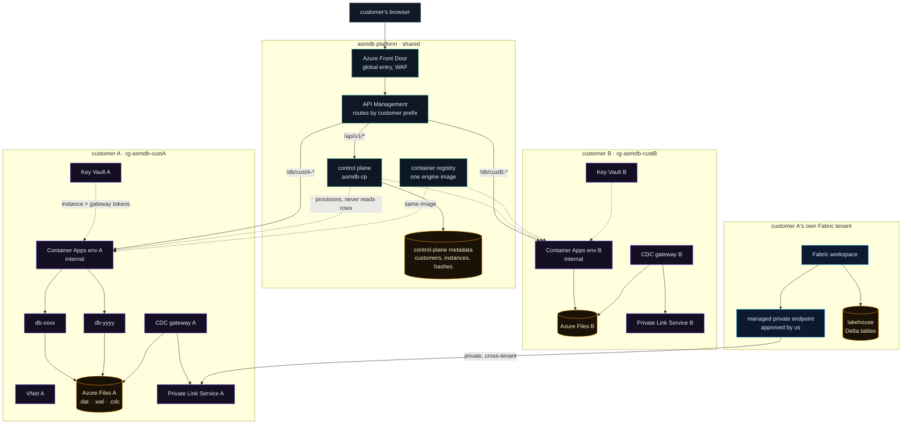

  

  <h1>asmdb Cloud — multi-tenancy</h1>

  
<em>How one control plane serves many customers, where the boundaries sit, and what private networking costs.</em>

---

> **Status: design, not deployment.** The platform described in
> [`SAAS.md`](SAAS.md) is single-tenant today: one resource group, one Container
> Apps environment, one APIM, one Key Vault. Nothing in this document is built.
> It is written before the fact so the shape is argued once, on paper, rather
> than discovered halfway through a migration.

- **[The decision that shapes everything](#the-decision-that-shapes-everything)**
- **[What is shared and what is not](#what-is-shared-and-what-is-not)**
- **[The architecture](#the-architecture)**
- **[Why a Container Apps environment per customer](#why-a-container-apps-environment-per-customer)**
- **[One APIM, or one per customer](#one-apim-or-one-per-customer)**
- **[The control plane stays shared, and must be paranoid](#the-control-plane-stays-shared-and-must-be-paranoid)**
- **[Reaching a customer's data from their own Fabric tenant](#reaching-a-customers-data-from-their-own-fabric-tenant)**
- **[Onboarding, step by step](#onboarding-step-by-step)**
- **[What this costs](#what-this-costs)**
- **[What breaks if you get it wrong](#what-breaks-if-you-get-it-wrong)**
- **[Open questions](#open-questions)**

---

## The decision that shapes everything

There is one question, and everything follows from the answer: **is a customer's
isolation enforced by code, or by the platform?**

Enforcing it in code means one shared environment, rows tagged with a customer
id, and every query carrying a filter. It is cheap and it is the industry
default. It also means a single missing `WHERE` clause is a cross-customer data
breach, and no amount of review makes that risk zero.

Enforcing it in the platform means a customer's databases sit in resources
another customer's identity cannot reach at all — not "is not permitted to
reach", but has no network path to. A bug in our code cannot cross that line,
because the line is not made of our code.

**asmdb takes the second answer**, and it is not a close call. The engine already
runs one process per database with an exclusive lock, so instances are already
physically separate; the isolation is between *groups* of instances, and the
grouping might as well be a subscription boundary. The trade is cost and
provisioning latency, both of which are quantified below.

---

## What is shared and what is not

| Layer | Shared | Per customer | Why |
|---|---|---|---|
| Control plane (`asmdb-cp`) | ✅ | | One codebase, one deployment, one upgrade path. It holds no customer data — it holds *pointers* to it. |
| Container image registry | ✅ | | The engine binary is identical for everyone. A per-customer registry would mean a per-customer build, which is how fleets drift. |
| APIM | ✅ *(single region)* | ⚠️ *(see below)* | Routing, not storage. |
| Resource group | | ✅ | The blast radius of a mistaken delete, and the unit of RBAC. |
| Container Apps environment | | ✅ | Private endpoints attach to the environment, not the app. This is the load-bearing constraint. |
| VNet | | ✅ | Follows the environment. |
| Key Vault | | ✅ | Holds the customer's instance tokens and the CDC gateway token. |
| Azure Files share | | ✅ | The `.dat`, `.wal` and `.cdc` files themselves. |
| CDC gateway | | ✅ | It mounts that share, so it lives where the share lives. |
| Fabric workspace | | ✅ *(in the customer's own tenant)* | Not ours at all. |

The line to remember: **we share the things that compute, and isolate the things
that remember.**

---

## The architecture

Read the dotted lines carefully: the control plane **provisions** a customer
environment and never reads a row out of one. That is the whole security model
in one arrow.

---

## Why a Container Apps environment per customer

This is the expensive decision, so it deserves its reason stated plainly.

A private endpoint on Azure Container Apps **targets the managed environment,
not the individual app** — verified while building the CDC gateway
([`WORKLOAD.md` §3.5](WORKLOAD.md)). If two customers share an environment, then
any private endpoint approved for one customer resolves to an ingress that
fronts *both*. The isolation would rest entirely on hostname routing and bearer
tokens, which is code again.

An environment per customer costs roughly €40–70 per month in baseline
infrastructure before a single database runs, and takes several minutes to
provision. That is the price of the guarantee. It is worth paying for a data
platform and would not be worth paying for a stateless API.

**A consequence worth planning for:** an empty environment still bills. Free-tier
customers cannot each have one. Either the free tier lives in a single shared
environment with the weaker, code-enforced isolation — clearly labelled as such —
or there is no free tier in the multi-tenant model. Do not blur this: a customer
who believes they have network isolation and does not is worse off than one who
was told they share.

---

## One APIM, or one per customer

Start with **one shared APIM** and route by path prefix. It carries no state and
sees no data at rest; a compromised APIM is a routing problem, not a disclosure.

Two situations force a dedicated instance, and only two:

**Data residency.** If a customer's data must remain in a region, the gateway
that terminates their TLS generally must too. APIM **multi-region is Premium-tier
only** — Developer, Basic and Standard, including the v2 tiers, are single-region.
So either the platform runs Premium and adds regional gateway units, or each
region gets its own APIM instance.

**Contractual isolation.** Some customers will require it in writing regardless
of the technical argument. Treat that as a pricing tier rather than an
architecture debate.

**Azure Front Door in front is worth it in either case**, and for a reason beyond
routing: it terminates TLS at the edge, gives one hostname regardless of how many
APIM instances exist behind it, and provides WAF. Adding it later means changing
every customer's endpoint URL, which is exactly the kind of migration nobody
schedules. Put it in at the start.

---

## The control plane stays shared, and must be paranoid

The control plane is the one component that can see every customer. That makes it
the only place where a bug is a cross-customer incident, so it carries rules the
rest of the system does not need.

**Every request resolves a customer before it resolves anything else.** The
customer comes from the caller's verified identity, never from a path segment,
a header or a body field. An instance id alone must never be sufficient to reach
an instance: `GET /db/{id}` has to prove the caller's customer owns `{id}` before
it routes.

**The control plane holds no data-plane credential.** It provisions Key Vaults; it
does not read instance tokens out of them. If it could, a control-plane
compromise would be a total compromise.

**Provisioning is the highest-privilege path in the system** and deserves to be
treated as such: its own managed identity, scoped to create resource groups from
a template, with no standing permission to read inside the ones it created.

**Cross-customer queries must be structurally impossible, not merely absent.**
The metadata store keys everything by customer id; there is no query surface that
takes an instance id without one. A filter that can be forgotten will be
forgotten.

---

## Reaching a customer's data from their own Fabric tenant

The Fabric workload runs in **the customer's tenant**, on their capacity, writing
into their lakehouse. Their Spark notebooks need to read the CDC gateway, which
sits in *our* subscription in *their* dedicated environment.

This is a cross-tenant private connection, and it has a specific shape:

1. **We** create an Azure **Private Link Service** in front of the customer's CDC
   gateway. This is the piece that makes a resource offerable across a tenant
   boundary — a managed private endpoint cannot target a Container Apps
   environment in another tenant directly.
2. **They** create a Fabric **managed private endpoint** from their workspace,
   pointing at our Private Link Service alias.
3. **We approve** the connection request. Until we do, nothing flows — which is
   the property that makes this safe to offer.

Two constraints follow, and both are load-bearing:

**A private endpoint belongs to exactly one tenant.** There is no mutualising
this: every customer needs their own Private Link Service and their own approved
connection. It is a per-customer onboarding step, permanently.

**Cross-tenant support is narrower than it looks.** It is documented for data
engineering — Spark, pipelines, eventstreams — which is what the sync notebook
needs. Do not assume it extends to every Fabric experience, and verify per
workload rather than per platform.

**Also worth knowing before promising it:** Fabric does *not* create private DNS
zones for every resource type. That is exactly how the single-tenant gateway
failed — the endpoint provisioned, both sides reported success, and the hostname
still resolved publicly ([`WORKLOAD.md` §3.5](WORKLOAD.md)). Verify DNS
resolution from inside a Spark session during onboarding, not by reading the
portal's status field.

---

## Onboarding, step by step

| # | Step | Automatable | Notes |
|---|---|---|---|
| 1 | Create `rg-asmdb-<customer>` | ✅ | Template-driven, from the provisioning identity |
| 2 | VNet, subnets, private DNS zones | ✅ | |
| 3 | Internal Container Apps environment | ✅ | Several minutes; the slowest step |
| 4 | Key Vault, RBAC mode, private | ✅ | RBAC, never access policies — a policy-mode vault silently ignores the role assignment |
| 5 | Azure Files share, NFS, private endpoint | ✅ | |
| 6 | CDC gateway container app, uid `100:101` | ✅ | The engine writes `0600`; NFS honours numeric ownership |
| 7 | Private Link Service over the gateway | ✅ | Record the alias; the customer needs it |
| 8 | Register the customer in control-plane metadata | ✅ | |
| 9 | APIM route for the customer prefix | ✅ | |
| 10 | Customer creates a Fabric managed private endpoint | ❌ | Their tenant, their action |
| 11 | **We approve the connection** | ⚠️ | Deliberately manual: it is the moment we consent to a cross-tenant path |
| 12 | Verify DNS from a Spark session | ❌ | The only check that proves the path works |

Ten of twelve steps are scriptable. **Step 11 should stay manual on purpose** —
it is the consent boundary, and an automatic approval is an automatic
cross-tenant network path.

---

## What this costs

Per customer, before any database exists:

| Resource | Rough monthly | Note |
|---|---|---|
| Container Apps environment | €35–50 | Workload profile baseline |
| Key Vault | €1 | Standard, negligible |
| Azure Files (NFS, provisioned) | €15+ | Premium FileStorage bills provisioned, not used |
| Private endpoints | €7 each | Several per customer |
| Private Link Service | €10 | Plus data processing |
| CDC gateway container | €10–20 | Scale-to-zero is possible but adds cold-start latency |

Call it **€80–110 per customer per month of floor**, plus whatever their
databases actually consume. Shared APIM Premium and Front Door add a fixed
platform cost on top, amortised across everyone.

The implication is a pricing floor, not a technical problem: below roughly €300
per month, a customer does not cover a dedicated environment with a margin worth
having. That is the number that decides whether the free tier can exist in this
model at all.

---

## What breaks if you get it wrong

**Sharing a Container Apps environment between customers.** Everything else in
this document assumes you did not. A private endpoint approved for one customer
reaches the ingress of every app in that environment.

**Deriving the customer from the request instead of the identity.** A path
segment is attacker-controlled. The identity is not.

**Automatic approval of managed private endpoints.** It converts a customer
request into a network path with no human consent, in a direction that crosses a
tenant boundary.

**Trusting the portal's status field for private DNS.** Both sides can report
`Succeeded` while the name still resolves publicly. Verify from inside the
consumer.

**A free tier with the isolation story of a paid one.** Either the isolation is
network-enforced or it is not; saying otherwise is the kind of claim that ends
badly and publicly.

---

## Open questions

These are genuinely undecided, and are recorded as such rather than resolved on
paper:

- **Regional expansion**: APIM Premium with multi-region gateway units, or one
  APIM per region behind Front Door? Premium is a large fixed cost; per-region
  instances are more operational surface. The answer depends on how many regions,
  and nobody knows that yet.
- **Free tier**: shared environment with honest labelling, or no free tier?
- **Migration path**: the platform is single-tenant today. Does the existing
  deployment become customer zero, or is it retired in favour of a fresh
  per-customer environment? The first is faster; the second leaves no special
  case in the code.
- **Per-customer engine versions**: the shared registry assumes everyone runs the
  same build. A customer who wants to pin a version breaks that assumption.
