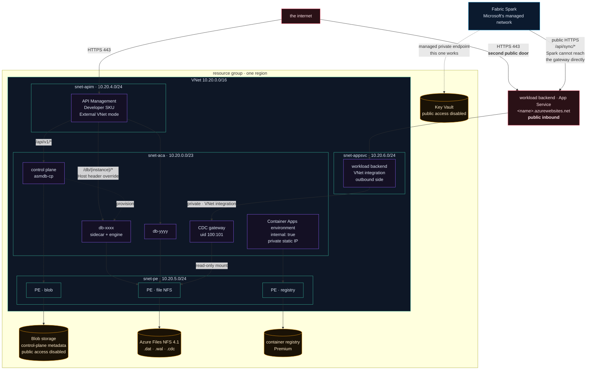
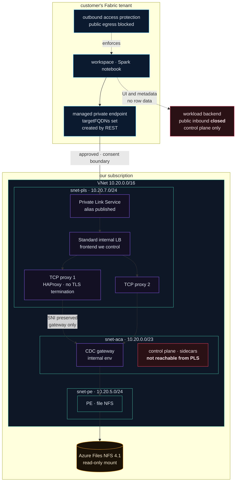
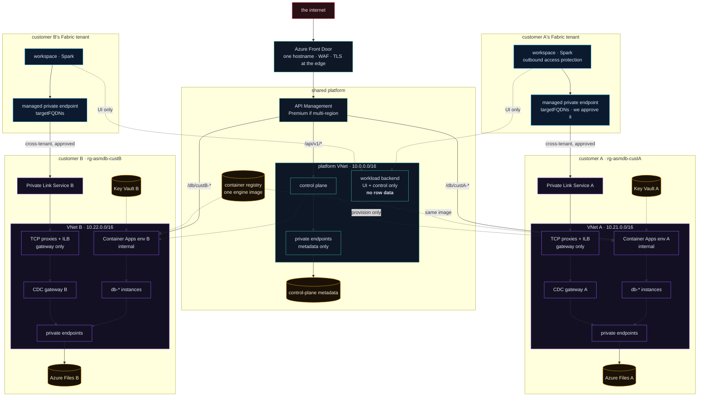

<div align="center">
  

  <h1>asmdb Cloud — network topology</h1>

  <p><em>Every path a packet can take today, and the shape it takes once there is more than one customer.</em></p>
</div>

---

Three topologies live here. The first is deployed and can be verified against
Azure this afternoon. The second closes the one public hole the first leaves open
and is **not built**. The third follows from [`MULTITENANCY.md`](MULTITENANCY.md)
and exists nowhere yet. They are kept in one document because each is only
comprehensible as a delta of the one before it.

**Part 1 — what is deployed**

- **[The current network](#the-current-network)**
- **[Address plan](#address-plan)**
- **[What is reachable from the internet](#what-is-reachable-from-the-internet)**
- **[Private DNS, and why it decides everything](#private-dns-and-why-it-decides-everything)**
- **[Four paths, traced end to end](#four-paths-traced-end-to-end)**

**Part 2 — closing the public notebook path**

- **[The hole part 1 leaves open](#the-hole-part-1-leaves-open)**
- **[Why the first attempt failed, and why the conclusion was too broad](#why-the-first-attempt-failed-and-why-the-conclusion-was-too-broad)**
- **[Step 1 — the cheap test, by REST](#step-1--the-cheap-test-by-rest)**
- **[Step 2 — the production shape: MPE to Private Link Service](#step-2--the-production-shape-mpe-to-private-link-service)**
- **[Step 3 — what the workload has to do](#step-3--what-the-workload-has-to-do)**
- **[Step 4 — remove the public fallback and prove it](#step-4--remove-the-public-fallback-and-prove-it)**
- **[What we run today, and what we would run in production](#what-we-run-today-and-what-we-would-run-in-production)**

**Part 3 — more than one customer**

- **[The multi-tenant network](#the-multi-tenant-network)**
- **[What changes, and what does not](#what-changes-and-what-does-not)**
- **[The cross-tenant path in detail](#the-cross-tenant-path-in-detail)**
- **[Address planning across customers](#address-planning-across-customers)**

---

## The current network

One VNet, four subnets, one internal Container Apps environment, and **two**
public front doors: API Management, and the workload backend that fronts the CDC
gateway for Fabric.



The backend is drawn outside the VNet on purpose. VNet integration is an
**outbound** feature: it gives the App Service a route into `snet-appsvc` so it
can reach the gateway privately, and it does nothing at all to its inbound
surface. The App Service keeps its public `*.azurewebsites.net` hostname, and
`/api/sync/*` answers on it.

---

## Address plan

| Range | Subnet | Holds |
|---|---|---|
| `10.20.0.0/16` | — | The whole VNet |
| `10.20.0.0/23` | `snet-aca` | Container Apps environment, delegated. `/23` is the minimum the platform accepts |
| `10.20.4.0/24` | `snet-apim` | API Management, External VNet mode |
| `10.20.5.0/24` | `snet-pe` | Private endpoints for blob, file and registry |
| `10.20.6.0/24` | `snet-appsvc` | Added later for the workload backend's VNet integration, delegated to `Microsoft.Web/serverFarms` |
| `10.20.7.0/24` | `snet-pls` | **Reserved, not deployed.** The Private Link Service, its internal load balancer and the TCP proxies of [part 2](#step-2--the-production-shape-mpe-to-private-link-service). A Private Link Service needs a subnet with `privateLinkServiceNetworkPolicies` disabled, so it cannot share `snet-pe` |

Everything from `10.20.8.0` upward is free. That matters for the multi-tenant
plan below, where address space stops being an afterthought.

---

## What is reachable from the internet

Two things, not one. The second was easy to miss for a long time, because it is
deployed by a different script into a different resource group.

| Resource | Public? | Notes |
|---|---|---|
| API Management | ✅ | External VNet mode. The gateway is public; its backends are not |
| **Workload backend · App Service** | ✅ | `<name>.azurewebsites.net`. VNet integration is outbound only and does not close the inbound side. `/api/sync/*` answers here, deliberately outside the Fabric token middleware |
| Container Apps environment | ❌ | `internal: true`. Its domain resolves only inside the VNet |
| Control plane | ❌ | `external: true` **within an internal environment**, which means reachable from the VNet, not the internet |
| Instance sidecars | ❌ | Same |
| CDC gateway | ❌ | Same, plus a read-only mount. **The gateway itself has never been public** |
| Blob storage | ❌ | `publicNetworkAccess: Disabled`, `allowSharedKeyAccess: false` |
| Azure Files | ❌ | Private endpoint only |
| Container registry | ⚠️ | Private endpoint for runtime pulls; public access stays enabled so ACR Tasks can build from a workstation |
| Key Vault | ❌ | Public access disabled by tenant policy; reachable only through a Fabric managed private endpoint |

The registry is the one deliberate exception, and it is recorded as such rather
than quietly tolerated: builds run as ACR Tasks from a laptop, which needs the
public endpoint. Runtime pulls take the private path.

**The distinction that matters, stated precisely.** The CDC gateway is not
reachable from the internet and never has been. What *is* reachable is the
backend that fronts it, and a request to `/api/sync/*` is answered with change-log
frames read from the private gateway. So the network boundary holds and the data
boundary does not: change-log content leaves the VNet through a public endpoint,
guarded only by a bearer token. Closing that is [part 2](#the-hole-part-1-leaves-open).

---

## Private DNS, and why it decides everything

Private Link is only half a mechanism. The other half is DNS, and the half that
gets forgotten is the one that fails silently.

Four private DNS zones are linked to the VNet:

| Zone | For |
|---|---|
| `privatelink.blob.core.windows.net` | Control-plane metadata |
| `privatelink.file.core.windows.net` | The NFS share holding every database |
| `privatelink.azurecr.io` | Runtime image pulls |
| `<container-apps-env-domain>` | A wildcard `A` record pointing every app hostname at the environment's private IP |

That last one is the interesting one. Inside the VNet, `db-xxxx.<env-domain>`
resolves to a private address; outside, the name does not resolve at all. APIM
can therefore route to an instance by overriding the `Host` header, and nothing
on the internet can.

**This is also where the CDC gateway failed for Fabric.** A managed private
endpoint was created, approved, and reported `Succeeded` on both sides — and the
hostname still resolved to a public address. The connection then reached the
public Container Apps edge, which serves nothing for an internal environment, and
dropped the TLS handshake. The symptom was an `SSLError` that reads like a
certificate problem and is a DNS one. The whole story is in
[`WORKLOAD.md` §3.5](WORKLOAD.md).

**The conclusion drawn at the time was too broad, and this document repeated
it.** "Fabric does not create private DNS zones for Container Apps, therefore the
private path is impossible" is not right. What is right is narrower: an endpoint
created without an explicit FQDN association gets no name resolution, and the
portal will not tell you. Fabric can associate the name — through
`targetFQDNs` on the REST API, which the portal does not expose. [Part
2](#why-the-first-attempt-failed-and-why-the-conclusion-was-too-broad) works
through what that changes.

The lesson generalises, and it survives the correction intact: **verify name
resolution from inside the consumer**, not from the portal's status field. An
`Approved` endpoint whose FQDN still resolves publicly is not a private path. It
is an Azure resource with the word *private* in its type name.

---

## Four paths, traced end to end

**A browser reaching the console.** Internet → APIM (public) → control plane over
the VNet. The browser never touches an instance.

**A customer's application reading rows.** Internet → APIM → `/db/{instance}/…`
→ `Host` header rewritten to `db-{instance}.<env-domain>` → resolved by the
private wildcard zone → the instance sidecar. The instance bearer token is
forwarded untouched; APIM validates nothing, and the sidecar is the only
authority.

**An instance reading its own data.** Container app → `snet-pe` private endpoint
→ Azure Files over NFS 4.1. Never leaves the VNet.

**A Fabric notebook syncing a lakehouse.** Spark → *public* HTTPS → the workload
backend on App Service → VNet integration into `snet-appsvc` → the CDC gateway on
its private address. Spark cannot reach the gateway directly today; the backend is
the bridge, and it forwards the caller's gateway token unchanged.

That fourth path is the only one where customer data crosses a public endpoint,
and it is the subject of the next part.

---

<div align="center">
  <h2>Part 2 — closing the public notebook path</h2>
  <p><em>The one path where customer data crosses a public endpoint, and how it stops.</em></p>
</div>

Everything above is deployed. Everything below is not.

---

## The hole part 1 leaves open

Path four is the odd one out. The other three either stay inside the VNet or
terminate on API Management, which exists to be public. Path four takes change-log
frames — real row content — out of the VNet, through an App Service that answers
on the open internet, and back.

Three properties compound:

| Property | Consequence |
|---|---|
| `/api/sync/*` is outside the Fabric token middleware | A Spark notebook holds no Fabric token for this application, so the route was deliberately left open. It is documented and it is intentional |
| The gateway credential is one static string | Same value for every consumer, so possession is the whole authorisation model |
| It never rotates | An accidental disclosure — a recorded demo, a screen share — cannot be undone |

None of this is dangerous in a single-tenant demonstrator whose databases all
belong to one owner. All of it is dangerous the day the change log carries a
customer's rows. The network fix is the same in both cases, so it is worth
writing down before it is needed.

**The goal:** Spark resolves the gateway to a private address, and the backend's
public inbound surface stops carrying data.

---

## Why the first attempt failed, and why the conclusion was too broad

The original managed private endpoint targeted the Container Apps environment and
was created without an explicit FQDN association. It provisioned, both sides
reported `Approved`, and the name kept resolving to `51.107.x.x`.

The conclusion recorded at the time — *managed private endpoints work for Key
Vault and not for our gateway* — fitted the evidence and generalised one step too
far. The mechanism is not Key Vault-specific. Fabric can reach a private or custom
API when the endpoint carries `targetFQDNs`, which associates the name so it
resolves inside the workspace's managed network.

**`targetFQDNs` is not exposed in the Fabric portal.** An endpoint created through
the UI has no FQDN association, provisions cleanly, and resolves publicly. That is
exactly the failure that was observed, and it is indistinguishable from
"unsupported" unless you already know the field exists.

So there are two candidate fixes, and they are not equivalent:

1. **Recreate the endpoint by REST with `targetFQDNs`.** Cheap, fast, and answers
   the question definitively.
2. **Publish a Private Link Service and point the endpoint at that.** More work,
   and the only shape that is defensible per customer.

Do the first to learn, and the second to ship.

---

## Step 1 — the cheap test, by REST

```http
POST https://api.fabric.microsoft.com/v1/workspaces/{workspaceId}/managedPrivateEndpoints
Authorization: Bearer <fabric-token>
Content-Type: application/json
```

```json
{
  "name": "asmdb-cdc-gateway",
  "targetPrivateLinkResourceId": "/subscriptions/<subscription>/resourceGroups/<service-resource-group>/providers/Microsoft.App/managedEnvironments/asmdb-env",
  "targetSubresourceType": "managedEnvironment",
  "targetFQDNs": [
    "asmdb-cdc-gateway.<environment-id>.swedencentral.azurecontainerapps.io"
  ],
  "requestMessage": "Private access from Fabric Spark to asmDB CDC"
}
```

`managedEnvironment` is the Private Link sub-resource for Container Apps, and the
zone that normally carries it is `privatelink.<region>.azurecontainerapps.io`.

Then approve the connection on the Azure side, and — this is the part that
matters — **test from a real Spark session**, not from the portal:

```python
import socket
from urllib.parse import urlparse

gateway = "https://asmdb-cdc-gateway.<environment-id>.swedencentral.azurecontainerapps.io"
host = urlparse(gateway).hostname

print(socket.getaddrinfo(host, 443))
```

```python
import requests

response = requests.get(f"{gateway}/healthz", timeout=15)
print(response.status_code, response.text)
```

`/healthz` is the right probe: it is the only gateway route that carries no bearer
token, so a `200` proves connectivity without involving the credential at all.

**The pass condition is the resolved address, not the status field.** A private
address means the mechanism works and the original diagnosis was an unset field. A
public address means the FQDN association did not take, and nothing else in this
part will help until it does.

### What this does not give you

Even when it works, the endpoint targets the **entire Container Apps
environment** — which in the current deployment also holds the control plane, every
instance sidecar and every engine. Listing one FQDN narrows ordinary use; it is not
a network boundary. A client that reaches the private address can set its own
`Host` header or SNI and try to address a neighbour.

For a single-tenant demonstrator, where every app in that environment belongs to
the same owner, this is acceptable and worth doing for the DNS proof alone. As the
architecture for a customer's data, it is not. It grants a customer's Spark
network a route to our whole environment.

---

## Step 2 — the production shape: MPE to Private Link Service

The endpoint should terminate on something that can only reach the gateway.



### Why the proxies are there

A Private Link Service attaches to the frontend of a **Standard load balancer**,
and the internal load balancer in front of a Container Apps environment is managed
by the platform. You do not own it, so you cannot publish it.

Private Link Service **Direct Connect** would remove the need — it can target the
static private IP of a Container Apps environment directly — but it is in preview
and **Sweden Central is not among the supported regions**. A production CDC path
is the wrong place to depend on that.

So: two small VMs, or a two-instance scale set, running HAProxy in TCP mode.
Boring, cheap, and it works.

```haproxy
frontend fabric_cdc_tls
    bind *:443
    mode tcp
    default_backend aca_cdc_gateway

backend aca_cdc_gateway
    mode tcp
    server gateway asmdb-cdc-gateway.<environment-id>.swedencentral.azurecontainerapps.io:443 check
```

Two properties make this worth the two VMs:

**It does not terminate TLS.** The stream is forwarded and the SNI survives to
Container Apps, which needs it to route to the right app. No certificate to
manage, no private key on the proxy, and the gateway still sees a TLS connection
it terminates itself.

**It has exactly one backend.** This is the whole point, and the reason to resist
a generic reverse proxy config. The customer's Spark network gets a route to the
CDC gateway and to nothing else in the environment. The isolation the step-1 test
could not give you is enforced here, by the proxy's configuration rather than by
hope.

The Fabric endpoint then points at the service instead of the environment:

```json
{
  "name": "asmdb-cdc-private",
  "targetPrivateLinkResourceId": "/subscriptions/<subscription>/resourceGroups/<rg>/providers/Microsoft.Network/privateLinkServices/asmdb-cdc-pls",
  "targetFQDNs": [
    "asmdb-cdc-gateway.<environment-id>.swedencentral.azurecontainerapps.io"
  ],
  "requestMessage": "Private CDC connection for asmDB Fabric workload"
}
```

`targetSubresourceType` is omitted here: a custom Private Link Service does not
have one.

---

## Step 3 — what the workload has to do

Less than it looks. The generated notebook already reads its base URL from a
substitution marker, and the backend already picks it:

```typescript
__ASMDB_GATEWAY_URL__: config.notebookGatewayUrl ?? config.gatewayUrl,
```

Point `ASMDB_NOTEBOOK_GATEWAY_URL` at the private FQDN and the notebook's CDC
logic — paging, gap handling, snapshot seeding, its tests — is untouched. Only the
hostname changes.

What has to be added is the onboarding sequence:

```
1. first sync link created in a workspace
2. backend lists the workspace's managed private endpoints
3. found and Approved?      -> create the notebook, enable the schedule
4. not found?               -> create it by REST with targetFQDNs
5. link state               -> Pending network approval
6. we approve on the PLS    -> the consent boundary, kept manual
7. backend polls provisioningState and connectionState.status
8. Approved                 -> then, and only then, enable the notebook
```

Three constraints shape it:

**A managed private endpoint is a workspace resource, not a notebook one.** One
per workspace per gateway, not one per sync link. Creating one for every link
would pile up endpoints that all point at the same place and all need approving.

**Creating one needs workspace-admin rights and `Workspace.ReadWrite.All`.** The
backend already performs an OBO exchange against Fabric, so this lands in the same
service — but the consent has to be added, and users, service principals and
managed identities are all accepted callers.

**Approval stays manual.** It is the only step where a human agrees that a
customer's network may reach ours. Automating it would turn a customer request
into a network path with nobody's consent, which is the one thing this whole
design is for.

---

## Step 4 — remove the public fallback and prove it

A private path that silently falls back to the public one is a public path with
extra steps.

Once connectivity is proven, `/api/sync/*` should stop serving row data
altogether, and the notebook should refuse to run if the private name does not
resolve privately:

```python
import ipaddress
import socket
from urllib.parse import urlparse

host = urlparse(GATEWAY_URL).hostname
resolved = {item[4][0] for item in socket.getaddrinfo(host, 443)}

if not resolved:
    raise SyncError(f"CDC gateway DNS resolution failed for {host}")

non_private = [a for a in resolved if not ipaddress.ip_address(a).is_private]
if non_private:
    raise SyncError(f"CDC gateway resolved publicly: {host} -> {non_private}")
```

Failing loudly here is deliberate. A sync that quietly reverts to the public
endpoint would keep working, keep reporting success, and keep moving rows across
the internet — and nobody would look at it again, because nothing broke.

Then make it a network property rather than a convention: **workspace outbound
access protection** restricts Spark to destinations reachable through approved
managed private endpoints and blocks public egress. With it on, the code above
becomes a second line of defence instead of the only one. Without it, a future
edit to the generated notebook — which the customer is free to make — can restore
the public path.

---

## What we run today, and what we would run in production

| | Demonstrator (today) | Production |
|---|---|---|
| Notebook data path | public `/api/sync/*` on the backend | Fabric MPE → PLS → proxies → gateway |
| Gateway reachability from Spark | none; the backend bridges | private FQDN, resolved inside the workspace |
| Backend public inbound | open, carries row data | open for the UI and control calls, **no row data** |
| Isolation of the route | none; the token is the whole model | proxy with a single backend |
| Consent | none needed | manual PLS approval, per customer |
| Egress guarantee | convention in the notebook | outbound access protection |
| Extra cost | zero | two small VMs, one ILB, one PLS |

**We stay on the public backend for now, and that is a deliberate choice rather
than an oversight.** The demonstrator is single-tenant, holds demonstration data,
and has no SLA; the two VMs, the load balancer and the per-workspace approval step
would buy isolation between parties that do not exist. Part 1 describes what runs.

**It becomes mandatory the moment a change log carries someone else's rows.** Not
because the risk changes shape — it is the same public endpoint and the same
static token — but because the consequence does. Everything above is written down
now, while it is cheap to think about, so that it is an implementation task later
rather than a design one.

The recommended order, if that day comes: run step 1 first to confirm DNS
association is the missing piece; use it for the reference tenant while documenting
that it exposes the whole environment; build step 2 before the first real customer;
automate step 3 but keep the approval human; and finish with step 4, because a
fallback that still works is a fallback that will be used.

---

<div align="center">
  <h2>Part 3 — more than one customer</h2>
  <p><em>The same shapes repeated per tenant, where the private path stops being optional.</em></p>
</div>

---

## The multi-tenant network

The same shapes, repeated per customer, with one shared front — and the private
notebook path of [part 2](#step-2--the-production-shape-mpe-to-private-link-service)
instantiated once per customer. At this scale it stops being optional: two
customers sharing one public `/api/sync` guarded by one static token is the exact
arrangement part 2 exists to prevent.



Two deltas against part 2, both consequences of there being more than one
customer:

**The proxy pair is per customer, inside the customer's VNet.** It is the piece
that makes the Private Link Service reachable and constrains it to the gateway, so
sharing one across customers would put customer A's Spark network one config line
away from customer B's environment. Duplicating two small VMs is the cheapest
isolation in this document.

**The backend keeps a public face and loses its data path.** It still serves the
Fabric iframe and control calls, which need to be reachable. What it no longer
does is carry change-log frames — those go customer-private, end to end. That is
the difference between a public endpoint and a public *data* endpoint, and it is
the whole point of part 2.

---

## What changes, and what does not

| | Today | Multi-tenant |
|---|---|---|
| VNets | 1 | 1 platform + 1 per customer |
| Container Apps environments | 1 | 1 per customer |
| Private endpoints | 3 | 3 per customer + platform |
| Private Link Service | 0 | 1 per customer |
| TCP proxy pair + internal LB | 0 | 1 per customer |
| Notebook data path | public `/api/sync/*` | customer-private, end to end |
| Public inbound surfaces | 2 (APIM, backend) | 2 (Front Door, backend) — **neither carries row data** |
| APIM | 1 Developer | 1 Premium, or 1 per region |
| Front Door | none | 1, in front of everything |
| Peering between customer VNets | — | **none, ever** |

**The VNets are deliberately not peered.** There is no scenario where customer
A's network should route to customer B's, so the address ranges do not need to
avoid each other for routing reasons — but they should anyway, because a future
hub-and-spoke or a support jumpbox becomes impossible once two customers overlap
on `10.21.0.0/16`.

**Front Door is not optional in this design, and not for the reason it usually
is.** It gives one stable hostname regardless of how many APIM instances exist
behind it. Adding it later means changing every customer's endpoint URL, and that
is a migration nobody ever schedules. Put it in before the first customer.

---

## The cross-tenant path in detail

This is the only path that crosses an organisational boundary, so it is worth
tracing precisely.

```
customer's Fabric workspace (their tenant)
  └─ managed private endpoint          they create it, targetFQDNs set
       └─ Private Link Service alias   we publish it
            └─ [ we approve ]          the consent boundary
                 └─ internal load balancer
                      └─ TCP proxy pair, one backend only
                           └─ CDC gateway (their dedicated environment)
                                └─ read-only NFS mount
                                     └─ <db>.cdc
```

Five properties hold this together:

**A managed private endpoint cannot target a Container Apps environment in
another tenant directly.** A Private Link Service is the piece that makes a
resource offerable across the boundary, and it is per customer.

**`targetFQDNs` is what makes the name resolve.** Without it the endpoint
provisions, reports `Approved`, and resolves publicly — the failure recorded in
[part 2](#why-the-first-attempt-failed-and-why-the-conclusion-was-too-broad). It
is set through the REST API; the portal does not expose it.

**The proxy pair is what makes the grant narrow.** A Private Link Service in front
of a whole environment would let a customer's Spark network address any app in it
by manipulating `Host` or SNI. Two proxies with a single configured backend reduce
that to the gateway alone.

**A private endpoint belongs to exactly one tenant.** There is no mutualising it,
so this is a permanent per-customer onboarding step.

**Approval is manual by design.** Until we approve, nothing flows. Automating it
would convert a customer request into a network path with no human consent.

**Cross-tenant support is narrower than the marketing suggests.** It is
documented for data-engineering workloads — Spark, pipelines, eventstreams —
which is what the sync notebook uses. Verify per workload rather than assuming it
covers all of Fabric.

And the check that actually proves it works: resolve the gateway hostname inside a
Spark session and confirm a private address comes back. Both sides can report
success while DNS still resolves publicly — that is not a hypothetical, it is what
happened here the first time.

---

## Address planning across customers

Not glamorous, and the cheapest possible thing to get right at the start.

| Block | Purpose |
|---|---|
| `10.0.0.0/16` | Shared platform: APIM, control plane, the workload backend, their private endpoints |
| `10.21.0.0/16` … `10.99.0.0/16` | One `/16` per customer, allocated sequentially |
| `10.100.0.0/16`+ | Reserved for a future hub, jumpbox or shared services |

A `/16` per customer is generous to the point of wasteful, and that is the point:
the alternative is a customer outgrowing a `/20` and needing a migration that
touches every private endpoint they have. Address space is free; renumbering a
live tenant is not.

Within each customer VNet, keep the layout identical to the one deployed today —
`/23` for Container Apps, `/24` for private endpoints, `/24` for anything
delegated, `/24` for the Private Link Service and its proxies. Identical layouts
mean a runbook written once applies to every customer, and an engineer reading
customer B's network already knows where to look.

One constraint is easy to discover too late: the Private Link Service subnet needs
`privateLinkServiceNetworkPolicies` disabled, which is a property of the subnet
rather than of the service. It cannot share a subnet with private endpoints, so
plan the `/24` for it from the first customer instead of carving one out of a
range already in use.
