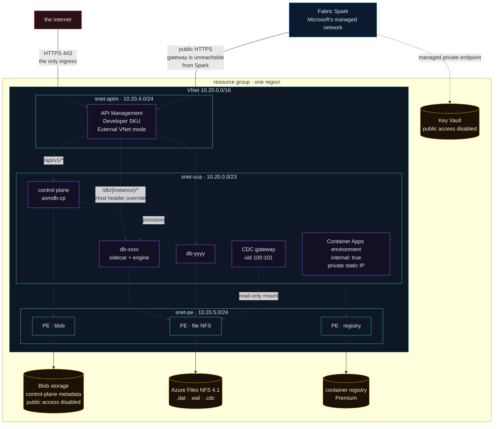
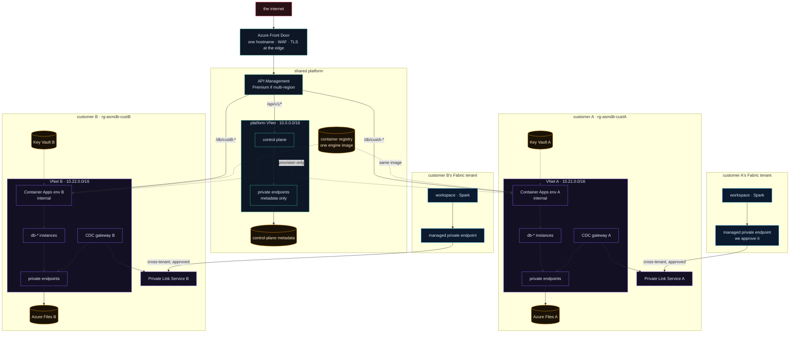

<div align="center">
  

  <h1>asmdb Cloud — network topology</h1>

  <p><em>Every path a packet can take today, and the shape it takes once there is more than one customer.</em></p>
</div>

---

Two topologies live here. The first is deployed and can be verified against
Azure this afternoon. The second is a design that follows from
[`MULTITENANCY.md`](MULTITENANCY.md) and exists nowhere yet. They are kept in one
document because the second is only comprehensible as a delta of the first.

- **[The current network](#the-current-network)**
- **[Address plan](#address-plan)**
- **[What is reachable from the internet](#what-is-reachable-from-the-internet)**
- **[Private DNS, and why it decides everything](#private-dns-and-why-it-decides-everything)**
- **[Four paths, traced end to end](#four-paths-traced-end-to-end)**
- **[The multi-tenant network](#the-multi-tenant-network)**
- **[What changes, and what does not](#what-changes-and-what-does-not)**
- **[The cross-tenant path in detail](#the-cross-tenant-path-in-detail)**
- **[Address planning across customers](#address-planning-across-customers)**

---

## The current network

One VNet, three subnets, one internal Container Apps environment, and API
Management as the only public door.



---

## Address plan

| Range | Subnet | Holds |
|---|---|---|
| `10.20.0.0/16` | — | The whole VNet |
| `10.20.0.0/23` | `snet-aca` | Container Apps environment, delegated. `/23` is the minimum the platform accepts |
| `10.20.4.0/24` | `snet-apim` | API Management, External VNet mode |
| `10.20.5.0/24` | `snet-pe` | Private endpoints for blob, file and registry |
| `10.20.6.0/24` | `snet-appsvc` | Added later for the workload backend's VNet integration, delegated to `Microsoft.Web/serverFarms` |

Everything from `10.20.7.0` upward is free. That matters for the multi-tenant
plan below, where address space stops being an afterthought.

---

## What is reachable from the internet

Exactly one thing.

| Resource | Public? | Notes |
|---|---|---|
| API Management | ✅ | External VNet mode. The gateway is public; its backends are not |
| Container Apps environment | ❌ | `internal: true`. Its domain resolves only inside the VNet |
| Control plane | ❌ | `external: true` **within an internal environment**, which means reachable from the VNet, not the internet |
| Instance sidecars | ❌ | Same |
| CDC gateway | ❌ | Same, plus a read-only mount |
| Blob storage | ❌ | `publicNetworkAccess: Disabled`, `allowSharedKeyAccess: false` |
| Azure Files | ❌ | Private endpoint only |
| Container registry | ⚠️ | Private endpoint for runtime pulls; public access stays enabled so ACR Tasks can build from a workstation |
| Key Vault | ❌ | Public access disabled by tenant policy; reachable only through a Fabric managed private endpoint |

The registry is the one deliberate exception, and it is recorded as such rather
than quietly tolerated: builds run as ACR Tasks from a laptop, which needs the
public endpoint. Runtime pulls take the private path.

---

## Private DNS, and why it decides everything

Private Link is only half a mechanism. The other half is DNS, and the half that
gets forgotten is the one that fails silently.

Four private DNS zones are linked to the VNet:

| Zone | For |
|---|---|
| `privatelink.blob.core.windows.net` | Control-plane metadata |
| `privatelink.file.core.windows.net` | The NFS share holding every database |
| `privatelink.azurecr.io` | Runtime image pulls |
| `<container-apps-env-domain>` | A wildcard `A` record pointing every app hostname at the environment's private IP |

That last one is the interesting one. Inside the VNet, `db-xxxx.<env-domain>`
resolves to a private address; outside, the name does not resolve at all. APIM
can therefore route to an instance by overriding the `Host` header, and nothing
on the internet can.

**This is also where the CDC gateway failed for Fabric.** A managed private
endpoint was created, approved, and reported `Succeeded` on both sides — and the
hostname still resolved to a public address, because Fabric does not create
private DNS zones for Azure Container Apps. The connection then reached the
public Container Apps edge, which serves nothing for an internal environment, and
dropped the TLS handshake. The symptom was an `SSLError` that reads like a
certificate problem and is a DNS one. The whole story is in
[`WORKLOAD.md` §3.5](WORKLOAD.md).

The lesson generalises: **verify name resolution from inside the consumer**, not
from the portal's status field.

---

## Four paths, traced end to end

**A browser reaching the console.** Internet → APIM (public) → control plane over
the VNet. The browser never touches an instance.

**A customer's application reading rows.** Internet → APIM → `/db/{instance}/…`
→ `Host` header rewritten to `db-{instance}.<env-domain>` → resolved by the
private wildcard zone → the instance sidecar. The instance bearer token is
forwarded untouched; APIM validates nothing, and the sidecar is the only
authority.

**An instance reading its own data.** Container app → `snet-pe` private endpoint
→ Azure Files over NFS 4.1. Never leaves the VNet.

**A Fabric notebook syncing a lakehouse.** Spark → *public* HTTPS → the workload
backend on App Service → VNet integration into `snet-appsvc` → the CDC gateway on
its private address. Spark cannot reach the gateway directly and never will; the
backend is the bridge, and it forwards the caller's gateway token unchanged.

---

## The multi-tenant network

The same shapes, repeated per customer, with one shared front.



---

## What changes, and what does not

| | Today | Multi-tenant |
|---|---|---|
| VNets | 1 | 1 platform + 1 per customer |
| Container Apps environments | 1 | 1 per customer |
| Private endpoints | 3 | 3 per customer + platform |
| Private Link Service | 0 | 1 per customer |
| APIM | 1 Developer | 1 Premium, or 1 per region |
| Front Door | none | 1, in front of everything |
| Peering between customer VNets | — | **none, ever** |

**The VNets are deliberately not peered.** There is no scenario where customer
A's network should route to customer B's, so the address ranges do not need to
avoid each other for routing reasons — but they should anyway, because a future
hub-and-spoke or a support jumpbox becomes impossible once two customers overlap
on `10.21.0.0/16`.

**Front Door is not optional in this design, and not for the reason it usually
is.** It gives one stable hostname regardless of how many APIM instances exist
behind it. Adding it later means changing every customer's endpoint URL, and that
is a migration nobody ever schedules. Put it in before the first customer.

---

## The cross-tenant path in detail

This is the only path that crosses an organisational boundary, so it is worth
tracing precisely.

```
customer's Fabric workspace (their tenant)
  └─ managed private endpoint          they create it
       └─ Private Link Service alias   we publish it
            └─ [ we approve ]          the consent boundary
                 └─ internal load balancer
                      └─ CDC gateway (their dedicated environment)
                           └─ read-only NFS mount
                                └─ <db>.cdc
```

Four properties hold this together:

**A managed private endpoint cannot target a Container Apps environment in
another tenant directly.** A Private Link Service is the piece that makes a
resource offerable across the boundary, and it is per customer.

**A private endpoint belongs to exactly one tenant.** There is no mutualising it,
so this is a permanent per-customer onboarding step.

**Approval is manual by design.** Until we approve, nothing flows. Automating it
would convert a customer request into a network path with no human consent.

**Cross-tenant support is narrower than the marketing suggests.** It is
documented for data-engineering workloads — Spark, pipelines, eventstreams —
which is what the sync notebook uses. Verify per workload rather than assuming it
covers all of Fabric.

And the check that actually proves it works: run `socket.gethostbyname` for the
gateway hostname inside a Spark session and confirm a private address comes back.
Both sides can report success while DNS still resolves publicly.

---

## Address planning across customers

Not glamorous, and the cheapest possible thing to get right at the start.

| Block | Purpose |
|---|---|
| `10.0.0.0/16` | Shared platform: APIM, control plane, its private endpoints |
| `10.21.0.0/16` … `10.99.0.0/16` | One `/16` per customer, allocated sequentially |
| `10.100.0.0/16`+ | Reserved for a future hub, jumpbox or shared services |

A `/16` per customer is generous to the point of wasteful, and that is the point:
the alternative is a customer outgrowing a `/20` and needing a migration that
touches every private endpoint they have. Address space is free; renumbering a
live tenant is not.

Within each customer VNet, keep the layout identical to the one deployed today —
`/23` for Container Apps, `/24` for private endpoints, `/24` for anything
delegated. Identical layouts mean a runbook written once applies to every
customer, and an engineer reading customer B's network already knows where to
look.
