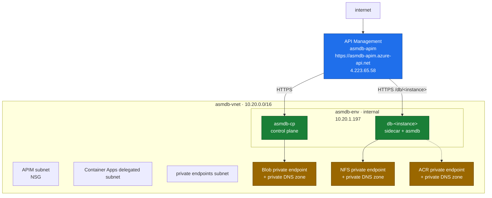
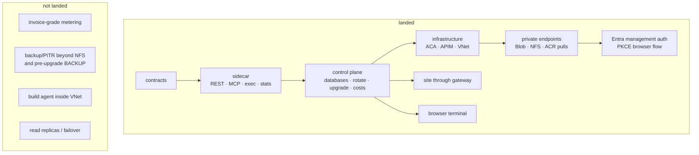

# asmdb Cloud — deployed service notes

> This document describes the asmdb Cloud platform that exists today: the Azure
> resources, request paths, authentication model, instance lifecycle and the
> remaining gaps. The engine itself remains the x86-64 assembly database
> specified in [`ENGINE.md`](ENGINE.md); the service wraps that engine with
> network, identity, routing and storage controls.

---

## 0. Engine envelope — constraints the service cannot loosen

Nothing in the service changes these engine facts. They are compiled into the
binary or into the on-disk format.

<p align="center">
  
</p>

| Dimension | Hard limit | Service consequence |
|---|---|---|
| Rows per database | 4 194 304 slots, comfortable to ~3.1 M | A database is a table. Multi-entity applications use multiple instances or their own routing key. |
| Row shape | 256 bytes, seven fixed columns | No per-tenant schema; richer shapes are encoded by the client. |
| `tag` | 39 bytes | Usable as a namespace or partition marker, not arbitrary metadata. |
| `content` | 175 bytes | Documents, embeddings and blobs live elsewhere; the row holds a reference. |
| `value` | one `i64` | The only numeric column, and the only one `RANGE` can filter on. |
| Rows per transaction | 4 096 distinct | Bulk writes must be chunked by the API or the client. |
| Disk per database | ~1 GiB sparse `.dat`, plus `.wal` and `.cdc` | The durable volume must be real; a Container App filesystem is not enough. |
| Concurrency | one writer, unlimited `--reader` sessions | `maxReplicas` is fixed at 1. A second engine process is not extra capacity. |
| Absent from the engine | no SQL, joins, planner, secondary indexes, auth, encryption or audit log | The platform supplies the controls it can; missing database features are not hidden. |

Four consequences are worth keeping visible:

1. `FIND` and `RANGE` are full scans of the slot region. The service must bound,
   cache or index hot predicate queries outside the engine.
2. The change log retention policy is external. Left alone, `<db>.cdc` grows for
   the life of the instance.
3. No transaction spans two instances. Cross-entity consistency is a control-plane
   or application concern.
4. Security is external to the engine. See [`SECURITY.md`](SECURITY.md) for the
   engine and platform threat model.

---

## Table of contents

1. [What is deployed](#1-what-is-deployed)
2. [Network topology](#2-network-topology)
3. [Request routing](#3-request-routing)
4. [Runtime components](#4-runtime-components)
5. [Authentication and tokens](#5-authentication-and-tokens)
6. [Instance lifecycle, storage and isolation](#6-instance-lifecycle-storage-and-isolation)
7. [Observability, stats and costs](#7-observability-stats-and-costs)
8. [Installation and deployment](#8-installation-and-deployment)
9. [Durability, upgrade and recovery](#9-durability-upgrade-and-recovery)
10. [Limits and non-goals](#10-limits-and-non-goals)
11. [Verified smoke checks](#11-verified-smoke-checks)
12. [Development plan status](#12-development-plan-status)
13. [Risks and open questions](#13-risks-and-open-questions)
14. [Pricing & packaging](#14-pricing--packaging)

---

## 1. What is deployed

The live platform is in resource group `<service-resource-group>`, region `swedencentral`.

| Resource | Deployed name | Notes |
|---|---|---|
| API Management | `asmdb-apim` | Developer SKU, External VNet mode, gateway `https://asmdb-apim.azure-api.net`, public IP `4.223.65.58`. This is the only public address. |
| Container Apps environment | `asmdb-env` | Internal environment, static IP `10.20.1.197`, domain `<container-apps-env>.swedencentral.azurecontainerapps.io`. That domain does not resolve from the public internet. |
| Virtual network | `asmdb-vnet` | `10.20.0.0/16`, with subnets for Container Apps, APIM and private endpoints. |
| Blob storage | `asmdbstosmwggii` | Control-plane metadata. `publicNetworkAccess: Disabled`, `allowSharedKeyAccess: false`; access is through managed identity. |
| File storage | `asmdbfsosmwggii3rfc4` | Premium FileStorage, NFS 4.1 share `instances`, 100 GiB provisioned. Instance directories are separated by mount sub-path. |
| Container registry | `<registry>` | Premium, because that is the cheapest SKU with private endpoint support. Runtime pulls are private. Public network access remains enabled for ACR Tasks from a workstation. |
| Managed identity | `asmdb-mi` | Used by the control plane. |
| Log Analytics | `asmdb-logs` | Platform logging target. |
| Control plane app | `asmdb-cp` | Ingress is `external: true`, which in an internal Container Apps environment means the environment's private load balancer, not the internet. |

The service is already reachable through APIM for the control-plane paths and
site content listed in [§11](#11-verified-smoke-checks).

---

## 2. Network topology

The topology is intentionally private behind one public front door.



Private endpoints exist for Blob storage, the NFS share and the registry, each
with a private DNS zone linked to the VNet. Blob public access is disabled and
shared-key access is disabled. The NFS share carries no account key; it is
reachable only from inside the VNet.

The one exception is the registry. `<registry>` keeps public network access
enabled so images can be built with ACR Tasks from a workstation. Pulls from
running Container Apps go through the private endpoint. Closing that exception
would require a build agent pool inside the VNet, and that is not in place.

---

## 3. Request routing

APIM has two APIs.

| APIM API | Path | Backend | Important policy |
|---|---|---|---|
| `asmdb` | `''` | Control plane `asmdb-cp` | Overrides `Host` to the backend FQDN. |
| `asmdb-instances` | `db` | `https://db-{instance}.<container-apps-env>.swedencentral.azurecontainerapps.io` | Strips `/db/{instance}`, overrides `Host`, and uses a 60-second forward timeout for cold starts. |

A customer receives this base endpoint:

```text
https://asmdb-apim.azure-api.net/db/<instance>
```

The data-plane paths sit beneath it:

```text
https://asmdb-apim.azure-api.net/db/<instance>/v1/rows
https://asmdb-apim.azure-api.net/db/<instance>/mcp
https://asmdb-apim.azure-api.net/db/<instance>/health
```

The instance API deliberately has no CORS policy. A browser calling an instance
directly would put the instance bearer token in front-end code. The browser
terminal goes through the control plane instead.

TLS is present on every request hop described here. APIM is HTTPS, APIM forwards
to HTTPS backends, and Container Apps ingress defaults to redirecting HTTP to
HTTPS because `allowInsecure` is not set.

---

## 4. Runtime components

### 4.1 Sidecar

Each database instance runs one sidecar and one `asmdb` process. The sidecar
exposes:

| Endpoint | Purpose |
|---|---|
| REST CRUD under `/v1/rows` | Data-plane row operations. |
| `/mcp` | MCP over HTTP. |
| `POST /v1/exec` | Browser terminal execution path. |
| `GET /v1/stats` | Rows/capacity from the engine and CPU/memory from container cgroups. |
| `/health` | Instance health. |

`GET /v1/stats` accepts a per-instance platform token:

```text
HMAC-SHA256(master secret, instance id)
```

That token is accepted only on `/v1/stats`, never on mutating routes.

### 4.2 Control plane

The control plane exposes:

| Endpoint | Purpose |
|---|---|
| `GET /healthz` | Control-plane health. |
| `GET /api/v1/config` | Browser configuration for Entra sign-in. |
| `GET /api/v1/databases` | List databases. |
| `POST /api/v1/databases` | Create a database and return endpoint + token once. |
| `DELETE /api/v1/databases/{id}` | Delete a database. |
| `POST /api/v1/databases/{id}/exec` | Proxy browser terminal commands using the instance token. |
| `POST /api/v1/databases/{id}/rotate-token` | Rotate the instance token. |
| `POST /api/v1/databases/{id}/upgrade` | Backup, restart and upgrade an instance. |
| `GET /api/v1/costs` | Estimated cost view. |

---

## 5. Authentication and tokens

The service uses two credentials. They are not interchangeable.

### 5.1 Management API

Create, list, delete, rotate, upgrade and cost operations require a Microsoft
Entra ID v2 access token. The server verifies the token against the tenant JWKS:
signature, issuer, audience and expiry. The `groups` claim must contain the
object id of the security group named `ASMDB_ADMIN`.

A valid token from a user outside `ASMDB_ADMIN` is rejected with `403`, not
`401`: the user is authenticated, but not authorised. An ID token is not accepted
in place of an access token, and no JWT payload is trusted before signature
verification. If the Entra configuration is absent, the management API fails
closed.

The browser uses authorization-code with PKCE. There is no client secret in the
repository, the image or an app setting. Tenant, client and group ids are read
from environment variables and returned to the browser through `/api/v1/config`.
The previous shared admin key has been removed.

### 5.2 Data plane

A database's own REST API, MCP endpoint and browser terminal use the instance
bearer token. The endpoint and token are returned together once from
`POST /api/v1/databases`. The token is stored by the control plane only as a
hash and is compared in constant time.

Rotation is available at:

```text
POST /api/v1/databases/{id}/rotate-token
```

Rotation is authenticated with Entra, not with the instance token. That is
intentional: rotation is needed when the instance token has been lost. Rotation
restarts the instance and briefly interrupts connections. The new token arrives
as an environment variable, which creates a new container revision, and the
engine holds an exclusive lock until the outgoing process releases it.

---

## 6. Instance lifecycle, storage and isolation

Each instance mounts the durable volume at `/data`. A Container App's own
filesystem is discarded on restart and on scale-to-zero, so running without a
volume would lose the database when the app went idle. The control plane refuses
to start if the volume is not configured.

One Premium FileStorage NFS 4.1 share, `instances`, serves the platform. The
mount sub-path is the instance id, so each database sees only its own directory.
The share is 100 GiB provisioned.

`maxReplicas` is `1` on every tier. This is not a scaling preference; it follows
from the engine. `asmdb` is a single-writer process holding an exclusive lock on
its database. A second replica is a second engine process, and it cannot safely
open the same files while the first one is running.

---

## 7. Observability, stats and costs

Log Analytics is deployed as `asmdb-logs`.

The sidecar's `/v1/stats` endpoint reports rows and capacity from the engine,
plus CPU and memory from the container cgroups. It is protected by the
per-instance platform token described in [§4.1](#41-sidecar).

`GET /api/v1/costs` is an estimate, not an invoice. It is computed from the Azure
Monitor `Replicas` metric, so paused time is excluded by construction. The
estimate uses list rates; it does not claim to be the bill of record.

Metering beyond that estimate is not implemented yet. There is no usage pipeline
that turns per-operation events into invoices.

---

## 8. Installation and deployment

Deployment is run from a workstation, never from CI.

### 8.1 Prerequisites

- Azure CLI.
- Owner on the target subscription.
- Subscription feature `Microsoft.Network/AllowBringYourOwnPublicIpAddress`
  registered. VNet-injected APIM requires a supplied public IP; without this
  feature the first deployment fails with `SubscriptionNotRegisteredForFeature`.

Register the feature and refresh the provider:

```powershell
az feature register --namespace Microsoft.Network --name AllowBringYourOwnPublicIpAddress
az provider register -n Microsoft.Network
```

Feature registration is asynchronous; wait for it to show as registered before
running the first deployment.

### 8.2 Build the image

Docker is not required on the workstation. Images build with ACR Tasks. Run from
the repository root so the Docker build context includes the engine and service
files, not only the Dockerfile directory:

```powershell
az acr build --registry <acr> --image asmdb-instance:latest --file saas/sidecar/Dockerfile .
```

### 8.3 Run the deployment script

`saas/infra/deploy.ps1` is idempotent and re-runnable. Useful switches:

| Switch | Use |
|---|---|
| `-Tag` | Deploy a specific image tag. |
| `-SkipBuild` | Reuse an existing image. |
| `-SkipApim` | Leave APIM untouched. |
| `-WhatIf` | Preview infrastructure changes. |

APIM Developer takes roughly 30-45 minutes to provision the first time. That is
normal for this SKU and should not be mistaken for a hung deployment.

A VNet cannot be added to an existing Container Apps environment. Moving an
existing environment onto a VNet means deleting its apps and the environment
first. The deployment script detects that shape and refuses rather than
half-applying a private-network migration.

---

## 9. Durability, upgrade and recovery

The live database files are on the durable NFS volume. That is the durability
mechanism that exists today beyond the engine's own `.dat`, `.wal` and `.cdc`
files. Backup shipping, PITR and invoice-grade usage metering are not deployed.

Upgrade is deliberately conservative. `POST /api/v1/databases/{id}/upgrade`
takes a `BACKUP` before changing anything and aborts if the backup fails. The
operation restarts the instance, so it is not seamless; active connections can
be interrupted while the old process exits, the lock is released and the new
revision starts.

---

## 10. Limits and non-goals

- There is no public address except APIM.
- There is no direct browser access to an instance API, by design.
- There is no CORS policy on `asmdb-instances`, by design.
- There is no build agent pool inside the VNet; ACR public access remains enabled
  for workstation-triggered ACR Tasks.
- There is no read-replica story for a single instance while `maxReplicas` is 1.
- There is no metering pipeline beyond the Azure Monitor cost estimate.
- There are no deployed backups beyond the provisioned NFS share and the backup
  taken before upgrade.
- There are no compliance certifications claimed here.

---

## 11. Verified smoke checks

The following have been proven through `https://asmdb-apim.azure-api.net`:

| Request | Result |
|---|---|
| `GET /healthz` | `200 ok` |
| `GET /` | site returned |
| `GET /api/v1/databases` | `200 {"databases":[]}` |

---

## 12. Development plan status

The original plan was organised as waves. The useful part now is the status of
what landed versus what remains.



| Area | Status |
|---|---|
| Contracts | Landed. The control-plane and sidecar surfaces exist. |
| Sidecar | Landed: REST CRUD, MCP over HTTP, browser `exec`, health, stats from engine + cgroups. |
| Control plane | Landed: health, config, database create/list/delete, exec proxy, rotate, upgrade, costs. |
| Infrastructure | Landed: resource group, VNet, internal Container Apps environment, APIM, managed identity, Log Analytics. |
| Private network and gateway | Landed: APIM is public; Container Apps, Blob, NFS and runtime pulls are private. |
| Site | Landed through `GET /` on the APIM gateway. |
| Authentication | Landed: Entra access-token verification with `ASMDB_ADMIN`, PKCE browser flow, hashed instance tokens. |
| Browser terminal | Landed through the control-plane proxy. |
| Stats and cost view | Landed as stats endpoint and Azure Monitor `Replicas` estimate. |
| Metering beyond estimate | Not landed. There is no invoice-grade usage pipeline. |
| Backups beyond provisioned share | Not landed, except the explicit `BACKUP` before upgrade. |
| Build agent inside VNet | Not landed; ACR public network access remains enabled for workstation builds. |
| Read replicas / failover | Not landed and incompatible with the current `maxReplicas: 1` instance shape. |

---

## 13. Risks and open questions

- **Single table per instance.** A database is a table, so a tenant with multiple
  entities needs multiple instances or an application-level encoding.
- **Full scans.** `FIND` and `RANGE` remain full scans. Hot predicates need a
  service-side index, cache or a future engine index.
- **One writer.** One instance cannot scale writes horizontally. Partitioning is
  the only deployed-compatible answer today.
- **ACR public build path.** Runtime pulls are private, but workstation ACR Tasks
  require the registry public endpoint until a build pool exists inside the VNet.
- **Cost estimate.** The current view excludes paused time by construction, but
  it is not an invoice.

---

## 14. Pricing & packaging

Three tiers ship today, priced from Azure list rates at **15 % margin on run**.
The derivation — every rate, every assumption, and what would break the model —
is in [`COST.md`](COST.md).

| Tier | Price | Size | Behaviour | Cap |
|---|---|---|---|---|
| **Free** | $0 | 0.25 vCPU / 0.5 GiB | sleeps when idle | 3 per account |
| **Standard** | $15/mo | 0.5 vCPU / 1 GiB | sleeps when idle | 20 per account |
| **Premium** | $49/mo | 1 vCPU / 2 GiB | always warm, no cold start | 100 per account |

Every tier runs the identical engine, with the same 4 194 304-row ceiling and
the same durability. Tiers buy **latency and headroom, not features** — there is
no paid feature flag in the codebase and there is not meant to be one.

The sizes are not free choices. Container Apps Consumption accepts only fixed
vCPU/memory pairs at a 1:2 ratio and **0.25 vCPU / 0.5 GiB is the floor**, so
there is nothing smaller to sell; the only lever below it is not running, which
is what scale-to-zero does.

`Premium` costs 3.6× `Standard` for 2× the CPU because it never scales to zero.
About $21/month of its cost is a replica sitting idle so the first request does
not wait. That is the product.

Two economics worth stating plainly:

- **The free tier is not free to run.** About $1.08/month each, funded by the
  paying tiers. The three-instance cap is a pricing control, not a technical
  limit.
- **This is a volume model.** Fixed platform cost is ~$161/month regardless of
  customers, so it stops dominating at roughly **150 databases**. Below that the
  standard tier loses money.

### Later tiers, not yet built

| Tier | Isolation | Durability/HA | Price model |
|---|---|---|---|
| **Premium+** | container, read replica | ≤5 s RPO | usage + reserved capacity |
| **Enterprise** | Firecracker micro-VM, dedicated nodes | warm standby, residency, SSO, audit export | annual contract + usage |

Ground any latency or throughput claim in the measured
[README benchmark](../README.md#performance) numbers, and don't promise the
bulk-durable path until incremental checkpointing lands.

---
