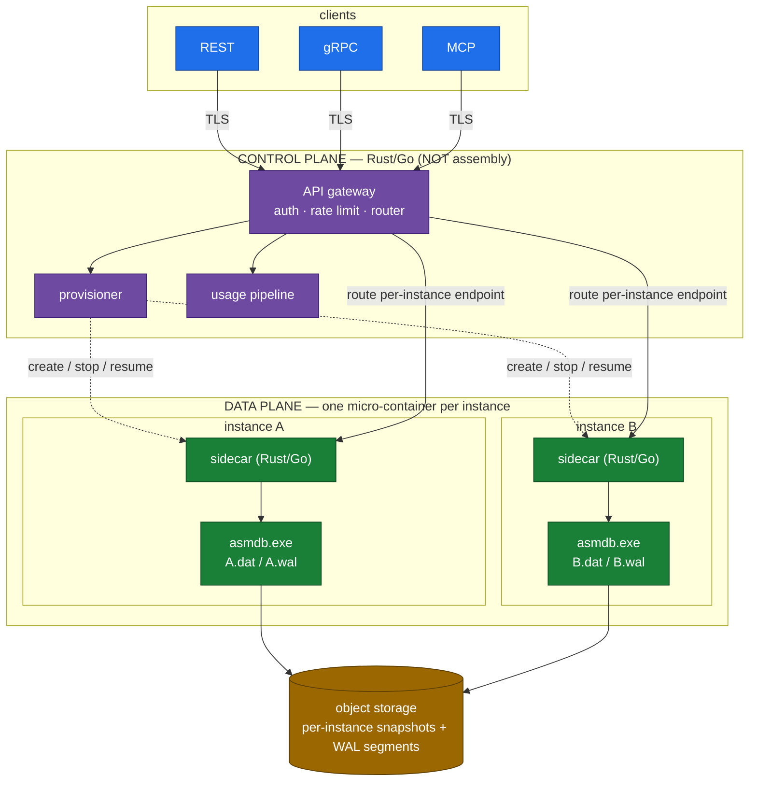
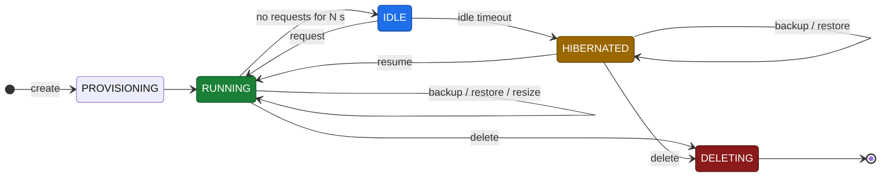

# asmdb Cloud — SaaS Productization Plan

> How we take **asmdb** — the x86-64 assembly transactional engine specified in
> [`ENGINE.md`](ENGINE.md) — and offer it as a **hosted, pay-as-you-go database
> service**.
>
> **Core architectural choice.** Every database instance created in the service
> runs in its **own isolated micro-container** (or micro-VM) with a **dedicated
> `asmdb.exe`** process, its own `.dat`/`.wal` files, and its own resource
> budget. One instance = one container = one engine = one WAL. There is no
> shared multi-tenant process; isolation is physical, and billing is per
> instance and per consumption.
>
> **Scope & separation of concerns.** The **engine stays 100% assembly** (its
> roadmap lives in [`ENGINE.md §12`](ENGINE.md#12-roadmap)). Everything in *this*
> document is the **service layer around** that engine — provisioning, the
> access/API layer, metering, billing, and operations. That layer is **not
> required to be assembly**; build it in whatever is safest and fastest to ship
> (Rust and Go are the leading candidates). The assembly engine is the **data
> plane**; everything here is the **control plane and edge**.

---

## Table of contents

1. [Product thesis](#1-product-thesis)
2. [Why one micro-container per instance](#2-why-one-micro-container-per-instance)
3. [Target users & example workloads](#3-target-users--example-workloads)
4. [High-level architecture](#4-high-level-architecture)
5. [Instance lifecycle](#5-instance-lifecycle)
6. [Isolation model](#6-isolation-model)
7. [Access layer & protocols](#7-access-layer--protocols)
8. [Consumption metering & billing](#8-consumption-metering--billing)
9. [Durability, backup & disaster recovery](#9-durability-backup--disaster-recovery)
10. [High availability & replication](#10-high-availability--replication)
11. [Security & compliance](#11-security--compliance)
12. [Observability & SRE](#12-observability--sre)
13. [Deployment & orchestration](#13-deployment--orchestration)
14. [Pricing & packaging](#14-pricing--packaging)
15. [Go-to-market roadmap](#15-go-to-market-roadmap)
16. [Risks & open questions](#16-risks--open-questions)

---

## 1. Product thesis

**asmdb Cloud** is a hosted transactional database you pay for by the drop.
You call an API to create a database; the service provisions a **dedicated
micro-container running the assembly engine**, hands you an endpoint and an API
key, and meters what you actually use — operations, stored bytes, and active
compute time. Idle instances **scale to zero** and cost almost nothing.

Why this can win:

- **The engine is tiny and starts instantly.** `asmdb.exe` is ~20 KB, has no
  runtime to warm up, and maps a single 1 GiB record region on boot — **sparse
  on disk**, so an empty or idle instance's data file costs only kilobytes. That
  makes **per-instance micro-containers** and **scale-to-zero** economically
  viable in a way a heavyweight DB image (hundreds of MB, slow warmup) is not — cold start
  is milliseconds, so we can hibernate idle databases and still feel "always on."
- **Cost per operation is dominated by a hash probe + a WAL append.** The engine
  spends almost nothing per op, so **pay-per-use** pricing can be aggressive and
  still carry margin.
- **Physical isolation is the simplest correct multi-tenancy.** One engine
  process per database means a tenant's blast radius is their own container;
  there is no shared-process leakage class to defend against.
- **One interface agents already speak.** The [MCP server](../mcp/README.md) is
  bundled, so the same instance is reachable as a generic CRUD store over HTTP
  or as a remote MCP endpoint — hosted agent memory is a turnkey example.

---

## 2. Why one micro-container per instance

The central design decision. Alternatives, and why per-instance isolation wins:

| Model | Isolation | Blast radius | Metering | Verdict |
|-------|-----------|--------------|----------|---------|
| Shared process, many tenants (namespaces) | logical only | whole process | hard to attribute | ❌ leakage risk, noisy neighbours |
| Shared host, process per tenant | OS process | one host | per process | ◐ better, weak resource limits |
| **Container per instance** | cgroups + namespaces | one container | clean per container | ✅ **default** |
| **micro-VM per instance** (Firecracker) | hardware-ish | one VM | clean per VM | ✅ **for stricter tenants** |

Because a database instance is *already* a single-writer engine over one WAL,
wrapping it in one container is a perfect fit: the unit of **isolation**, the
unit of **resource limits (CPU/mem/IO quota)**, the unit of **metering**, and
the unit of **backup/restore** are all the same thing — the instance. Scaling
the fleet is "run more containers"; the control plane never has to reason about
tenants sharing an engine.

The engine's small footprint is what makes this affordable: thousands of idle
instances can be **hibernated** (container paused or stopped, files at rest in
object storage) and **resumed on first request** in milliseconds, so we bill
compute only while an instance is actually serving.

> **Why the Linux build is the natural container image.** The engine ships a
> native **ELF64 binary** (~30 KB) that depends on nothing but the kernel — no
> libc, no runtime, no shared objects. It runs on a **`FROM scratch`** image
> that contains literally two files (the engine + the sidecar), so a per-instance
> container is a few tens of kilobytes, cold-starts in milliseconds, and has a
> near-zero attack surface. The identical source also builds a Windows PE for
> local development; production containers standardise on the Linux ELF.

---

## 3. Target users & example workloads

asmdb Cloud is a **general-purpose** small-transactional-database service. The
record shape (numeric `value`, timestamps, `tag`, free-text `content`, keyed by
`u64` id or hashed string key) suits many workloads:

| Workload | How it maps | Notes |
|----------|-------------|-------|
| Per-user / per-app **key–value + text** store | `id`/`key` → row, `content` → text, `value` → number | the bread-and-butter case |
| **Session / state** store for services | one instance per app, key by session id | scale-to-zero fits bursty traffic |
| **Event / audit tail** | append rows, `FIND` by substring | fixed-width rows, cheap writes |
| Edge / IoT **device registry** | `tag` = device class, `value` = status | tiny footprint per instance |
| **Agent long-term memory** *(one example)* | remote MCP endpoint; `key` = memory name, `tag` = namespace, `content` = remembered text | turnkey via the bundled MCP server |

**Agent memory is a first-class example, not the thesis.** Any workload that
wants a fast, durable, small transactional store with a dead-simple CRUD API is
the target.

---

## 4. High-level architecture



- **Control plane** (Rust/Go, stateless, horizontally scaled): API gateway (TLS,
  authn/z, rate limiting, routing), the **provisioner** (creates/stops/resumes/
  destroys instances and maps `instance_id → endpoint`), and the **usage
  pipeline** (collects metering events for billing). Metadata (instances, keys,
  placement) lives in a managed store (e.g. Postgres).
- **Data plane**: one **micro-container per database instance**. The image is a
  `FROM scratch` bundle of the **Linux ELF64 engine** (~30 KB, zero shared-library
  dependencies) plus a small **sidecar** (Rust/Go) that supervises the `asmdb`
  process, speaks the engine's protocol on one side and HTTP/gRPC/MCP on the
  other, ships WAL/snapshots to object storage, and emits per-op usage events.
- **Object storage** (S3 / Azure Blob / GCS): per-instance durability beyond the
  node — WAL segments + periodic snapshots, and the resting place for hibernated
  instances.

The engine is **unchanged** by all this; the service is built by *wrapping* one
engine process per instance (the same stdio contract the local MCP server
already uses — see [`ENGINE.md §11`](ENGINE.md#11-mcp-server--crud-interface)).

---

## 5. Instance lifecycle

An instance is the product's core object. Its states:



| Transition | What happens | Billing effect |
|------------|--------------|----------------|
| **Create** | provisioner allocates a container, initialises `<id>.dat`/`.wal`, registers the endpoint | storage starts |
| **Running → Idle** | no requests for *N* seconds | still warm, compute still billed |
| **Idle → Hibernated** | container stopped; files flushed to object storage | **compute billing stops**; storage continues |
| **Hibernated → Resume** | first request arrives; files pulled, `asmdb.exe` starts (ms), WAL recovered | compute resumes |
| **Resize** | change CPU/mem/quota tier, or capacity (rides engine dynamic-resize, v1.0) | tier change |
| **Backup / Restore** | snapshot to / from object storage; PITR via WAL replay | backup storage |
| **Delete** | container destroyed; files retained per retention policy then purged | billing stops |

Scale-to-zero is the economic heart: because the engine cold-starts in
milliseconds and recovers its WAL idempotently ([`ENGINE.md §7`](ENGINE.md#7-transactions-durability--crash-recovery)),
hibernating idle databases is cheap and invisible to the caller.

---

## 6. Isolation model

- **Compute & memory:** each instance is one container with cgroup CPU/memory
  limits and an IO budget; a runaway tenant can only starve *itself*.
- **Process:** exactly one `asmdb.exe` per instance — no shared engine, so there
  is no cross-tenant memory or file access by construction.
- **Storage:** each instance owns its `<id>.dat`/`<id>.wal` and its object-store
  prefix; encryption keys are per instance (see §11).
- **Network:** the gateway routes an authenticated request only to *its*
  instance's endpoint; instances have no lateral network path to each other.
- **Stronger tier — micro-VMs:** tenants needing hardware-grade isolation (or
  data residency) run each instance in a **Firecracker/Cloud-Hypervisor
  micro-VM** instead of a container, at higher cost.

Because isolation is physical and per instance, the control plane never enforces
tenant boundaries *inside* an engine — a whole class of multi-tenant bugs simply
does not exist here.

---

## 7. Access layer & protocols

Every instance is reachable through the gateway by three interchangeable
surfaces, all backed by the same engine verbs:

### 7.1 REST (default)

```
POST   /v1/db/{instance}/rows            {id|key, content?, tag?, value?, upsert?}
GET    /v1/db/{instance}/rows/{idOrKey}
GET    /v1/db/{instance}/rows?query=...            # substring search
GET    /v1/db/{instance}/rows                      # list (paginated)
DELETE /v1/db/{instance}/rows/{idOrKey}
GET    /v1/db/{instance}/count
POST   /v1/db/{instance}/tx                        # BEGIN…COMMIT batch
```

### 7.2 Remote MCP

MCP over **HTTP + SSE**, exposing the same seven CRUD tools as the local server
(`db_insert`/`db_get`/`db_find`/…). Point an agent at the instance URL + API key
and it has a durable cloud store — **hosted agent memory** is exactly this.

### 7.3 gRPC (high-throughput / server-to-server)

The same operations as a `.proto` service over HTTP/2 for callers issuing many
small ops.

> All three map onto the engine's REPL/CRUD verbs today; the **binary wire
> protocol** on the engine roadmap ([`ENGINE.md §12`](ENGINE.md#12-roadmap),
> v3.0) later lets the sidecar talk a length-prefixed socket protocol to the
> engine instead of parsing REPL lines — lower overhead, cleaner framing.

Keys map to the engine's `u64` id exactly as the MCP server does: pass an integer
`id`, or a string `key` the layer hashes with FNV-1a.

### 7.4 Connecting a web application (end-to-end)

The common case: **your web app's backend talks to asmdb over REST; the browser
never does.** An instance endpoint + API key is a server-side credential — treat
it like a database password. Your frontend calls *your* API; your API calls the
asmdb instance. This is the standard backend-for-frontend (BFF) pattern.

```mermaid
flowchart LR
    BROWSER["browser / SPA<br/>(no API key)"]
    APP["your web backend<br/>(Node / .NET / Go)<br/>holds ASMDB_API_KEY"]
    GW["asmdb Cloud gateway<br/>auth · rate limit · route"]
    SIDE["instance sidecar"]
    ENG["asmdb.exe<br/>&lt;instance&gt;.dat / .wal"]

    BROWSER -->|"HTTPS · your session cookie / JWT"| APP
    APP -->|"HTTPS · Bearer &lt;API key&gt;<br/>/v1/db/&#123;instance&#125;/rows"| GW
    GW -->|"routed to this tenant only"| SIDE
    SIDE -->|"stdin/stdout"| ENG
    ENG -.->|rows| SIDE
    SIDE -.-> GW
    GW -.-> APP
    APP -.->|"JSON your frontend needs"| BROWSER

    classDef edge fill:#1f6feb,stroke:#0b3d91,color:#fff
    classDef app fill:#6e4aa0,stroke:#3b1e75,color:#fff
    classDef ctrl fill:#b35900,stroke:#5a3d00,color:#fff
    classDef engine fill:#1a7f37,stroke:#0b4a20,color:#fff
    class BROWSER edge
    class APP app
    class GW,SIDE ctrl
    class ENG engine
```



**Steps**

1. **Provision** an instance (dashboard, CLI, or the provisioning API). You get
   back an **endpoint URL** (`https://api.asmdb.cloud/v1/db/{instance}`) and an
   **API key**.
2. **Store the key as a server secret** (env var / Key Vault / Secrets Manager) —
   never bundle it in frontend code or expose it to the browser.
3. **Call the REST API from your backend** with `Authorization: Bearer <key>`.
   Map your app's identifiers to a row `key` (hashed to the engine's `u64` id).

```js
// server-side only — the API key is a secret, never sent to the browser
const ASMDB = "https://api.asmdb.cloud/v1/db/inst_8f3c"; // your instance endpoint
const KEY   = process.env.ASMDB_API_KEY;                 // from your secret store
const H = { Authorization: `Bearer ${KEY}`, "Content-Type": "application/json" };

// CREATE / upsert a row
await fetch(`${ASMDB}/rows`, {
  method: "POST", headers: H,
  body: JSON.stringify({ key: "user:42:profile", tag: "profile",
                         content: "Ada Lovelace", value: 42, upsert: true }),
});

// READ one row
const row = await fetch(`${ASMDB}/rows/user:42:profile`, { headers: H })
                    .then(r => r.json());

// ATOMIC multi-row write (one BEGIN…COMMIT round-trip)
await fetch(`${ASMDB}/tx`, {
  method: "POST", headers: H,
  body: JSON.stringify({ ops: [
    { op: "insert", key: "order:1001", value: 5, content: "pending", upsert: true },
    { op: "update", key: "user:42:profile", content: "Ada L. (updated)" },
  ]}),
});
```

Wrap those calls behind your own routes so the browser only ever talks to your
app (which enforces *its* user auth before touching the shared instance key):

```js
// Express BFF route: browser -> your API -> asmdb instance
app.get("/api/profile/:uid", requireLogin, async (req, res) => {
  const row = await fetch(`${ASMDB}/rows/user:${req.params.uid}:profile`,
                          { headers: H }).then(r => r.json());
  res.json(row);            // return only what the frontend needs
});
```

**Operational notes**

- **Multi-tenant apps:** run **one instance per tenant** (clean isolation and
  metering) and have your backend select the right endpoint + key per request,
  or a single shared instance keyed by `tenant:<id>:...` when isolation is not
  required.
- **Scale-to-zero cold starts:** the first request after **hibernation** wakes
  the container (WAL-recovered in ms). Use a short **retry with backoff** on the
  initial call so a resume is invisible to users.
- **Reuse connections:** keep HTTP keep-alive on (a pooled `fetch`/`HttpClient`);
  the sidecar keeps one warm engine process, so back-to-back ops are in-memory
  hash lookups plus a small durable write.
- **Idempotency:** `upsert: true` makes writes safe to retry; wrap related
  writes in `/tx` so a partial failure rolls back.
- **Pagination:** `GET /rows` is paginated (cursor/limit) — stream large lists
  rather than materialising them in the browser.
- **On-box equivalent:** the bundled [`clients/`](../clients) (Python · C# · C)
  show the same verbs over local stdio; first-party **HTTP SDKs** are on the
  [roadmap](#15-go-to-market-roadmap). Until then the REST surface above is the
  stable contract.

---

## 8. Consumption metering & billing

Pay-as-you-go, metered **per instance** at the gateway + sidecar (never in the
engine hot path). Billable dimensions:

| Dimension | Unit | Notes |
|-----------|------|-------|
| **Operations** | per 1M CRUD ops | insert/update/get/delete/find/list/count |
| **Compute** | vCPU-second (or active instance-second) | billed only while RUNNING/IDLE, **not** while HIBERNATED |
| **Storage** | GB-month of live `.dat`/`.wal` | the region is compact and predictable |
| **Backups** | GB-month of snapshots + WAL history | retention-dependent |
| **Egress** | GB out | inbound free |

- The sidecar emits one usage event per op (`instance`, `op`, `bytes`, `ts`) to a
  durable stream (Kafka/Kinesis → warehouse); billing and quotas derive from it.
- **Quotas & rate limits** are enforced at the gateway per API key (ops/sec,
  concurrent connections, max rows/bytes). Hitting the per-instance capacity
  (`2^22` slots today) triggers a **resize** (engine v1.0 dynamic resize) or an
  upsell.
- **Free tier** leans entirely on scale-to-zero: a hibernated instance costs
  only its (tiny) storage, so a generous free allowance is affordable.

---

## 9. Durability, backup & disaster recovery

The engine gives **in-instance** durability (WAL + crash recovery). The service
adds **beyond-the-container** durability, per instance:

- **WAL shipping:** the sidecar streams committed WAL segments to the instance's
  object-store prefix continuously (RPO = shipping interval, seconds).
- **Snapshots:** periodic full `<id>.dat` snapshots (one contiguous region, cheap)
  as a recovery base so WAL replay stays bounded — and the artifact a hibernated
  instance rests as.
- **Point-in-time restore:** snapshot + WAL replay to a timestamp; trivially
  clean because each instance is its own engine + WAL.
- **Portable export / GDPR erasure:** a tenant's export is literally their
  `.dat` + WAL tail; deletion is dropping their prefix.

RPO/RTO by tier: free = best-effort daily snapshot; standard = ≤60 s RPO via WAL
shipping; premium = ≤5 s RPO + warm replica (§10).

---

## 10. High availability & replication

- **Per-instance primary/replica via WAL streaming.** The instance's engine is
  the single writer; the sidecar streams its WAL to one or more replica
  containers that apply the same idempotent redo path used at recovery. Reads
  (`db_get`/`db_find`) can be served from a replica for HA/read-scaling.
- **Failover:** if a primary container/node dies, the control plane promotes a
  caught-up replica (metadata flip) and fences the old primary. Single-writer
  per instance makes promotion simple — no consensus on the data path.
- **Multi-writer is out of scope for the engine.** Scaling a single hot database
  beyond one writer is handled by **partitioning** (engine v3.0) into multiple
  instances/shards, not by making the engine multi-writer. Consensus (if any)
  guards only *placement metadata*, never the data path.

---

## 11. Security & compliance

- **In transit:** TLS 1.3 at the gateway; mTLS for gRPC/VPC customers.
- **At rest:** the sidecar / volume layer encrypts `.dat`/WAL and object-store
  objects with **per-instance data keys** via KMS (envelope encryption) — keeping
  crypto *out of the assembly hot path* while meeting at-rest requirements.
- **Isolation:** physical, per instance (§6) — the strongest and simplest story.
- **AuthN/Z:** API keys (hashed, revocable, scoped read/read-write) for the simple
  case; JWT/OIDC (bring-your-own IdP) for enterprises. The gateway resolves
  token → instance → scope *before* any request reaches an engine; the engine
  never sees credentials.
- **Audit logs:** every control-plane action (auth, provisioning, CRUD summaries)
  logged immutably per instance, exportable for SOC 2 / ISO 27001.
- **Compliance path:** SOC 2 Type II first, then ISO 27001; GDPR/CCPA export &
  erasure are natural per-instance; **data residency** via region-pinned
  instances (containers or micro-VMs).

---

## 12. Observability & SRE

- **Metrics:** per-instance ops/sec, p50/p99 latency, error rate, capacity fill %,
  WAL lag, checkpoint duration, hibernate/resume counts; per-node CPU/mem/disk.
  Prometheus + Grafana.
- **Tracing:** OpenTelemetry spans gateway → sidecar → engine op, so a slow
  `db_get` is attributable to an instance and node.
- **Logging:** structured logs at gateway + sidecar; the engine's stdout is
  captured by the sidecar and surfaced as structured events.
- **SLOs:** e.g. 99.9% standard / 99.95% premium; p99 `db_get` < 10 ms
  same-region (warm). Error budgets drive release pace.
- **Runbooks & alerts:** capacity-near-limit, WAL-lag-high, replica-behind,
  resume-storm, node-down → paged with documented recovery (promote replica,
  restore snapshot+WAL, resize).

---

## 13. Deployment & orchestration

- **Packaging:** engine binary + sidecar in one small container image; instance
  data on fast local NVMe, replicated to object storage.
- **Orchestration:** Kubernetes. Instances are **stateful** → one pod (or a
  micro-VM via Kata/Firecracker) per instance with a persistent volume, managed
  by a custom **operator** that handles create/hibernate/resume/resize/failover
  and `instance_id → endpoint` mapping. Control plane is **stateless** →
  `Deployment`s behind an ingress/LB.
- **Scale-to-zero:** the operator stops idle instance pods and resumes them on a
  gateway "wake" signal; the engine's ms cold-start makes this transparent.
- **Regions:** start single-region multi-AZ; add regions for latency + residency;
  object-storage replication for cross-region DR.
- **Windows vs Linux:** the engine is Win32/PE today, so instances run on Windows
  nodes initially. The **Linux syscall port** on the engine roadmap
  ([`ENGINE.md §12`](ENGINE.md#12-roadmap), v3.0) unlocks cheaper Linux container
  fleets and Firecracker micro-VMs; the control plane already runs anywhere.

---

## 14. Pricing & packaging

Consumption-based, with tiers layered on the same per-instance engine:

| Tier | Isolation | Compute | Durability/HA | Price model |
|------|-----------|---------|---------------|-------------|
| **Free** | container, scale-to-zero | hibernated when idle | daily snapshot | $0 up to small ops/storage cap |
| **Standard** | container | scale-to-zero + burst | ≤60 s RPO WAL shipping | pay-as-you-go: per-1M ops + vCPU-s + GB-month |
| **Premium** | container | reserved / always-warm | read replica, ≤5 s RPO | usage + reserved capacity |
| **Enterprise** | Firecracker micro-VM, dedicated nodes | reserved | warm standby, residency, SSO, audit export | annual contract + usage |

**Cost narrative.** A fixed 256-byte record + one hash probe + one WAL append
per op means **predictable, low unit cost**, and scale-to-zero means idle
databases are nearly free — so pay-as-you-go can undercut always-on managed
Postgres/Redis for small transactional workloads while keeping margin. Ground
any latency/throughput marketing in the honest
[README benchmark](../README.md#performance) numbers; don't over-promise the
bulk-durable path until incremental checkpoint (engine v1.0) lands.

---

## 15. Go-to-market roadmap

Phased so each stage ships independent value; **none require changing the
engine's assembly**, though some ride engine roadmap items.

### Phase 0 — Provisioned instances MVP (single region)
- Provisioner + operator that creates **one container per instance** with the
  existing stdio sidecar; REST API + API keys.
- Object-storage snapshots (basic durability). Best-effort SLA.
- **Goal:** `POST /v1/db` returns a live endpoint you can CRUD against.

### Phase 1 — Consumption billing & scale-to-zero
- Metering pipeline + pay-as-you-go billing (ops + compute + storage).
- Hibernate/resume (scale-to-zero); quotas & rate limits; dashboards.
- Remote **MCP** endpoint (hosted agent-memory example) + REST SDKs.
- **Goal:** first paying customers; idle instances cost ~nothing.

### Phase 2 — Durability, HA & scale
- WAL shipping (≤60 s RPO), read replicas + failover, PITR.
- Instance resize (rides engine v1.0 dynamic resize); gRPC surface.
- **Goal:** 99.9% SLA, production-grade.

### Phase 3 — Enterprise & compliance
- Firecracker micro-VM tier, VPC peering, SSO/OIDC, audit export, residency.
- SOC 2 Type II, then ISO 27001; per-instance KMS encryption.
- Multi-region DR.
- **Goal:** land enterprise workloads.

### Phase 4 — Performance edge as a feature
- Adopt engine wins (binary wire protocol, SIMD scans, incremental checkpoint,
  Linux port → cheaper Firecracker fleets) to publish credible "fastest/cheapest
  small transactional DB" benchmarks.
- **Goal:** turn the assembly core into a defensible cost/performance story.

---

## 16. Risks & open questions

- **Windows-only engine** raises fleet cost and blocks Firecracker until the
  Linux port lands. Open question: prioritise the Linux port vs run Windows
  nodes for the data plane initially.
- **Single-writer per instance** caps one database's write throughput to one
  engine. Mitigation: partition a hot workload across instances (engine v3.0).
  Open question: expose sharding to users or keep it internal.
- **Fixed capacity per instance** (`2^22` slots) means we must resize or shard
  before the hash table saturates (load factor 0.75). Needs a capacity watchdog
  + engine dynamic resize (v1.0).
- **Resume latency under load** (thundering-herd wake of many hibernated
  instances) needs admission control and pre-warming heuristics.
- **At-rest encryption** is a sidecar/volume responsibility today; some buyers
  may want engine-level field encryption (an optional AES page path in assembly,
  later — not required).
- **Benchmark honesty:** the bulk-durable path currently trails SQLite; don't
  build pricing/marketing on numbers the incremental-checkpoint work hasn't
  delivered yet.

---

> **Remember the split:** the [engine](ENGINE.md) is the assembly heart and its
> roadmap is engine-only; **this** document is the product wrapper (per-instance
> micro-containers, pay-as-you-go) and may use any technology. Keep new work in
> the correct lane.
