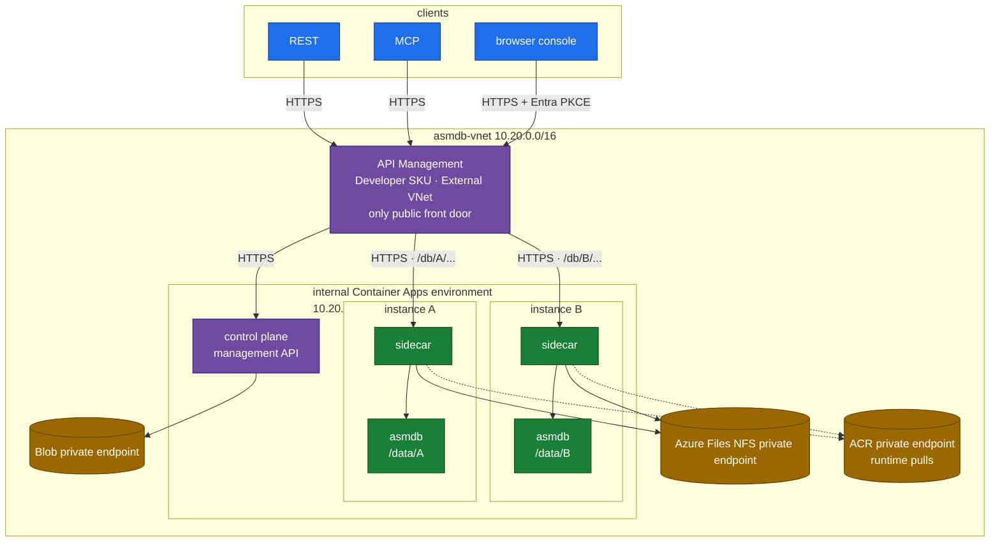
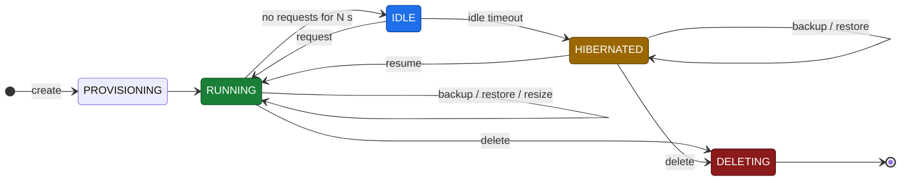
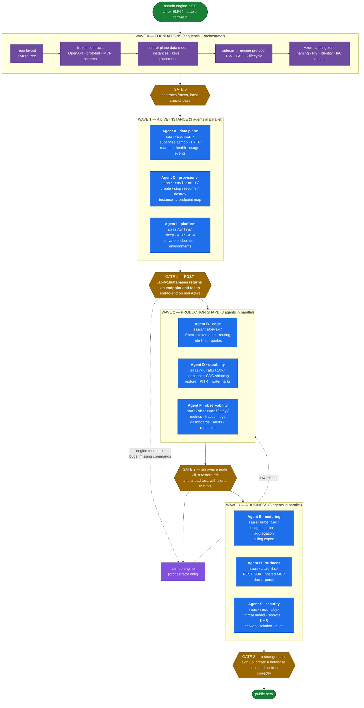

# asmdb Cloud — SaaS Productization Plan

> How we take **asmdb** — the x86-64 assembly transactional engine specified in
> [`ENGINE.md`](ENGINE.md) — and offer it as a **hosted, pay-as-you-go database
> service**.
>
> **Core architectural choice.** Every database instance created in the service
> runs in its **own isolated micro-container** (or micro-VM) with a **dedicated
> `asmdb.exe`** process, its own `.dat`/`.wal` files, and its own resource
> budget. One instance = one container = one engine = one WAL. There is no
> shared multi-tenant process; isolation is physical, and billing is per
> instance and per consumption.
>
> **Scope & separation of concerns.** The **engine stays 100% assembly** (its
> roadmap lives in [`ENGINE.md §12`](ENGINE.md#12-roadmap)). Everything in *this*
> document is the **service layer around** that engine — provisioning, the
> access/API layer, metering, billing, and operations. That layer is **not
> required to be assembly**; build it in whatever is safest and fastest to ship
> (Rust and Go are the leading candidates). The assembly engine is the **data
> plane**; everything here is the **control plane and edge**.

---

## 0. Engine envelope — the constraints every design here inherits

Nothing in this plan can loosen these. They are compiled into the engine, not
configured, and they are what a tenant actually buys.

<p align="center">
  
</p>

| Dimension | Hard limit | What it means for the service |
|---|---|---|
| Rows per database | 4 194 304 slots, comfortable to ~3.1 M | **A database *is* a table** - one file, one table, no catalogue. So the unit of scale is the instance, and a tenant outgrowing 3 M rows needs a second instance and a routing key, not a bigger box. |
| Row shape | 256 bytes, seven fixed columns | No per-tenant schema. The product sells a **typed key/value/tag/text row**, and anything richer is encoded by the client. |
| `tag` | 39 bytes | Usable as a namespace/partition marker; too small for arbitrary metadata. |
| `content` | 175 bytes | **The single biggest product constraint.** Documents, embeddings and blobs do not fit; they live elsewhere and the row holds a reference. |
| `value` | one `i64` | The only numeric column, and the only one `RANGE` can filter on. |
| Rows per transaction | 4 096 distinct | Bulk import must be batched. The API layer has to chunk, not stream, writes. |
| Disk per database | ~1 GiB sparse `.dat`, plus `.wal` and `.cdc` | Storage billing is driven by the **change log**, which grows without bound, far more than by the table. |
| Concurrency | one writer, unlimited `--reader` | A natural read-replica story with no work; a **write-scaling story that does not exist yet** (MVCC is roadmap). |
| Absent from the engine | no SQL, no joins, no planner, no secondary indexes, no auth, no encryption, no audit log | Every one of these is the service layer's job, or is not sold. |

Four consequences worth stating plainly before designing anything:

1. **`FIND` and `RANGE` are full scans** of 4 194 304 slots. They are fine at
   human scale and unacceptable as a public API on a hot path. The service must
   either bound them, cache them, or maintain its own index outside the engine.
2. **The change log's retention is manual.** `<db>.cdc` grows for the life of
   the instance unless something calls `CDCTRIM`, and it is re-read in full at
   every start. Deciding *when* to trim needs to know what consumers have
   acknowledged, which only the control plane knows — so it owns the policy.
3. **No transaction spans two entities.** Since a database is a single table,
   `BEGIN`/`COMMIT` is atomic over one table only. A tenant with users *and*
   orders has two instances, and keeping them consistent is a saga or a
   coordinator in the control plane — a decision to take early, not after.
4. **Security is entirely the service layer's.** The engine has no notion of a
   user. See [`SECURITY.md`](SECURITY.md) for the engine's actual threat
   model — it is short, and that is the point.

---

## Table of contents

1. [Product thesis](#1-product-thesis)
2. [Why one micro-container per instance](#2-why-one-micro-container-per-instance)
3. [Target users & example workloads](#3-target-users--example-workloads)
4. [High-level architecture](#4-high-level-architecture)
5. [Instance lifecycle](#5-instance-lifecycle)
6. [Isolation model](#6-isolation-model)
7. [Access layer & protocols](#7-access-layer--protocols)
8. [Consumption metering & billing](#8-consumption-metering--billing)
9. [Durability, backup & disaster recovery](#9-durability-backup--disaster-recovery)
10. [High availability & replication](#10-high-availability--replication)
11. [Security & compliance](#11-security--compliance)
12. [Observability & SRE](#12-observability--sre)
13. [Deployment & orchestration](#13-deployment--orchestration)
14. [Pricing & packaging](#14-pricing--packaging)
15. [Go-to-market roadmap](#15-go-to-market-roadmap)
16. [Risks & open questions](#16-risks--open-questions)
17. [**Development plan — how we actually build this**](#17-development-plan--how-we-actually-build-this) ⬅ *the execution plan: work breakdown, parallel agent streams, gates*

---

## 1. Product thesis

**asmdb Cloud** is a hosted transactional database you pay for by the drop.
You call an API to create a database; the service provisions a **dedicated
micro-container running the assembly engine**, hands you an endpoint and an
instance access token, and meters what you actually use — operations, stored bytes, and active
compute time. Idle instances **scale to zero** and cost almost nothing.

Why this can win:

- **The engine is tiny and starts instantly.** `asmdb` is ~40 KB, has no
  runtime to warm up, and maps its record region **copy-on-write** from a
  **sparse** file — so an idle instance's data file costs kilobytes on disk
  *and* its process costs a few MB of RAM rather than a gigabyte. Measured on a
  1 000 000-row database: **~5 MB peak working set, ~80 ms to open**, whatever
  the database contains. That is the number the whole model rests on — it is
  what lets a host carry **hundreds of live instances** instead of one per
  gigabyte, and it makes **per-instance micro-containers** with
  **scale-to-zero** economically viable in a way a heavyweight DB image
  (hundreds of MB, slow warmup) is not. Cold start is milliseconds, so we can
  hibernate idle databases and still feel "always on."
- **Cost per operation is dominated by a hash probe + a WAL append.** The engine
  spends almost nothing per op, so **pay-per-use** pricing can be aggressive and
  still carry margin.
- **Physical isolation is the simplest correct multi-tenancy.** One engine
  process per database means a tenant's blast radius is their own container;
  there is no shared-process leakage class to defend against.
- **One interface agents already speak.** The [MCP server](../mcp/README.md) is
  bundled, so the same instance is reachable as a generic CRUD store over HTTP
  or as a remote MCP endpoint — hosted agent memory is a turnkey example.

---

## 2. Why one micro-container per instance

The central design decision. Alternatives, and why per-instance isolation wins:

| Model | Isolation | Blast radius | Metering | Verdict |
|-------|-----------|--------------|----------|---------|
| Shared process, many tenants (namespaces) | logical only | whole process | hard to attribute | ❌ leakage risk, noisy neighbours |
| Shared host, process per tenant | OS process | one host | per process | ◐ better, weak resource limits |
| **Container per instance** | cgroups + namespaces | one container | clean per container | ✅ **default** |
| **micro-VM per instance** (Firecracker) | hardware-ish | one VM | clean per VM | ✅ **for stricter tenants** |

Because a database instance is *already* a single-writer engine over one WAL,
wrapping it in one container is a perfect fit: the unit of **isolation**, the
unit of **resource limits (CPU/mem/IO quota)**, the unit of **metering**, and
the unit of **backup/restore** are all the same thing — the instance. Scaling
the fleet is "run more containers"; the control plane never has to reason about
tenants sharing an engine.

The engine's small footprint is what makes this affordable: thousands of idle
instances can be **hibernated** (container paused or stopped, files at rest in
object storage) and **resumed on first request** in milliseconds, so we bill
compute only while an instance is actually serving.

> **Why the Linux build is the natural container image.** The engine ships a
> native **ELF64 binary** (~48 KB) that depends on nothing but the kernel — no
> libc, no runtime, no shared objects. It runs on a **`FROM scratch`** image
> that contains literally two files (the engine + the sidecar), so a per-instance
> container is a few tens of kilobytes, cold-starts in milliseconds, and has a
> near-zero attack surface. The identical source also builds a Windows PE for
> local development; production containers standardise on the Linux ELF.

---

## 3. Target users & example workloads

asmdb Cloud is a **general-purpose** small-transactional-database service. The
record shape (numeric `value`, timestamps, `tag`, free-text `content`, keyed by
`u64` id or hashed string key) suits many workloads:

| Workload | How it maps | Notes |
|----------|-------------|-------|
| Per-user / per-app **key–value + text** store | `id`/`key` → row, `content` → text, `value` → number | the bread-and-butter case |
| **Session / state** store for services | one instance per app, key by session id | scale-to-zero fits bursty traffic |
| **Event / audit tail** | append rows, `FIND` by substring | fixed-width rows, cheap writes |
| Edge / IoT **device registry** | `tag` = device class, `value` = status | tiny footprint per instance |
| **Agent long-term memory** *(one example)* | remote MCP endpoint; `key` = memory name, `tag` = namespace, `content` = remembered text | turnkey via the bundled MCP server |

**Agent memory is a first-class example, not the thesis.** Any workload that
wants a fast, durable, small transactional store with a dead-simple CRUD API is
the target.

---

## 4. High-level architecture



- **Public edge:** API Management is the only public front door. Instance
  Container Apps are internal; their domain does not resolve from the public
  internet.
- **Control plane:** the management API creates, lists, deletes and rotates
  database tokens. It accepts Microsoft Entra ID v2 access tokens only, verifies
  them against the tenant JWKS, and requires membership in the `ASMDB_ADMIN`
  security group.
- **Data plane:** one **micro-container per database instance**. The image
  contains the Linux ELF64 engine and a small sidecar that supervises it,
  translates HTTP/MCP calls into the engine protocol and mounts the instance's
  `/data` directory.
- **Private storage:** Blob, Azure Files NFS and ACR each have a private
  endpoint and linked private DNS zone. Blob public access is disabled and
  shared-key auth is disabled; NFS carries no account key. ACR is the explicit
  exception: public network access remains enabled for ACR Tasks from a
  workstation, while runtime pulls use the private endpoint.

The engine is **unchanged** by all this; the service is built by *wrapping* one
engine process per instance (the same stdio contract the local MCP server
already uses — see [`ENGINE.md §11`](ENGINE.md#11-mcp-server--crud-interface)).

---

## 5. Instance lifecycle

An instance is the product's core object. Its states:



| Transition | What happens | Billing effect |
|------------|--------------|----------------|
| **Create** | control plane allocates a Container App, mounts `/data` at the instance-id sub-path, initialises `<id>.dat`/`.wal`, and returns the endpoint plus instance token once | storage starts |
| **Running → Idle** | no requests for *N* seconds | still warm, compute still billed |
| **Idle → Hibernated** | container stopped; files remain on the durable NFS volume | **compute billing stops**; storage continues |
| **Hibernated → Resume** | first request arrives; `asmdb` starts against the mounted volume and recovers its WAL | compute resumes |
| **Resize** | change CPU/mem/quota tier, or capacity (rides engine dynamic-resize, v1.0) | tier change |
| **Backup / Restore** | snapshot to / from object storage; PITR via WAL replay | backup storage |
| **Delete** | container destroyed; files retained per retention policy then purged | billing stops |

Scale-to-zero is the economic heart: because the engine cold-starts in
milliseconds and recovers its WAL idempotently ([`ENGINE.md §7`](ENGINE.md#7-transactions-durability--crash-recovery)),
hibernating idle databases is cheap and invisible to the caller.

The control plane refuses to start an instance if the durable volume is not
configured. A Container App's own filesystem is discarded on restart and on
scale-to-zero; running without `/data` would make a database disappear the first
time it went idle.

---

## 6. Isolation model

- **Compute & memory:** each instance is one container with cgroup CPU/memory
  limits and an IO budget; a runaway tenant can only starve *itself*.
- **Process:** exactly one `asmdb` process per instance — no shared engine, so there
  is no cross-tenant memory or file access by construction.
- **Storage:** one Azure Files NFS 4.1 share serves the platform, but the mount
  sub-path is the instance id. Each database owns one directory under `/data`
  and cannot see another's.
- **Network:** the gateway routes an authenticated request only to *its*
  instance path. The Container Apps environment is internal, so instances are
  not directly reachable from the internet.
- **Replica count:** `maxReplicas` is `1` on every tier and is not negotiable.
  The engine is a single-writer process holding an exclusive lock; a second
  replica is not extra capacity, it is another process that cannot safely open
  the same database.

Because isolation is physical and per instance, the control plane never enforces
tenant boundaries *inside* an engine — a whole class of multi-tenant bugs simply
does not exist here.

---

## 7. Access layer & protocols

Every instance is reached through the public gateway by a path prefix. Use
`https://<gateway-host>` as a placeholder until the final hostname is assigned.
Everything after `/db/<instance>` is forwarded verbatim, so the routes in
`saas/contracts/CONTRACTS.md` §3 are unchanged except for the prefix.

### 7.1 REST (default)

```
POST   /db/{instance}/v1/rows            {id|key, content?, tag?, value?, upsert?}
GET    /db/{instance}/v1/rows/{idOrKey}
GET    /db/{instance}/v1/rows?query=...            # substring search
GET    /db/{instance}/v1/rows                      # list (paginated)
DELETE /db/{instance}/v1/rows/{idOrKey}
GET    /db/{instance}/v1/count
POST   /db/{instance}/v1/tx                        # BEGIN…COMMIT batch
```

### 7.2 Remote MCP

MCP is exposed at `/db/{instance}/mcp`, with the same generic CRUD tools as the
local server (`db_insert`/`db_get`/`db_find`/…). Point an agent at the instance
URL plus the instance access token and it has a durable cloud store — **hosted
agent memory** is exactly this.

### 7.3 Health

Health is exposed at `/db/{instance}/health`.

> These surfaces map onto the engine's REPL/CRUD verbs today; the **binary wire
> protocol** on the engine roadmap ([`ENGINE.md §12`](ENGINE.md#12-roadmap),
> v3.0) later lets the sidecar talk a length-prefixed socket protocol to the
> engine instead of parsing REPL lines — lower overhead, cleaner framing.

Keys map to the engine's `u64` id exactly as the MCP server does: pass an integer
`id`, or a string `key` the layer hashes with FNV-1a.

### 7.4 Connecting a web application (end-to-end)

The common case: **your web app's backend talks to asmdb over REST; the browser
never does.** An instance endpoint + access token is a server-side credential —
treat it like a database password. Your frontend calls *your* API; your API calls the
asmdb instance. This is the standard backend-for-frontend (BFF) pattern.

```mermaid
flowchart LR
    BROWSER["browser / SPA<br/>(no instance token)"]
    APP["your web backend<br/>(Node / .NET / Go)<br/>holds ASMDB_TOKEN"]
    GW["asmdb Cloud gateway<br/>auth · rate limit · route"]
    SIDE["instance sidecar"]
    ENG["asmdb<br/>&lt;instance&gt;.dat / .wal"]

    BROWSER -->|"HTTPS · your session cookie / JWT"| APP
    APP -->|"HTTPS · bearer token<br/>/db/&#123;instance&#125;/v1/rows"| GW
    GW -->|"routed to this tenant only"| SIDE
    SIDE -->|"stdin/stdout"| ENG
    ENG -.->|rows| SIDE
    SIDE -.-> GW
    GW -.-> APP
    APP -.->|"JSON your frontend needs"| BROWSER

    classDef edge fill:#1f6feb,stroke:#0b3d91,color:#fff
    classDef app fill:#6e4aa0,stroke:#3b1e75,color:#fff
    classDef ctrl fill:#b35900,stroke:#5a3d00,color:#fff
    classDef engine fill:#1a7f37,stroke:#0b4a20,color:#fff
    class BROWSER edge
    class APP app
    class GW,SIDE ctrl
    class ENG engine
```



**Steps**

1. **Provision** an instance (dashboard, CLI, or the provisioning API). You get
   back an **endpoint URL** (`https://<gateway-host>/db/{instance}`) and an
   **instance access token**. They are shown together once.
2. **Store the token as a server secret** (env var / Key Vault / Secrets Manager) —
   never bundle it in frontend code or expose it to the browser.
3. **Call the REST API from your backend** with `Authorization: Bearer <token>`.
   Map your app's identifiers to a row `key` (hashed to the engine's `u64` id).

```js
// server-side only — the token is a secret, never sent to the browser
const ASMDB = "https://<gateway-host>/db/inst_8f3c/v1"; // your instance endpoint
const TOKEN = process.env.ASMDB_TOKEN;                  // from your secret store
const H = { Authorization: `Bearer ${TOKEN}`, "Content-Type": "application/json" };

// CREATE / upsert a row
await fetch(`${ASMDB}/rows`, {
  method: "POST", headers: H,
  body: JSON.stringify({ key: "user:42:profile", tag: "profile",
                         content: "Ada Lovelace", value: 42, upsert: true }),
});

// READ one row
const row = await fetch(`${ASMDB}/rows/user:42:profile`, { headers: H })
                    .then(r => r.json());

// ATOMIC multi-row write (one BEGIN…COMMIT round-trip)
await fetch(`${ASMDB}/tx`, {
  method: "POST", headers: H,
  body: JSON.stringify({ ops: [
    { op: "insert", key: "order:1001", value: 5, content: "pending", upsert: true },
    { op: "update", key: "user:42:profile", content: "Ada L. (updated)" },
  ]}),
});
```

Wrap those calls behind your own routes so the browser only ever talks to your
app (which enforces *its* user auth before touching the instance token):

```js
// Express BFF route: browser -> your API -> asmdb instance
app.get("/api/profile/:uid", requireLogin, async (req, res) => {
  const row = await fetch(`${ASMDB}/rows/user:${req.params.uid}:profile`,
                          { headers: H }).then(r => r.json());
  res.json(row);            // return only what the frontend needs
});
```

**Operational notes**

- **Multi-tenant apps:** run **one instance per tenant** (clean isolation and
  metering) and have your backend select the right endpoint + token per request,
  or a single shared instance keyed by `tenant:<id>:...` when isolation is not
  required.
- **Scale-to-zero cold starts:** the first request after **hibernation** wakes
  the container (WAL-recovered in ms). Use a short **retry with backoff** on the
  initial call so a resume is invisible to users.
- **Reuse connections:** keep HTTP keep-alive on (a pooled `fetch`/`HttpClient`);
  the sidecar keeps one warm engine process, so back-to-back ops are in-memory
  hash lookups plus a small durable write.
- **Idempotency:** `upsert: true` makes writes safe to retry; wrap related
  writes in `/tx` so a partial failure rolls back.
- **Pagination:** `GET /rows` is paginated (cursor/limit) — stream large lists
  rather than materialising them in the browser.
- **On-box equivalent:** the bundled [`clients/`](../clients) (Python · C# · C)
  show the same verbs over local stdio; first-party **HTTP SDKs** are on the
  [roadmap](#15-go-to-market-roadmap). Until then the REST surface above is the
  stable contract.

---

## 8. Consumption metering & billing

Pay-as-you-go, metered **per instance** at the gateway + sidecar (never in the
engine hot path). Billable dimensions:

| Dimension | Unit | Notes |
|-----------|------|-------|
| **Operations** | per 1M CRUD ops | insert/update/get/delete/find/list/count |
| **Compute** | vCPU-second (or active instance-second) | billed only while RUNNING/IDLE, **not** while HIBERNATED |
| **Storage** | GB-month of live `.dat`/`.wal` | the region is compact and predictable |
| **Backups** | GB-month of snapshots + WAL history | retention-dependent |
| **Egress** | GB out | inbound free |

- The sidecar emits one usage event per op (`instance`, `op`, `bytes`, `ts`) to a
  durable stream (Kafka/Kinesis → warehouse); billing and quotas derive from it.
- **Quotas & rate limits** are enforced at the gateway per instance token (ops/sec,
  concurrent connections, max rows/bytes). Hitting the per-instance capacity
  (`2^22` slots today) triggers a **resize** (engine v1.0 dynamic resize) or an
  upsell.
- **Free tier** leans entirely on scale-to-zero: a hibernated instance costs
  only its (tiny) storage, so a generous free allowance is affordable.

---

## 9. Durability, backup & disaster recovery

The engine gives **in-instance** durability (WAL + crash recovery). The service
adds **beyond-the-container** durability, per instance:

- **WAL shipping:** the sidecar streams committed WAL segments to the instance's
  object-store prefix continuously (RPO = shipping interval, seconds).
- **Snapshots:** periodic full `<id>.dat` snapshots (one contiguous region, cheap)
  as a recovery base so WAL replay stays bounded — and the artifact a hibernated
  instance rests as.
- **Point-in-time restore:** snapshot + WAL replay to a timestamp; trivially
  clean because each instance is its own engine + WAL.
- **Portable export / GDPR erasure:** a tenant's export is literally their
  `.dat` + WAL tail; deletion is dropping their prefix.

The deployed platform stores live instance files on the `/data` durable volume,
backed by Azure Files NFS. Blob is used by the control plane through managed
identity; public Blob access and shared-key access are disabled.

---

## 10. High availability & replication

The deployed service does **not** run read replicas for an instance. Every tier
sets `maxReplicas` to `1` because the engine is a single-writer process holding
an exclusive lock on its database. A second Container Apps replica is not extra
capacity; it is another engine process that cannot safely open the same files
until the first one releases them.

Scale is therefore instance-level: create more databases and route by tenant,
entity or shard key. Multi-writer inside one database remains an engine roadmap
item, not a platform feature.

---

## 11. Security & compliance

- **In transit:** the public gateway is HTTPS-only and forwards to the control
  plane over HTTPS. Container Apps ingress redirects HTTP to HTTPS by default
  because `allowInsecure` is not set. There is no plaintext hop in the request
  path.
- **Network:** API Management is the only public front door. The Container Apps
  environment is internal, and Blob, NFS and ACR runtime pulls use private
  endpoints.
- **Management authentication:** create/list/delete/rotate operations require a
  Microsoft Entra ID v2 access token. The server verifies signature, issuer,
  audience and expiry against the tenant JWKS, then requires the `groups` claim
  to contain the object id of `ASMDB_ADMIN`. A valid token outside the group is
  `403`, not `401`.
- **Browser authentication:** the console uses authorization-code with PKCE.
  There is no client secret in the repository, image or app settings.
- **Data-plane authentication:** each database has an opaque instance access
  token, returned once at creation, stored only as a hash and compared in
  constant time. Rotation is an Entra-authenticated management operation and
  restarts the instance, so connections are briefly interrupted.
- **Storage keys:** Blob has `allowSharedKeyAccess: false` and the control plane
  uses managed identity. Azure Files NFS has no account key in the mount path;
  reachability inside the VNet is the authorisation boundary.
- **Engine boundary:** the engine still has no auth, encryption or audit log.
  Those are platform controls around the engine, not features inside it. See
  [`SECURITY.md`](SECURITY.md).

---

## 12. Observability & SRE

- **Metrics:** per-instance ops/sec, p50/p99 latency, error rate, capacity fill %,
  WAL lag, checkpoint duration, hibernate/resume counts; per-node CPU/mem/disk.
  Prometheus + Grafana.
- **Tracing:** OpenTelemetry spans gateway → sidecar → engine op, so a slow
  `db_get` is attributable to an instance and node.
- **Logging:** structured logs at gateway + sidecar; the engine's stdout is
  captured by the sidecar and surfaced as structured events.
- **Runbooks & alerts:** capacity-near-limit, resume-storm and node-down are the
  relevant failure modes for the deployed shape. Replica-lag alerts do not apply
  while `maxReplicas` is fixed at `1`.

---

## 13. Deployment & orchestration

- **Packaging:** engine binary + sidecar in one small container image; instance
  data on the `/data` Azure Files NFS mount.
- **Orchestration:** Azure Container Apps. The environment is internal
  (`internal: true`) with static IP `10.20.1.197`; API Management in External
  VNet mode is the only public entry point.
- **Scale-to-zero:** stopped instances resume against the same durable `/data`
  mount. The control plane refuses to start if the volume is absent.
- **Network dependencies:** Blob storage, the NFS share and ACR runtime pulls use
  private endpoints and private DNS zones linked to `asmdb-vnet`. ACR public
  network access remains enabled only for ACR Tasks from a workstation.
- **Linux is the fleet target.** The ELF64 engine (~48 KB, no shared-library
  dependencies) already exists, so instance images are Linux. The Windows binary
  stays a first-class development target, not a deployment one.

---

## 14. Pricing & packaging

Three tiers ship today, priced from Azure list rates at **15 % margin on run**.
The derivation — every rate, every assumption, and what would break the model —
is in [`COST.md`](COST.md).

| Tier | Price | Size | Behaviour | Cap |
|---|---|---|---|---|
| **Free** | $0 | 0.25 vCPU / 0.5 GiB | sleeps when idle | 3 per account |
| **Standard** | $15/mo | 0.5 vCPU / 1 GiB | sleeps when idle | 20 per account |
| **Premium** | $49/mo | 1 vCPU / 2 GiB | always warm, no cold start | 100 per account |

Every tier runs the identical engine, with the same 4 194 304-row ceiling and
the same durability. Tiers buy **latency and headroom, not features** — there is
no paid feature flag in the codebase and there is not meant to be one.

The sizes are not free choices. Container Apps Consumption accepts only fixed
vCPU/memory pairs at a 1:2 ratio and **0.25 vCPU / 0.5 GiB is the floor**, so
there is nothing smaller to sell; the only lever below it is not running, which
is what scale-to-zero does.

`Premium` costs 3.6× `Standard` for 2× the CPU because it never scales to zero.
About $21/month of its cost is a replica sitting idle so the first request does
not wait. That is the product.

Two economics worth stating plainly:

- **The free tier is not free to run.** About $1.08/month each, funded by the
  paying tiers. The three-instance cap is a pricing control, not a technical
  limit.
- **This is a volume model.** Fixed platform cost is ~$161/month regardless of
  customers, so it stops dominating at roughly **150 databases**. Below that the
  standard tier loses money.

### Later tiers, not yet built

| Tier | Isolation | Durability/HA | Price model |
|---|---|---|---|
| **Premium+** | container, read replica | ≤5 s RPO | usage + reserved capacity |
| **Enterprise** | Firecracker micro-VM, dedicated nodes | warm standby, residency, SSO, audit export | annual contract + usage |

Ground any latency or throughput claim in the measured
[README benchmark](../README.md#performance) numbers, and don't promise the
bulk-durable path until incremental checkpointing lands.

---

## 15. Go-to-market roadmap

Phased so each stage ships independent value; **none require changing the
engine's assembly**, though some ride engine roadmap items.

### Phase 0 — Provisioned instances MVP (single region)
- Control plane creates **one Container App per instance** with the existing
  stdio sidecar, mounted at `/data/<instance>`.
- API Management routes `/db/<instance>/...` to the private instance.
- **Goal:** `POST /api/v1/databases` returns a live endpoint and one-time
  instance token you can CRUD against.

### Phase 1 — Consumption billing & scale-to-zero
- Metering pipeline + pay-as-you-go billing (ops + compute + storage).
- Hibernate/resume (scale-to-zero); quotas & rate limits; dashboards.
- Remote **MCP** endpoint (hosted agent-memory example) + REST SDKs.
- **Goal:** first paying customers; idle instances cost ~nothing.

### Phase 2 — Durability, HA & scale
- Backup/restore and token rotation workflows.
- Instance resize where it does not violate the one-writer model.
- **Goal:** operationally boring single-process instances with clear recovery
  procedures.

### Phase 3 — Enterprise & compliance
- Harden the management plane, audit trail and network options.
- Document any compliance path only after the controls exist.
- **Goal:** make the platform's boundaries reviewable without implying
  certifications that do not exist.

### Phase 4 — Performance edge as a feature
- Adopt engine wins (binary wire protocol, SIMD scans, incremental checkpoint)
  and publish only reproducible benchmarks.
- **Goal:** turn the assembly core into a defensible cost/performance story.

---

## 16. Risks & open questions

- **Single table per instance.** A database *is* a table, so a tenant with two
  entities has two instances and **no transaction spans them**. Open question:
  expose that honestly in the product, or hide it behind a coordinator we own?
- **`FIND` and `RANGE` are full scans** of the whole slot region — roughly
  900 ms whatever the row count. A persisted status directory was prototyped
  and measured *worse* on populated tables (see
  [`ENGINE.md §12`](ENGINE.md#12-roadmap)), so the answer is a real secondary
  index, in the engine or in the service. Until then predicate queries must be
  bounded, cached, or served from an index the service maintains itself.
- **Single-writer per instance** caps one database's write throughput to one
  engine. Mitigation: partition a hot workload across instances (engine v3.0).
  Open question: expose sharding to users or keep it internal.
- **Fixed capacity per instance** (`2^22` slots) means we must resize or shard
  before the hash table saturates (load factor 0.75). Needs a capacity watchdog
  + engine dynamic resize (v1.0).
- **Resume latency under load** (thundering-herd wake of many hibernated
  instances) needs admission control and pre-warming heuristics.
- **At-rest encryption** is a sidecar/volume responsibility today; some buyers
  may want engine-level field encryption (an optional AES page path in assembly,
  later — not required).
- **Benchmark honesty:** the bulk-durable path is the most disk-/cache-sensitive
  figure (ahead of SQLite on warm runs, behind on cold ones); don't build
  pricing/marketing on numbers the incremental-checkpoint work hasn't made
  *consistent* yet.

---

## 17. Development plan — how we actually build this

§15 says *what* ships and in which order commercially. This section says *how
the code gets written*: the work breakdown, which streams run in parallel, who
owns what, and the gates where they must converge.

Several Wave 0/Wave 1 decisions have now landed: Azure Container Apps is the
instance runtime, the environment is internal, API Management is the public
front door, management auth is Entra-gated, data-plane auth uses hashed instance
tokens, and durable instance storage is Azure Files NFS mounted at `/data` by
instance-id sub-path. The table below remains useful as ownership history, but
the deployed shape above is the source of truth.

The plan is built for **parallel agent execution under a single orchestrator**.
That imposes two hard rules, and everything below follows from them:

> **Rule 1 — contracts before code.** Nothing fans out until the interfaces
> between streams are frozen. An agent that has to guess another agent's schema
> will guess wrong, and the cost lands at integration.
>
> **Rule 2 — one owner per directory.** Two agents editing the same file is the
> single most reliable way to lose work. Every stream owns a path and touches
> nothing else; the orchestrator alone edits shared files.

### 17.1 Work breakdown



### 17.2 Stream ownership

Nine streams, at most three running at once. Each owns exactly one directory
and one deliverable, and is **done** only when its column-3 test passes.

| Stream | Owns | Deliverable | Done when |
|---|---|---|---|
| **A** data plane | `saas/sidecar/` | supervises one `asmdb` process; HTTP + engine protocol; spawns `--reader` sessions for reads; emits usage events; health and readiness | a container serves CRUD over HTTP, survives an engine crash, and reports the right row after a restart |
| **C** provisioner | `saas/provisioner/` | instance lifecycle API and state machine; `instance_id → endpoint`; hibernate/resume | create → use → hibernate → resume → destroy, driven only through the API, with state reconciled after a control-plane restart |
| **I** platform | `saas/infra/` | Bicep modules, container registry, cluster, environments, deployment scripts | one command builds the image and rolls a change to dev |
| **B** edge | `saas/gateway/` | TLS termination, Entra-gated management, instance-token data plane, path routing, rate limits, quotas | an unauthenticated call is refused, a tenant cannot reach another tenant's instance, and a quota actually bites |
| **D** durability | `saas/durability/` | snapshot + `.cdc` shipping to Blob, restore, PITR, backup watermark contract | a deliberately destroyed instance is restored to a point in time, verified by row count **and** `VERIFY` |
| **F** observability | `saas/observability/` | metrics, traces, structured logs, dashboards, alert rules, runbooks | a fault injected in staging pages a human, and the runbook resolves it |
| **E** metering | `saas/metering/` | usage events → aggregation → billing export; idempotent, replay-safe | a replayed event stream produces the identical bill twice |
| **H** surfaces | `saas/clients/` | REST SDK, hosted MCP endpoint, quickstart docs, portal | someone follows the quickstart with no help and stores a row |
| **S** security | `saas/security/` | threat model, secret handling, encryption at rest, network isolation, audit trail | an external review finds nothing the threat model has not already named |

### 17.3 Frozen contracts (Wave 0 output)

These are the artefacts every later stream codes against. They live in
`saas/contracts/` and **only the orchestrator changes them**; a stream that
needs a change raises it and waits.

| Contract | Form | Consumed by |
|---|---|---|
| Public API | OpenAPI 3.1 + protobuf | B, H, and every SDK |
| Instance lifecycle | explicit state machine, states and legal transitions | C, F, D |
| Sidecar ↔ engine | the stdio protocol: `FORMAT TSV`, `PAGE`, error grammar | A only — but its guarantees leak into B's error mapping |
| Usage event | one schema, versioned, with an idempotency key | A produces, E consumes |
| Control-plane schema | SQL DDL, migrations from day one | C, B, E |
| Durability contract | what a snapshot guarantees, what `last_commit_seq` means for restore | D, and any consumer following the change log |

### 17.4 Azure shape

Deliberately boring, because the interesting part is the engine.

| Concern | Choice | Why |
|---|---|---|
| Instance runtime | **Azure Container Apps** in an internal environment | Container Apps gives scale-to-zero; API Management is the public endpoint |
| Image registry | Azure Container Registry | one image: ELF64 engine + sidecar |
| Instance volume | Azure Files NFS 4.1 share, mounted by instance-id sub-path at `/data` | avoids SMB account keys and keeps each instance in its own directory |
| Object storage | Azure Blob (cool tier for snapshots) | snapshots + shipped `.cdc` segments |
| Control-plane store | Azure Database for PostgreSQL Flexible Server | instances, tenants, keys, placement |
| Secrets | Key Vault + workload identity | no secrets in images or env files |
| Identity | Entra ID; managed identities between services | no shared keys inside the platform |
| Observability | Azure Monitor, Log Analytics, App Insights | one place for all three signals |
| Language | **Go** for sidecar and control plane | one toolchain, static binaries, good Azure SDK; Rust stays open for the sidecar hot path if profiling demands it |

### 17.5 How the orchestration actually runs

1. **I write Wave 0 myself.** Contracts are not delegable — they are the thing
   that keeps nine streams from diverging.
2. **Each wave launches its agents together**, each with: its directory, the
   frozen contracts, an explicit *do not touch* list, and the acceptance test
   that defines done.
3. **Agents never integrate their own work.** They deliver into their directory;
   I do the integration, resolve contract collisions and run the gate.
4. **A gate is a demonstration, not a checklist.** Gate 1 is not "the code
   compiles" — it is a live endpoint on real Azure answering a real `INSERT`.
5. **Engine changes are mine alone.** If a stream needs something the engine
   does not do, it stops and reports; nobody edits assembly to unblock a
   service-layer problem.
6. **Every gate ends with the same three questions:** what did we learn that
   invalidates the plan, what is now dead code, and what did we claim that is no
   longer true in the docs.

### 17.6 What the engine's limits force on this plan

Not risks to manage later — constraints that shape the design now.

| Engine reality | Consequence for the build |
|---|---|
| A database *is* a table | The provisioner's unit is an instance, and the API must never suggest a tenant can add a table to one. Multi-entity tenants get multiple instances and a routing key. |
| One writer per instance | Writes cannot scale within an instance. The gateway must not promise otherwise, and the load test must find the ceiling before a customer does. |
| No cross-instance transaction | Any product feature spanning two entities needs a saga in the control plane. Decide at Wave 0 whether we sell that or refuse it. |
| `FIND`/`RANGE` are full scans | Predicate queries must be bounded (`PAGE`), cached, or served by an index the service maintains. Not a Wave 3 discovery. |
| No auth, no encryption, no audit in the engine | 100 % of that is Agent B and Agent S. There is no engine feature coming to help. |
| `CDCTRIM` is manual | Retention is Agent D's policy, driven by what consumers have acknowledged. Left alone, the change log grows forever. |
| 4 096 rows per transaction | The API must chunk bulk writes rather than stream them, and say so in the SDK. |

### 17.7 Sequencing risks

- **Gate 1 is the honest one.** Everything before it is scaffolding; a live
  endpoint on real infrastructure is where the assumptions break. Budget for
  it to take longer than Waves 2 and 3 combined.
- **Three agents is the ceiling.** Not because more cannot run, but because
  integration is serial and I am the integrator.
- **Contract drift is the failure mode.** If two streams disagree about a
  schema at a gate, the cost is theirs *and* mine. Hence Wave 0.
- **Cost runs before revenue.** One container per instance means the fleet bill
  starts at Gate 1 and metering only lands at Gate 3. Scale-to-zero must work
  from Wave 1, not be retro-fitted.

---

> **Remember the split:** the [engine](ENGINE.md) is the assembly heart and its
> roadmap is engine-only; **this** document is the product wrapper (per-instance
> micro-containers, pay-as-you-go) and may use any technology. Keep new work in
> the correct lane.
