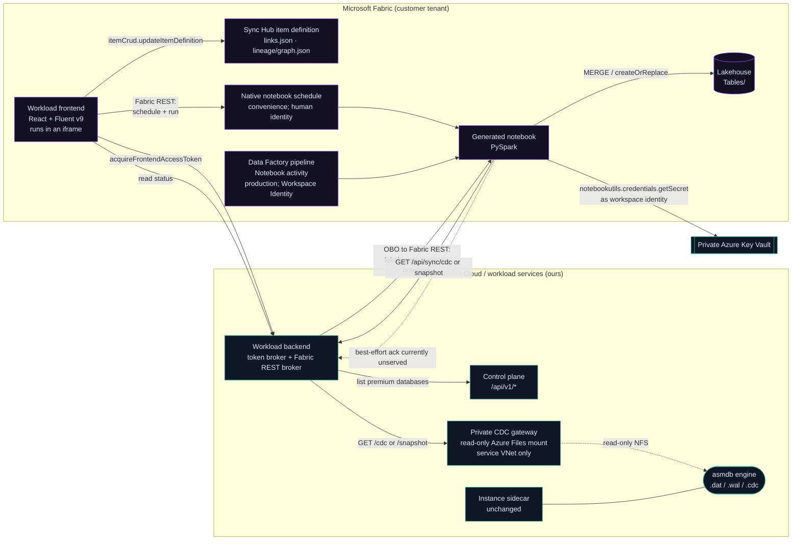
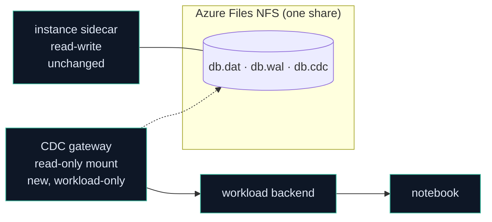
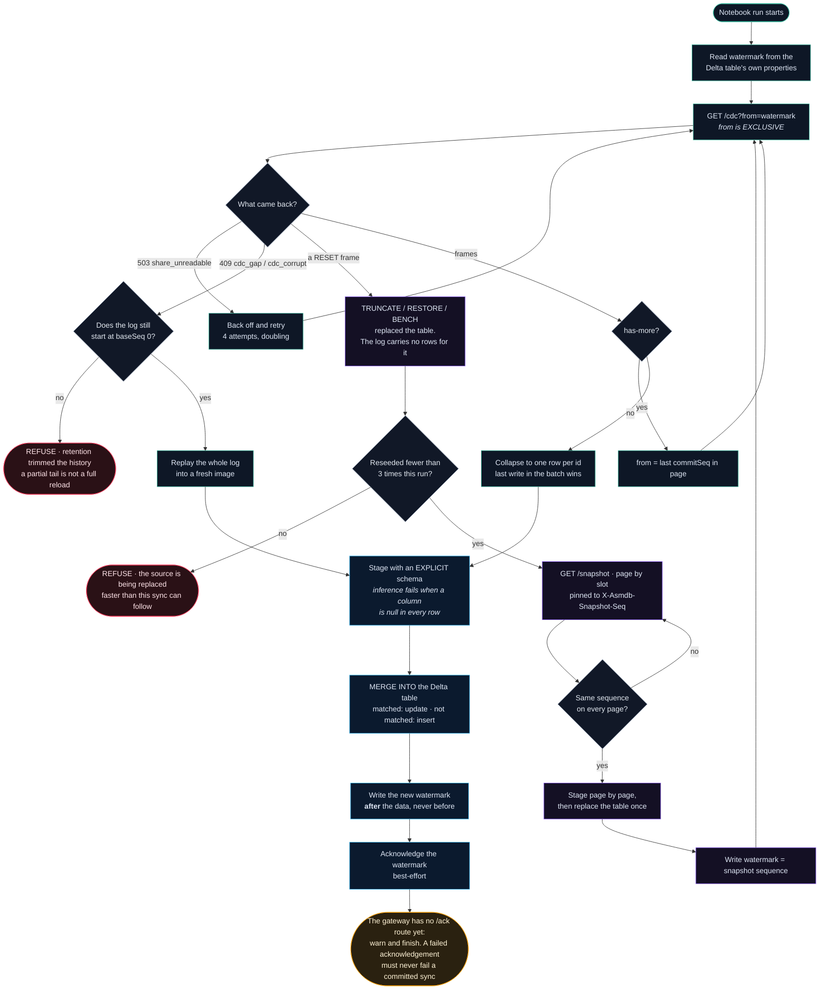
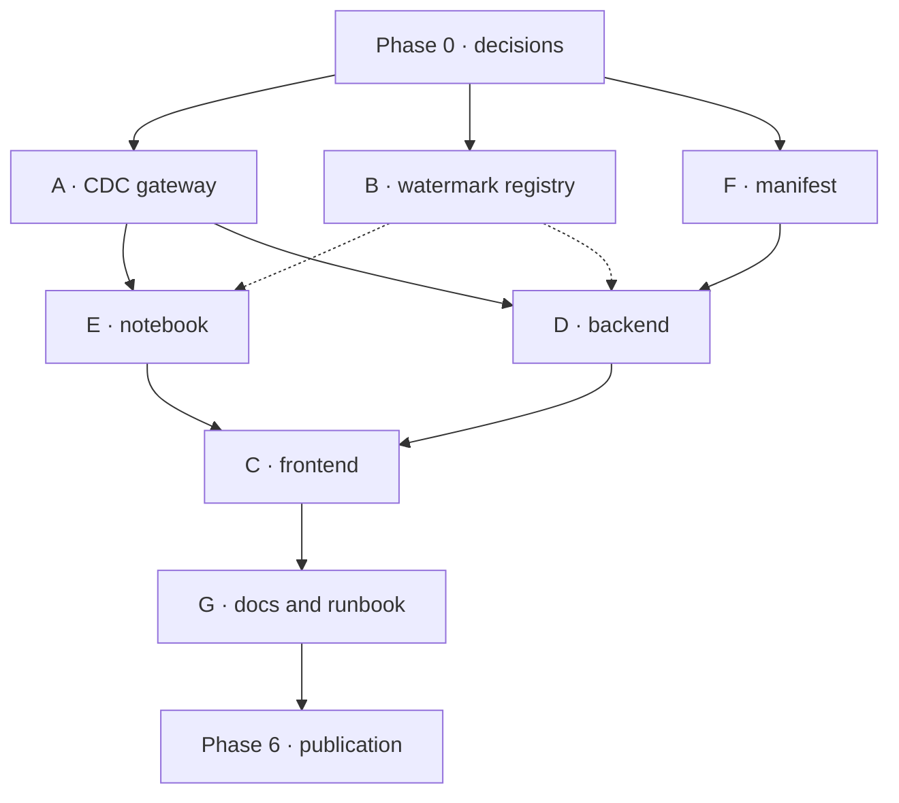
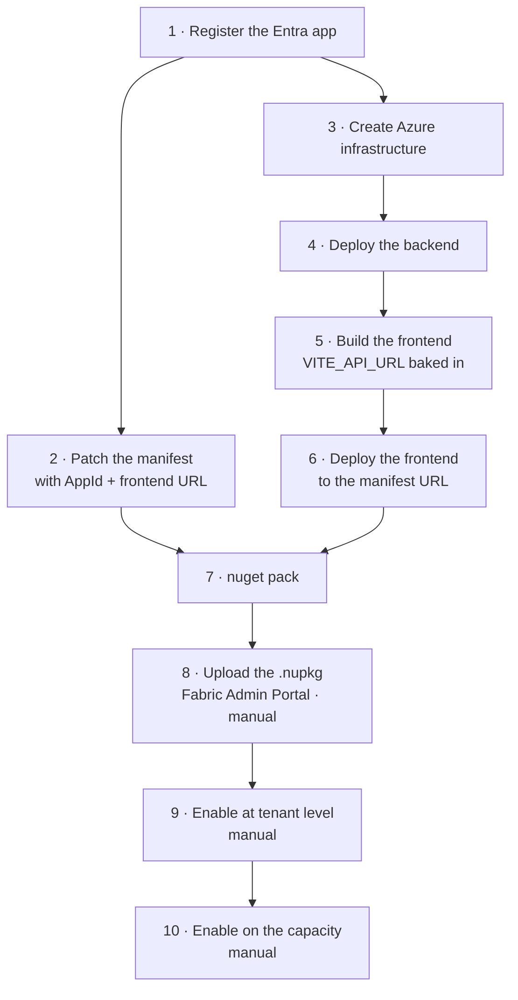

<div align="center">
  

  <h1>asmDB Analytical Capabilities — a Microsoft Fabric workload</h1>

  <p><em>The Fabric workload: design, contracts, and what was got wrong on the way.</em></p>
</div>

---

> **Status: live workload, with remaining planned work called out explicitly.**
> Convention in this document: **Built** means implemented in this repository and, where
> stated, deployed in the reference Fabric tenant; **Planned** means not built yet.
> Nothing is currently marked *Unverified* — where this document once used that word for
> code whose end-to-end Fabric behaviour was unproven, the behaviour has since been
> measured against the live tenant and the claim either stands or has been corrected.
> The surface is no longer aspirational: [`workload/mockup/index.html`](../workload/mockup/index.html)
> records the original visual target, and the screenshots in the repository README show
> what actually runs.

---

## 0. What this is, in one paragraph

asmDB is a transactional engine. It is deliberately not an analytical one: one fixed
256-byte record, one table per database, open-addressed hashing, no joins, no
aggregation. **asmDB Analytical Capabilities** is the bridge — a custom Fabric
workload that turns an asmDB database into a Delta table in a Fabric lakehouse and
keeps it current from the change log the engine already writes. The transactional
side stays small and fast; the analytical side is Fabric's job, which is what Fabric
is good at.

---

## 1. The decision that shapes everything

**Fabric Spark does the writing. We do not.**

The Extensibility Toolkit gives an item its own OneLake folder with `Files/` and
`Tables/`, and a client that can read and write **files**. It does **not** bundle a
Delta writer; `Tables/` is Delta or Iceberg and writing it needs Spark or the ADLS v2
API driven by something that understands the Delta protocol.[^onelake]

We could have written a sync service that speaks Delta. We are not going to, and the
reasons are worth stating because they also explain the shape of the whole product:

| If we ran the sync ourselves | If Fabric Spark runs it |
|---|---|
| We operate a service that must be up whenever a customer's data moves | Nothing of ours runs between syncs |
| We pay the compute | The customer's Fabric capacity pays, where their analytics budget already lives |
| We implement and maintain a Delta writer | Spark's writer, maintained by Microsoft |
| We own a scheduler | Fabric owns cadence. **Built:** the UI can configure Fabric's native notebook schedule, but it warns that this runs as a named human. **Production path:** a Data Factory pipeline with Workspace Identity. |
| The customer trusts a black box | **The customer can read the notebook** |

That last row is the one that matters most. The artefact we generate is a notebook in
the customer's own workspace, in their own language, doing something they can inspect
line by line. A data engineer who does not trust us can read it, change it, or write
their own. That is a much easier thing to adopt than an opaque connector.

So the workload is a **control plane, a notebook generator and a monitor**, with one
narrow exception that became unavoidable in implementation: the private CDC gateway is
a read-only change-log relay. The backend and frontend still do not move customer rows,
and there is no public analytical data plane, but the blanket plan claim that no row
ever passes through anything we operate is no longer true.

[^onelake]: `learn.microsoft.com/en-us/fabric/extensibility-toolkit/how-to-store-data-in-onelake`. The premise remains that Delta table writes are out of scope for the workload client. The implementation also found that the WDK client instance exposed to this `HostingType="FERemote"` workload does **not** expose the planned `writeFileAsText` path for workload state, so state moved to the item definition (§2.2).

---

## 2. Architecture



### 2.1 Components and who owns them

| Component | Status | Where | Responsibility |
|---|---|---|---|
| **Workload frontend** | **Built** | `workload/frontend/` | The Fabric iframe surface. Uses `acquireFrontendAccessToken`, stores link state in the item definition, creates a notebook automatically when a link is created, deletes it with the link, and schedules and runs notebooks through the **Fabric REST API** — not the SDK's `itemSchedule` client, which is for custom item types and does not apply to first-party Notebooks (§5d). Link state is computed from real run history read back from Fabric. |
| **Workload backend** | **Built** | `workload/backend/` | Validates Fabric tokens, performs OBO to asmDB Cloud and Fabric REST, lists premium databases/lakehouses, creates Notebook items, proxies CDC preview, and — because Fabric Spark cannot reach the private gateway (§3.5) — passes the change log and snapshots through to generated notebooks under `/api/sync`. Carries the private gateway URL and token in app settings. |
| **Notebook templates** | **Built** | `workload/notebooks/` | PySpark that reads CDC, merges into Delta, writes the table watermark, rebuilds from the retained log when it can honestly produce a complete table, and **seeds from the gateway's snapshot** when the source was replaced wholesale. Generated per link through the backend. |
| **Manifest + packaging** | **Built** | `workload/manifest/`, `workload/build/` | `WorkloadManifest.xml`, `Product.json`, item manifests, `.nuspec`, preflight validation and deployment scripts. |
| **CDC gateway** | **Built and deployed private** | `workload/cdc-gateway/` | Reads `<db>.cdc` and `<db>.dat` from a read-only Azure Files NFS mount and serves change frames and point-in-time snapshots. Deployed in `<service-resource-group>` because it mounts the service share, runs as uid `100:101`, and is reachable only from inside the VNet — which is why both the backend and, through it, the notebooks reach it the way they do. See §3. |
| **Watermark acknowledgement / trim registry** | **Planned** | not built in `saas/controlplane/` | The notebook calls an acknowledgement path best-effort, but the gateway has no `/ack` route and no control-plane registry advances `CDCTRIM` yet. Retention is therefore not automated by the workload today. The notebook prints a warning and continues, because a failed acknowledgement must never fail a sync that already committed its data. |
| Engine | unchanged | `src/` | Already writes the change log we need. |

### 2.2 Where state lives

**Built correction:** sync-link definitions and **lineage** do **not** live in
OneLake files. The plan said they would live under the workload item's `Files/`
folder because the SDK documentation describes file storage, but the WDK client
instance available to this `HostingType="FERemote"` workload exposes no usable
`writeFileAsText` method. Treating that as a transient error made Create Link look
recoverable when it was a dead end.

State now lives in the **Fabric item definition**, written with
`itemCrud.updateItemDefinition` as base64 `InlineBase64` parts. The part paths keep
the file-like names `links.json` and `lineage/graph.json`, which preserves the mental
model while using the storage API Fabric actually exposes. This still means:

- the customer's configuration lives in the customer's tenant, which is where it belongs;
- deleting the item deletes the configuration, with no orphaned rows on our side;
- we do not operate a second datastore.

**Lineage is applicational and we store it ourselves.** Fabric does not document a way
for a custom workload to contribute lineage edges (§5), so the edges shown in the
mockup — *this asmDB database feeds that lakehouse table* — are facts we know and
nobody else does. They are written to item-definition parts as links are created and read back when
the item is opened, so the graph is there immediately rather than rebuilt by probing
every database on every load. Practically, the built definition parts are:

```
item definition parts
├── links.json            one entry per sync link: source, target, decoder, notebook id
└── lineage/graph.json    nodes and edges derived from the saved links
```

**Planned:** append-only lineage history and persisted recent run outcomes are still
not built as definition parts.

Writing lineage down rather than deriving it also survives the case that matters: an
asmDB database that has been deleted, or a lakehouse the caller can no longer see. The
edge still existed, and a lineage view that forgets deleted things is not a lineage
view.

The **watermark** — how far a lakehouse has consumed — is the exception. It lives in the
Delta table's own properties, written by the notebook in the same transaction as the
data. That is the only place it can be correct; see §4.5.

---

## 3. Reading the change log without touching the SaaS

**There is no way to read the change log over HTTP today.** The sidecar exposes
`/v1/rows`, `/v1/stats`, `/v1/exec` and the rest, and `CDCTRIM` is on the exec
allowlist — but nothing serves change frames.[^routes]

The obvious move would be to add `GET /v1/cdc` to the sidecar. **We are not doing
that.** The sidecar is the customer-facing data plane of a transactional database; it
holds an exclusive lock, it is the thing a paying customer's writes go through, and it
was the source of three separate correctness defects in the last release. Adding a new
route to it to serve a *different product* would put analytics traffic on the path of
transactional writes, and would widen the surface of a component whose job is to be
small.

Instead: **a separate CDC gateway that reads the log from the share, read-only.**



### 3.1 Why this works, and why it is safe

- **The format was designed to be followed by another process.** `docs/CDC.md` says so
  in as many words, and `tests/cdc_dump.py` is a dependency-free reference reader that
  already does it. We are not inventing a capability; we are deploying the one that
  exists.
- **Read-only at the filesystem level, not by policy.** The gateway mounts the share
  read-only. It is not trusted to behave; it is unable to misbehave.
- **The engine is untouched.** No new assembly, no new sidecar route, no new lock
  holder. A bug in the gateway cannot corrupt a database or block a write.
- **Torn frames are already distinguishable.** Every frame carries a CRC-32 and a
  trailer, precisely so a reader can tell a crash-truncated tail from real damage. The
  gateway stops at the last complete frame and comes back later.
- **It is private and deliberately co-located with the service share.** The gateway is
  deployed in `<service-resource-group>`, not the analytics resource group, because Azure Files is
  mounted there. It runs in the internal Container Apps environment on the service VNet
  with no public DNS; the backend reaches it only after App Service regional VNet
  integration. A customer who does not use Fabric never has it in their path.
- **It runs as uid `100:101` for a reason.** The engine writes `.dat`, `.wal` and
  `.cdc` as `0600`; Azure Files over NFS honours numeric ownership and has no uid
  mapping. Running the gateway as any other uid produced `permission denied`. Loosening
  the engine's file mode would have made every row readable to local accounts and was
  the wrong trade.

### 3.2 What the gateway serves

```
GET /cdc/{instanceId}?from=<seq>&limit=<n>
GET /cdc/{instanceId}/head
GET /snapshot/{instanceId}?after=<slot>&limit=<n>
GET /healthz
```

`/healthz` is unauthenticated and returns JSON. The other three routes require
`Authorization: Bearer <gateway token>`. `/cdc` and `/snapshot` return
`application/x-ndjson`; `/head` returns JSON.

```json
{"commitSeq":"4211","flags":{"reset":false},"ops":[
  {"op":"upsert","id":"17850795121213","record":{"id":"...","value":"7240172205118292613","tag":"cdc","content":"...","created":"...","updated":"..."}},
  {"op":"delete","id":"17850795121200"}
]}
```

Rules that are **not** negotiable, because getting them wrong corrupts a customer's
warehouse silently:

1. **`from` below the log's base sequence is a named error, never an empty page.**
   `CDCTRIM` is a retention policy; once it has run, a consumer asking for a trimmed
   sequence has a hole. It must be told `cdc_gap` with the current `baseSeq` so the
   notebook can reseed. An empty `200` here would read as "nothing changed" and the
   lakehouse would diverge from the database quietly and permanently. **This is the
   single most important line in the design.**
2. **`from` is exclusive.** The gateway skips frames whose `commitSeq <= from`, so a
   consumer pages from *the last sequence it consumed*, never that plus one. This is
   worth stating because it looks like a matter of taste and is not: asking for
   `watermark + 1` skips exactly one frame on every call, and the symptom is a run
   that reports success having silently done nothing.
3. **Never serve a partial frame.** Stop at the last valid trailer.
4. **`RESET` must reach the consumer, and the consumer must be able to act on it.**
   It means "everything you knew is void". Because a `RESET` carries no operations
   by design (§3.3), the log alone cannot repair the consumer — which is what
   `GET /snapshot/{instanceId}` exists for.
5. **A snapshot is pinned or it is worthless.** The snapshot route reads the `.dat`
   header before and after its scan and returns `X-Asmdb-Snapshot-Seq`, the
   change-log sequence the image belongs to. If the sequence moved it answers `409
   snapshot_moved`; if a bulk operation is in flight it answers `503
   snapshot_unstable`. A torn image served with a plausible sequence is worse than no
   snapshot at all, because the consumer will resume from a watermark it never
   actually reached.
6. **Bounded responses.** `limit` is capped server-side at 1000 frames in the built
   gateway; consumers page by watermark and must not depend on a larger requested
   value. The snapshot route is additionally bounded by **slots examined**, not rows
   found, because the engine reserves the table file up front and writes into it
   sparsely — a table holding five live rows can sit in a gigabyte of reservation. A
   snapshot page may therefore legitimately return zero rows with
   `X-Asmdb-Has-More: true`.
7. **The gateway never writes.** Not to the share, not to the database, not ever.

The response headers are part of the contract. CDC pages carry
`X-Asmdb-Base-Seq`, `X-Asmdb-Last-Seq` and `X-Asmdb-Has-More`. Snapshot pages carry
`X-Asmdb-Snapshot-Seq`, `X-Asmdb-Live-Rows`, `X-Asmdb-Rows`,
`X-Asmdb-Has-More` and `X-Asmdb-Next-After`. The named failures are JSON:
`400 invalid_request` for malformed path or query values, `401 unauthorized` for a
missing or invalid bearer token, `404 not_found` for an unknown instance,
`409 cdc_gap` or `cdc_corrupt` for an unusable CDC position or log,
`409 snapshot_moved` for a snapshot whose sequence changed, and
`503 share_unreadable` or `snapshot_unstable` when the share or table image cannot
be read safely.

### 3.3 What asmDB already gives us

From [`docs/CDC.md`](CDC.md), and the reason this is tractable at all:

- One durable frame per committed transaction, `commit_seq` **strictly increasing and
  dense**.
- Each operation is a fixed 272 bytes carrying **the full 256-byte record image**, so a
  consumer never queries back. The notebook needs no read path into the transactional
  database at all — a real security property, not a convenience.
- A `RESET` flag for global operations. **`TRUNCATE`, `RESTORE` and `BENCH` each emit
  exactly one `RESET` frame carrying no operations**, by deliberate design:
  `src/cdc.inc:16` and `src/parse.inc:2012` say so in as many words. The consequence
  is easy to miss and expensive to discover in production: the change log does **not**
  contain the replacement rows, so no amount of replaying it can reconstruct the
  table. That is the whole reason `/snapshot` exists.
- The `.dat` header carries `HDR_SEQ` at offset 88 — *the last commit sequence
  published to the change log* — which is what lets a snapshot be pinned to an exact
  point in the log rather than merely taken at roughly the right time. `HDR_BULK` at
  128 and `HDR_RESETP` at 96 say whether a bulk operation or reset is in flight, and
  the live row count sits at offset 24.
- CRC-32 per frame plus a trailer.
- `CDCTRIM <seq>` for retention, once a watermark is acknowledged.

### 3.4 Credentials — resolved

**Decision D1: the notebook's gateway token lives in Azure Key Vault and is fetched by
the workspace identity.** So no long-lived secret is stored in a notebook, and no
credential is written into an artefact the customer can print or share. The notebook
resolves the secret through `notebookutils.credentials.getSecret`; the gateway
validates the token and nothing else can call the gateway.

**Built correction:** the Key Vault is private. Tenant policy forbids public network
access, so the notebook reaches the vault through a Fabric managed private endpoint.
The backend cannot reach that vault; its copy of the gateway token is therefore an App
Service application setting, not a Key Vault reference. That is a deliberate
operational trade-off recorded in `workload/docs/INSTALL.md`, not an oversight.

Two mechanical details decide whether this works at all, and both were wrong in the
first implementation — see §7.6. The notebook must use `notebookutils`, not
`DefaultAzureCredential`, which Fabric does not support. And it must be triggered by a
pipeline whose connection is set to **Workspace Identity**, because every other trigger
runs the notebook under a *human* account and D1 then quietly does not hold.

That also removes the option of putting a *database* token anywhere near a notebook,
which would have been indefensible: an instance token can write and truncate, and a
notebook is a shared, editable, printable object.

### 3.5 How a notebook actually reaches the gateway

The gateway is private, and it must stay private: it reads the share the live service
writes to. The backend reaches it by regional VNet integration, which is available
because the backend is an App Service we own, sitting in a subnet we created.

**A Fabric notebook has neither of those properties.** It runs on Spark inside
Microsoft's own managed network, in a different region, and cannot be placed in our
VNet. No setting on the notebook changes that.

The obvious answer — a Fabric managed private endpoint, the same mechanism that gives
the notebook its Key Vault access — **does not work for Container Apps, and it fails
silently.** Private Link is only half a mechanism; the other half is DNS. Fabric
creates and links private DNS zones automatically for the resource types it supports,
and Azure Container Apps is not among them. The endpoint provisions, both sides report
`Succeeded` and `Approved`, and the name still resolves publicly. Measured from inside
a Spark session after approval:

```
asmdb-cdc-gateway.<env>.swedencentral.azurecontainerapps.io -> 51.107.183.214
<env>.privatelink.swedencentral.azurecontainerapps.io       -> 51.107.183.214
HTTP FAILED: SSLError ... UNEXPECTED_EOF_WHILE_READING
```

Both names resolve to the **public** address, the connection reaches the public
Container Apps edge, which serves nothing for an internal environment and drops the
TLS handshake. The resulting `SSLError` reads like a certificate problem and is a DNS
one, which is what makes this worth writing down.

So generated notebooks read through the backend, which already has a working path:

```
GET /api/sync/cdc/{instanceId}?from=<seq>&limit=<n>
GET /api/sync/snapshot/{instanceId}?after=<slot>&limit=<n>
```

These mirror the gateway's own contract — same CDC and snapshot resources, same NDJSON,
same `x-asmdb-*` headers — so the notebook's parsing, its gap and corruption handling
and its tests are unchanged; only the base URL differs. The backend adds the
`/api/sync` prefix, clamps `limit` to the gateway maximum instead of rejecting a larger
page request, and validates generated instance ids as alphanumeric plus `_` and `-`.
`ASMDB_NOTEBOOK_GATEWAY_URL` carries that base URL into every generated notebook.

**The caller's bearer token is forwarded untouched.** The gateway remains the only
authority on who may read a change log; the backend mints, validates and substitutes
nothing. Consequently `/api/sync` is deliberately **not** behind the Fabric token
middleware that guards the rest of `/api`: a Spark notebook holds no Fabric token for
this application, and inventing one would have meant a second, weaker authority.

The trade-off, stated plainly: change-log data now traverses a public endpoint
protected by the same bearer token that protects the gateway itself. The gateway stays
unreachable from the internet, and the token is still the only credential that reads a
change log — but the exposure is a public TLS endpoint rather than a private address,
and the backend's App Service plan carries sync traffic as well as UI traffic. Revisit
this if Fabric adds Container Apps to the resource types it integrates DNS for.

[^routes]: `saas/sidecar/http.go` route table as of 1.7.0.

---

## 4. How a sync actually works

### 4.1 Shapes

asmDB has **one table per database** — there is no notion of a table inside a
database.[^onetable] So a sync link is always *one asmDB database → one Delta table*.
The "Target Table Prefix" in the mockup exists because a lakehouse gathers many
databases: `sales_` + `orders_db` → `sales_orders_db`.

[^onetable]: `saas/contracts/CONTRACTS.md` §1.

### 4.2 Decoding the content field

A record carries a 175-byte `content` field. In a transactional store it is free text
written and read by the same application, so it is frequently *not* text: hex, Base64,
a JSON document, a CSV line, a MessagePack blob.

That is fine transactionally and unhelpful analytically — a column of
`7b226964223a3132...` cannot be filtered or grouped.

So a sync link carries an optional **content decoder**, applied by the notebook before
the merge. **The default is `None`**: content lands as text, unchanged. Anything else is
an explicit choice the customer makes, because a decoder is an assertion about data we
did not write.

| Decoder | Produces |
|---|---|
| `None` *(default)* | `content` as text, untouched |
| `Hex` | decoded bytes, as a string or binary column |
| `Base64` | decoded bytes |
| `JSON` | parsed into typed columns |
| `CSV` | split into declared columns |
| `MessagePack` | parsed into typed columns |

Three rules keep it honest:

1. **The raw content is always kept**, as `content_raw`. A decoder is an interpretation,
   and interpretations turn out to be wrong. Discarding the source makes that
   unrecoverable.
2. **A row that fails to decode is not dropped.** It keeps its raw content and sets
   `_decode_error`. Silently discarding rows that do not fit an assumption is how a
   warehouse ends up quietly incomplete.
3. **Changing a decoder requires a reseed**, because rows already in the table were
   decoded under the old one. The UI says so before it lets the change through.

### 4.3 The resulting Delta schema

| Delta column | Source | Type |
|---|---|---|
| `id` | record `id` | `long` |
| `value` | record `value` | `long` |
| `tag` | record `tag` (39 usable bytes) | `string` |
| `content_raw` | record `content` (175 usable bytes) | `string` |
| *(decoder columns)* | decoded `content` | declared |
| `created` | record `created` | `timestamp` |
| `updated` | record `updated` | `timestamp` |
| `_commit_seq` | frame `commit_seq` | `long` |
| `_deleted` | frame op type | `boolean` |
| `_decode_error` | decoder outcome | `string` |
| `_synced_at` | notebook run time | `timestamp` |

**Decision D4: tombstone by default.** A `DELETE` frame sets `_deleted = true` and keeps
the row. In analytics, "this order existed and was then cancelled" is a fact, not noise,
and a physical delete breaks every time-travel query over that period. Hard delete stays
available per link — but it is irreversible, so it is not the default.

### 4.4 The notebook, in outline

```python
# 1. resolve the watermark from the Delta table itself
last_seq = spark.sql(f"DESCRIBE DETAIL {table}").select("properties").first() ... or 0

# 2. pull frames. `from` is EXCLUSIVE: page from the last sequence consumed,
#    never that plus one, or exactly one frame is skipped on every call
resp = GET f"{gateway}/cdc/{instance_id}?from={last_seq}&limit=5000"
#    the built gateway caps the page at 1000 frames and returns has-more headers

#    a gap/corrupt log means ordinary incremental consumption cannot continue
if resp.error in ("cdc_gap", "cdc_corrupt"):
    if resp.baseSeq == 0:
        rebuild_table_by_replaying_cdc_from_base(); return
    raise FullReloadUnavailable("retention has trimmed the history needed for a complete rebuild")

#    a RESET means the source was replaced wholesale and the log carries no rows
#    for it, so replaying would empty the table rather than reload it. Seed from
#    the pinned snapshot instead, then resume at the snapshot's own sequence in
#    the same run. Reseeds are capped per run, so a source being replaced faster
#    than it can be followed fails with that explanation rather than looping
if reset_frame_seen:
    seq = seed_from_snapshot(f"{gateway}/snapshot/{instance_id}")  # writes data, then watermark
    from_seq = seq; continue

# 3. collapse to one row per id — the last write in the batch wins
# 4. stage with an EXPLICIT schema. Inference fails with CANNOT_DETERMINE_TYPE
#    when an optional column is null in every row, which is ordinary for a table
#    that never sets `value` or `tag`, and always true of `_synced_at`
# 5. MERGE INTO ... WHEN MATCHED UPDATE / WHEN NOT MATCHED INSERT
# 6. write the new watermark as a table property, after the data
# 7. best-effort acknowledge; built gateway has no /ack yet, so CDCTRIM is not automated
```

### 4.5 Correctness, stated plainly

- **Exactly once is achieved by idempotence, not by delivery guarantees.** The notebook
  may run twice on the same range; `MERGE` on `id` with the full record image makes that
  harmless.
- **The watermark must be committed with the data.** If it lived in a separate store, a
  crash between the two writes would either replay (harmless) or skip (silent data
  loss). Delta table properties are written transactionally; use them.
- **Trim only what has been acknowledged.** `CDCTRIM` is destructive and irreversible.
  Only advance it on a watermark a lakehouse has actually committed. **Planned:** the
  acknowledgement/registry path that would do this is not built; the notebook logs a
  warning if acknowledgement fails and still leaves the lakehouse correct.
- **There is no sync mode.** The UI and plan once offered "CDC Incremental" and
  "Full Reload". That was wrong. **Built:** there is one behaviour: replicate change
  events on a schedule. When the change log cannot serve the needed position, the
  notebook automatically rebuilds only if the retained CDC log starts at `baseSeq=0`.
  If retention has already trimmed old frames, it refuses loudly. Rebuilding from a
  retained tail and calling it "full" would silently lose the oldest live rows.
- **A gap is an incident, not a retry.** Report it, rebuild only when complete history
  is retained, and surface it in the UI — the "Warning" state in the mockup is exactly
  this case.

### 4.6 One run, drawn

Every branch below is reachable in production, and each of the three refusals exists
because the alternative is a lakehouse that quietly disagrees with the database.



Three things in that picture are the whole design, and each was learned the hard way:

**`from` is exclusive.** Paging from `watermark + 1` skips exactly one frame per call.
It shipped once, and the symptom was a run that reported success having done nothing.

**The watermark is written after the data, always.** A crash between the two either
replays an idempotent `MERGE`, which is harmless, or skips rows for ever, which is not.
The order is asserted in code rather than merely intended.

**A `RESET` cannot be replayed.** The log holds no rows for it, so folding it would
empty the table rather than reload it. Seeding from a snapshot pinned to a change-log
sequence is what makes "reload, then resume" exact instead of approximate.

---

## 5. Fabric integration — what is supported, and what we do not yet know

Verified against the toolkit and Microsoft Learn (July 2026). **The uncertainties are
listed as uncertainties**; they should be resolved before the phase that depends on them.

| Capability | Status | Consequence for us |
|---|---|---|
| Frontend in an iframe, `allow-same-origin allow-scripts` | **Built** | Our surface is a normal SPA. |
| Backend optional; toolkit default is frontend-only | **Built, but backend required by this workload** | The backend is no longer token-only: it brokers Fabric REST calls too, because the frontend token has the workload audience. |
| Create a Notebook item | **Built through backend Fabric REST** | `POST /api/notebooks` calls the Fabric REST notebooks API on behalf of the user and polls the long-running operation to completion. The generated item exists only after our endpoint returns 201. |
| List lakehouses | **Built through backend Fabric REST** | The frontend cannot call Fabric REST directly with its workload-audience token; `/api/lakehouses` performs OBO to `https://api.fabric.microsoft.com/.default`. |
| Run a notebook on demand / native schedule | **Built in UI as convenience** | The UI uses the Fabric REST job and schedule endpoints directly, not `itemSchedule`, and states the trade-off: direct notebook schedules run as the user who created or last updated the schedule. |
| Production unattended cadence | **Documented, manual** | Use a Data Factory pipeline Notebook activity with Workspace Identity. The workload does not create that pipeline today. |
| Persist workload state | **Built via item definition** | `links.json` and `lineage/graph.json` are definition parts written with `itemCrud.updateItemDefinition`, not OneLake files. |
| Write `Tables/` (Delta) from the workload | **Not supported by the toolkit** | Confirms §1 — Spark writes. |
| **Custom workloads contributing lineage edges** | **Not documented** | ⚠️ See below. |
| Custom brand colours | Architecturally supported via `createDarkTheme` | ⚠️ Publishing to the Workload Hub requires Fabric UX compliance; the exact limits are not published. |

**On lineage — resolved by decision, not by API.** The documentation says workload items
"participate in lineage", but no API, manifest field or SDK method lets a custom
workload *report* an edge (`this database → that table`). So we store our own:
`lineage/graph.json` in the item's definition, written when a link is created and read
when the item opens (§2.2). These edges are **applicational** — they are true, they are
ours, and Fabric's own lineage view will not show them. The UI must therefore never
imply otherwise: the panel is titled "Current Lineage" and describes asmDB→lakehouse
links we know about. If Microsoft later exposes a contribution API, publishing to it
becomes an addition, not a redesign, because the data is already modelled and stored.

**On scheduling — resolved, then corrected.** The toolkit's own Fabric-scheduler support
is marked *under development*, so we do not build on it. Cadence comes from Fabric's own
scheduling, which the customer already knows how to change — but **not from the
notebook's own schedule**, which was the original plan and is wrong.

A Fabric notebook's security context is determined by how it was triggered. An
interactive run is the person who clicked. A **direct notebook schedule runs as the user
who created or last updated that schedule** — a named human account. A pipeline activity
runs as the pipeline's last-modified user, unless its connection is explicitly set to
**Workspace Identity**, which is the only trigger that runs as the workspace service
principal.

This matters because D1 requires the workspace identity. A directly scheduled notebook
would satisfy every test we could write and then fail months later, when the person whose
account it borrowed changes role or leaves, with a Key Vault denial that names no cause.
The failure is silent, delayed, and points nowhere.

So the supported production cadence comes from a **Data Factory pipeline** containing
a Notebook activity whose connection is Workspace Identity, and the *pipeline* carries
the schedule. **Built UI correction:** the Notebooks tab also exposes Fabric's native
notebook schedule because users asked for it and the WDK supports it, but the UI states
the trade-off beside the control: direct notebook schedules run as a named human and
are not the durable unattended path. This also
depends on a tenant setting — *Service principals can call Fabric public APIs* — which is
disabled by default and needs a Fabric administrator, so it belongs early in the install
rather than at the point of first run.

**On branding — see the D2 warning in Phase 0.** Fluent UI v9 takes a 16-shade brand
ramp; our cyan and violet can drive it, and `theme.onChange` lets us follow the host
between light and dark. But we are publishing to the Workload Hub, so Fabric UX
compliance applies and its limits are unpublished. This is now a scheduling risk, not a
footnote.

**SkyNav is the working reference for everything mechanical** — manifest shapes, the
`bootstrap({ initializeWorker, initializeUI })` entry point, token acquisition, JWT
validation with `jose`, `.nupkg` packaging, and the deploy order. It is deliberately
*not* a reference for theming: it ships stock `webLightTheme` with hardcoded hex
literals scattered through components. We are doing the opposite.

---

## 5b. What the mockup commits us to

[`workload/mockup/index.html`](../workload/mockup/index.html) is the design target.
Every control on it is a promise, so each is mapped here to the part of the plan that
has to deliver it. Anything on screen that is not in this table is decoration and can be
dropped without argument.

| On screen | Plan | Note |
|---|---|---|
| Source database · target lakehouse | Workstreams C + D | Databases come from the control plane through the backend; lakehouses from the Fabric API. |
| ~~Sync mode~~ | §4.5 | **Removed.** There is no user-facing mode. The only behaviour is scheduled CDC replication; automatic rebuild is an internal recovery path and refuses when retention makes a complete rebuild impossible. |
| Target table prefix | §4.1 | One asmDB database is one Delta table, so the prefix is what keeps a lakehouse legible. |
| **Content decoding** — decoder, sample, decoded preview, `46 / 176 bytes` | §4.2 | The counter is the engine's real limit: 176 bytes, 175 usable. Showing it beats an error later. The preview decodes **client-side** — it is a sample, not a round trip into a customer's database. |
| Create notebook · Generate notebook · Preview CDC | §1 · Phase 2 | `Preview CDC` reads a bounded page through the gateway (§3.2) and respects the same caps. |
| Current lineage, with `Active / Planned / Warning` | §2.2 | Edges are ours, stored in the item definition as `lineage/graph.json`. **`Planned` means configured but never run** — worth showing, because a link created and never scheduled is the most common silent failure. |
| Recent sync activity — status, last run, lag | Phase 4 | Lag in minutes; see below. |
| Selected link details, incl. **decoder** and **next run** | Phase 4 | Built next-run display comes from the native notebook schedule if one exists. Production pipeline scheduling remains documented/manual, not created by the workload. |
| Coverage & readiness | Phase 4 | "Not configured" is a database with no link at all — the number that sells the product, and the only one requiring us to list databases the user has never touched. |
| `Data updated · Auto-refresh` | Phase 4 | Obeys the rule already paid for once in asmdb Cloud: a failed poll shows the last good sample marked stale, never a blank panel. |

### Two things the mockup must not say

**Not "real-time".** Decision D3 is analytics cadence. The lag figures are minutes and
the copy reads "analytical sync", not "real-time analytical sync". A screenshot promising
seconds becomes a commitment the moment someone shows it to a customer — and the sync is
driven by Fabric scheduling, whether native notebook schedule for convenience or a
production pipeline schedule, which gives minutes.

**Not Fabric's lineage.** The panel shows edges we hold. It must never imply that opening
Fabric's own lineage view will show the same graph (§5).

---

## 5c. Who is allowed to sync what

**Decision: anyone who can already reach asmdb Cloud, and only `premium` databases.**

That is the whole rule, and it is deliberately not a new permission system. asmdb Cloud
is single-organisation (§5b), so "can reach asmdb Cloud" means "is a member of
`ASMDB_ADMIN`". Two consequences follow, and both matter more than they look:

**The workload does not re-implement the check.** The backend exchanges the Fabric
user's token for an asmdb Cloud call (on-behalf-of) and lets the control plane apply its
own rule. One authority decides who sees what. If the workload kept its own copy of the
rule, the two would drift, and it is always the copy that ends up wrong — a user removed
from `ASMDB_ADMIN` would keep working through Fabric.

**The `premium` filter is a filter, not a security boundary.** `GET /api/v1/databases`
already returns `tier`, so the backend lists only `premium` and needs no change to asmdb
Cloud at all. It is not protecting anything the caller could not otherwise see; it is
refusing to offer something that would disappoint. A `free` database holds 393,216 rows
and a `standard` one 1,572,864 — neither is an interesting analytical subject, and
offering them would generate support conversations rather than value.

### The Entra application is separate from asmdb Cloud's

**Decision: a second, dedicated app registration.** This is right, and the reason is
worth writing down. The asmdb Cloud application carries `ASMDB_ADMIN`, whose members can
create, delete and rotate the token of every database. A Fabric workload runs in an
iframe, in the customer's tenant, and its token passes through components we do not
fully control. Lending it that identity would give an analytical surface the power to
destroy transactional databases.

The workload app is therefore a **multitenant SPA using authorisation-code with PKCE and
no client secret**, exposing a verified-domain Application ID URI of the form
`https://asmdb.cloud/fe/be/Org.AsmdbAnalytical/1`, not the earlier `api://<client-id>`
shape. The host must be the verified domain exactly; `workload.asmdb.cloud` failed.

The app needs delegated Power BI/Fabric permissions including `Fabric.Extend`
(mandatory for Fabric workloads) plus the workspace/item permissions used to list
lakehouses and create notebooks. Its exposed `FabricWorkloadControl` scope must
preauthorise the Microsoft client apps called out in `workload/docs/INSTALL.md` —
Power BI, Fabric Client for Workloads, and the Power BI Service legacy/client path.
Do not copy the values here; keep the install document as the operational source of
truth.

---

## 5d. Scheduling a Notebook is not what the SDK suggests

The workload SDK exposes `workloadClient.itemSchedule.*`, and it is the wrong API for
this job. It serves the **custom item types a workload declares in its own manifest**;
a Notebook is a first-party Fabric item, and its schedules live in the Fabric REST API.
The two contracts share no fields, which is the clue that they are unrelated concepts
rather than two routes to the same place:

| SDK field | REST equivalent |
|---|---|
| `scheduleType: "Hourly"` | `configuration.type: "Cron"` with `interval: 60` |
| `cronPeriod` / `cronUnit` | `configuration.interval`, in minutes |
| `scheduleHours` | `configuration.times` |
| `scheduleWeekdays: [{key, selected}]` | `configuration.weekdays: ["Monday", …]` |
| `jobDefinitionObjectId` | **does not exist** |
| `localTimeZoneId` (IANA) | `localTimeZoneId` (**Windows** identifier) |

Calls through the SDK client fail without naming this as the reason, so the workload
calls REST directly with a token acquired for the Fabric audience:

```
POST   /v1/workspaces/{ws}/items/{nb}/jobs/RunNotebook/schedules      → 201, synchronous
PATCH  /v1/workspaces/{ws}/items/{nb}/jobs/RunNotebook/schedules/{id}
GET    /v1/workspaces/{ws}/items/{nb}/jobs/RunNotebook/schedules
POST   /v1/workspaces/{ws}/items/{nb}/jobs/RunNotebook/instances      → 202, not 200
GET    /v1/workspaces/{ws}/items/{nb}/jobs/instances                  → run history
```

Four details decide whether a schedule is accepted, and none is obvious from the
schema: `localTimeZoneId` must be a Windows identifier (`Romance Standard Time`, not
`Europe/Paris`); `startDateTime` and `endDateTime` are required in practice though
marked optional; timestamps carry **no trailing `Z`** despite the documentation showing
one; and there is no `Hourly` type at all — an hourly cadence is `Cron` with `interval`
expressed in minutes.

Run-on-demand returns **202 Accepted with an empty body**. Treating only 200 as success
makes every run report a failure it did not have, and the empty body is also why the
run list has to be read back afterwards rather than appended to locally.

`GET .../jobs/instances` is what makes the link states in §6 Phase 4 real rather than
decorative: it returns runs started by a schedule or from the Fabric portal, not only
those this browser session started, and it carries `failureReason` so a failed sync can
say why.

---

## 6. Development plan

Seven workstreams. **Scopes are disjoint by directory** so they can run in parallel
without agents overwriting each other — the same discipline used for the 1.7.0 security
work, where four agents worked simultaneously without a single collision.

### Phase 0 — decisions

**All four are answered.** Recorded here because the rest of the plan depends on them.

| # | Decision | Answer | Consequence |
|---|---|---|---|
| D1 | How the notebook gets a credential | **Azure Key Vault, read by the workspace identity via `notebookutils`** | No secret is stored in a notebook or in OneLake. Requires a pipeline with Workspace Identity for production — see §7.6. Backend uses an app setting for its gateway token because the vault is private to Fabric. |
| D2 | Distribution | **Workload Hub publication**, with a custom domain and a manifest upload | Fabric UX compliance now genuinely applies — see the warning below. |
| D3 | Cadence | **Analytics, not real time.** Minutes, not seconds | The mockup's lag figures are minutes. Do not promise seconds; §5b explains why the number in a screenshot becomes a commitment. |
| D4 | Deleted rows | **Tombstone by default**, hard delete per link | `_deleted` is carried; history and time travel survive. |

> ⚠️ **D2 makes the palette a real risk, not a theoretical one.** Publishing to the
> Workload Hub requires compliance with the [Fabric UX system](https://aka.ms/fabricux),
> and the published rules do not say how far a workload may depart from Fabric's own
> palette. Our brand is a dark navy with a cyan-to-violet accent, and the mockup commits
> to it. **Get this answered before Phase 4 begins**, not after the surface is built:
> constraining a palette costs an afternoon, restyling a finished application costs a
> week. If compliance turns out to be strict, the fallback is a Fabric-native palette
> with our accent used only for our own marks and states — which is a smaller loss than
> it sounds, and is a decision better made deliberately than discovered late.

### Phase 1 — the CDC gateway *(Built; acknowledgement/trim still Planned)*

**Workstream A — gateway.** Scope: `workload/cdc-gateway/`. **Does not touch `src/` or
`saas/sidecar/`.**

- Mount the instance share **read-only**; parse `<db>.cdc` per [`docs/CDC.md`](CDC.md).
- `GET /cdc/{instanceId}?from=&limit=` serving NDJSON, bounded. `from` is exclusive.
- `GET /snapshot/{instanceId}?after=&limit=` serving the current table image from
  `<db>.dat`, pinned to `HDR_SEQ` and refusing rather than serving a torn image:
  `503 snapshot_unstable` while a bulk operation is in flight, `409 snapshot_moved` if
  the sequence changes mid-read. Bounded by slots examined, because the engine reserves
  the table file up front and writes sparsely.
- `cdc_gap` when `from` precedes the log's base sequence — never an empty page.
- Stop at the last complete frame; a torn tail is normal, not an error.
- Authenticate the workload backend only; refuse everything else.
- Tests: gap detection, `RESET` propagation, torn-tail handling, pagination, cap
  enforcement, a log being appended to while it is read, a log trimmed underneath
  a reader mid-page, and for snapshots: live/deleted/empty slots, sequence pinning,
  paging by slot index, a sparse reservation terminating through bounded pages, and
  content honouring `REC_CLEN` rather than trailing NULs.

**Workstream B — control plane.** Scope: `saas/controlplane/`. **Planned, not built.**

- Resolving an instance id to its share path is bypassed today by the private gateway
  reading the mounted share directly and the backend minting/holding the gateway token.
- Recording acknowledged watermarks and advancing `CDCTRIM` only on them is still the
  right design, but no registry or `/ack` implementation exists yet.
- The public API surface still does not grow a CDC route.

*Exit criterion: a plain `curl` against the gateway pages through a live database's change log while that database is being written to, and a trimmed log produces `cdc_gap` rather than an empty page.*

### Phase 2 — the notebook *(Built)*

**Workstream E.** Scope: `workload/notebooks/`.

- Parameterised PySpark template: pull, collapse, `MERGE`, watermark, acknowledge.
- Automatic rebuild path, triggered by `cdc_gap` / `cdc_corrupt` only when the retained CDC log still starts at `baseSeq=0`; otherwise fail loudly rather than pretend a partial tail is a full reload.
- `RESET` seeds from the gateway snapshot and resumes at the snapshot's own sequence.
  Reseeds are capped per run so a source replaced faster than it can be followed fails
  with that explanation rather than rewriting the lakehouse table in a loop. The seed
  stages page by page and swaps once, so driver memory does not scale with table size.
- Idempotence test: run the same range twice, assert the table is identical.
- Correctness test against a database under concurrent write.

*Exit criterion: a notebook run by hand syncs a live asmDB database into a Delta table, twice, with the same result.* **Met**, verified end to end against the live engine: rows through gateway, backend and Spark into Delta with the correct column types and the watermark property written after the data.

### Phase 3 — workload skeleton *(parallel with Phase 2)*

**Workstream F — manifest and packaging.** Scope: `workload/manifest/`, `workload/build/`.

- `WorkloadManifest.xml` (`Org.AsmdbAnalytical`, `HostingType="FERemote"`), `Product.json`, one item manifest, `.nuspec`.
- Entra app registration, `.nupkg` build, and the documented upload/enable sequence.

**Workstream D — backend.** Scope: `workload/backend/`. **Built, with broader scope than planned.**

- Fabric JWT validation with `jose` and a remote JWKS.
- OBO exchange to call asmDB Cloud.
- OBO exchange to call Fabric REST for lakehouse listing and Notebook creation.
- CDC token minting/preview endpoints per D1.
- `/api/sync/cdc` and `/api/sync/snapshot` passthrough for generated notebooks, which
  cannot reach the private gateway themselves (§3.5). Deliberately outside the Fabric
  token middleware, forwarding the caller's gateway token untouched.
- CORS allowing Fabric and Power BI hosts, `trust proxy`, and request limits.

*Exit criterion: an empty workload loads inside Fabric, authenticates, and lists the caller's asmDB databases.*

### Phase 4 — the surface *(Built)*

**Workstream C — frontend.** Scope: `workload/frontend/`.

Build in the mockup's order, because that is the order a user meets it:

1. Shell, header, KPI strip.
2. Create Sync Link — the core flow. Creating a link creates its notebook; deleting the
   link deletes the notebook, and says so plainly if that call fails rather than
   claiming a cascade that did not happen.
3. Lineage panel (our own edges — see §5), coloured from computed state, not stored state.
4. Notebooks tab: the generated notebooks with their status, a formatted preview, the
   five scheduling cadences the Fabric portal itself offers, and run history.
5. Monitoring tab: recent sync activity and coverage, read back from Fabric.

Non-negotiables carried over from asmDB Cloud, all of which were bugs we have already
paid for once:

- A timeout is **not** a failure. Show the last good sample, marked stale.
- Distinguish *no data* from *not configured* from *request failed*. Three states, three messages.
- Never present a reservation as consumption.
- No status conveyed by colour alone.
- Every published number is real or explicitly absent — never a plausible placeholder.

#### What a link's state means

The three words on a link are derived from what Fabric reports, and are recomputed
whenever run history is read. They were once written at creation and never revisited,
which made every link read `Planned` for ever and made the word meaningless.

| State | When |
|---|---|
| **Warning** | The notebook could not be created, or the most recent run failed |
| **Active** | A run is in progress, or a schedule is enabled, or the last run succeeded |
| **Planned** | The link is saved but nothing runs it yet |

Warning takes precedence over Active: a scheduled link whose last run failed is a
Warning, because the schedule existing is not evidence that the sync works.

Each state carries the sentence that justifies it. A Warning quotes Fabric's own
`failureReason` rather than asking the reader to go and find it.

#### Where run history comes from

`GET /v1/workspaces/{ws}/items/{nb}/jobs/instances`, for every link that has a notebook.

This matters more than it sounds. An earlier version kept only what the current browser
session had started, so a scheduled run that failed overnight left Monitoring empty and
every link still reading `Planned` — the workload showed nothing wrong while the sync
was not working at all.

### Phase 5 — operations *(Partly built)*

**Workstream G.** Scope: `docs/`, `workload/docs/`.

- Runbook: a link is lagging; a gap was detected; a notebook failed; a token expired.
- Cost model, in the manner of [`COST.md`](COST.md): whose capacity pays for what, measured rather than estimated.
- Update `README.md`, `CONTRACTS.md` (new endpoint, new scope), `SECURITY.md` (new credential class).

### Phase 6 — publication *(Partly built; public Workload Hub publication Planned)*

- Fabric UX compliance review. **Do this at the start of Phase 4, not here** — by this point the surface is built and a compliance failure is expensive.
- Tenant `.nupkg` upload and enablement are built and have been exercised for the
  reference tenant. Public Workload Hub submission, certification evidence and real
  listing pages are still planned; see §8.

### Dependency graph



Phases 2, 3 and 4 have now landed. The dotted watermark-registry edges remain future
retention automation: the notebook can warn after a failed acknowledgement, but no
control-plane path advances `CDCTRIM` yet.

---

## 7. Installing it

Written to be followed by someone who did not build it. Every step is either a command
or an explicit "this cannot be scripted". The sequence is derived from two workloads by
the same author that are running today — [SkyNav](https://github.com/fredgis/SkyNav),
which automates most of it, and [FabricPRA](https://github.com/fredgis/FabricPRA), which
does the Entra registration by hand. Where they differ, SkyNav is the better model.

### 7.1 Prerequisites

| | Why |
|---|---|
| Node.js **20+**, npm | Frontend and backend toolchain |
| PowerShell **7+** | The deployment script |
| Azure CLI, signed in | Infrastructure and the app registration |
| `nuget` CLI | Packaging (falls back to manual) |
| `@azure/static-web-apps-cli` via npx | Frontend deployment |
| Fabric capacity: **F64+**, or **F2** in developer mode | Custom workloads are not available below this |
| A **verified custom domain** resolving to the Static Web App | The manifest's `ServiceEndpoint/Url` must resolve **at upload time**, or the upload is rejected |
| Fabric **tenant admin** | Only an admin can upload a workload and enable it |
| Entra privileges to register an app and **grant admin consent** | Consent is not something a normal user can give |
| A Fabric **managed private endpoint** to the Key Vault, approved | Required for the notebook to read the gateway token. A managed private endpoint to the Container Apps environment is **not** a solution for the gateway: Fabric does not integrate private DNS for Container Apps, so the endpoint provisions and stays unreachable — generated notebooks read the change log through the backend instead |

### 7.2 The order, and why it is not negotiable

Nine of the ten steps below fail in a way that does not name its cause if done out of
order. That is the single most valuable thing in this section.



**What breaks, and how badly it lies to you:**

| Mistake | Symptom |
|---|---|
| Wrong `AppId` in the manifest | The workload loads and authentication fails **silently**, with nothing in the UI |
| Frontend URL in the manifest ≠ actual deployment URL | Fabric refuses to load the iframe, with no useful message |
| Frontend built before the backend URL is known | The wrong API URL is compiled into the bundle; it looks deployed and calls nothing |
| Capacity enabled before tenant | The capacity setting silently has no effect |
| Oversized or wrong-format assets | Rejected at **upload**, not at packaging — after everything else is done |

### 7.3 Step 1 — Register the Entra application

A **multitenant SPA**, authorisation-code with PKCE, **no client secret**.

```powershell
az ad app create `
  --display-name "asmDB Analytical Capabilities" `
  --sign-in-audience AzureADMultipleOrgs `
  --enable-id-token-issuance true `
  --enable-access-token-issuance true `
  --public-client-redirect-uris "http://localhost:60006/close"
```

Then the SPA redirect URIs. The Fabric and Power BI forms are
`workloadSignIn/{tenantId}/{WorkloadName}`, and `{WorkloadName}` **must** equal the value
in `WorkloadManifest.xml`:

```
http://localhost:60006/close
https://app.fabric.microsoft.com/workloadSignIn/{tenantId}/Org.AsmdbAnalytical
https://app.powerbi.com/workloadSignIn/{tenantId}/Org.AsmdbAnalytical
https://{custom-domain}/close
```

> `/close` must actually be served by the frontend and call `window.close()`. Both
> reference workloads do this in `main.tsx`; it is not optional and it is easy to miss
> because nothing fails until a user signs in.

The operational Entra shape is stricter than this original sketch. The Application ID
URI must use the verified domain as the host exactly, the frontend host may have only
one label beyond that domain, `Fabric.Extend` is mandatory, and the exposed workload
scope must preauthorise the Microsoft client apps listed in `workload/docs/INSTALL.md`.
Follow that document for the exact app registration steps; this app is **not** asmdb
Cloud's — see §5c.

### 7.4 Steps 2–7 — Build and deploy

Scripted, in `workload/build/deploy.ps1`, following SkyNav's phase structure:
validate → login → app registration → infrastructure → build → backend → frontend →
pack. The two constraints the script must respect are already stated above: the manifest
is patched **before** packing, and the frontend is built **after** the backend URL is
known.

Asset rules enforced at pack time rather than discovered at upload:

- every `assets/*` reference in the JSON manifests must resolve to a real file;
- extensions limited to `.png`, `.jpg`, `.jpeg`;
- each asset **≤ 1.5 MB**;
- `slideMedia` videos must be YouTube or Vimeo *embed* URLs.

### 7.5 Steps 8–10 — What cannot be scripted

No CLI exists for any of these. A Fabric **tenant admin** must do them, in this order:

1. **Upload** the `.nupkg` — `admin.fabric.microsoft.com` → Workload Publishing → Upload.
2. **Enable at tenant level** — Admin Portal → Tenant settings → Additional workloads.
3. **Enable on the capacity** — Admin Portal → Capacity settings → enable
   `Org.AsmdbAnalytical`. Nothing happens if step 2 was skipped, and no error says so.

### 7.6 One step neither reference workload has ever done

Our design has the generated notebook read its asmDB credential from **Azure Key Vault
using the workspace's managed identity** (D1). Neither SkyNav nor FabricPRA uses Key
Vault at all — both avoid secrets entirely via managed identity on an App Service, which
is a *different* identity from the one a notebook runs under.

So this step is ours to prove, and researching it changed the design twice:

- **`DefaultAzureCredential` does not work in a Fabric notebook.** Microsoft documents
  this outright. The credential chain probes IMDS at `169.254.169.254`, which does not
  exist in a Spark session; the workspace identity is a *service principal*, not an Azure
  VM managed identity, so it is not reachable that way at all. The call exhausts every
  credential and raises. The supported API is `notebookutils.credentials.getSecret`,
  which needs no package and no import — so the two Azure SDK dependencies we were
  originally going to ask the installer to provision were never needed;
- **only a pipeline activity with Workspace Identity actually runs as that identity.**
  See §5d. A direct notebook schedule borrows a human account;
- the vault must be created with **RBAC authorisation enabled**. In legacy access-policy
  mode the role assignment is silently ignored and the notebook gets a 403 that says
  nothing about why;
- the **workspace identity** must then be granted **Key Vault Secrets User** on the
  vault. That is a Fabric administration action against an Azure resource, automated
  nowhere, and exactly the kind of step that gets forgotten;
- a tenant setting — *Service principals can call Fabric public APIs* — gates the whole
  path and is off by default;
- the vault is private by tenant policy. Fabric reaches it through a managed private
  endpoint; the backend cannot, so its gateway token is an App Service setting rather
  than a Key Vault reference;
- it must be verified end to end before Phase 2 is called done, not assumed.

Treat this as the highest-risk item in the whole installation, because it is the only one
with no working precedent. Several of the points above were wrong in our first
implementation and were caught by reading Microsoft's documentation rather than by any
test we could have written.

---

## 8. Publishing to the Workload Hub

**There is no documented path in either reference workload.** Neither repository contains
a certification checklist, a review process, Fabric UX compliance evidence, or real
privacy, terms and support pages — the `supportLink` entries in both are placeholder
GitHub URLs. That is worth stating plainly rather than implying we know the route.

What we do know is the metadata the manifest carries and the packaging validates:
`documentation`, `certification`, `help`, `privacy`, `terms` and `license` links, plus
`slideMedia` screenshots and an optional video. Those must become **real pages**, not
placeholders, before any submission.

Two things to settle before submitting, not after:

1. **Fabric UX compliance.** Publishing to the Hub requires it, the limits are not
   published, and — now confirmed — *neither reference workload has attempted custom
   branding*, so there is no precedent to lean on. See §5.
2. **What the listing claims.** Everything in §5c applies with more force in a public
   listing than in an internal screenshot.

---

## 9. Risks, ranked by what they would actually cost

| Risk | Consequence | Mitigation |
|---|---|---|
| **A trimmed log is treated as "no changes"** | A lakehouse silently diverges from the database, indefinitely, and nobody notices until someone reconciles by hand | `cdc_gap` is an explicit error; the notebook rebuilds only if the retained log can produce a complete table and otherwise fails loudly. This is the single most important correctness rule in the design. |
| **The gateway reads a log while it is being written and trimmed** | Torn frames read as corruption; a trim under a paging reader looks like a gap that is not one | The format was built for this: per-frame CRC and a trailer distinguish a torn tail from damage. Stop at the last complete frame. Re-check `baseSeq` on every page, and treat a mid-page trim as a gap rather than guessing. Test both explicitly. |
| **A decoder is wrong** | Typed columns are silently meaningless — worse than no decoding, because they look authoritative | Default is `None`; always keep `content_raw`; never drop a row that fails to decode; require a reseed when a decoder changes |
| **Fabric UX compliance forbids our palette** | Restyling a finished application | **D2 is now "publish to the Hub", so this is live.** Resolve at the start of Phase 4. |
| Lineage cannot be contributed to Fabric | Our edges are ours alone | Already assumed and designed for: stored in the item definition as `lineage/graph.json`, presented as ours |
| **The gateway's mount is misconfigured read-write** | A bug in analytics could damage a transactional database | Read-only at the mount, asserted at startup and in a test, not merely intended |
| A large database's first sync is slow | Bad first impression | **Partly addressed.** The gateway now serves the current table state from the `.dat` file at `GET /snapshot/{instanceId}`, pinned to the `HDR_SEQ` it was read at, so a consumer can seed and then resume incrementally with no gap. It is used to recover from `RESET`; it is not yet used to shorten a first sync. |
| asmDB free tier is 393,216 rows | Analytics on a free-tier database is not interesting | Position for `premium`; the mockup already says "premium databases" |
| **A bulk operation replaces the source between syncs** | `TRUNCATE`, `RESTORE` and `BENCH` emit one `RESET` carrying no rows, so the change log cannot reconstruct the table. Before the snapshot path existed this stopped a sync permanently, and — because the notebook asked for `watermark + 1` against an exclusive `from` — it did so while reporting success | Seed from the pinned snapshot and resume at its sequence (§3.5, §4.4). The reseed count is capped per run so a source replaced faster than it can be followed fails loudly instead of rewriting the table in a loop |
| **A sync reports success having done nothing** | The worst failure mode in the system: the interface shows calm while the lakehouse silently diverges | Two defences. Link state is computed from Fabric's own run history rather than stored at creation, so "Active" means a run actually succeeded. And the paging contract is pinned by tests, because the off-by-one that caused this was invisible to a green suite |

---

## 10. What we are explicitly not building

- **No reverse sync.** Fabric never writes back into asmDB. One direction only — the
  engine is single-writer and a second writer would be a correctness disaster.
- **No transformation layer.** We land the table faithfully. Modelling belongs in the
  lakehouse, where the customer already has tools.
- **No scheduler of our own.** Fabric has one. Native notebook scheduling is available as a convenience; production unattended scheduling is a pipeline with Workspace Identity.
- **No public/general data plane.** The private CDC gateway is the deliberate exception: it relays change frames from a read-only mount because no existing HTTP surface serves them. The backend/frontend remain control plane — with one further exception recorded in §3.5, where the backend passes change frames through to notebooks because Fabric Spark cannot reach the gateway itself.
- **No snapshot of a database we do not own.** `/snapshot` reads the same read-only
  mount as the change log and never queries the engine, so a snapshot cannot disturb a
  running database or contend for its capacity.

---

## 11. Naming

- Workload: **asmDB Analytical Capabilities**
- Workload id: `Org.AsmdbAnalytical`
- Item type: `Org.AsmdbAnalytical.SyncHub`
- Mockup: [`workload/mockup/index.html`](../workload/mockup/index.html)

---

## 12. References

| Source | Used for |
|---|---|
| `github.com/microsoft/fabric-extensibility-toolkit` | Manifest schema, client SDK, item definition APIs, scheduler clients, theming |
| `learn.microsoft.com/en-us/fabric/extensibility-toolkit/` | Hosting model, OneLake storage, Fabric API access, publishing |
| [`github.com/fredgis/SkyNav`](https://github.com/fredgis/SkyNav) | A working workload with the deployment **automated**: app registration, infrastructure, build, deploy, pack. The installation sequence in §7 is derived from it. |
| [`github.com/fredgis/FabricPRA`](https://github.com/fredgis/FabricPRA) | A second working workload. Same skeleton, Entra registration done by hand — useful mainly as confirmation that the manifest shapes and bootstrap pattern are stable across projects rather than one-offs. |
| [`docs/CDC.md`](CDC.md) | Change log format, sequences, RESET, retention |
| [`saas/contracts/CONTRACTS.md`](../saas/contracts/CONTRACTS.md) | asmDB Cloud API surface, tiers, one-table-per-database |
| [`docs/SECURITY.md`](SECURITY.md) | Existing credential classes and the narrow-scope precedent |

### What the reference workloads do **not** answer

Both were read specifically to find precedents for our two riskiest choices. Neither has
one:

- **Custom branding.** Both ship stock `webLightTheme` with hard-coded hex literals, and
  neither reads `workloadClient.theme` or reacts to the host switching light and dark.
  Fluent UI v9 supports a custom brand ramp — `createLightTheme` / `createDarkTheme` over
  a 16-shade `BrandVariants` — but no working example exists in this codebase to copy.
- **Key Vault from a notebook.** Both avoid secrets entirely through a managed identity on
  an App Service, which is a different identity from the one a Fabric notebook runs under.
  Our D1 design has no precedent here (§7.6).

Neither is a reason to change course. Both are reasons to schedule them early rather than
assume them.
