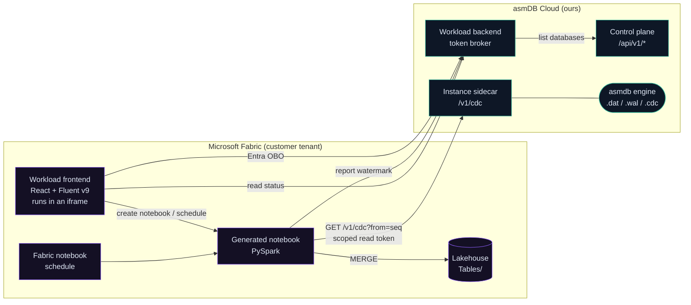
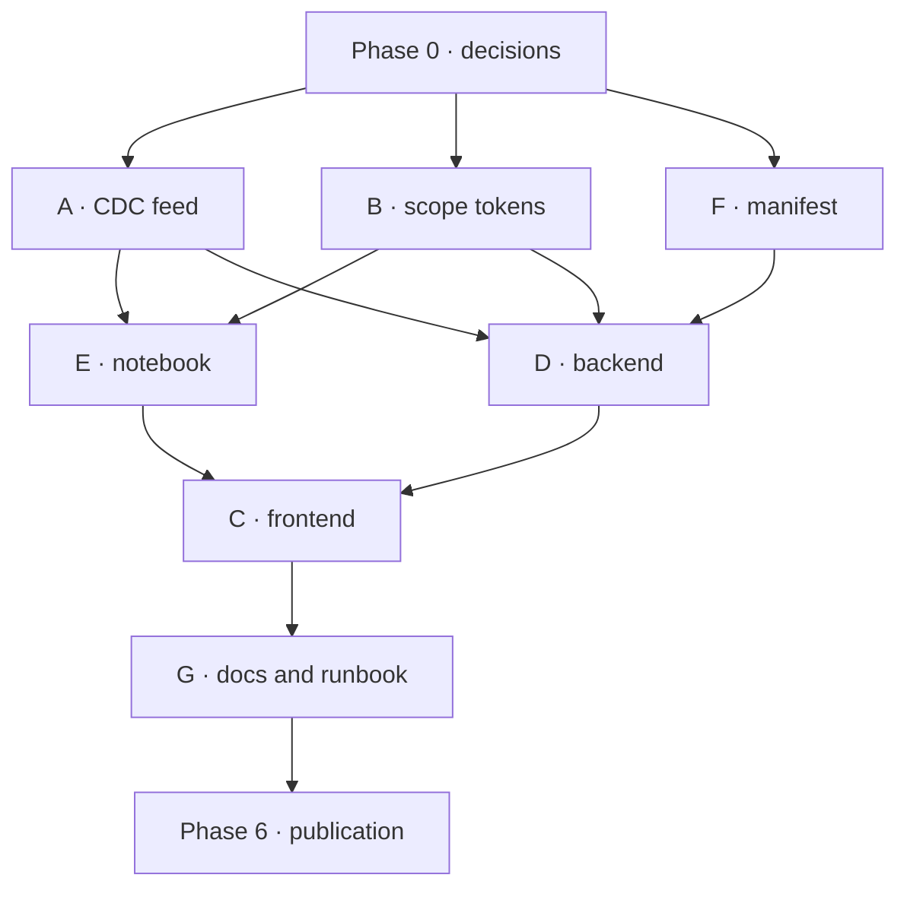

# asmDB Analytical Capabilities — a Microsoft Fabric workload

> **Status: plan. No code has been written yet.**
> This document is the architecture and the development plan. The visual target is
> [`workload/mockup/index.html`](../workload/mockup/index.html) — open it in a browser.

---

## 0. What this is, in one paragraph

asmDB is a transactional engine. It is deliberately not an analytical one: one fixed
256-byte record, one table per database, open-addressed hashing, no joins, no
aggregation. **asmDB Analytical Capabilities** is the bridge — a custom Fabric
workload that turns an asmDB database into a Delta table in a Fabric lakehouse and
keeps it current from the change log the engine already writes. The transactional
side stays small and fast; the analytical side is Fabric's job, which is what Fabric
is good at.

---

## 1. The decision that shapes everything

**Fabric Spark does the writing. We do not.**

The Extensibility Toolkit gives an item its own OneLake folder with `Files/` and
`Tables/`, and a client that can read and write **files**. It does **not** bundle a
Delta writer; `Tables/` is Delta or Iceberg and writing it needs Spark or the ADLS v2
API driven by something that understands the Delta protocol.[^onelake]

We could have written a sync service that speaks Delta. We are not going to, and the
reasons are worth stating because they also explain the shape of the whole product:

| If we ran the sync ourselves | If Fabric Spark runs it |
|---|---|
| We operate a service that must be up whenever a customer's data moves | Nothing of ours runs between syncs |
| We pay the compute | The customer's Fabric capacity pays, where their analytics budget already lives |
| We implement and maintain a Delta writer | Spark's writer, maintained by Microsoft |
| We schedule and retry | Fabric's notebook scheduler, which the customer already knows |
| The customer trusts a black box | **The customer can read the notebook** |

That last row is the one that matters most. The artefact we generate is a notebook in
the customer's own workspace, in their own language, doing something they can inspect
line by line. A data engineer who does not trust us can read it, change it, or write
their own. That is a much easier thing to adopt than an opaque connector.

So the workload is a **control plane, a notebook generator and a monitor**. It is not
a data plane. No customer row ever passes through anything we operate.

[^onelake]: `learn.microsoft.com/en-us/fabric/extensibility-toolkit/how-to-store-data-in-onelake`. The toolkit's `OneLakeStorageClient` exposes `writeFileAsText` / `writeFileAsBase64` / `readFileAsText` and shortcut management. Delta table writes are out of scope for it.

---

## 2. Architecture



### 2.1 Components and who owns them

| Component | New? | Where | Responsibility |
|---|---|---|---|
| **Workload frontend** | new | `workload/frontend/` | The surface in the mockup. Runs in a Fabric iframe. |
| **Workload backend** | new | `workload/backend/` | Token broker only. Exchanges the Fabric user's token for an asmDB Cloud call, and mints short-lived read-only CDC tokens for notebooks. |
| **Notebook templates** | new | `workload/notebooks/` | The PySpark that reads CDC and merges into Delta. Generated per link, owned by the customer once created. |
| **Manifest + packaging** | new | `workload/manifest/`, `workload/build/` | `WorkloadManifest.xml`, `Product.json`, item manifests, `.nuspec`. |
| **CDC feed** | **new, in asmDB** | `saas/sidecar/` | `GET /v1/cdc` — does not exist today. See §3. |
| **CDC scope tokens** | **new, in asmDB** | `saas/controlplane/` | A read-only credential that can read change frames and nothing else. |
| Engine | unchanged | `src/` | Already writes the change log we need. |

### 2.2 Where state lives

Sync-link definitions live in the **workload item's own OneLake folder** (`Files/links.json`),
not in a database of ours. The toolkit supports this natively and it means:

- the customer's configuration lives in the customer's tenant, which is where it belongs;
- deleting the item deletes the configuration, with no orphaned rows on our side;
- we do not operate a second datastore.

The **watermark** — how far a lakehouse has consumed — lives in the Delta table's own
properties, written by the notebook in the same transaction as the data. That is the
only way it can be correct: a watermark stored anywhere else can disagree with the data
after a failure. See §4.3.

---

## 3. The gap in asmDB, and what has to be built

**There is no way to read the change log over HTTP today.** The sidecar exposes
`/v1/rows`, `/v1/stats`, `/v1/exec` and the rest, and `CDCTRIM` is on the exec
allowlist — but nothing serves change frames.[^routes] The entire premise of this
workload depends on that endpoint, so it is the first thing to build and everything
else is blocked on it.

[^routes]: `saas/sidecar/http.go` route table as of 1.7.0.

### 3.1 What the engine already gives us

The format is genuinely well suited to this, which is why the design is simple.
From [`docs/CDC.md`](CDC.md):

- One durable frame per committed transaction, `commit_seq` **strictly increasing and dense**.
- Each operation is a fixed 272 bytes: `op_type` (1 = UPSERT, 2 = DELETE), `id`, and
  **the full 256-byte record image**. A consumer never has to query back to resolve an
  event — which means the notebook needs no read path into the transactional database
  at all. That is a real security property, not just a convenience.
- A `RESET` flag marks a global operation (`TRUNCATE`, `RESTORE`, format change).
- CRC-32 per frame plus a trailer, so a **torn** frame (crash mid-append) is
  distinguishable from a **corrupt** one.
- `CDCTRIM <seq>` gives the log a retention policy once a consumer has acknowledged a
  watermark.

### 3.2 `GET /v1/cdc` — proposed contract

```
GET /v1/cdc?from=<seq>&limit=<n>
Authorization: Bearer <cdc-read token>
Accept: application/x-ndjson
```

```json
{"commitSeq":"4211","flags":{"reset":false},"ops":[
  {"op":"upsert","id":"17850795121213","record":{"id":"...","value":"4","tag":"cdc","content":"...","created":"...","updated":"..."}},
  {"op":"delete","id":"17850795121200"}
]}
```

Design points that are **not** negotiable, because getting them wrong corrupts a
customer's warehouse silently:

1. **`from` below the log's base sequence must be an explicit, named error**, not an
   empty result. If the log has been trimmed past what the consumer asked for, the
   consumer has a hole. It must be told `cdc_gap`, with the current `baseSeq`, so the
   notebook can fall back to a full reseed. An empty 200 here would look like "nothing
   changed" and the lakehouse would quietly diverge from the database forever.
2. **A frame is either complete or absent.** Never serve a partial frame at the tail.
3. **`RESET` must be visible to the consumer**, because it means "everything you know is
   wrong, start again".
4. **Bounded response.** `limit` is capped server-side; the consumer pages by watermark.
5. **Read-only.** This endpoint must not accept the instance token — see §3.3.

### 3.3 A credential that can only read changes

Putting a full instance token into a customer's notebook would be indefensible: a
notebook is a shared, editable, printable artefact, and the instance token can write
and truncate. The workload needs a **CDC-read scope**: a credential that can call
`/v1/cdc` and `/v1/stats` and nothing else, is bound to one database, and expires.

This is the same principle already established for `/v1/prepare-upgrade`, where the
platform token can express exactly one operation and no caller value reaches the
engine. Extend the pattern rather than invent a second one.

Open question for design review: **who holds it?** Options are (a) the notebook fetches
it at run time from our backend using the workspace's managed identity, (b) it is
written into a Fabric-managed secret at link creation. (a) is better — nothing
long-lived is stored anywhere — but it costs a round trip per run and requires the
managed identity to be known to us. Decide before Phase 3.

---

## 4. How a sync actually works

### 4.1 Shapes

asmDB has **one table per database** — there is no notion of a table inside a
database.[^onetable] So a sync link is always *one asmDB database → one Delta table*.
The "Target Table Prefix" in the mockup exists because a lakehouse gathers many
databases: `sales_` + `orders_db` → `sales_orders_db`.

The record layout is fixed, so the Delta schema is known in advance and never has to be
inferred:

| Delta column | Source | Type |
|---|---|---|
| `id` | record `id` | `long` |
| `value` | record `value` | `long` |
| `tag` | record `tag` (39 usable bytes) | `string` |
| `content` | record `content` (175 usable bytes) | `string` |
| `created` | record `created` | `timestamp` |
| `updated` | record `updated` | `timestamp` |
| `_commit_seq` | frame `commit_seq` | `long` |
| `_deleted` | derived from op type | `boolean` |
| `_synced_at` | notebook run time | `timestamp` |

`_deleted` is carried rather than applied as a physical delete by default, so the
lakehouse keeps history and a late-arriving reader is not surprised by a vanished row.
Hard-delete is a per-link option.

[^onetable]: `saas/contracts/CONTRACTS.md` §1.

### 4.2 The notebook, in outline

```python
# 1. resolve the watermark from the Delta table itself
last_seq = spark.sql(f"DESCRIBE DETAIL {table}").select("properties").first() ... or 0

# 2. pull frames
resp = GET f"{endpoint}/v1/cdc?from={last_seq + 1}&limit=5000"

#    a gap means the log was trimmed past us: reseed, do not limp on
if resp.error == "cdc_gap":
    full_reseed(); return

#    a RESET frame means everything before it is void
if any(f.flags.reset for f in frames):
    full_reseed_from(first_reset_frame); return

# 3. collapse to one row per id — the last write in the batch wins
# 4. MERGE INTO ... WHEN MATCHED UPDATE / WHEN NOT MATCHED INSERT
# 5. write the new watermark as a table property, in the same transaction
# 6. acknowledge the watermark so asmDB can CDCTRIM
```

### 4.3 Correctness, stated plainly

- **Exactly once is achieved by idempotence, not by delivery guarantees.** The notebook
  may run twice on the same range; `MERGE` on `id` with the full record image makes that
  harmless.
- **The watermark must be committed with the data.** If it lived in a separate store, a
  crash between the two writes would either replay (harmless) or skip (silent data
  loss). Delta table properties are written transactionally; use them.
- **Trim only what has been acknowledged.** `CDCTRIM` is destructive and irreversible.
  Only advance it on a watermark a lakehouse has actually committed.
- **A gap is an incident, not a retry.** Report it, reseed, and surface it in the UI —
  the "Warning" state in the mockup is exactly this case.

---

## 5. Fabric integration — what is supported, and what we do not yet know

Verified against the toolkit and Microsoft Learn (July 2026). **The uncertainties are
listed as uncertainties**; they should be resolved before the phase that depends on them.

| Capability | Status | Consequence for us |
|---|---|---|
| Frontend in an iframe, `allow-same-origin allow-scripts` | Supported | Our surface is a normal SPA. |
| Backend optional; toolkit default is frontend-only | Supported | Our backend stays thin — token brokering only. |
| Create a Notebook item via `items.createItem` | Supported | "Generate Notebook" is real. |
| Run a notebook on demand / on a schedule | Supported via Fabric Job Scheduler REST + Spark Livy | Cadence is Fabric's, not ours. |
| Write `Files/` from the frontend | Supported | Link definitions live there. |
| Write `Tables/` (Delta) from the workload | **Not supported by the toolkit** | Confirms §1 — Spark writes. |
| **Custom workloads contributing lineage edges** | **Not documented** | ⚠️ See below. |
| Fabric scheduler support *in the toolkit* | **Marked "under development"** | ⚠️ Use the notebook's own schedule; do not build on the toolkit's job type until it lands. |
| Custom brand colours | Architecturally supported via `createDarkTheme` | ⚠️ Publishing to the Workload Hub requires Fabric UX compliance; the exact limits are not published. |

**On lineage — read this before building the panel.** The documentation says workload
items "participate in lineage", but no API, manifest field or SDK method for a custom
workload to *report* an edge (`this database → that table`) could be found. Until that
is confirmed with Microsoft, **the "Current Lineage" panel in the mockup is our own
view of our own links, drawn from our own state** — not an injection into Fabric's
lineage graph. The mockup is honest about this only if we are: the panel is titled
"Current Lineage" and shows asmDB→lakehouse edges we know about. It must not imply
that opening Fabric's lineage view will show the same edges. If it turns out we *can*
contribute, that is an enhancement, not a redesign.

**On branding.** Fluent UI v9 takes a 16-shade brand ramp and builds a theme from it.
Our cyan (`oklch(82% 0.145 205)`) and violet (`oklch(70% 0.19 292)`) can drive that ramp,
and `theme.onChange` lets us follow the host between light and dark. For a
tenant-internal workload this is unconstrained. For Workload Hub publication, Fabric UX
compliance applies and we do not know how strictly — **resolve before Phase 6, not
after**, because it is much cheaper to constrain a palette than to restyle an app.

**SkyNav is the working reference for everything mechanical** — manifest shapes, the
`bootstrap({ initializeWorker, initializeUI })` entry point, token acquisition, JWT
validation with `jose`, `.nupkg` packaging, and the deploy order. It is deliberately
*not* a reference for theming: it ships stock `webLightTheme` with hardcoded hex
literals scattered through components. We are doing the opposite.

---

## 6. Development plan

Seven workstreams. **Scopes are disjoint by directory** so they can run in parallel
without agents overwriting each other — the same discipline used for the 1.7.0 security
work, where four agents worked simultaneously without a single collision.

### Phase 0 — decisions (blocking, no code)

| # | Decision | Why it blocks |
|---|---|---|
| D1 | CDC token delivery: notebook fetches at run time, or stored secret? | Changes the backend's shape and the notebook's first cell. |
| D2 | Tenant-internal only, or Workload Hub publication? | Decides whether Fabric UX compliance constrains the palette. |
| D3 | Default sync cadence and the lag we are willing to promise | The mockup shows ~1.2 s lag; that is a claim, and claims get measured. |
| D4 | Hard-delete or tombstone by default | Affects schema and every downstream query. |

### Phase 1 — the CDC feed *(blocks everything else)*

**Workstream A — engine and sidecar.** Scope: `saas/sidecar/`, `tests/`, `docs/CDC.md`.

- `GET /v1/cdc?from=&limit=` serving NDJSON frames, bounded, with the `cdc_gap` error.
- Refuse the instance token; accept only the CDC-read scope.
- Never serve a torn frame.
- Tests: gap detection, RESET propagation, torn-tail handling, pagination, cap enforcement, wrong-credential refusal.

**Workstream B — control plane.** Scope: `saas/controlplane/`.

- Mint CDC-read scope tokens: bound to one database, short-lived, revocable.
- Record which lakehouse consumes which database, and the acknowledged watermark.
- Advance `CDCTRIM` only on acknowledged watermarks.

*Exit criterion: a plain `curl` with a CDC token can page through a live database's change log, and a trimmed log produces `cdc_gap` rather than an empty page.*

### Phase 2 — the notebook *(depends on Phase 1)*

**Workstream E.** Scope: `workload/notebooks/`.

- Parameterised PySpark template: pull, collapse, `MERGE`, watermark, acknowledge.
- Full-reseed path, triggered by `cdc_gap` and by `RESET`.
- Idempotence test: run the same range twice, assert the table is identical.
- Correctness test against a database under concurrent write.

*Exit criterion: a notebook run by hand syncs a live asmDB database into a Delta table, twice, with the same result.*

### Phase 3 — workload skeleton *(parallel with Phase 2)*

**Workstream F — manifest and packaging.** Scope: `workload/manifest/`, `workload/build/`.

- `WorkloadManifest.xml` (`Org.AsmdbAnalytical`, `HostingType="FERemote"`), `Product.json`, one item manifest, `.nuspec`.
- Entra app registration, `.nupkg` build, and the documented upload/enable sequence.

**Workstream D — backend.** Scope: `workload/backend/`.

- Fabric JWT validation with `jose` and a remote JWKS, following SkyNav's middleware.
- OBO exchange to call asmDB Cloud.
- CDC token minting endpoint per D1.
- CORS allowing `*.fabric.microsoft.com`, `trust proxy`, per-route rate limits.

*Exit criterion: an empty workload loads inside Fabric, authenticates, and lists the caller's asmDB databases.*

### Phase 4 — the surface *(depends on Phase 3)*

**Workstream C — frontend.** Scope: `workload/frontend/`.

Build in the mockup's order, because that is the order a user meets it:

1. Shell, header, KPI strip.
2. Create Sync Link — the core flow.
3. Lineage panel (our own edges — see §5).
4. Recent Sync Activity, Selected Link Details.
5. Coverage & Readiness.

Non-negotiables carried over from asmDB Cloud, all of which were bugs we have already
paid for once:

- A timeout is **not** a failure. Show the last good sample, marked stale.
- Distinguish *no data* from *not configured* from *request failed*. Three states, three messages.
- Never present a reservation as consumption.
- No status conveyed by colour alone.
- Every published number is real or explicitly absent — never a plausible placeholder.

### Phase 5 — operations

**Workstream G.** Scope: `docs/`, `workload/docs/`.

- Runbook: a link is lagging; a gap was detected; a notebook failed; a token expired.
- Cost model, in the manner of [`COST.md`](COST.md): whose capacity pays for what, measured rather than estimated.
- Update `README.md`, `CONTRACTS.md` (new endpoint, new scope), `SECURITY.md` (new credential class).

### Phase 6 — publication *(gated on D2)*

- Fabric UX compliance review if publishing to the Workload Hub.
- Tenant settings, capacity enablement, `.nupkg` upload.

### Dependency graph



Phases 2 and 3 overlap. Phase 4 is the long pole and cannot start before the backend
answers, so **do not let Workstream C wait on a finished backend** — agree the
contract first and let the frontend build against it.

---

## 7. Risks, ranked by what they would actually cost

| Risk | Consequence | Mitigation |
|---|---|---|
| **A trimmed log is treated as "no changes"** | A lakehouse silently diverges from the database, indefinitely, and nobody notices until someone reconciles by hand | `cdc_gap` is an explicit error; the notebook reseeds; the UI raises it. This is the single most important correctness rule in the design. |
| **The CDC token leaks through a shared notebook** | Read access to a customer's transactional data | Scope it to reads, bind it to one database, expire it, prefer run-time fetch over storage |
| Lineage cannot be contributed to Fabric | The panel is ours alone, less valuable than it looks | Already assumed. Anything better is upside. |
| Fabric UX compliance forbids our palette | Restyling late | Resolve D2 before Phase 4 |
| Toolkit scheduler is "under development" | Building on a moving API | Use the notebook's own schedule |
| A large database's first sync is slow | Bad first impression | Seed from a `BACKUP` snapshot, then tail the log from that watermark |
| asmDB free tier is 393,216 rows | Analytics on a free-tier database is not interesting | Position for `premium`; the mockup already says "premium databases" |

---

## 8. What we are explicitly not building

- **No reverse sync.** Fabric never writes back into asmDB. One direction only — the
  engine is single-writer and a second writer would be a correctness disaster.
- **No transformation layer.** We land the table faithfully. Modelling belongs in the
  lakehouse, where the customer already has tools.
- **No scheduler of our own.** Fabric has one.
- **No data plane.** No customer row transits anything we operate.

---

## 9. Naming

- Workload: **asmDB Analytical Capabilities**
- Workload id: `Org.AsmdbAnalytical`
- Item type: `Org.AsmdbAnalytical.SyncHub`
- Mockup: [`workload/mockup/index.html`](../workload/mockup/index.html)

---

## 10. References

| Source | Used for |
|---|---|
| `github.com/microsoft/fabric-extensibility-toolkit` | Manifest schema, client SDK, OneLake and scheduler clients, theming |
| `learn.microsoft.com/en-us/fabric/extensibility-toolkit/` | Hosting model, OneLake storage, Fabric API access, publishing |
| `github.com/fredgis/SkyNav` | A working workload: manifest shapes, bootstrap, JWT validation, packaging, deploy order |
| [`docs/CDC.md`](CDC.md) | Change log format, sequences, RESET, retention |
| [`saas/contracts/CONTRACTS.md`](../saas/contracts/CONTRACTS.md) | asmDB Cloud API surface, tiers, one-table-per-database |
| [`docs/SECURITY.md`](SECURITY.md) | Existing credential classes and the narrow-scope precedent |
