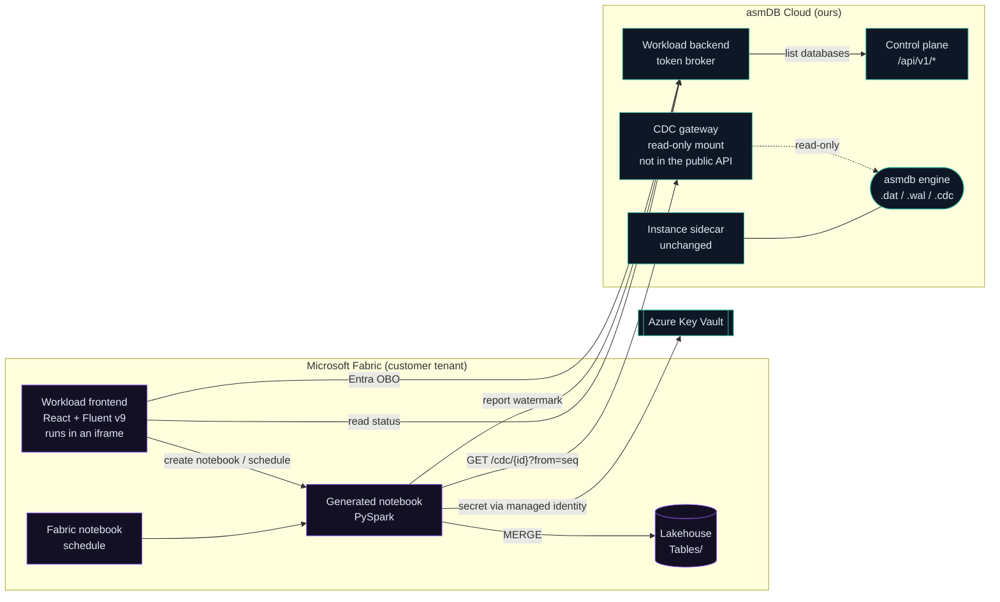
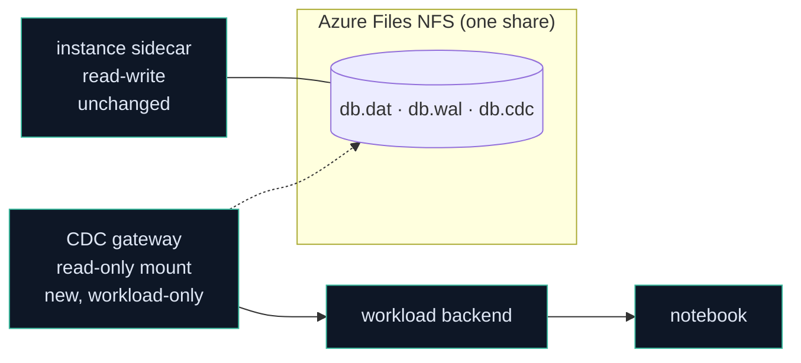
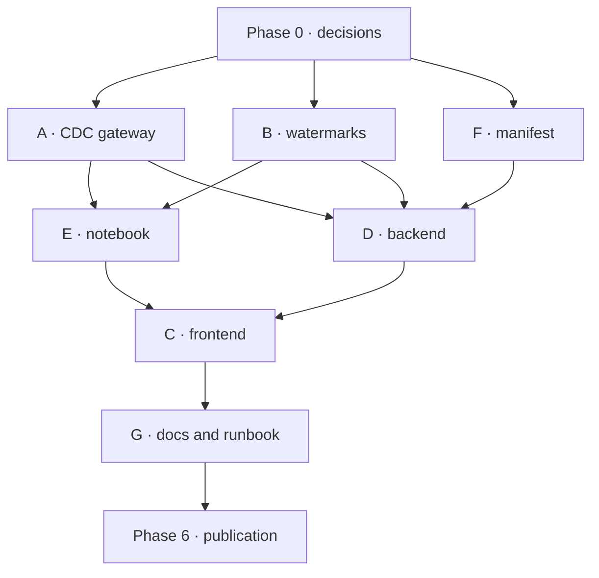

# asmDB Analytical Capabilities — a Microsoft Fabric workload

> **Status: plan. No code has been written yet.**
> This document is the architecture and the development plan. The visual target is
> [`workload/mockup/index.html`](../workload/mockup/index.html) — open it in a browser.

---

## 0. What this is, in one paragraph

asmDB is a transactional engine. It is deliberately not an analytical one: one fixed
256-byte record, one table per database, open-addressed hashing, no joins, no
aggregation. **asmDB Analytical Capabilities** is the bridge — a custom Fabric
workload that turns an asmDB database into a Delta table in a Fabric lakehouse and
keeps it current from the change log the engine already writes. The transactional
side stays small and fast; the analytical side is Fabric's job, which is what Fabric
is good at.

---

## 1. The decision that shapes everything

**Fabric Spark does the writing. We do not.**

The Extensibility Toolkit gives an item its own OneLake folder with `Files/` and
`Tables/`, and a client that can read and write **files**. It does **not** bundle a
Delta writer; `Tables/` is Delta or Iceberg and writing it needs Spark or the ADLS v2
API driven by something that understands the Delta protocol.[^onelake]

We could have written a sync service that speaks Delta. We are not going to, and the
reasons are worth stating because they also explain the shape of the whole product:

| If we ran the sync ourselves | If Fabric Spark runs it |
|---|---|
| We operate a service that must be up whenever a customer's data moves | Nothing of ours runs between syncs |
| We pay the compute | The customer's Fabric capacity pays, where their analytics budget already lives |
| We implement and maintain a Delta writer | Spark's writer, maintained by Microsoft |
| We schedule and retry | Fabric's notebook scheduler, which the customer already knows |
| The customer trusts a black box | **The customer can read the notebook** |

That last row is the one that matters most. The artefact we generate is a notebook in
the customer's own workspace, in their own language, doing something they can inspect
line by line. A data engineer who does not trust us can read it, change it, or write
their own. That is a much easier thing to adopt than an opaque connector.

So the workload is a **control plane, a notebook generator and a monitor**. It is not
a data plane. No customer row ever passes through anything we operate.

[^onelake]: `learn.microsoft.com/en-us/fabric/extensibility-toolkit/how-to-store-data-in-onelake`. The toolkit's `OneLakeStorageClient` exposes `writeFileAsText` / `writeFileAsBase64` / `readFileAsText` and shortcut management. Delta table writes are out of scope for it.

---

## 2. Architecture



### 2.1 Components and who owns them

| Component | New? | Where | Responsibility |
|---|---|---|---|
| **Workload frontend** | new | `workload/frontend/` | The surface in the mockup. Runs in a Fabric iframe. |
| **Workload backend** | new | `workload/backend/` | Token broker only. Exchanges the Fabric user's token for an asmDB Cloud call, and mints short-lived read-only CDC tokens for notebooks. |
| **Notebook templates** | new | `workload/notebooks/` | The PySpark that reads CDC and merges into Delta. Generated per link, owned by the customer once created. |
| **Manifest + packaging** | new | `workload/manifest/`, `workload/build/` | `WorkloadManifest.xml`, `Product.json`, item manifests, `.nuspec`. |
| **CDC gateway** | **new** | `workload/cdc-gateway/` | Reads `<db>.cdc` from a read-only mount and serves frames. Not exposed in the public API. See §3. |
| **Watermark registry** | **new** | `saas/controlplane/` | Records the acknowledged watermark per link and advances `CDCTRIM` only on it. |
| Engine | unchanged | `src/` | Already writes the change log we need. |

### 2.2 Where state lives

Sync-link definitions and **lineage** live in the **workload item's own OneLake folder**
(`Files/`), not in a database of ours. The toolkit supports this natively and it means:

- the customer's configuration lives in the customer's tenant, which is where it belongs;
- deleting the item deletes the configuration, with no orphaned rows on our side;
- we do not operate a second datastore.

**Lineage is applicational and we store it ourselves.** Fabric does not document a way
for a custom workload to contribute lineage edges (§5), so the edges shown in the
mockup — *this asmDB database feeds that lakehouse table* — are facts we know and
nobody else does. They are written to `Files/lineage/` as the links are created and
read back when the item is opened, so the graph is there immediately rather than
rebuilt by probing every database on every load. Practically:

```
{workspaceId}/{itemId}/Files/
├── links.json            one entry per sync link: source, target, decoder, schedule
├── lineage/
│   ├── graph.json        nodes and edges, with the run that last proved each edge
│   └── history/          append-only snapshots, so a lineage change is auditable
└── runs/                 recent run outcomes, for the activity panel
```

Writing lineage down rather than deriving it also survives the case that matters: an
asmDB database that has been deleted, or a lakehouse the caller can no longer see. The
edge still existed, and a lineage view that forgets deleted things is not a lineage
view.

The **watermark** — how far a lakehouse has consumed — is the exception. It lives in the
Delta table's own properties, written by the notebook in the same transaction as the
data. That is the only place it can be correct; see §4.5.

---

## 3. Reading the change log without touching the SaaS

**There is no way to read the change log over HTTP today.** The sidecar exposes
`/v1/rows`, `/v1/stats`, `/v1/exec` and the rest, and `CDCTRIM` is on the exec
allowlist — but nothing serves change frames.[^routes]

The obvious move would be to add `GET /v1/cdc` to the sidecar. **We are not doing
that.** The sidecar is the customer-facing data plane of a transactional database; it
holds an exclusive lock, it is the thing a paying customer's writes go through, and it
was the source of three separate correctness defects in the last release. Adding a new
route to it to serve a *different product* would put analytics traffic on the path of
transactional writes, and would widen the surface of a component whose job is to be
small.

Instead: **a separate CDC gateway that reads the log from the share, read-only.**



### 3.1 Why this works, and why it is safe

- **The format was designed to be followed by another process.** `docs/CDC.md` says so
  in as many words, and `tests/cdc_dump.py` is a dependency-free reference reader that
  already does it. We are not inventing a capability; we are deploying the one that
  exists.
- **Read-only at the filesystem level, not by policy.** The gateway mounts the share
  read-only. It is not trusted to behave; it is unable to misbehave.
- **The engine is untouched.** No new assembly, no new sidecar route, no new lock
  holder. A bug in the gateway cannot corrupt a database or block a write.
- **Torn frames are already distinguishable.** Every frame carries a CRC-32 and a
  trailer, precisely so a reader can tell a crash-truncated tail from real damage. The
  gateway stops at the last complete frame and comes back later.
- **It is not in `asmdb.cloud`.** The gateway is deployed with the workload, not with
  the public API surface. A customer who does not use Fabric never has it in their path.

### 3.2 What the gateway serves

```
GET /cdc/{instanceId}?from=<seq>&limit=<n>
Authorization: Bearer <workload backend credential>
Accept: application/x-ndjson
```

```json
{"commitSeq":"4211","flags":{"reset":false},"ops":[
  {"op":"upsert","id":"17850795121213","record":{"id":"...","value":"7240172205118292613","tag":"cdc","content":"...","created":"...","updated":"..."}},
  {"op":"delete","id":"17850795121200"}
]}
```

Rules that are **not** negotiable, because getting them wrong corrupts a customer's
warehouse silently:

1. **`from` below the log's base sequence is a named error, never an empty page.**
   `CDCTRIM` is a retention policy; once it has run, a consumer asking for a trimmed
   sequence has a hole. It must be told `cdc_gap` with the current `baseSeq` so the
   notebook can reseed. An empty `200` here would read as "nothing changed" and the
   lakehouse would diverge from the database quietly and permanently. **This is the
   single most important line in the design.**
2. **Never serve a partial frame.** Stop at the last valid trailer.
3. **`RESET` must reach the consumer.** It means "everything you knew is void".
4. **Bounded responses.** `limit` capped server-side; consumers page by watermark.
5. **The gateway never writes.** Not to the share, not to the database, not ever.

### 3.3 What asmDB already gives us

From [`docs/CDC.md`](CDC.md), and the reason this is tractable at all:

- One durable frame per committed transaction, `commit_seq` **strictly increasing and
  dense**.
- Each operation is a fixed 272 bytes carrying **the full 256-byte record image**, so a
  consumer never queries back. The notebook needs no read path into the transactional
  database at all — a real security property, not a convenience.
- A `RESET` flag for global operations (`TRUNCATE`, `RESTORE`).
- CRC-32 per frame plus a trailer.
- `CDCTRIM <seq>` for retention, once a watermark is acknowledged.

### 3.4 Credentials — resolved

**Decision D1: tokens live in Azure Key Vault and are fetched by the workspace's
managed identity.** So no long-lived secret is stored in a notebook, and no credential
is written into an artefact the customer can print or share. The notebook's first cell
resolves the secret through the managed identity it already runs under; the gateway
validates it and nothing else can call the gateway.

That also removes the option of putting a *database* token anywhere near a notebook,
which would have been indefensible: an instance token can write and truncate, and a
notebook is a shared, editable, printable object.

[^routes]: `saas/sidecar/http.go` route table as of 1.7.0.

---

## 4. How a sync actually works

### 4.1 Shapes

asmDB has **one table per database** — there is no notion of a table inside a
database.[^onetable] So a sync link is always *one asmDB database → one Delta table*.
The "Target Table Prefix" in the mockup exists because a lakehouse gathers many
databases: `sales_` + `orders_db` → `sales_orders_db`.

[^onetable]: `saas/contracts/CONTRACTS.md` §1.

### 4.2 Decoding the content field

A record carries a 175-byte `content` field. In a transactional store it is free text
written and read by the same application, so it is frequently *not* text: hex, Base64,
a JSON document, a CSV line, a MessagePack blob.

That is fine transactionally and unhelpful analytically — a column of
`7b226964223a3132...` cannot be filtered or grouped.

So a sync link carries an optional **content decoder**, applied by the notebook before
the merge. **The default is `None`**: content lands as text, unchanged. Anything else is
an explicit choice the customer makes, because a decoder is an assertion about data we
did not write.

| Decoder | Produces |
|---|---|
| `None` *(default)* | `content` as text, untouched |
| `Hex` | decoded bytes, as a string or binary column |
| `Base64` | decoded bytes |
| `JSON` | parsed into typed columns |
| `CSV` | split into declared columns |
| `MessagePack` | parsed into typed columns |

Three rules keep it honest:

1. **The raw content is always kept**, as `content_raw`. A decoder is an interpretation,
   and interpretations turn out to be wrong. Discarding the source makes that
   unrecoverable.
2. **A row that fails to decode is not dropped.** It keeps its raw content and sets
   `_decode_error`. Silently discarding rows that do not fit an assumption is how a
   warehouse ends up quietly incomplete.
3. **Changing a decoder requires a reseed**, because rows already in the table were
   decoded under the old one. The UI says so before it lets the change through.

### 4.3 The resulting Delta schema

| Delta column | Source | Type |
|---|---|---|
| `id` | record `id` | `long` |
| `value` | record `value` | `long` |
| `tag` | record `tag` (39 usable bytes) | `string` |
| `content_raw` | record `content` (175 usable bytes) | `string` |
| *(decoder columns)* | decoded `content` | declared |
| `created` | record `created` | `timestamp` |
| `updated` | record `updated` | `timestamp` |
| `_commit_seq` | frame `commit_seq` | `long` |
| `_deleted` | frame op type | `boolean` |
| `_decode_error` | decoder outcome | `string` |
| `_synced_at` | notebook run time | `timestamp` |

**Decision D4: tombstone by default.** A `DELETE` frame sets `_deleted = true` and keeps
the row. In analytics, "this order existed and was then cancelled" is a fact, not noise,
and a physical delete breaks every time-travel query over that period. Hard delete stays
available per link — but it is irreversible, so it is not the default.

### 4.4 The notebook, in outline

```python
# 1. resolve the watermark from the Delta table itself
last_seq = spark.sql(f"DESCRIBE DETAIL {table}").select("properties").first() ... or 0

# 2. pull frames
resp = GET f"{gateway}/cdc/{instance_id}?from={last_seq + 1}&limit=5000"

#    a gap means the log was trimmed past us: reseed, do not limp on
if resp.error == "cdc_gap":
    full_reseed(); return

#    a RESET frame means everything before it is void
if any(f.flags.reset for f in frames):
    full_reseed_from(first_reset_frame); return

# 3. collapse to one row per id — the last write in the batch wins
# 4. MERGE INTO ... WHEN MATCHED UPDATE / WHEN NOT MATCHED INSERT
# 5. write the new watermark as a table property, in the same transaction
# 6. acknowledge the watermark so asmDB can CDCTRIM
```

### 4.5 Correctness, stated plainly

- **Exactly once is achieved by idempotence, not by delivery guarantees.** The notebook
  may run twice on the same range; `MERGE` on `id` with the full record image makes that
  harmless.
- **The watermark must be committed with the data.** If it lived in a separate store, a
  crash between the two writes would either replay (harmless) or skip (silent data
  loss). Delta table properties are written transactionally; use them.
- **Trim only what has been acknowledged.** `CDCTRIM` is destructive and irreversible.
  Only advance it on a watermark a lakehouse has actually committed.
- **A gap is an incident, not a retry.** Report it, reseed, and surface it in the UI —
  the "Warning" state in the mockup is exactly this case.

---

## 5. Fabric integration — what is supported, and what we do not yet know

Verified against the toolkit and Microsoft Learn (July 2026). **The uncertainties are
listed as uncertainties**; they should be resolved before the phase that depends on them.

| Capability | Status | Consequence for us |
|---|---|---|
| Frontend in an iframe, `allow-same-origin allow-scripts` | Supported | Our surface is a normal SPA. |
| Backend optional; toolkit default is frontend-only | Supported | Our backend stays thin — token brokering only. |
| Create a Notebook item via `items.createItem` | Supported | "Generate Notebook" is real. |
| Run a notebook on demand / on a schedule | Supported via Fabric Job Scheduler REST + Spark Livy | Cadence is Fabric's, not ours. |
| Write `Files/` from the frontend | Supported | Link definitions live there. |
| Write `Tables/` (Delta) from the workload | **Not supported by the toolkit** | Confirms §1 — Spark writes. |
| **Custom workloads contributing lineage edges** | **Not documented** | ⚠️ See below. |
| Fabric scheduler support *in the toolkit* | **Marked "under development"** | ⚠️ Use the notebook's own schedule; do not build on the toolkit's job type until it lands. |
| Custom brand colours | Architecturally supported via `createDarkTheme` | ⚠️ Publishing to the Workload Hub requires Fabric UX compliance; the exact limits are not published. |

**On lineage — resolved by decision, not by API.** The documentation says workload items
"participate in lineage", but no API, manifest field or SDK method lets a custom
workload *report* an edge (`this database → that table`). So we store our own:
`Files/lineage/` in the item's OneLake folder, written when a link is created and read
when the item opens (§2.2). These edges are **applicational** — they are true, they are
ours, and Fabric's own lineage view will not show them. The UI must therefore never
imply otherwise: the panel is titled "Current Lineage" and describes asmDB→lakehouse
links we know about. If Microsoft later exposes a contribution API, publishing to it
becomes an addition, not a redesign, because the data is already modelled and stored.

**On scheduling — resolved.** The toolkit's own Fabric-scheduler support is marked
*under development*, so we do not build on it. A generated notebook is a first-class
Fabric item and carries its own schedule; that is what drives cadence. It is also what
the customer already knows how to change, which is worth more than an integration we
would have to explain.

**On branding — see the D2 warning in Phase 0.** Fluent UI v9 takes a 16-shade brand
ramp; our cyan and violet can drive it, and `theme.onChange` lets us follow the host
between light and dark. But we are publishing to the Workload Hub, so Fabric UX
compliance applies and its limits are unpublished. This is now a scheduling risk, not a
footnote.

**SkyNav is the working reference for everything mechanical** — manifest shapes, the
`bootstrap({ initializeWorker, initializeUI })` entry point, token acquisition, JWT
validation with `jose`, `.nupkg` packaging, and the deploy order. It is deliberately
*not* a reference for theming: it ships stock `webLightTheme` with hardcoded hex
literals scattered through components. We are doing the opposite.

---

## 6. Development plan

Seven workstreams. **Scopes are disjoint by directory** so they can run in parallel
without agents overwriting each other — the same discipline used for the 1.7.0 security
work, where four agents worked simultaneously without a single collision.

### Phase 0 — decisions

**All four are answered.** Recorded here because the rest of the plan depends on them.

| # | Decision | Answer | Consequence |
|---|---|---|---|
| D1 | How the notebook gets a credential | **Azure Key Vault, fetched by the workspace's managed identity** | No secret is stored in a notebook or in OneLake. The gateway trusts the managed identity, not a copied string. |
| D2 | Distribution | **Workload Hub publication**, with a custom domain and a manifest upload | Fabric UX compliance now genuinely applies — see the warning below. |
| D3 | Cadence | **Analytics, not real time.** Minutes, not seconds | The mockup's lag figures are minutes. Do not promise seconds; §7 explains why the number in a screenshot becomes a commitment. |
| D4 | Deleted rows | **Tombstone by default**, hard delete per link | `_deleted` is carried; history and time travel survive. |

> ⚠️ **D2 makes the palette a real risk, not a theoretical one.** Publishing to the
> Workload Hub requires compliance with the [Fabric UX system](https://aka.ms/fabricux),
> and the published rules do not say how far a workload may depart from Fabric's own
> palette. Our brand is a dark navy with a cyan-to-violet accent, and the mockup commits
> to it. **Get this answered before Phase 4 begins**, not after the surface is built:
> constraining a palette costs an afternoon, restyling a finished application costs a
> week. If compliance turns out to be strict, the fallback is a Fabric-native palette
> with our accent used only for our own marks and states — which is a smaller loss than
> it sounds, and is a decision better made deliberately than discovered late.

### Phase 1 — the CDC gateway *(blocks everything else)*

**Workstream A — gateway.** Scope: `workload/cdc-gateway/`. **Does not touch `src/` or
`saas/sidecar/`.**

- Mount the instance share **read-only**; parse `<db>.cdc` per [`docs/CDC.md`](CDC.md).
- `GET /cdc/{instanceId}?from=&limit=` serving NDJSON, bounded.
- `cdc_gap` when `from` precedes the log's base sequence — never an empty page.
- Stop at the last complete frame; a torn tail is normal, not an error.
- Authenticate the workload backend only; refuse everything else.
- Tests: gap detection, `RESET` propagation, torn-tail handling, pagination, cap
  enforcement, a log being appended to while it is read, and a log trimmed underneath
  a reader mid-page.

**Workstream B — control plane.** Scope: `saas/controlplane/`. Minimal by design.

- Resolve an instance id to its share path and confirm the caller may read it.
- Record the acknowledged watermark per link and advance `CDCTRIM` only on it.
- Nothing else. The public API surface does not grow a CDC route.

*Exit criterion: a plain `curl` against the gateway pages through a live database's change log while that database is being written to, and a trimmed log produces `cdc_gap` rather than an empty page.*

### Phase 2 — the notebook *(depends on Phase 1)*

**Workstream E.** Scope: `workload/notebooks/`.

- Parameterised PySpark template: pull, collapse, `MERGE`, watermark, acknowledge.
- Full-reseed path, triggered by `cdc_gap` and by `RESET`.
- Idempotence test: run the same range twice, assert the table is identical.
- Correctness test against a database under concurrent write.

*Exit criterion: a notebook run by hand syncs a live asmDB database into a Delta table, twice, with the same result.*

### Phase 3 — workload skeleton *(parallel with Phase 2)*

**Workstream F — manifest and packaging.** Scope: `workload/manifest/`, `workload/build/`.

- `WorkloadManifest.xml` (`Org.AsmdbAnalytical`, `HostingType="FERemote"`), `Product.json`, one item manifest, `.nuspec`.
- Entra app registration, `.nupkg` build, and the documented upload/enable sequence.

**Workstream D — backend.** Scope: `workload/backend/`.

- Fabric JWT validation with `jose` and a remote JWKS, following SkyNav's middleware.
- OBO exchange to call asmDB Cloud.
- CDC token minting endpoint per D1.
- CORS allowing `*.fabric.microsoft.com`, `trust proxy`, per-route rate limits.

*Exit criterion: an empty workload loads inside Fabric, authenticates, and lists the caller's asmDB databases.*

### Phase 4 — the surface *(depends on Phase 3)*

**Workstream C — frontend.** Scope: `workload/frontend/`.

Build in the mockup's order, because that is the order a user meets it:

1. Shell, header, KPI strip.
2. Create Sync Link — the core flow.
3. Lineage panel (our own edges — see §5).
4. Recent Sync Activity, Selected Link Details.
5. Coverage & Readiness.

Non-negotiables carried over from asmDB Cloud, all of which were bugs we have already
paid for once:

- A timeout is **not** a failure. Show the last good sample, marked stale.
- Distinguish *no data* from *not configured* from *request failed*. Three states, three messages.
- Never present a reservation as consumption.
- No status conveyed by colour alone.
- Every published number is real or explicitly absent — never a plausible placeholder.

### Phase 5 — operations

**Workstream G.** Scope: `docs/`, `workload/docs/`.

- Runbook: a link is lagging; a gap was detected; a notebook failed; a token expired.
- Cost model, in the manner of [`COST.md`](COST.md): whose capacity pays for what, measured rather than estimated.
- Update `README.md`, `CONTRACTS.md` (new endpoint, new scope), `SECURITY.md` (new credential class).

### Phase 6 — publication

- Fabric UX compliance review. **Do this at the start of Phase 4, not here** — by this point the surface is built and a compliance failure is expensive.
- Tenant settings, capacity enablement, `.nupkg` upload.

### Dependency graph



Phases 2 and 3 overlap. Phase 4 is the long pole and cannot start before the backend
answers, so **do not let Workstream C wait on a finished backend** — agree the
contract first and let the frontend build against it.

---

## 7. Risks, ranked by what they would actually cost

| Risk | Consequence | Mitigation |
|---|---|---|
| **A trimmed log is treated as "no changes"** | A lakehouse silently diverges from the database, indefinitely, and nobody notices until someone reconciles by hand | `cdc_gap` is an explicit error; the notebook reseeds; the UI raises it. This is the single most important correctness rule in the design. |
| **The gateway reads a log while it is being written and trimmed** | Torn frames read as corruption; a trim under a paging reader looks like a gap that is not one | The format was built for this: per-frame CRC and a trailer distinguish a torn tail from damage. Stop at the last complete frame. Re-check `baseSeq` on every page, and treat a mid-page trim as a gap rather than guessing. Test both explicitly. |
| **A decoder is wrong** | Typed columns are silently meaningless — worse than no decoding, because they look authoritative | Default is `None`; always keep `content_raw`; never drop a row that fails to decode; require a reseed when a decoder changes |
| **Fabric UX compliance forbids our palette** | Restyling a finished application | **D2 is now "publish to the Hub", so this is live.** Resolve at the start of Phase 4. |
| Lineage cannot be contributed to Fabric | Our edges are ours alone | Already assumed and designed for: stored in `Files/lineage/`, presented as ours |
| **The gateway's mount is misconfigured read-write** | A bug in analytics could damage a transactional database | Read-only at the mount, asserted at startup and in a test, not merely intended |
| A large database's first sync is slow | Bad first impression | Seed from a `BACKUP` snapshot, then tail the log from that watermark |
| asmDB free tier is 393,216 rows | Analytics on a free-tier database is not interesting | Position for `premium`; the mockup already says "premium databases" |

---

## 8. What we are explicitly not building

- **No reverse sync.** Fabric never writes back into asmDB. One direction only — the
  engine is single-writer and a second writer would be a correctness disaster.
- **No transformation layer.** We land the table faithfully. Modelling belongs in the
  lakehouse, where the customer already has tools.
- **No scheduler of our own.** Fabric has one.
- **No data plane.** No customer row transits anything we operate.

---

## 9. Naming

- Workload: **asmDB Analytical Capabilities**
- Workload id: `Org.AsmdbAnalytical`
- Item type: `Org.AsmdbAnalytical.SyncHub`
- Mockup: [`workload/mockup/index.html`](../workload/mockup/index.html)

---

## 10. References

| Source | Used for |
|---|---|
| `github.com/microsoft/fabric-extensibility-toolkit` | Manifest schema, client SDK, OneLake and scheduler clients, theming |
| `learn.microsoft.com/en-us/fabric/extensibility-toolkit/` | Hosting model, OneLake storage, Fabric API access, publishing |
| `github.com/fredgis/SkyNav` | A working workload: manifest shapes, bootstrap, JWT validation, packaging, deploy order |
| [`docs/CDC.md`](CDC.md) | Change log format, sequences, RESET, retention |
| [`saas/contracts/CONTRACTS.md`](../saas/contracts/CONTRACTS.md) | asmDB Cloud API surface, tiers, one-table-per-database |
| [`docs/SECURITY.md`](SECURITY.md) | Existing credential classes and the narrow-scope precedent |


