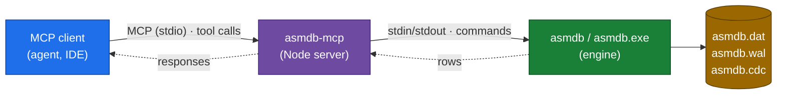

# asmdb MCP server

A [Model Context Protocol](https://modelcontextprotocol.io) server that exposes
the **asmdb** transactional engine as a **generic CRUD store** over MCP. Any MCP
client can insert, update, get, delete, search, list and count rows — all backed
by the WAL-durable x86-64 assembly engine.

Current engine: **1.7.0**, storage format **2**. The binaries are 43,749 bytes
(PE64) and 52,221 bytes (ELF64), and downloads are published at
<https://www.asmdb.cloud/downloads/> with SHA-256 hashes in the manifest.

**Agent memory is one example use case** (address each memory by a string key,
use `tag` as a namespace and `content` as the remembered text) — but the tools
are a general-purpose database interface, not memory-specific.



The server keeps **one long-lived `asmdb` process** for the whole session, and
the record region is **mapped copy-on-write**, so startup is immediate and only
the pages actually touched become resident; every tool call is then an in-memory
hash lookup plus a small durable write. The server relies on the 1.7.0 CLI
guarantee that every command terminates with `[ OK ]` or `[ERR]`; older engines
missed terminators on `HELP`, `SCHEMA`, `VERSION` and empty `SELECT *`, which
could desynchronise a stdio reader. When the MCP client disconnects, the server
shuts the engine down cleanly (no orphaned process).

In asmdb Cloud, the same mapping sits on Azure Files NFS. That share does not
honour sparseness on disk, and cgroup working-set counters include reclaimable
file-backed page cache, so hosted stats separate reserved capacity from actual
engine pressure; see [`../docs/SAAS.md`](../docs/SAAS.md#7-observability-stats-and-costs).

For hosted databases, every instance also speaks MCP over HTTP at
`https://www.asmdb.cloud/db/<instance>/mcp` using the instance bearer token; REST
is available at `https://www.asmdb.cloud/db/<instance>/v1/rows`. See
[`../docs/SAAS.md`](../docs/SAAS.md) for the platform details. The local engine
itself has no authentication, encryption or audit log; those are supplied by the
host around it.

## Addressing rows: `id` or `key`

Every record-addressed tool accepts **either**:

- `id` — a decimal string primary key (`u64`), used as-is (the generic-DB
  pattern; small JS safe-integer numbers are accepted, but strings are the
  portable form), or
- `key` — a free-text string that the server hashes to a `u64` id with 64-bit
  **FNV-1a** (the named-record / agent-memory pattern).

So the engine stays a pure id-keyed store — no secondary string index needed.
For keyed rows, the server stores a hidden content prefix
`\asmdb-key:<base64url(utf8-key)>;` before the caller's content. `db_get`,
`db_find` and `db_list` strip that prefix before returning rows, so caller
content round-trips unchanged. On `db_get`/`db_delete` by `key`, the decoded key
must exactly match the requested key; otherwise the server reports a
`keyCollision` error instead of returning or deleting a row that belongs to a
different key. Because the engine content column holds 175 usable bytes, keyed
rows must fit the caller content plus this metadata in 175 UTF-8 bytes.

The rest of the record maps as:

| Field     | asmdb column | notes |
|-----------|--------------|-------|
| `id`/`key`| `id`         | decimal string as-is, or FNV-1a(key) → u64 |
| `tag`     | `tag`        | UTF-8 category / namespace token (≤ 39 bytes, no whitespace/control chars) |
| `value`   | `value`      | optional i64 decimal string payload / score |
| `content` | `content`    | UTF-8 text (≤ 175 bytes; keyed rows reserve metadata bytes) |
| —         | `created` / `updated` | set automatically (unix ms) |

## Tools

| Tool | Arguments | Description |
|------|-----------|-------------|
| `db_insert` | `id`\|`key`, `content?`, `tag?`, `value?`, `upsert?` | insert a row; `upsert:true` atomically overwrites instead of erroring |
| `db_update` | `id`\|`key`, `content?`, `tag?`, `value?` | overwrite an existing row (errors if absent) |
| `db_get`    | `id`\|`key` | fetch one row with value, tag, content, timestamps |
| `db_delete` | `id`\|`key` | remove a row |
| `db_find`   | `query`, `limit?`, `offset?` | case-insensitive substring search over tag + content |
| `db_list`   | `limit?`, `offset?` | return live rows |
| `db_count`  | — | number of live rows |

Every tool returns JSON with `ok: true` on success. Failures return
`ok: false`, an `error` string and an `errorKind` discriminator. `id` and
`value` are always decimal strings in responses. `db_find` and `db_list` are
bounded: `limit` defaults to 100, is capped at 1000, and responses include
`hasMore` plus `nextOffset` when another page may exist.

## Install & run

Prerequisites: Node.js 18 or newer, npm, and a built asmdb engine. On Windows
the engine build requires NASM (`winget install --id NASM.NASM -e`).

```bash
cd mcp
npm install
node src/server.js       # speaks MCP over stdio
npm test                 # end-to-end test against a scratch database
```

Build the engine first (`powershell -ExecutionPolicy Bypass -File .\scripts\build.ps1`
from the repo root on Windows) so `build/asmdb.exe` exists. On non-Windows
platforms the default executable name is `build/asmdb`.

### Configuration

| Env var | Default | Purpose |
|---------|---------|---------|
| `ASMDB_EXE` | `../build/asmdb.exe` on Windows, `../build/asmdb` elsewhere | path to the engine binary |
| `ASMDB_DIR` | `~/.asmdb` | directory holding the data files |
| `ASMDB_DB`  | `asmdb` | database base name (`<db>.dat` / `<db>.wal`) |
| `ASMDB_TIMEOUT_MS` | `30000` | per-engine-command timeout |
| `ASMDB_MAX_OUTPUT_BYTES` | `67108864` | per-command output cap |

## Compatibility

| MCP server | Engine | Storage format | CLI protocol |
|------------|--------|----------------|--------------|
| 1.2.0 | 1.2.0 – 1.7.0 | 2 (`.dat` + `.wal` + `.cdc`) | REPL with `FORMAT TSV` rows (`R<TAB>…`) and `PAGE <limit> <offset>`; 1.7.0+ always emits a status terminator |
| 1.1.0 | 1.1.0 | 2 (`.dat` + `.wal` + `.cdc`) | Human table parsing — content silently truncated at 39 bytes; do not use |
| 1.0.0 | 1.0.0 | 2 (`.dat` + `.wal` + `.cdc`) | Human table parsing — content silently truncated at 39 bytes; do not use |

### Register with an MCP client

Add the server to your client's MCP configuration (example for a
`mcpServers` map, as used by Claude Desktop / VS Code / Copilot):

```json
{
  "mcpServers": {
    "asmdb": {
      "command": "node",
      "args": ["C:/Users/you/repo-asmdb/mcp/src/server.js"],
      "env": {
        "ASMDB_EXE": "C:/Users/you/repo-asmdb/build/asmdb.exe",
        "ASMDB_DIR": "C:/Users/you/.asmdb",
        "ASMDB_DB": "asmdb"
      }
    }
  }
}
```

## Examples

**Generic key/value+text store**, addressing rows by numeric id:

```jsonc
db_insert { "id": "1001", "tag": "order", "value": "4200", "content": "invoice #1001 paid" }
db_get    { "id": "1001" }
db_find   { "query": "invoice" }
```

**Agent long-term memory**, addressing rows by string key (create-or-update
with `upsert`):

```jsonc
db_insert { "key": "user.timezone", "content": "Europe/Paris", "tag": "profile", "upsert": true }
db_get    { "key": "user.timezone" }        // → durable across restarts
db_delete { "key": "user.timezone" }
```

Both patterns hit the same assembly engine, where each record is four cache
lines and every write is WAL-durable.
